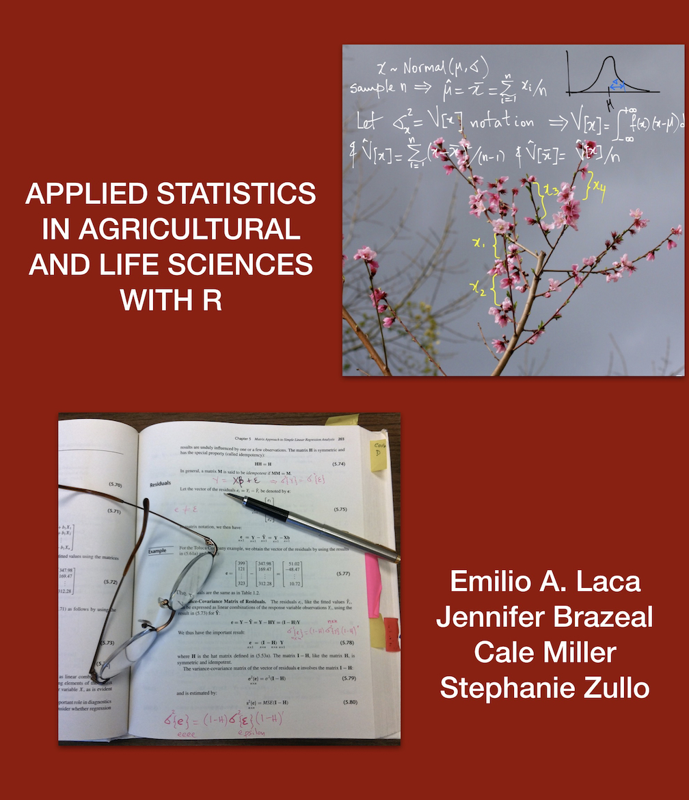

```{r message=FALSE, warning=FALSE, paged.print=FALSE, echo=FALSE}
library(knitr)
library(rmarkdown)
library(bookdown)
library(pander)
library(kableExtra)
```

# Cover {-#Cover}

```{r, echo=FALSE, fig.align='center', out.width='100%'}

```

# Front Matter {-#chFront}

## This is an early draft published just so students can use it at UC Davis this quarter.

## Look for updates weekly.

This section should have a cover, copyright, UCD logo, etc.

Probably will take 3-4 pages.

The online version of this book is licensed under the

<a href="https://creativecommons.org/licenses/by-nc-sa/4.0/" target="_blank">Creative Commons Attribution-NonCommercial-ShareAlike 4.0 International License</a>


