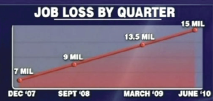

```{r setup, echo=FALSE, message=FALSE, include=FALSE}
library(kableExtra)
library(knitr)
```


# Introduction to Applied Statistics {#chIntro}

<!-- See Intro2StatsLectureNotes in Notability -->

## Learning Objectives

1. Define statistics and its use.
1. Describe applications of statistics in the "real world."
1. List the topics covered in this book.
1. Distinguish between formal statistical calculations and intuitive solutions.
1. List the goals for the course.
1. Describe relationships among methods included in this book.
1. Determine if and how a specific "real-world" problem can be addressed with these methods.


## Course Goals
1. Identify questions and problems that can be addressed by using statistical methods.
1. Propose basic statistical methods to test hypotheses and estimate unknown quantities.
1. Given a problem that can be addressed with statistics, define the response variable, predictor or explanatory variables, parameters and their hypothesized relationship.
1. Write down linear models for simple experimental designs.
1. Calculate or propose appropriate distributions for specific random variables.
1. Classify random variables according to type.
1. Calculate the probability of various events for simple random experiments where parameters of distributions are known, such as flipping coins, rolling dice, selecting subsets from a population, drawing cards from a deck.
1. Test simple hypotheses such as equality of means, independence of variables and goodness of fit.
1. State the effects of sample size on the variance of estimates of population means.

## Why Statistics?

For us, the world is an uncertain place. We do not know exactly what will happen, and for a lot of stuff, we do not know what actually happened, even if we were looking at it as it happened. What will be the cost of increased drought and wildfires due to climate change in California? Will my house increase, maintain of decrease in value in the next 30 years? Should I get vaccine XX? Is my weight lifting program leading to increases in my muscle mass? Does my landscape design lead to lower water use? Is the Bay Delta estuary ecosystem damaged because of the use of water for agricultural irrigation? All of these and many more questions you think of daily reflect the fact that we operate with uncertainty all the time. So far as we know, the use of statistical methods is the only formal and objective way to answer these questions. Statistics, just like haphazard or biased opinions, will not lead to infallible statements. However, unlike opinions and statements, statistics will lead to results with chosen error rates.

## Definition of Statistics

**Statistics** is frequently defined as a branch of mathematics that deals with the collection, analysis, interpretation, presentation and organization of data. One of the key aspects of statistics is that it formalizes methods to operate in an uncertain world. It gives us a set of tools to get clear quantitative assessments of situations, and to make estimates and predictions with the corresponding estimates of uncertainty.

For example, the "situation" is to determine if milk productivity in terms of kg/ha of farm is increasing or decreasing in California. A sample of farms is selected and milk production and farm area are measured over two years. Based on the measurements, an estimate of the difference between years is calculated, as well as an interval that represents the uncertainty of the estimate.


Traditionally, the science of statistics deals with the collection and summarization of data, design of experiments and surveys, measurement of variation of observations, estimation of population parameters as well as the accuracy and precision of these estimates, test of hypotheses, and assessment of relationship among variables. In my opinion, the science of statistics revolves around the creation and use of methods to make statistical statements about a clearly defined part of the world. Statistical statements have two components: a description or guess about something, and a quantitative description of the certainty of the first component. For example:

<br>

- "I am pretty sure it is going to rain" is not a statistical statement.

- "The chance of rain is 50\%" is not a statistical statement.

- "The chance of rain in Davis for tomorrow is 50\%" is a statistical statement.

<br>

Statistical methods allow us (i.e., provide a formal, logical basis) to make statistical statements. A statistical statement is characterized by specifying a clearly defined subject, an estimation of some characteristic of the subject, and an estimation of the certainty about that characteristic.

It is common to express statistical statements informally and incompletely. Although that is not a problem when one fully knows and understands what has been omitted, it can be a problem when the audience does not have the details. At best, incomplete statements are misinterpreted, and at worst they are unethical and deceitful. Examples of the statistical statements we will be making in this course are as follows:


- Based on a random sample of 10 coin tosses I was not able to reject the hypothesis that the probability of getting a head with this specific quarter is 0.5 at a significance level of 5\%.

- The average yield of rice in the US in 2013 was estimated at 7,694 pounds per acre, with a 95\% confidence interval width of 100 pounds per acre.


The latter statement shows the use of units for quantitative variables. The population it refers to is the total area planted to rice in the US in 2013. The estimate is the average yield and the number is correctly expressed with units as a complete quantity. The degree of certainty is also expressed quantitatively as the width of a confidence interval. Notice how the population for which the statement applies is clearly defined by saying where and when.

<br>
```{block StatsAreNotTheTruth, type='stattip'}
- Statistics and statistical tests cannot and do not attempt to categorically prove or disprove statements and hypotheses about the real world. They simply provide methods to determine how consistent, in a probabilistic way, statements and hypotheses are with data.
```
<br>


Keep in mind that the word "statistics" can have several meanings, even within the field of statistics. We can describe **Statistics** as the science of data collection, analysis, interpretation and presentation of results. As a science, statistics uses mathematical models and mathematics extensively. However, we also use the term *statistic* to refer to the result of applying a function to a set of sample data. For example. the average of a set of numbers is a statistic. The name of the science ends in "s" but it is singular ("Statistics is a science.") whereas in reference to calculations based on samples the term can be plural or singular. For example, we say the sample average is one *statistic* of the various *statistics* that can be calculated from a sample.


## Learning Statistics {#LearnStats}

Learning statistics can be challenging but also fun. The math involved in introductory statistics is very basic and for the most part involves only addition and multiplication. You can use statistics to make better decisions about your life. You should use statistical knowledge to properly interpret pseudo information presented in advertisements and the media.

Consider the following examples:

1. The three door game. In this game show you are presented with three doors (A, B, C) behind which there are prizes. Two of the doors hide a goat each and one hides a brand-new car. You choose one of the doors, say A. Before the selected door is opened, the hosts opens one of the other two doors, say C, and reveals a goat. Then, you are asked whether you want to keep your choice of door A or switch to door B. What do you do? Does it make any difference? Why?

1. A news cast presents the following graph while the anchorman speaks about the disastrous effect of the new president on job loss. What do you think?

<br>
```{r JobLossFig, message=FALSE, warning=FALSE, paged.print=FALSE, out.width = '60%', fig.align='center', echo=FALSE, fig.cap ="Graphical representation of job losses from December 2007 to June 2010."}



```
<br>


Many statistical concepts and methods have intuitive counterparts. Humans have intuitions and subconscious methods to deal with uncertainty which evolved because they have adaptive value. For example, in the piece <a href="https://www.nature.com/news/humans-have-innate-grasp-of-probability-1.16271" target="_blank">Innate concept of probability</a>, [@Callaway2014] gives multiple examples of studies that show that humans and several animals have at least basic mechanisms to handle mathematical problems involving probability. However, the abilities are limited.

Although humans do have an innate ability to assess contingencies and likelihood of certain events, our intuitive ability is far from perfect. In fact, it has been shown that humans tend to be particularly bad at estimating probabilities in certain situations. Kahneman and Tversky [@KahnemanTversky1972] refer to the probabilities people guess without using calculations and the theory of probability as "subjective" probability, not to be confused with the subjective probabilities of Bayesian statistics.

Statistical methods allow us to remove some of the biases introduced by human intuition. Many of the errors Kahneman and Tversky's subjects made would have been prevented if those subjects used statistical calculations instead of their intuition.For example, K&T posed the following question to high school students: All families of six children in a city were surveyed. In 72 families the exact order of births of boys and girls was GBGBBG.
What is your estimate of the number of families surveyed in which the exact order of births was BGBBBB? What do you think? The [median](#chData) estimate that students gave was 30. In fact, if the probability of G and B are the same, then both sequences have **equal** probability!

In another series of experiments, K&T asked students to estimate sampling distributions for various processes, for example, the number of boys and girls born each day. They concluded that:

>>"The notion that sampling variance decreases in proportion to sample size is apparently not part of man’s repertoire of intuitions."

This is very interesting and challenging, because the fact that variance of sample averages decreases with increasing sample size is the **most important concept for this course!**

Why are we bringing these things up?? The point is that when you need to deal with uncertainty, you cannot trust your intuition. If you need to get it right, use statistics and do the calculations. It is important for you to know that it is not safe to rely on raw intuition to solve many problems that involve estimation of probabilities and statistical distributions. Although we believe that many statistical and probability concepts can become almost intuitive with practice, the message is clear: using untrained intuition to deal with uncertainty leads to error. ^[Do not confuse this statement about "subjective" probability as defined by K&T with the idea of subjective probability as used in Bayesian statistics. The concept of subjective probability in Bayesian statistics (as in "subjective priors") is not what we describe above.]

## Going to the movies: PBS program on statistics

The PBS NOVA program *Prediction by the numbers* will be shown during a lecture.

<a href="http://www.pbs.org/wgbh/nova/physics/prediction-numbers.html" target="_blank">Prediction by numbers</a>


## Methods and Concepts in this Book 

### Probability, estimation, inference {#estimationInference}

Humans and animals go about our lives acting and making decision with uncertainty. Although the world is for the most part deterministic, we are not able to know it in sufficient detail to have certainty about events that have not yet happened or that we cannot observe. Even when we can observe events, the picture of reality that is created in our brains differs from reality because our senses are imperfect. Evolutionary psychology has documented multiple cases and offers theories to understand why it is not possible and even not good to know everything. The brain and the senses are products of evolution and reflect the conditions and constraints within which they evolved. For more detail on theories about how and why the human mind evolved, see the following webpage on <a href="https://www.iep.utm.edu/evol-psy/" target="_blank">Evolutionary Psychology</a>.

We routinely assign chances or probabilities to events, and we subconsciously estimate unknown probabilities. We also estimate other unknown quantities and how uncertain we are about those. For example, a contractor will give you an estimate how long it will take to complete a project and how much it will cost. Naturally, you would ask how much those values could vary. You predict how much money you will have to pay for the job in the future and compare it with the estimate from the contractor.

In statistics these terms have specific meaning, and we will be revisiting these definitions frequently. Informally,

- A probability is an idea of how likely an event is.

- An estimate is a statement about the value of a fixed but unknown quantity.

- A prediction is a statement about the result of a random event that is not observed.


In order to use statistics we have to assign probabilities to events of interest, like the failure of an engine, or the yield of a field being sufficient to cover the costs of cropping. This step requires that we create model distributions for different types of random experiments, such as running an engine for 5,000 hours or planting a field.

Distribution models will frequently involve parameters such as the mean and variance that are unknown, which requires that we obtain sample data and analyze it to estimate parameters. Estimated parameters add a second layer of uncertainty. These two layers of uncertainty are illustrated with an example. imagine that you draw a marble randomly from an urn that has 9 white and 1 orange marble. We are uncertain about the color of the marble drawn, but we are certain that the probability of white is 9/10. Now, suppose that I add black and white marbles to the urn, but you do not know how many of each I added. When you draw another marble at random you will be uncertain about the color of the marble AND about the probability of getting a white one. You could take a sample of marbles with replacement (easier to calculate), meaning that you put each marble back after you observe it, and record the colors. Say that in a sample of 20 marbles you get 10 white ones. Now you can estimate the probability of white as 10/20 = 0.5, but you would not be sure that this is the true proportion of marbles. You used a sample of 20 marbles to **estimate** the proportions. But you would probably get different results in other samples. The question is, how certain are you that the proportion is 0.5? The answer to this question requires that we determine how much the proportion in a sample varies from sample to sample. Therefore, in this third step we need to use methods to determine the sampling distribution of the estimated parameters.

Finally, we will frequently be interested in comparing parameters from potentially different distributions. We could have a second urn with marbles and be interested in determining if the probability of getting a white marble from the first is greater or less than from the second. Or we could be interested in determining if the mean productivity of a new crop variety is greater than the old one. These comparisons are reduced to calculating the value and distribution of linear combinations of estimated parameters. Usually, the distribution is normal, so the problem reduces to estimating the variance of a linear combination of estimated parameters. Analysis of variance is key to achieve this.

This book has 14 chapters dealing with introductory statistical methods and concepts. The first section comprises chapters 1-3 provide essential but minimal tools necessary to be able to read and understand the rest of the book.

This first chapter introduces statistics and the rest of the book. It gives a general introduction to the need for formal methods that yield repeatable quantitative results to deal with uncertainty in an optimal manner. Chapter 2 is an introduction to the tool that we use for doing statistics: R and RStudio. R is the program that actually does all the computations; essentially, it is a programming language for statistics. RStudio is an integrated development environment (IDE) that handles the creation and debugging of code, as well as the input and output. Chapter 2 is necessary because this book is written using RStudio and code for R. There are examples, exercises and explanations that use R in the rest of the chapters. Chapter 3 presents the required math skills and symbols that are used in the rest of the book.

In chapter 4 we start working with data. Data are summarized and descriptions of central tendency and variability are calculated. These exploratory techniques are implemented in R, which we use to create frequency tables, histograms and box-and-whisker plots.

Chapters 5 through 7 are fundamental. We build the formal basis for most statistical testing. A basic but sufficiently formal presentation of probability is given and then built upon to define random variables of different types. Probability of random variables taking different values leads to the study of the most important prototypical distributions, including the Binomial, Poisson and Normal. Random variables and probability distributions are then taken as models to describe and quantify the results of sampling. Types of sampling designs are briefly described, and we proceed with the assumption the we use simple random sampling with replacement unless stated otherwise. Now we have all the tools to make statistical statements based on data. One of the most useful types of statistical statements, the confidence interval is introduced in Chapter 7, together with the logic of hypothesis testing. From this point on, there is little addition of fundamental concepts. The rest of the chapters are elaborations based on previous material.

In Chapter 8 we move from one random variable to analyzing difference between means of two different random variables. In chapter 9 the idea is further extended to multiple populations or treatments by using Analysis of Variance (ANOVA). This powerful tool is derived conceptually and numerically from the previous chapter. We introduce ANOVA in the simplest experimental design possible, a completely randomized design (CRD). Chapter 10 is devoted to give a more comprehensive idea of what is involved in experimental design and treatment design, and the concept of blocking is introduced. The randomized complete block design is used in Chapter 11 to show the power of reducing error variance by blocking the experimental material in multiple ways. Chapter 12 turns the attention to design of treatments and comparisons among treatments, introducing contrasts and estimation of linear combinations of parameters as a powerful technique to translate scientific questions into statistically estimable questions or testable hypotheses.

Up to Chapter 13, the book has dealt mostly with models in which the values of parameters, mostly means, are estimated as a function of categorical explanatory variables: one mean for each treatment or experimental condition. In Chapter 13 the model is augmented by considering explanatory variables that are continuous. The subject is the simplest model with one continuous explanatory variable: simple linear regression. Once students complete chapter 13, they should be prepared for learning all sorts of more complicated linear models, such as models that include categorical and continuous predictors, as well as nonlinear responses. Partly, the idea of polynomial responses was introduced in Chapter 12 when we considered contrasts for **trends**.

The final chapter is devoted to the use of the $\chi^2$ distribution for testing independence in contingency tables. The concepts of marginal and joint probabilities seen in Chapter 5 are reviewed and used to determine if a table with data classified in two different categorical variables can be use to test if the events are independent. The contingency table looks the same as seen in the probability chapter, but now it represents a random realization, not the whole population. The same $\chi^2$ distribution is used to test hypothesis about the statistical distribution followed by variables from which we have random samples.


<!-- Include a schematic or figure that unifies the materials in all chapters. -->


## Use and Misuse of Statistics

Theme: There are compelling arguments indicating that statistics has been misunderstood and misused. There is a dominating culture of users of statistics who do not understand the exact original meaning of the methods and who misuse them. This has resulted in a culture where statistics is considered obscure and where the two main approaches (Bayesian and frequentist) are pitted against each other.

A main problem in science is the misuse and misunderstanding of the so-called p-value. The p-value is the probability of observing the specific realized data if it came from a data-generating process as described by the null hypothesis and assumptions. In *frequentist* as opposed to *Bayesian* statistics, hypotheses are tested by determining if the p-value is too low. The logic can be a little convoluted, and that is why we will emphasize its explanation throughout the book. The problem is that many people think that the p-value has other meanings, like being the probability that the hypothesis is true (incorrect). In addition to that, p-value has been used in a way that differs from what it was intended for. These days p-values are largely used to determine what is published. Given that any hypothesis will be eventually rejected if it is tested a sufficient number of times, obviously the publication of only the times when it is rejected is not a good representation of the results of experimentation. ALL the times when it was not rejected SHOULD ALSO be considered.

<a href="https://https://youtu.be/cOgscsjUvvE" target="_blank">What is the p-value?</a>


<a href="https://www.nature.com/news/scientific-method-statistical-errors-1.14700" target="_blank">Not understanding and misusing p-value</a>

In dealing with problems or questions we will use the following approach:

1. Identify and define the problem or question as something answerable.
2. Define what will be accepted as a useful solution.
3. Determine quantities that need to be estimated for solution.
4. Find and use a method to estimate such quantities.
5. State solution.
6. Implement solution.

Math and calculations will be necessary, particularly in step 4. Frequently, in order to get to the solution the question has to be cast in the framework of an already existing mathematical procedure that is not immediately intuitive. A specific case is the use of analysis of variance to determine if means are different. The question is: "are means different?" but the method compares variances instead of means! The approach works because there is an underlying theory that states that if means are different, then variances will also differ by an amount related to the difference among means. We do not need to know the exact details of the calculations in order to understand the process to an acceptable degree.

In many real applications of advanced statistics, step 4 involves massive computations with complicated software that can only be fully understood from a computational math science approach. We do not need to study computational math. We just need to understand the concepts behind the computation. It is sufficient to know that the computation yields a good approximation to the optimal estimate for the unknown quantity, where "optimal" means that the sum of squared deviations are minimized, for example. Some computations are rather simple and we may look into those to get a better concept of what computation does.

<!-- ## Real-world problems -->


## Exercises and Solutions

### Exercise 1

Describe three decision making situations that you face at least once a year in your life and that involve uncertainty. Describe the sources of uncertainty and your method to come to a decision.

### Exercise 2

Goal: Do many random experiments and estimations. Identify the elements involved in making estimates and sources of variation.

This exercise is actually a game. The team that guesses the secret target most accurately wins the game. Students will form two teams. Each team will designate a dart thrower. Throwers will proceed to the front game area and get magnetic darts. A horizontal line with marks and labels every 2 inches is drawn for each pitcher on the board. The referee gives each pitcher a different position as their target. Those numbers remain unknown to everyone else. Each pitcher throws the projectile at the designated position in the line three times, and the referee marks each hit on the horizontal line. Vertical positions are ignored. Each team collectively guesses the target point for their pitcher. Guesses are plotted against number of pitches on the board. Five to 6 rounds of throws and guesses are conducted. The team that is closest to their pitcher's true target wins. After the award ceremony, the following questions are asked for discussion:

1. What factors determined the winner?
1. Was one of the pitchers better? In what way?
1. Which values varied between throws and which ones were constant?
1. How would a team's guess change if their pitcher did a large number of throws?
1. What is the frequency of different distances from the true target?
1. Why do distances from the target vary among throws?
1. What does random mean?

### Exercise 3: three doors and two goats

This is a simulation of a game show performed by Monty Hall a few decades ago. One contestant is offered a choice of three doors, but she cannot open the doors. Only the show host can open the doors. Behind one door is a car, whereas the other two have goats. The contestant selects one door, which is marked as his initial choice. Then, the host open one of the other doors behind which is a goat and offers the contestant the opportunity to switch his choice to the unopened door that he did not select at first. Should she switch?

This exercise is a game to be repeated many times by having the whole class participate in groups of two to elicit the probabilities of what happens "in the long run." The point is to do random simulations of the choices and get estimated probabilities.

Students work in pairs. Each pair of students is given a set of three equal tokens representing the doors. One student is the host and the other is the contestant. The host marks the top of the tokens with letters A, B, C and then secretly marks the bottoms of the tokens randomly, one with C for car and two with G for goats. He makes a mental note of which letter has the car. Tokens are shuffled and the contestant makes his first choice. Host records the letter selected, then he reveals the bottom of a token that has no car, randomly selected if both are goats, and records its letter. Then the contestant decides whether he wants to switch or not. The host records the letter of the last choice. Host now has 4 letters to report: Car letter, first choice, letter of goat shown and final choice. Results are entered in Top Hat and tallied.

The simulation is most efficient if all realize that the case where there is no switch should have an expected success rate of 1/3, if indeed the procedure achieves equal probabilities. In that case we may just assume the expected results. However, it may be good to experience the variability about the expected rate.

Solution: The car can be in any of the thre letters. For each position of the car, the contestant can pick any of the three letters. The host can only show a letter that is not the first letter and is not the second one. If the contestant chose the car, then the host can pick out of two letters. Otherwise, the host only has one choice. The final letter can be either the second one (host initial choice) or the one on the unopened door. We can calculate how many options there are when the car is in door A and then simply multiply by three, to account for the cases when the car is behind A, B, or C.

The easiest way to think of this problem is to use the objects behind the doors to label the doors. There are three cases, where Door1 is the door the contestant chooses first:

```{r goatsTable, echo=FALSE, message=FALSE}

mhGoats <- data.frame(Door1 = c("Car", "Goat", "Goat"),
                      Door2 = c("Goat", "Car", "Goat"),
                      Door3 = c("Goat", "Goat", "Car"),
                      ResultIfSwitch = c("Goat", "Car", "Car"))

knitr::kable(mhGoats, caption = "Simplified cases in the Monty Hall problem. Door 1 is the door selected by the contstant. Because the host will always show a door with a goat, switching the original choice leads to a probability of success equal to 2/3, assuming that getting the car is considered success.") %>%
   kableExtra::kable_styling(full_width = FALSE)

```


<!-- ## Laboratory Exercise -->


<!-- Include survey questions to be completed online in Canvas site. -->
<!-- Why are you taking this course? -->
<!-- What are your goals for taking this course? -->
<!-- How will you determine if you reach your goal? -->
<!-- What are your fears/expectations about the course? -->
<!-- How will you approach the challenges of the course? -->
<!-- For example, what will you do when you are not able to complete an exercise? -->

<!-- From CEE: -->
<!-- Name -->
<!-- Class rank: Freshman____ Soph____ Junior____  Senior____ Graduate/Post-Bacc____ -->
<!-- What do you want to be called in class? -->
<!-- Major -->
<!-- Email address you check regularly: -->
<!-- What classes in this subject and/or department have you taken? What are some of your academic or career goals? -->
<!-- How do you think this class might apply to your academic or career goals? -->
<!-- How many units are you taking this quarter? -->
<!-- Why are you taking this class? (e.g., required for my major, chose it as an elective, etc.)  -->
<!-- What would you like to learn in this class? -->
<!-- What do you think you will find challenging with this course material? -->
<!-- How do you learn best? -->
<!-- What should this class NOT be like? -->
<!-- Anything else that you would like to tell me? -->
