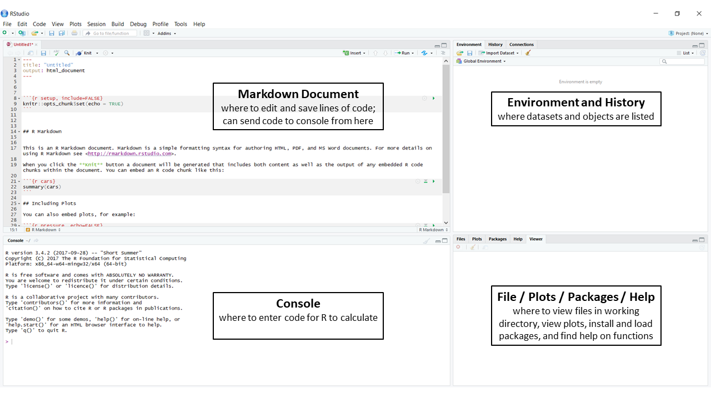

# Statistics with R {#chStatsR}

## Learning Objectives for Chapter


1. Install R and RStudio.
1. Find information about objects and functions in R.
1. Create and use R scripts and projects in RStudio.
1. Read data into R from csv files and line input.
1. Data curation: validate and properly organize and manipulate data.
1. Perform simple assignments and calculations.
1. Use vectorized operations.
1. Create, study and use data frames.
1. Create simple plots and export them.
1. Customize global and project options.
1. Identify, list and describe function of each pane.
1. Describe the efects of the parameters of the Uniform distribution
1. Calculate the expected value of a random variable with Uniform distribution.
1. Explain what the pdf of the Uniform distribution shows (y axis, X axis)
1. Draw a sketch of the sum of 2 Uniform distributions.
1. Give an example of a random variable that might be modelled using the Uniform distribution.  


## Background on R and RStudio 

W. N. Venables, D. M. Smith and the R Core Team [@R-base] state: "R is an integrated suite of software facilities for data manipulation, calculation and graphical display." They specifically leave out the word "statistics" to emphasize that R is actually an "environment" or fully planned coherent system for programming. RStudio furthers this idea and provides an IDE or integrated development environment for programming in R and other languages. In fact, this book and all the figures and interactive examples and simulations were completely programmed, compiled and deployed using R in the RStudio IDE. The only way to get a good idea of what R and Rstudio can do is to use them with a curious and exploratory approach.

For this class, we will working with RStudio, however both R and RStudio programs needs to be installed to work in RStudio.  R contains the software that performs the calculations using R-programming language, whereas RStudio provides a more user-friendly interface.  

R is the current state-of-the-art Open Source software for statistical analysis and reproducible research. Reproducible research requires that scientific articles be published with the data and the code so anyone can very the results. When working on your computer, you can download and install R from <a href="https://cran.r-project.org" target="new">here</a>.

We will use a friendly user interface to work with R: RStudio. When working on your computer, you can download and install RStudio <a href="https://www.rstudio.com/products/rstudio/download3/" target="new">here</a>. RStudio is actually an IDE (Interactive Development Environment) that is also free Open Source. Take a look at the intro video <a href="https://www.rstudio.com/products/rstudio/" target="new">here</a>.

Both installers have instructions to guide you. If you run into problems, bring your computer to office hours and we will help you.

R consists of a programming environment with a "line" interface that interprets and runs the code and produces results. Results are not sent to permanent files or output unless you specifically ask for it. This is a main point in the philosophy of R that differs dramatically from SAS. R force you to specify what you want to see or produce in specific.

We will use the "knitr" package to produce the lab reports. You have to install and the load knitr. Start RStudio and type *options(repos = c(CRAN = "http://cran.rstudio.com"))* <ENTER> to specify where your computer will find the packages. Then, type *install.packages(knitr)* <ENTER>. You can also click on the Packages tab, then click on Install at the upper left and type "knitr" in the space provided. Then, click on the Install button.

The reports are actually written in Markdown, so we need to install *rmarkdown*. As an exercise, repeat the procedure above to install this package. For an intro video about rmarkdown, go <a href="http://rmarkdown.rstudio.com/lesson-1.html" target="new">here</a>. The installation instructions, as well as more links for R Markdown are also found on that page.

## R Basics 

**Do not worry about the details of markdown and knitr!** You will be given all code you need to use in the course, and most reports will be formatted for you so you can learn reproducible research, but you will not have to be an expert in programming or markdown!

For the basic features of R Programming we will use *"A (very) short introduction to R"* <a href="https://cran.r-project.org/doc/contrib/Torfs+Brauer-Short-R-Intro.pdf" target="new"> found here</a>.
In the lab we will create a lab report based on some sections of this document.


## Exploring RStudio

RStudio have 4 panes in the window.  These windows and many other features of RStudio are explained in the video below. Make sure to watch the video as part of your homework and send questions to your instructors.

<br>
<a href="https://resources.rstudio.com/wistia-rstudio-essentials-2/rstudioessentialsprogrammingpart1-2" target="new"></a>
<br>


When RStudio is opened, four windows that appear :

- the Terminal or Console window, which is where R computes the command line code you enter,

- the Markdown File window, which is where you can edit and save lines of code and send code to the console to calculate, 

- the Environment and History window, which is where working datasets and objects are listed, and

- the Files/Plots/Packages/Help window, which is where you can see what other files are in your working directory, view plots, install and load packages and find help on functions. 

You can customize the windows and adjust the size of each of these windows by clicking and dragging the borders between them, and minimize/maximize them depending on your preference.  


<br>
```{r WindowPanes, echo=FALSE, out.width="80%", fig.pos="center"}



```
<br>


### Terminal or Console Window

The Terminal or Console window is where the R program computes command line code. R is ready to receive a command when there is a 
">" on the left of each line in the Terminal is called the cursor. It is important to note that command line code is case sensitive, so be careful to include capital and lower case letters when appropriate.  Next to the cursor is where you type a complete line of code and press "enter" to be prompted with the computed result.  Some of the code is straight forward using universal symbols such as "+", "-", "/" and "*" for basic arithmetic that is similar to commands in excel.  

Take some time to practice simple arithmetic commands in the Console window.  After inputting the code press "Enter" to perform the calculation.  


```{r Calculations, echo=FALSE}


```

When R returns the calculation it will include a "[1]" when there is only a single line to the calculation.  For other R calculations, the results may be listed across multiple lines where each line will be numbered within the brackets.  You can also build upon this code by including parentheses "()" and powers "^" similar to code from excel.  

In R studio you can easily add balanced parenthesis ( ), brackets [ ], braces { }, single ' ' and double " " quotation marks by selecting the text to be enclosed and then typing the beginning character (, [, {, ', or ". RStudio will insert both the beginning and end parenthesis etc. making them "balanced."

```{r Calculations2, echo=FALSE}


```

If you enter a command and the code is not complete, the cursor changes to "+" and R is waiting for you to finish the command. A common example of this is when your code includes multiple parentheses and an open or closed end of the parentheses is missing.   

```{r IncompleteCode, echo=FALSE}


```

If parts of the code is missing or incorrectly entered, you will recieve an **error** message with some detail of the error.  Using the "up arrow" with the cursor in the Console allows you to scroll through previous commands; this is helpful when making corrections to a previous command that did not compute, especially if the code is complex.  

```{r ErrorMessage, echo=FALSE}


```

To clear the history in the Console, you can click on the broom button or press "Ctrl" + "L".


### Markdown (Source) Window

The Markdown window is similar to a notepad; this is where you can input and save command line code, include instructions and attach notes.  All of the computer labs for this class will have you working with instructions provided in R Markdown, saved in .rmd files.  These files will contain written instructions and then "chunks" within the R Markdown file where you can input and send command line code to the Terminal window for computation.  The "chunks" will appear as gray lines that always start with three ticks and a lowercase r in brackets and end with another three ticks. See the example below of an empty chunk.  

Code entered in these "chunks" can be sent to the Console for computation several ways.  The fastest method to compute a single line of code is by having the cursor on the same line as the code and pressing "Ctrl" + "Enter" (for Windows) or "command" + "return" (for Macs).  To run multiple lines of code within a single chunk, you can press "Ctrl" + "Alt" + "C" (for Windows) or "command" + "option" + "C" (for Macs).  You can also go to the top right bar of the Markdown window and click on "Run" which will give you multiple options to run a single line, an entire chunk, all of the code in a document, etc.  The third option is to click on the green arrow at the top right corner of the chunk, which will run the entire chunk of code.  

```{r RunningChunk, echo=FALSE}


```


Code that is entered in white space is not computable; code can only be sent to the Console for computation when it is in the gray space known as a chunk. You can also include non-computable notes within a chunk when it is prefaced with a "#".  Entering these notes can be useful as code gains complexity.

```{r BasicFunctions, echo=FALSE}
#two ways to calculate the sum of 1 and 5
1 + 5

sum(c(1,5)) 
#sum() is the function to calculate the sum of the two numbers. 
#c() is the function used to combine numbers into a list/vector


#two ways to calculate the mean of 8, 4, and 6
(8 + 4 + 6) / 3

mean(c(8,4,6))
#mean() is the function used for calculating the mean. 

```

#### Saving Files

The benefit of using RMarkdown is the ability to save instructions, codes and notes.  There are two ways that you can save the file (1) as the working .Rmd file, which will allow the Markdown file to be accessed for future edits and (2) as a .html file that provides a finished easy-to-read file that can be opened up in a browser complete with all plots.  For each lab, you will be submitting both the .Rmd and .html files.  

Saving as a .Rmd file can be done by either clicking on the floppy disk button on the top of the Markdown pane, by pressing "Ctrl" + "S" or going to the upper left File button in the RStudio pane.  

```{r RmdFile, echo=FALSE}


```

Saving as a .html file can be done by clicking on the Knit icon that has the ball of yarn at the top of the Markdown pane.

```{r html File}


```


### Files, Plots, Packages, Help Window

#### Files

This pane will includes all of the files that are currently available in your working directory.  Here you can read and save files and set your working directory.  Your working directory is the default location R will use as the file path for importing and saving files on the computer.  If there is a particular location or folder on your computer that is where you plan to import and save files from R, you will need to set this file path to your working directory in R.  This simplifies the need to re-write the entire file path everytime you plan to import or save data.  

In the Files tab, you can click on "More" and set your working directory to the desired location on your computer.  

```{r Working Directory}


```

You can also use the function getwd() to check the location of your current working directory and setwd() to set your working directory, where you need to enter the designated path file within the function for the latter.  In order to set the working directory "by hand" you need to know the path used by the operating system for your drive. It is probably something like "E:/". Select a file within your flash drive when prompted.  

setwd(dirname(file.choose()))

After you set your working directory, verify that it is set at the appropriate location with getwd().


#### Plots

This pane will allow you to see each of the plot images that you have created individually when the code is entered in the Console.  Within this tab you have the ability to open up the plot in a separate window, to copy the plot to your clipboard, and to export the plot as a PDF or JPEG image.  


```{r Plot}


```


#### Packages

The Packages pane is where we can install and access "packages" in our library for different functions.  At the beginning of each of our computer labs, there will be a list of packages that we will be using for different functions throughout each lab.  We load each of these packages with the library() function.  However the first time you use a package, we need to install the package on the local computer.  This step requires internet access to install a package on your computer, but once installed it will be saved in your library. Click on the "Install" button and then enter the name of the package you wish to install on your computer.  Then once installed we need to load the package into our current working session by using the library() function or by manually checking the box next to the function.  Using the library() function will automatically check this box in the Packages pane 

```{r Packages}

library(car)


```

#### Help


RStudio has a pane specifically designed to find information about functions, objects, data and many other things in R. The help pane has an entry area for keywords at the top right. There is a basic toolbar that can be used to navigate pages as in a browser.  You can also use help() with the name of a function within it to prompt this pane.

There is a large community of R users all over the world. This community provides lots of help and support through multiple websites. Whenever you are stuck and cannot find the information you need in a form that you understand using R help, you should use a seach engine, typically Google, and pose your question directly as a web search. This works remarkably well if you use the correct keyworkds. Always end your query with "in R" so the search is much more focused.


```{r Help}

help(help) #allows you to access more information on the help() function within the Help pane


```


### Environment and History Window

The Environment and History window shows you data and objects that are loaded into R.  The History tab will provide you a list of all code that has been entered into the Console during your active working session.  The Environment will list data imported from external files (.xls, .txt, .csv) and objects that are defined within R.  These objects include vectors and data frames.  


#### Vectors and Data Frames

```{r Vectors and Data Frames}


```

A vector is a basic data structure in R, which is a string of values of the same data type.  For example, a vector will consist of a string of numbers (1, 2, 3) or a string of characters ("one", "two", "three"), but not both.  You can use "<-" to designate a name to a given object, and it will then appear in the Environment window.  Vectors only have a single dimension, their length, which is what distinguishes them from data frames.


```{r Vectors}

myvector <- c(1,2,3)
myvector 

myvector2 <- c("one","two","three") 
myvector2

help(c) #help() allows you to search for a description of a given function
#c() is a function that combines values to form a vector

```


One of the most common way to have data in R is using objects called data frames. These are table-like structures with rows and columns like a spreadsheet. Data frames are two-dimensional data sets that consist of a width and height, or more accurately the length of their columns (or number of rows) and the number of columns (or length of their rows).  Data frames can also be thought of as multiple vectors (columns) of the same length that are bound together.  Each column can have only one type of data, but different columns can have different data types. Data and objects in general in R can be of various types, called "modes." Whenever we enter data into R and do not specify the type, R will assign it the data type that does not lose any information. For example, if we enter A, 1, 3, 4, t, i, 7.5, into a column of a data frame, R will make a column of type character, because that is the only mode that can contain letters and numbers, but the numbers are stored as characters. The mode of objects can be changed, with restrictions.

Another data structure is a matrix, which is a two-dimensional table.  Matrices may look like data frames in their structure, but they are different in that it can only contain one type of data, i.e. a table of numeric values only.  Due to this limitation, we will primarily be working with data frames throughout the class. 


```{r Data Frames}

mymatrix <- cbind(myvector, myvector2)
mymatrix

help(cbind) 
#cbind() is a function that combines columns

mydataframe <- as.data.frame(cbind(myvector, myvector2))
mydataframe

help(as.data.frame)
#as.data.frame() is a function that converts an object to a dataframe

```

"<-" and "=" mean the same thing. They assign the value on the right into the object on the left: object.name <- operation. The "=" sign is also used to give values to the arguments of functions, where "<-" does not work. For example, to make an object called "my.random.numbers" with 5 random numbers from a normal distribution with mean 3 and standard deviation 2 we write:

`my.random.numbers <- rnorm(n = 3, mean = 3, sd = 2)`


#### Importing Data

Data files can be imported from your local computer for manipulation and analysis in R and new files can be created and saved back to your local computer from R.  We will be importing data from select files for most of our computer labs to perform statistical analyses and creating new .RMD and .HTML files in R.  

Depending on how a data file is saved on the computer, as a text, csv or excel file, there are different functions for uploading the data into R. For each of the different functions, two important arguments to include are the file path to direct you to the file and designating that the column names, also known as headers, should be preserved when imported into R.  When the desired data file is located within your working directory, you do not need to enter the complete file path, you can just include the name of the file in quotations.  If the file is outside of your working directory, you will need to designate the complete file path in the quotations.


read.csv() imports .csv files into your Environment
read.table() imports .txt files into your Environment
read_excel() imports .xls and .xlsx files into your Environment


```{r Importing Data}


```

Another option is to click on the Import Dataset button at the top of the Environment Window tab and to manually select the location of the file.   Here you can designate if the file is from Excel or from a Text (readr); the latter will also give you the option to designate if your file is comma (.csv) or tab (.txt) delineated.  This will also provide you with code for importing the data, including the complete file path. The code will be provided at the beginning of each lab for how to import the dataset we will be working with. 


## Functions

Functions take arguments, perform operations on them and return results. For example, in mean(x = c(8, 4, 6)), mean() is the function and the argument called x receives the value c(8, 4, 6), which is a vector made up of the numbers 8, 4, and 6 in that order. The function returns a result that is the number 6.

Users interact with R mostly using functions. R and R packages provide thousands of functions, and each user can create new custom fuctions. Suppose we want to make a plot of a polynomial of order 3 for many different values of the parameters. We define a function that calculates the values of the polynomial and plots them all in one step.

``` {r}
plotPoly <- function(b0, b1, b2, b3, xmin, xmax){ # name function and arguments
  x <- seq(from = xmin, to = xmax, length.out = 100) # create x values
  y <- b0 + b1 * x + b2 * x^2 + b3 * x^3 # calculate y values
  plot(y ~ x, type = "l") # plot the results
}
# Now that the function is defined we can make plots for any values of the arguments pretty quickly

plotPoly(b0 = 1, b1 = 0.5, b2 = 0.03, b3 = -0.01, xmin = -5, xmax = 10)

# Adjust the range of x to get a better view

plotPoly(b0 = 1, b1 = 0.5, b2 = 0.03, b3 = -0.01, xmin = -10, xmax = 10)

```


Command line code varies in its complexity, but **it is never expected for all of the code to be memorized**.  This is why the following window, R Markdown, is an important tool to save code and attach instructions and notes.    

R can do basic arithmetic operations that can be completed on a calculator, but what is particularly useful is the ability to perform these operations on vectors and data frames

```{r}

a <- c(1, 2, 3, 4, 5)
b <- c(10, 20, 30, 40, 50)

a + 100
## [1] 101 102 103 104 105
a + b
## [1] 11 22 33 44 55
(a + b) / 10
## [1] 1.1 2.2 3.3 4.4 5.5

```

We can also rename existing objects, perform arithmetic functions across vectors, and print out the values within defined objects

```{r}
a <- 1:5
b <- 1:5

ab.sum <- a + b
ab.diff <- a - b
ab.prod <- a * b

ab.sum
## [1]  2  4  6  8 10
ab.diff
## [1] 0 0 0 0 0
ab.prod
## [1]  1  4  9 16 25
```

There are also basic summary statistics that can be calculated with different functions in R.  These are important statistics that we will continue to use throughout the class to extrapolate different information from datasets.  

Lets take the numbers 1-10 and extrapolate different summary statistics from the data.


### Summary Statistics Functions

Table: (\#tab:SumStatFun) Summary Statistics for the length, summation, minimum, maximum, median, mean, range, variance, standard deviation and summary of a set of data

|   Function   |    Example    |  Result returned  |
|-------------:|:-------------:|:-----------------:|
|   length()   | length(1:10)  |        10         |
|    sum()     |   sum(1:10)   |        55         |
|    min()     |   min(1:10)   |         1         |
|    max()     |   max(1:10)   |        10         |
|   median()   | median(1:10)  |        5.5        |
|    mean()    |   mean(1:10)  |        5.5        |
|   range()    |  range(1:10)  |       1  10       |
|    var()     |   var(1:10)   |       9.16        |
|     sd()     |    sd(1:10)   |       3.03        |
|              |               |Min. 1,  1st Q.3.25|
|  summary()   | summary(1:10) |Med. 5.5,  Mean 5.5|
|              |               |3rd Q.7.75,  Max 10|


```{r}

length(1:10)
sum(1:10)
min(1:10)
max(1:10)
median(1:10)
mean(1:10)
range(1:10)
var(1:10)
sd(1:10)
summary(1:10)

```
<br>

## Exercises

1. For data set E1 consisting of 12 values, calculate the following summary statistics

```{r}

E1 <- c(14, 18, 47, 3, 112, 63, 32, 27, 91, 81, 4, -71) 

```

a. mean
b. range
c. variance
d. standard deviation

2. For data set E2 consisting of 12 values, calculate the following summary statistics

```{r}

E2 <- c(8, 128, -103, 92, 14, 44, -67, 9, 31, 12, -7, 0)

```

a. mean
b. range
c. variance
d. standard deviation

3. Subtract dataset E1 from dataset E2 and calculate the following summary statistics

a. length
b. mean
c. range
d. variance
e. standard deviation

4. Add 100 to each of the 12 values you calculated in Question 3, how does this change the mean, range, variance and standard deviation?


## Laboratory Exercises

### Plant Sciences

#### Introduction to R and RStudio

If you are using a lab computer and not your personal computer, insert your flash drive and set the working directory to be in your drive. This way you will have all of your files with you in your drive. Files that you save to the lab computers are wiped every night. The following script chunk allows you to manually select your working directory by selecting a file within it. 

Once you have installed the necessary packages, you can render this Rmd file and produce the html file that can be viewed in any browser. **For full credit you will submit both the Rmd and html files you complete.**


#### Create a dataframe and table 

To create a data frame we use the data.frame() function. In this example we create a data frame named "mydata." This data frame has 2 columns (Y1 and Y2) and 3 rows.

```{r PsCreateDf, echo=TRUE}

mydata <- data.frame(Y1 = c("treatment 1", "treatment 2", "treatment 3"), Y2 = c(35, 23, 30)) # Create data frame with 2 columns and 3 rows

mydata # see the contents of the data frame

str(mydata) # see the structure of the data frame

class(mydata) # see the class of the data frame

library(pander) # we need to install pander first

pander(mydata, caption = "Table showing my data.") #pander() creates a table for the data

```

#### Summary Statistics 

Summary statistics are classified as measures of central tendency and measures of dispersion. Mean, and median are measures of central tendency. Variance, standard deviation, range minimum and maximum are measures of dispersion. For positive random variables, the coefficient of variation is a measure of variation relative to the mean.

We use the *clover.txt* data set provided in the first assignment. These data represent the mass of clover plants grown for different periods at three different temperatures. Temperatures are in the first column coded as 1 for 5-15 C, 2 for 10-20 C and 3 for 15-25 C. The second column contains the number of days of growth and the last column contains the log of the plant mass in g. Column names are in the first row of the file, so we specify *header = TRUE* in the line of code to read the data. Data are placed in a data frame named "clover.

```{r ps summarystats1, echo = TRUE}

clover <- read.csv("Datasets/Lab01clover.txt", header = TRUE) # read in data.

help(clover) # Read about the nature of the data set.

(avg.lnwt <- mean(clover$lnwt)) # obtain the average lnwtance; note the use of $ to select parts of an object and the outer parentheses to display the result.

(med.lnwt <- median(clover$lnwt)) # median or 50th percentile

quantile(clover$lnwt, 0.5) # 50th percentile is the same as the median

(var.lnwt <- var(clover$lnwt)) # variance

(std.lnwt <- sd(clover$lnwt)) # standard deviation

sum(clover$lnwt)/length(clover$lnwt) # manual calculation of average

sum( (clover$lnwt - avg.lnwt) ^ 2 ) / (length(clover$lnwt) - 1)

(rng.lnwt <- range(clover$lnwt)) # output is a vector of lenght 2

min(clover$lnwt) # minimum braking lnwtance

max(clover$lnwt) # maximum braking lnwtance

(cv.lnwt <- std.lnwt / avg.lnwt) # coefficient of variation

```

The **coefficient of variation** is the standard deviation in units of the average. A value greater than 1 is high and indicates that there is a large amount of variation unexplained. Values below 0.30 are very low and indicate that there is little unexplained variation. For laboratory or controlled field experiments the CV should be below 0.5, whereas for observational studies an acceptable CV can be up to 1.0.


#### Frequency Table and Histogram

We can create a frequency table by dividing the range of lnwt into bins according to a general guideline: number of bins = 1 + 3.3 log(sample size). For this we use the cut() function. Then we create the frequency table using the xtabs() function and plot the histogram. All of this is done automatically by R using the hist() function. We will worry about making the graphs look pretty later on.

```{r ps freqhist, echo = TRUE, include = TRUE}

(sample.size <- length(clover$lnwt))

(nbins <- max(8, (1 + log(sample.size, 2)))) # we round down for bins

clover$bin <- cut(clover$lnwt, breaks = nbins) # create column with bin

(freq.table <- as.data.frame(xtabs( ~clover$bin))) # creates frequency table

pander(freq.table) # format the table a little better

plot(freq.table, xlim = c()) # make histogram "by hand"

hist(clover$lnwt) # by default it uses Sturges rule for bins.
```

Note that by adding parenthesis outside the whole expression we make the new object and display it at the same time.The function as.data.frame transforms the output of xtabs() into a table that is easy to understand.

The histogram can be used to visually assess the type of distribution the data may exhibit.

Data can be easily summarized by using the summary() function of R. This function will produce results that take into account the type of variable in the object it operates on.

```{r ps summaryfunc, echo = TRUE, include = TRUE}

summary(clover$lnwt) # summary of a numeric variable or vector

class(clover$lnwt) # a numeriv vector contains real numbers

summary(clover$bin) # this is a character variable coded as a factor

class(clover$bin)

summary(clover) # gives the summary for all variables
# What kind of result or object does summary() produce?

class(summary(clover)) # This is functional programming; nested functions

mode(summary(clover))

str(summary(clover)) # See the inside of an object!!

summary(clover)[1,1] # get the first element of the table

summary(clover)[1,] # get the first row of the summary table

summary(clover)[,1] #  get the first column of the summary table

```

The function str() is really important to see what objects are composed of and to use parts of those objects. Any part of an object can be referenced and modified using its "address."


#### Box-and-Whisker Plot and 5-Number Summary

Data can be summarized using a boxplot and or the 5-number summary. These contain information about the average, median, first quartile, third quartile, range and outliers. The *range* argument determines how far the plot whiskers extend out from the box. If range is positive, the whiskers extend to the most extreme data point which is no more than *range* times the interquartile range (IQR) from the box. Data points that fall outside the whiskers are plotted and can be interpreted as "outliers" or values more extreme than expected. Outliers are so only on the basis of some preconceived expectation, usually a more or less normal distribution. A range value of zero causes the whiskers to extend to the data extremes, so no outliers are shown.

```{r PsBoxplot1, echo = TRUE, include = TRUE}

myrange.factor <- 1.5

boxplot(clover$lnwt, range = myrange.factor)

text(x = 0.70, y = median(clover$lnwt), label = "Median")

text(x = 0.65, y = quantile(clover$lnwt, 0.75), label = "3rd quartile or 75% quantile")

text(x = 1.30, y = quantile(clover$lnwt, 0.75), label = "Upper Hinge")

text(x = 0.65, y = quantile(clover$lnwt, 0.25), label = "1st quartile or 25% quantile")

text(x = 1.30, y = quantile(clover$lnwt, 0.25), label = "Lower Hinge")

# To get the location of the top "fence" we need to identify the datapoint that is closest to but no greater than the upper hinge plus 1.5 * interquartile range.

(iqrange <- IQR(clover$lnwt)) # Calculate the interquartile range

(uplimit <- quantile(clover$lnwt, 0.75) + myrange.factor * iqrange)

(rows.where.lt.uplimit <- which(clover$lnwt <= uplimit)) # gives row numbers of those that are less than uplimit

clover$lnwt[rows.where.lt.uplimit] # gives lnwt in those rows

(up.fence <- max(clover$lnwt[rows.where.lt.uplimit])) # gives the value we seek

(outl <- clover$lnwt[clover$lnwt > up.fence]) # No outliers!

text(x = 0.65, y = up.fence, label = "Upper Fence")

help(boxplot) # get more information about the boxplot.

```

If we choose a smaller value for the *range* argument of boxplot we can make some values appear like outliers. Note that 1.5 is a commonly accepted value for range. Just to see how the plots behave with a different range, we copy the code above and re-run it after changing the range value.

```{r ps boxplot2, echo = TRUE, include = TRUE}

myrange.factor = 0.5

boxplot(clover$lnwt, range = myrange.factor)

text(x = 0.70, y = median(clover$lnwt), label = "Median")

text(x = 0.65, y = quantile(clover$lnwt, 0.75), label = "3rd quartile or 75% quantile")

text(x = 1.30, y = quantile(clover$lnwt, 0.75), label = "Upper Hinge")

text(x = 0.65, y = quantile(clover$lnwt, 0.25), label = "1st quartile or 25% quantile")

text(x = 1.30, y = quantile(clover$lnwt, 0.25), label = "Lower Hinge")

# To get the location of the top "fence" we need to identify the datapoint that is closest to but no greater than the upper hinge plus 1.5 * interquartile range.

(iqrange <- IQR(clover$lnwt)) # Calculate the interquartile range

(uplimit <- quantile(clover$lnwt, 0.75) + myrange.factor * iqrange)

(rows.where.lt.uplimit <- which(clover$lnwt <= uplimit)) # gives row numbers of those that are less than uplimit

clover$lnwt[rows.where.lt.uplimit] # gives lnwt in those rows

(up.fence <- max(clover$lnwt[rows.where.lt.uplimit])) # gives the value we seek

(outl <- clover$lnwt[clover$lnwt > up.fence]) # We have outliers!

text(x = 0.65, y = up.fence, label = "Upper Fence")

```

The values for the five-number summary can be obtained directly with the fivenum() function:

```{r ps fiven, echo = TRUE, include = TRUE}

pander(cbind(c("min", "lower hinge", "median", "upper hinge", "max"), fivenum(clover$lnwt)))

```

#### Analyses by Groups

The clover data has groups defined by the temperature treatments. Because the group numbers are just lables, we need to transform them into what is called "factor" class in R. This way, we can apply functions that obtain summaries and figures for each group. In the case of the clover, we expect that plants to grow faster at higher temperature; let's see what the data say.

```{r PsGrouped, echo=TRUE, message=FALSE, warning=FALSE, include=TRUE}

clover$temp <- factor(clover$temp)

summary(clover)

str(clover)

boxplot(lnwt ~ temp, data = clover, notch = TRUE) # boxplots by treatment

help(by) # by produces a list with an element for each value of the grouping variable.

sumry.by.temp <- by(data = clover$lnwt, INDICES = clover$temp, FUN = summary)

pander(sumry.by.temp)

(fiven.by.temp <- by(data = clover$lnwt, INDICES = clover$temp, FUN = fivenum))


```


### Animal Sciences

#### Introduction to R and RStudio

If you are using a lab computer and not your personal computer, insert your flash drive and set the working directory to be in your drive. This way you will have all of your files with you in your drive. Files that you save to the lab computers are wiped every night. The following script chunk allows you to manually select your working directory by selecting a file within it. 

Once you have installed the necessary packages, you can render this Rmd file and produce the html file that can be viewed in any browser. **For full credit you will submit both the Rmd and html files you complete.**


#### Create a dataframe and table 
To create a data frame we use the data.frame() function. In this example we create a data frame named "mydata." This data frame has 2 columns (Y1 and Y2) and 3 rows.

```{r as createdf, echo=TRUE}

mydata <- data.frame(Y1 = c("treatment 1", "treatment 2", "treatment 3"), Y2 = c(35, 23, 30)) # Create data frame with 2 columns and 3 rows

mydata # see the contents of the data frame

str(mydata) # see the structure of the data frame

class(mydata) # see the class of the data frame

library(pander) # we need to install pander first

pander(mydata, caption = "Table showing my data.") #pander() creates a table for the data

```

#### Summary Statistics 

Summary statistics are classified as measures of central tendency and measures of dispersion. Mean, and median are measures of central tendency. Variance, standard deviation, range minimum and maximum are measures of dispersion. For positive random variables, the coefficient of variation is a measure of variation relative to the mean.

We use the *heifer.xlsx* data set provided in the first assignment. These data represent the birth weight of heifers across three different years (2005, 2006, 2007). Column names are in the first row of the file, so we specify *col_names = TRUE* in the line of code to read the data. Data are placed in a data frame named "heifer".

```{r as summarystats1, echo = TRUE}

library(readxl)

 # read in data.
heifer <- read_excel("Datasets/HeiferDataLab1.xlsx", col_names = TRUE)

(avg.bwt <- mean(heifer$Birth_Wt)) # obtain the average bwt
# note the use of $ to select parts of an object and the outer
# parentheses to display the result.

(med.bwt <- median(heifer$Birth_Wt)) # median or 50th percentile

quantile(heifer$Birth_Wt, 0.5) # 50th percentile is the same as the median

(var.bwt <- var(heifer$Birth_Wt)) # variance

(std.bwt <- sd(heifer$Birth_Wt)) # standard deviation

sum(heifer$Birth_Wt)/length(heifer$Birth_Wt) # manual calculation of average

sum( (heifer$Birth_Wt - avg.bwt) ^ 2 ) / (length(heifer$Birth_Wt) - 1)

(rng.bwt <- range(heifer$Birth_Wt)) # output is a vector of lenght 2

min(heifer$Birth_Wt) # minimum braking bwtance

max(heifer$Birth_Wt) # maximum braking bwtance

(cv.bwt <- std.bwt / avg.bwt) # coefficient of variation

```

The **coefficient of variation** is the standard deviation in units of the average. A value greater than 1 is high and indicates that there is a large amount of variation unexplained. Values below 0.30 are very low and indicate that there is little unexplained variation. For laboratory or controlled field experiments the CV should be below 0.5, whereas for observational studies an acceptable CV can be up to 1.0.


#### Frequency Table and Histogram

We can create a frequency table by dividing the range of bwt into bins according to a general guideline: number of bins = 1 + 3.3 log(sample size). For this we use the cut() function. Then we create the frequency table using the xtabs() function and plot the histogram. All of this is done automatically by R using the hist() function. We will worry about making the graphs look pretty later on.

```{r as freqhist, echo = TRUE, include = TRUE}

(sample.size <- length(heifer$Birth_Wt))

(nbins <- max(8, (1 + log(sample.size, 2)))) # we round down for bins

heifer$bin <- cut(heifer$Birth_Wt, breaks = nbins) # create column with bin

(freq.table <- as.data.frame(xtabs( ~heifer$bin))) # creates frequency table

pander(freq.table) # format the table a little better

plot(freq.table, xlim = c()) # make histogram "by hand"

hist(heifer$Birth_Wt) # by default it uses Sturges rule for bins.
```

Note that by adding parenthesis outside the whole expression we make the new object and display it at the same time.The function as.data.frame transforms the output of xtabs() into a table that is easy to understand.

The histogram can be used to visually assess the type of distribution the data may exhibit.

Data can be easily summarized by using the summary() function of R. This function will produce results that take into account the type of variable in the object it operates on.

```{r as summaryfunc, echo = TRUE, include = TRUE}

summary(heifer$Birth_Wt) # summary of a numeric variable or vector

class(heifer$Birth_Wt) # a numeriv vector contains real numbers

summary(heifer$bin) # this is a charcater variable coded as a factor

class(heifer$bin)

summary(heifer) # gives the summary for all variables
# What kind of result or object does summary() produce?

class(summary(heifer)) # This is functional programming; nested functions

mode(summary(heifer))

str(summary(heifer)) # See the inside of an object!!

summary(heifer)[1,1] # get the first element of the table

summary(heifer)[1,] # get the first row of the summary table

summary(heifer)[,1] #  get the first column of the summary table

```

The function str() is really important to see what objects are composed of and to use parts of those objects. Any part of an object can be referenced and modified using its "address."


#### Box-and-Whisker Plot and 5-Number Summary

Data can be summarized using a boxplot and or the 5-number summary. These contain information about the average, median, first quartile, third quartile, range and outliers. The *range* argument determines how far the plot whiskers extend out from the box. If range is positive, the whiskers extend to the most extreme data point which is no more than *range* times the interquartile range (IQR) from the box. Data points that fall outside the whiskers are plotted and can be interpreted as "outliers" or values more extreme than expected. Outliers are so only on the basis of some preconceived expectation, usually a more or less normal distribution. A range value of zero causes the whiskers to extend to the data extremes, so no outliers are shown.

```{r as boxplot1, echo = TRUE, include = TRUE}

myrange.factor = 1.5 # save number in a named object for later use

boxplot(heifer$Birth_Wt, range = myrange.factor)

text(x = 0.70, y = median(heifer$Birth_Wt), label = "Median")

text(x = 0.65, y = quantile(heifer$Birth_Wt, 0.75), label = "3rd quartile or 75% quantile")

text(x = 1.30, y = quantile(heifer$Birth_Wt, 0.75), label = "Upper Hinge")

text(x = 0.65, y = quantile(heifer$Birth_Wt, 0.25), label = "1st quartile or 25% quantile")

text(x = 1.30, y = quantile(heifer$Birth_Wt, 0.25), label = "Lower Hinge")

# To get the location of the top "fence" we need to identify the datapoint that is closest to but no greater than the upper hinge plus 1.5 * interquartile range.

(iqrange <- IQR(heifer$Birth_Wt)) # Calculate the interquartile range

(uplimit <- quantile(heifer$Birth_Wt, 0.75) + myrange.factor * iqrange)

(rows.where.lt.uplimit <- which(heifer$Birth_Wt <= uplimit)) # gives row numbers of those that are less than uplimit

heifer$Birth_Wt[rows.where.lt.uplimit] # gives bwt in those rows

(up.fence <- max(heifer$Birth_Wt[rows.where.lt.uplimit])) # gives the value we seek

(outl <- heifer$Birth_Wt[heifer$Birth_Wt > up.fence]) # 10 outliers

text(x = 0.65, y = up.fence, label = "Upper Fence")

help(boxplot) # get more information about the boxplot.

```

If we choose a smaller value for the *range* argument of boxplot we can make some values appear like outliers. Note that 1.5 is a commonly accepted value for range. Just to see how the plots behave with a different range, we copy the code above and re-run it after changing the range value.

```{r as boxplot2, echo = TRUE, include = TRUE}

myrange.factor = 0.5

boxplot(heifer$Birth_Wt, range = myrange.factor)

text(x = 0.70, y = median(heifer$Birth_Wt), label = "Median")

text(x = 0.65, y = quantile(heifer$Birth_Wt, 0.75), label = "3rd quartile or 75% quantile")

text(x = 1.30, y = quantile(heifer$Birth_Wt, 0.75), label = "Upper Hinge")

text(x = 0.65, y = quantile(heifer$Birth_Wt, 0.25), label = "1st quartile or 25% quantile")

text(x = 1.30, y = quantile(heifer$Birth_Wt, 0.25), label = "Lower Hinge")

# To get the location of the top "fence" we need to identify the datapoint that is closest to but no greater than the upper hinge plus 1.5 * interquartile range.

(iqrange <- IQR(heifer$Birth_Wt)) # Calculate the interquartile range

(uplimit <- quantile(heifer$Birth_Wt, 0.75) + myrange.factor * iqrange)


(rows.where.lt.uplimit <- which(heifer$Birth_Wt <= uplimit)) # gives row numbers of those that are less than uplimit

heifer$Birth_Wt[rows.where.lt.uplimit] # gives bwt in those rows

(up.fence <- max(heifer$Birth_Wt[rows.where.lt.uplimit])) # gives the value we seek

(outl <- heifer$Birth_Wt[heifer$Birth_Wt > up.fence]) # We have 90 outliers!

text(x = 0.65, y = up.fence, label = "Upper Fence")

```


<!-- **PUT THIS IN THE CORRECT PLACE** -->

<!-- Note that the uniform distribution U(0, 1) is the distribution of the random numbers generated by the function RAND() in Excel. For more details on this distribution, see Uniform Distribution at <https://en.wikipedia.org/wiki/Uniform_distribution_(continuous)>. -->

<!-- \begin{equation} -->
<!-- f(x) = -->
<!--   \begin{cases} -->
<!--     \frac{1}{b-a}       & \quad \text{if } a \leq x \leq b \\ -->
<!--     0                   & \quad \text{otherwise } -->
<!--   \end{cases} -->
<!--     (\#eq:unifPdf) -->
<!-- \end{equation} -->

<!-- ```{r UnifDist, fig.cap="Probability density function for a continuous uniform distribution."} -->

<!-- ``` -->
<!-- **DOWN TO HERE**  -->


The values for the five-number summary can be obtained directly with the fivenum() function:


```{r as fiven, echo = TRUE, include = TRUE}

pander(cbind(c("min", "lower hinge", "median", "upper hinge", "max"), fivenum(heifer$Birth_Wt)))

```

#### Analyses by Groups

The heifer data has groups defined by the year. Because the group numbers are just labels, we need to transform them into what is called "factor" class in R. This way, we can apply functions that obtain summaries and figures for each group. We can see if there are any differences in the birth weight across the three years for heifers.  

```{r as grouped, echo=TRUE, message=FALSE, warning=FALSE, include=TRUE}

heifer$year <- factor(heifer$Birth_Year)

summary(heifer)

str(heifer)

boxplot(Birth_Wt ~ year, data = heifer, notch = TRUE) # boxplots by treatment

help(by) # by produces a list with an element for each value of the grouping variable.

pander(sumry.by.temp <- by(data = heifer$Birth_Wt, INDICES = heifer$year, FUN = summary))

(fiven.by.temp <- by(data = heifer$Birth_Wt, INDICES = heifer$year, FUN = fivenum))


```

