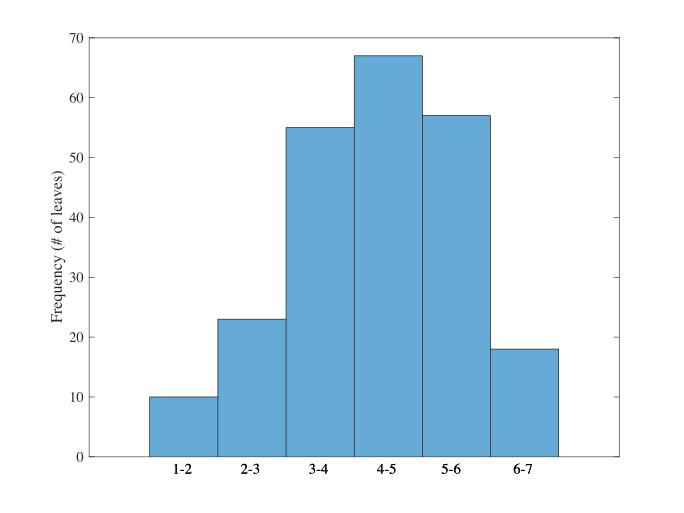
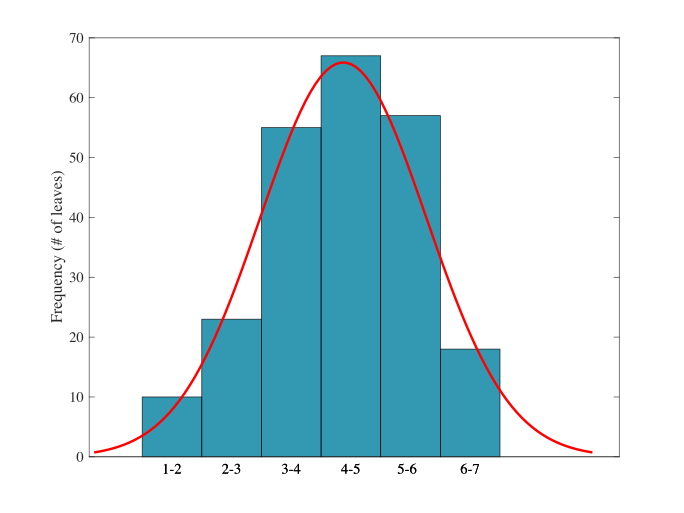
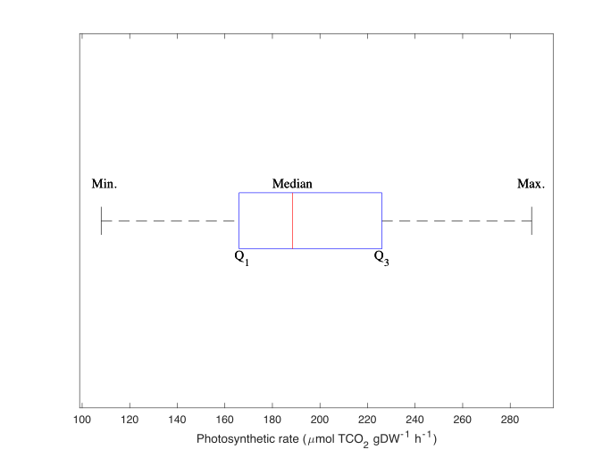

```{r setup0, include=FALSE}
knitr::opts_chunk$set(echo = TRUE)
```

```{r message=FALSE, warning=FALSE, paged.print=FALSE, echo=FALSE, include=FALSE}
# load packages for chapter

options(digits = 10)
library(bookdown)
library(emmeans)
library(ggplot2)
library(dplyr)
library(kableExtra)
library(knitr)
library(tables)
library(pander)
library(multcomp)
library(agricolae)
library(nlme)
library(car)
library(tidyr)

```
# Data Manipulation, Exploration and Summaries {#ch.data}

## Learning Objectives for Chapter

1. Distinguish between population parameters and sampling statistics.
1. List, define and calculate measures of central tendency for data and populations.
1. List, define and calculate measures of dispersion for data and populations.
1. Explain organization of one- and two-way data using subscripts.
1. Make histograms for sample data, explain histogram parts and interpret it.
1. Calculate the 5-number summary and make a box and whisker plot with all elements labeled.
1. Asses the normality of data using the histogram and boxplot.  
1. Calculate the coefficient of variation and describe its weaknesses.

## Data curation

<<<<<<< HEAD
See wikipedia entry on <a href="https://en.wikipedia.org/wiki/Data_curation" target = "_blank">Data Curation</a>.


See message from Duncan Lang and Vessela Ensberg:

The content that you want to cover is very similar to one of my seminars on keeping data tidy and organized (slides here) and data sharing (slides attached). If you prefer, I can adapt this content for your class. I have presented data management sessions for a number of graduate seminar classes.
 
=======
<!-- See wikipedia entry on <a href="https://en.wikipedia.org/wiki/Data_curation" target = "_blank">Data Curation</a>. -->


<!-- See message from Duncan Lang and Vessela Ensberg: -->

<!-- The content that you want to cover is very similar to one of my seminars on keeping data tidy and organized (slides here) and data sharing (slides attached). If you prefer, I can adapt this content for your class. I have presented data management sessions for a number of graduate seminar classes. -->

Data analysis depends completely on having good data that is correclty organized. The data curation is a new discipline that has become extremely important. We have the ability to gather and store very, very large amounts of data, but those data are useful only if the are well organized, maintained and validated. Most of us work with data and use our senses, hands and brains to organize and check the data. For example, we look at two numbers on the screen and decide if the are equal or not. This may work when we handle a few numbers and pieces of information, but not for more than that, even if it feels that it works. We must use computers and validated logic and programs to manage data.

### Entering data

There are several rules for data entry, and we mention a few.

- Format data area as a rectangular set of cells.

- Only one point of entry and storage for each piece of information or data. No data should be entered more than at one point or stored in more than one place (except for backups, of course).

- Include metadata. Where does data come from? Methods? Who entered it? When? Where? Units. Contact info.

- Keep data in a format that is open, widely adopted, widely supported and stored without loss (this last part is particularly important for media).

- Use a validated file naming convention. You will have to handle files as if each were a datapoint.

- Do not mix data and metadata in the same portio of the file.

- One row per observation or number. Nothing unrelated to the observation in the row.

- A row is analogous to a RECORD in a relational database structure.

- One column per variable. Specify units. A column is analogous to a FIELD in a relational database structure.

- Short column names without spaces or non-ASCII characters. Styles that work wiht R can be my.col.name.cm, my_col_name_cm or MyColNameCm.

- Never enter values that can be calculated based on other primary values.

- No Excel or other formatting except for dates.

- Enter dates as 10-Mar-2018. 10-5-18 is ambiguous. It could be October 5, 2018 or May 10, 1918, or other combinations.

- No spaces before or after visible characters. No leading or trailing spaces.

The followng figure shows a messy data file created in Excel. See if you can spot all the problems and errors in the file. Interestingly, some errors are not visible at all. Can you guess which ones are those?

```{r messyExcelData, echo=FALSE, message=FALSE, fig.cap="Example of what NOT TO DO with data. This file has multiple errors and violations of the principles listed above."}

```

>>>>>>> EAL18Sep18
For references, I’d recommend starting with FAIR data:
https://www.nature.com/articles/sdata201618
https://www.force11.org/group/fairgroup/fairprinciples
 
For tidy data, Data carpentry has some good guidelines:
http://www.datacarpentry.org/semester-biology/materials/tidy-data/
 
New England Collaborative Data Management Curriculum has extensive material and lesson plans on data management:
https://library.umassmed.edu/necdmc/modules
 


<<<<<<< HEAD
=======


>>>>>>> EAL18Sep18
## Data comes from samples

Within a statistical framework, the term population refers to an entire set of measurments or a specific characteristic that is being examined. A descriptive measure for a population is refered to as a parameter. For example, popualtion parameters can be the number of all diary cows in California (population size = N) or the mean body weight of all diary cow calves in California. To determine these parameters a survey would need to be conducted, which is often not fesible. In such cases, inferential statistics is used by taking representative, random samples, of the popualtion and infering conclusions about the entire popualtion.

When conducting random samples from a population, collected parameters from a sample are refered to as statistics. Using the example above where *N* (captial letter) referred to the entire population of dairy cows in California, a random sample of dairy cows in California can be designated with the varibale *n* (lower-case). 

<<<<<<< HEAD
In the figure below (\@ref(fig:Map_cows)) two random samples were drawn from the California dairy cow population to infer the average weight of newborn calves for the entire population. In this example the sample statistic is weight of newborn dairy cow calves.  
=======
In the figure below (\@ref(fig:MapCows)) two random samples were drawn from the California dairy cow population to infer the average weight of newborn calves for the entire population. In this example the sample statistic is weight of newborn dairy cow calves.  
>>>>>>> EAL18Sep18

<br>

```{r MapCows, message=FALSE, warning=FALSE, paged.print=FALSE, out.width = '60%', fig.align='center', echo=FALSE, fig.cap ="Example of random samples of newborn calf weight collected from dairy cows in northern and southern California."}

knitr::include_graphics("images/MapCows.pdf")

```

<br>

## Measures of central tendency

The measure of central tendency is a summary measure that represents the center point of a whole data set and indicates the typical value of the data. The three measures of central tendency are the mean, median, and mode. 

In the above example the mean weight of newborn dairy cows in California was collected from a random sample of the entire popualtion. In statistics, the **mean** is the average value from the collected data set. Advantages of using the mean are that most other statitcs such as variance and standard deviations can be determined algebraically using the mean. The symbol that represents the mean for a popualtion is 

$$\mu$$ 

and for a sample:

$$\bar{x}$$.

The **median** of a sample data set is the middle value when the data are arranged in ascending or descending order. The median is simple to calcuate as it is the middle value and is not influenced by extreme values. 

The **mode** of a sample data set is the value that occurs most frequently. Since multiple values can occur several times, one or more mode may be present for a data set. Alternatively, there may not be a most frequent value in a data set and, thus, no mode value. 

<<<<<<< HEAD
For the sample data set in table \@ref(fig:photoRateSeagrass) the average, sample median, and sample mode can be calculated as:
=======
For the sample data set in table \@ref(fig:PhotoRateSeagrass) the average, sample median, and sample mode can be calculated as:
>>>>>>> EAL18Sep18

$$ \bar{x} = \frac{y_1 + y_2 + y_3 + y_4 + y_5 + \ldots + y_{10}} {n}$$
For the data in table :
$$mean = \frac{180 + 166 + 226 + 226 + 206 +  \ldots + 154}{10}$$
<<<<<<< HEAD


$${median = 206}$$

=======
```{r}
# R code
# Functions: 
#combine numbers into a vector (c)
#mean (calculates mean value)

x = c(180, 166, 226, 206, 197, 180, 108, 243, 289, 154)

mean(x)

```


$${median = 206}$$
>>>>>>> EAL18Sep18
For the data in table:
$${180, 166, 226, 206, 197, 180, 108, 243, 289, 154}$$

$$median = \frac{197 + 180}{2}.$$
```{r}
# R code
# Functions: 
#median (calculates median value)
median(x)

```

$$ mode = {y_1, y_6}$$
For the data in table 1.1:
$$ mode = 180$$
```{r}
# R code
# Functions: 
#mode (calculates mode value)
mode(x)

```
<br>

<<<<<<< HEAD
```{r photoRateSeagrass, message=FALSE, warning=FALSE, paged.print=FALSE, out.width = '30%', fig.align='center', echo=FALSE, fig.cap ="Sample data set of photosynthetic rate for 10 different shoots of the seagrass *Zostera marina*."}
=======
```{r PhotoRateSeagrass, message=FALSE, warning=FALSE, paged.print=FALSE, out.width = '50%', fig.align='center', echo=FALSE, fig.cap ="Sample data set of photosynthetic rate for 10 different shoots of the seagrass *Zostera marina*. Reference: Miller et al. 2016 Master's thesis"}
>>>>>>> EAL18Sep18

knitr::include_graphics("images/PR_seagrass.pdf")

```

<br>

## Measures of dispersion

Measures of dispersion are important parameters and statistics that describe the spread of the data around its central measure (e.g., mean). Knowing the variability in conjunction with the measure if central tendency, a more clear and better inference can be made about a given popualtion from a random sample. 

The most important measure of dispersion is the **variance** which numerically describes the variability of values in a data set. The **standard deviation** is ther square root of the variance and it evaluates dispersion in the same units as the random variable, while the variance is in the units squared. For example, the random variable defined as the girth growth rate of a randomly selected valley oak tree in California during the spring of 2018 has units of mm day^-1^, its variance has units of mm^2^ days^-2^ and its standar deviation has units of mm day^-1^. The population variance of random variable $X$ is denoted by $\sigma^2_X = V\{X\}$ and its standard deviation is $\sigma_X$.

The variance is estimated from a sample with the following equation, where $S^2$ stands for *sample variance*.

$$S^2 = \frac{\sum_{i=1}^n (X_i - \bar{X})^2}{n-1}$$

```{r}
# R code
# Functions:
#var (calculates variance)
var(x)

```

and for the standard deviation, which is the square root of the variance:

$$s = \sqrt{\frac{{\sum_{i=1}^n(x_i - \bar{x})^2}}{n-1}}.$$
```{r}
# R code
# Functions:
#sd (calculates standard deviation)
sd(x)

```
One final measure of dispersion is the range. The **range** is the difference between the largest and smallest values in a data set. The range is the most ambiguous measure of dispersion and is not suited for determing data dispersion when dealing with large data sets. 


## Frequency distributions and histograms

Sample data sets from a population can be summerized in a frequency table as a first step in data analysis Table \@ref(tab:Freq). In the example below, the number of leaves per one shoot of seagrass were put into classes: 1-2, 2-3, 3-4, 4-5, 5-6, 6-7 in order to identify the frequency of occurences found in the data set. In this case, the data set was leaves counted per shoot in a 3x3 m plot and the observations were then catagorized into classes.

When breaking a data set into classes, an approximation for the number of classes can be determined by using sturges rule:

$$ k = 1 + 3.3 log(n)$$

where k is the number of classes (i.e., bins).

<br><br>

Table: (\#tab:Freq) Number of leaves per shoot counted in a 3x3 m plot of seagrass in a northern California estuary. 

| # Leaves| Frequency|
|--------:|---------:|
|    1-2  |     10   |  
|    2-3  |     23   |  
|    3-4  |     55   |    
|    4-5  |     67   |   
|    5-6  |     57   |   
|    6-7  |     18   |

<br><br>

A good way to visualize the distribution of frequencies in a data set is to construct a histogram. A **histogram** uses the height of adjacent bars to display frequency of a value and the center of the bar as the midpoint of each class (\@ref(fig:Hist)). 

<br>
```{r Hist, message=FALSE, warning=FALSE, paged.print=FALSE, out.width = '50%', fig.align='center', echo=FALSE, fig.cap = "Histogram constructed from frequency of leaves per shoot ."}



```
<br>

Observing the histogram, the frequency of each class is easy to identify, with 4-5 leaves being the most frequent observation in the 3x3 m plot. The distribution of the data is such that there is a peak around the middle classes and lower frequencies to the left and right of the peak (i.e., the left and right tails). The red curve fit over the historgam highlights the distribuution of frequencies (\@ref(fig:Histcurve). This type of distribution with a peak in the middle and approximately equal length tails on each end is referred to as a normal distribution. A **normal distribution** takes the shape of a bell curve. This informs that the data are normally distributed. That is, it is not skewed to the left or right.

<br>
```{r Histcurve, message=FALSE, warning=FALSE, paged.print=FALSE, out.width = '50%', fig.align='center', echo=FALSE, fig.cap ="Histogram constructed from frequency of leaves per shoot with fit curve over frequency distribution."}



```
<br>

```{r}
# R code
# Functions:
#create a data object (<-)
#Create a histogram (hist)
PRrate<-c(180, 166, 226, 206, 197, 180, 108, 243, 289, 154)
hist(PRrate)
```


## Five-number summary 
Another form of initial data analysis can be conducted by computing a five-number summary. The **five-number summary** is a set of descriptive statistics that provides information about the frequency distribution of a data set when values are arranged in ascending order. These descriptive statistics are as follows:

Minimum (Min.): Smallest value in the data set.

Lower quartile (Q_1): The median for the lower half of the data set that seperates the first 25% of the values from the other 75%. 

Median: The value that falls in the middle of the data set.

Upper Quartile (Q_3): The median for the upper half of the data set that seperates the last 25% of the values from the lower 75%. 

Maximum (Max.): Largest value in the data set.

Not included in the five-number summary is the interquartile range (IQR), which may be useful in determining the middle 50% values in the data set. The IQR is calculated:

$$IQR = Q3 - Q1.$$

The five-number summary can be graphically represented with a boxplot, sometimes referred to as a box and wisker plot (\@ref(fig:boxplot)). The median (red line in \@ref(fig:boxplot) is shifted slightly to the left, but close to center. Since there is not a large observable skew to the distribution, the data are said to be normally distributed. 

<br>
```{r boxplot, message=FALSE, warning=FALSE, paged.print=FALSE, out.width = '50%', fig.align='center', echo=FALSE, fig.cap ="Boxplot and five-number summary of the photosynthetic rates presented in from seagrass leaves."}



```
<br>

The output from the five-number summary for the 10 observations (i.e., values) of photosynthetic rate describe a minimum value of 108, Q~1~ of 166, median of 188.5, Q~3~ of 226, and a maximum of 289 $\mu$mol TCO~2~ gDW^-1^ h^-1^. The descriptive statistics help inform about the spread of data while providing a measure of central tendency and a way to visually assess the normality of the data set. That is, whether or not the data are normally distributed. 

```{r}
# R code
# Functions:
#Create a boxplot (boxplot)
#Get five-number summary (fivenum)
boxplot(PRrate)
fivenum(PRrate)
```

## Coefficient of variation 

The final topic to be discussed in this chapter is the statistic, known as the coefficient of variation. The **coefficient of variation (CV)** is simply the ratio of the standard deviation to the mean. 

$$ CV_{population} = \frac{\sigma}{\mu}$$

Or

$$ CV_{sample} = \frac{s}{\bar{x}}$$

 
```{r}
# R code
#Assigning values

<<<<<<< HEAD
=======
PRmean = 194.9
PRsd =   50.29
(CV = PRmean/PRsd)
```

What is the use of the coefficient of variation? The CV provides a dimensionless value that permits comparison of variability between random variables that are in different dimensions (i.e., have different types of units) or that have ranges of values that are very different from each other.

For example, in some cases, we may be interested in determining if the seed mass produced by an individual plant is more or less variable than the variability of leaf area. Mass and area are different dimensions, so it makes no sense to compare the values of their variances or standard deviations directly. The question "is 1 g greater than 1 m^2^?" is not answerable, and therefore it is not a meaningful question. If we divide the standard deviation of each variable by its average, the units cancel out and we obtain a dimensionless coefficient that can now be compared. 

<!-- Include figure with example of CV comparison. -->

Frequently, tolerances, allowable or acceptable values of certain variables are expressed as proportions of percentages of the mean or average value. This makes sense because usually, the needed precision in instruments, construction, machines, etc. increases as the units become smaller or lighter. For example, vehicle scales may have a precision of 2%. Accordingly, vehicles within 2% of the nominal value are allowable. It would not make sense to establish a set tolerance for all vehicles. A range of 800 lb might make sense for loaded trucks up to 80,000 lb, but it would be ridiculous for a smart car that has a maximum weight of 2,000 lb. The coefficient of variation allows quick and meaning full comparisons of variability across vehicle categories.

The coefficient of variation is also useful to establish standards for the acceptable variability in lab results. A CV smaller than 10% is achievable in and acceptable for indoor lab experiments with a great level of environmental control. However, such a level is very difficult to achieve in field experiments, where 20-40% is pretty frequent.

**CV pitfalls**

The CV has issues with zero in a couple of ways. This makes sense because it has a denominator, the mean or the average, that can be very close to zero. First, the CV is only meaningful for random variables that are measured in *ratio* scales like mass, length, area and volume. The ratio scale is characterized for having a set and well defined zero. Because of this it does make sense to use ratios in those scales. To say that 2 cm is twice as long as 1 cm makes sense. Interval scale variables such as temperature in C is not a ratio scale variable. It does not make sense to say that 10 C is twice as hot as 5 degrees, because 0 C is an arbitrary zero.

Second, the CV is not very useful when the variable measures has a range of values that is close to zero, particularly when the mean or average is also close to zero. When the means are close to zero, minor difference in mean will cause large changes in the CV.

>>>>>>> EAL18Sep18

## Exercises and Solutions

Wilder and Rypstra (2004) examined the effect of praying mantis excrement on the behavior of wolf spiders to test whether cues from an introduced predator (the praying mantis) would change the movement rate of the native wolf spider. They put 15 wolf spiders in individual containers; inside each container there were two semicircles of filter paper. One semicircle was smeared with praying mantis excrement and one circle was without excrement. The researchers observed each spider for one hour, and calculated spider mean walking speed while it moved across first the excrement circle and then the non-excrement circle (data were modified for the purpose of this exercise and are not the original true data).


1. Calculate the average speed and sample variance for each treatment
2. Calculate the difference in speed between treatments for each spider. Report the average difference.

3. Calculate the sample variance for the difference between treatments.

4. Calculate the estimated variance of the averages of difference between treatments.

5. What is the median, first and third quartile for difference bewteen treatments?

6. What is the coefficient of variation for both treatments?

**Data**

```{r} 

Spider<-(1:1:15)
Nexc<-c(2.5, 5.5, 1.1, 2.7, 2.8, 1.6, 3.2, 4.5, 5, 6.9, 2.2, 3.9, 3.8, 3.5, 5.7)
Wexc<-c(0.4, 1.9, 1.2, 2.6, 4.3, 0.3, 1, 1.5, 3.3, 2.6, 0.7, 1.4, 2.1, 3.4, 2.3)
Diff<-c(2.1, 3.6, -0.1, 0.1, -1.5, 1.3, 2.2, 3, 1.7, 4.3, 1.5, 2.5, 1.7, 0.1, 3.4)
```

**Solutions**
  
1. Average speed No excrement: 3.66; Variance: 2.63 cm/s
   Average speed with excrement: 1.93; Variance: 1.36 cm/s
```{r}
Nomean<-mean(Nexc) #Mean value for no excrement treatment
Novar<-var(Nexc) #Variance for no excrement treatment
Wmean<-mean(Wexc) #Mean value for excrement treatment
Wvar<-var(Wexc) #Variance for excrement treatment
```
   
2. Average difference in speed between treatments: 1.73 cm/s
```{r}
Difmean<-mean(Diff)
```

3. Sample variance for differnec between treatments: 2.48 cm/s

```{r}
Difvar<-var(Diff)
```

4. Estimated variance of averages of difference between treatments: 0.166 cm/s

```{r}
Estvar = Difvar/length(Diff) #Variance of difference divided by the number of observations (n)
```

5. Median, first and third quartiles for difference bewteen treatments: -1.50, 1.70, 2.75 cm/s

```{r}
sum<-fivenum(Diff) #Get five-bumber summary
```

6. CV for both treatments: 
   No excrement: 0.443
   With excrement: 0.604

```{r}
CVNoexc = (sqrt(Novar))/Nomean
CVWexc = (sqrt(Wvar))/Wmean
```
<br><br>

Table: (\#spider) Wolf spider walking speed with and without mantis excrement. 

| Spider #| cm/sec no|cm/sec with| difference|
|         | excrement| excrement |           |
|--------:|---------:|----------:|----------:|
|    1    |    2.5   |    0.4    |    2.1    |
|    2    |    5.5   |    1.9    |    3.6    |
|    3    |    1.1   |    1.2    |   -0.1    |
|    4    |    2.7   |    2.6    |    0.1    |
|    5    |    2.8   |    4.3    |   -1.5    |
|    6    |    1.6   |    0.3    |    1.3    |
|    7    |    3.2   |    1.0    |    2.2    |
|    8    |    4.5   |    1.5    |    3.0    |
|    9    |     5    |    3.3    |    1.7    |
|   10    |    6.9   |    2.6    |    4.3    |
|   11    |    2.2   |    0.7    |    1.5    |
|   12    |    3.9   |    1.4    |    2.5    |
|   13    |    3.8   |    2.1    |    1.7    |
|   14    |    3.5   |    3.4    |    0.1    |
|   15    |    5.7   |    2.3    |    3.4    |
<br><br>


### Homework

1. Samples are taken from a population of heifers with known mean and variance of weight gains equal to 80 kg and 324 kg, respectively.

a. What are the mean and variance of the average weight gain of random samples of 20 heifers?

n = ?
Mean = ?
Variance = ?

b. What are the mean and variance of the average weight  gain of random samples of 30 heifers? 

n = ?
Mean = ?
Variance = ?

c. How many heifers have to be sampled for the variance of the average weight to equal 12.96 ?

2. The mean and standard deviation (kg/ha) of wheat yield two different soils are given in the table below.

	     **mean**	**sd**
soil A	 3000	   450
soil B	 4000	   600

a. What are the mean and variance of the differences between sample averages (average of B - average of A) when independent  samples of size 9 are taken from fields 
in soil A and samples of size 16 are taken from fields in soil B?

n (soil A) = ?
n (soil B) = ?
Mean = ?
Variance = ?

3. Heights of many individual plants were measured for  plants of two varieties. Find summary statistics for both plant varieties.
 

**variety 1**	 **variety 2**
   14.9	           3.1
    9.5	          11.8
   10.6	          15.4
   19.8	          13.3
   20.2	           8.2
   14.8	          18.3
   16.8	          20.7
   14.6	           6.6
   11.2	           8.5
   18.3	           9.8
   20.9	           9.1
   13.3	          18.1
   18.4	          28.0
   17.7	           7.4
   16.5	          12.9
   16.7	          15.7
    8.3	           8.7
   10.1	           9.0
   16.7	          12.6
   16.3	          13.6
   14.9	          12.2
   12.6	          19.2
   12.4	           9.9
   12.5	           8.1
   11.7	          13.4
   16.3	          23.3
   14.9	          19.7
                   9.5
                  19.3
                  14.9
                  14.8
                   7.9
                  14.2
                   9.8


a. r = ?
   mean = ?
   sample variance = ?
   q1 = ?
   min = ?
   median = ?
   max = ?
   q3 = ?
   IQR = ?
   k (number of classes) = ?

b. Create a boxplot for both plant varieties.

## Homework

## Laboratory Exercises

### Plant Sciences Lab

Prepare an .Rmd document starting with the following text, where you substitute the corresponsing information for author name and date.

<<<<<<< HEAD
"---" Unquote the three dashes
=======

```
---
>>>>>>> EAL18Sep18
title: "Lab01: Data Exploration and Summaries"
author: "YourFirstName YourLastName"
date: "today's date here"
output: html_document
<<<<<<< HEAD
"---" Unquote the three dashes
=======
--- 
```
>>>>>>> EAL18Sep18

```{r setup, include=FALSE}

knitr::opts_chunk$set(echo = TRUE)

```

### Instructions

For this lab you will modify this file and submit this file with the file name changed so it has your email ID (the part before @) in lower case instead of "email." Do not add spaces to the file name.

This is a markdown document. You will type your code and run it one line at a time as you add it in the lines indicated below. Add code **ONLY** in the areas between `{r}` and ` ``` `. These areas are highlighted with a light grey color. Run each line and parts to learn and experiment until you get the result you want. Keep the lines that worked and move on. At any time you can see if your document "knits" or not by clicking on the Knit HTML icon at the top. Once you have completed all work, knit your document and save the html file produced with the same file name but with an html extension (Lab01email.html).

**Submit BOTH files for your lab report using the appropriate Canvas tool**

For each part and question below, type your code in the grey area below, between the sets of back-ticks (```) to perform the desired computation and get output. Type your answers below the corresponding grey area. A completed example follows.

### Example Question with Answer

Create a vector with 5 random numbers from the standard normal distribution. Call it "x." Calculate the average and variance of the values in x. Create a second 5-number vector using the same procedure. Call it "y." Calculate the sum of the elements in y. Make a nicely formatted table showing x and y as columns. Calculate x + y and then sum(x) + sum(y). Discuss the difference between the last two calculations.

```{r}

library(pander) # to do nice tables

x = rnorm(5)

mean(x)

var(x)

y = rnorm(5)

sum(y)

pander(data.frame(x = x, y = y))

x + y

sum(x) + sum(y)

```
The x + y and sum(x) + sum(y) are totally different. The former results in a vector of five numbers, each number being the sum of the corresponding elements in x and y. The latter results in a single number that is the sum of the 5 numbers in x plus the 5 numbers in y. (Full credit!)


### Part 1. Data input [10 points]

Load the iris data that comes with R into a data frame called myiris, and get its structure. Use help() to learn what the iris data are about. When were the data first published? Hint: you need help. [5 points]


```{r iris.info, echo = TRUE, include = TRUE}

myiris <- iris # put iris data into dataframe object or container called myiris

str(myiris)

myiris <- read.table(header = TRUE, text = "
Sepal.Length	Sepal.Width	Petal.Length	Petal.Width	Species
5.1	3.5	1.4	0.2	setosa
4.9	3	1.4	0.2	setosa
4.7	3.2	1.3	0.2	setosa
4.6	3.1	1.5	0.2	setosa
5	3.6	1.4	0.2	setosa
5.4	3.9	1.7	0.4	setosa
4.6	3.4	1.4	0.3	setosa
5	3.4	1.5	0.2	setosa
4.4	2.9	1.4	0.2	setosa
4.9	3.1	1.5	0.1	setosa
5.4	3.7	1.5	0.2	setosa
4.8	3.4	1.6	0.2	setosa
4.8	3	1.4	0.1	setosa
4.3	3	1.1	0.1	setosa
5.8	4	1.2	0.2	setosa
5.7	4.4	1.5	0.4	setosa
5.4	3.9	1.3	0.4	setosa
5.1	3.5	1.4	0.3	setosa
5.7	3.8	1.7	0.3	setosa
5.1	3.8	1.5	0.3	setosa
5.4	3.4	1.7	0.2	setosa
5.1	3.7	1.5	0.4	setosa
4.6	3.6	1	0.2	setosa
5.1	3.3	1.7	0.5	setosa
4.8	3.4	1.9	0.2	setosa
5	3	1.6	0.2	setosa
5	3.4	1.6	0.4	setosa
5.2	3.5	1.5	0.2	setosa
5.2	3.4	1.4	0.2	setosa
4.7	3.2	1.6	0.2	setosa
4.8	3.1	1.6	0.2	setosa
5.4	3.4	1.5	0.4	setosa
5.2	4.1	1.5	0.1	setosa
5.5	4.2	1.4	0.2	setosa
4.9	3.1	1.5	0.2	setosa
5	3.2	1.2	0.2	setosa
5.5	3.5	1.3	0.2	setosa
4.9	3.6	1.4	0.1	setosa
4.4	3	1.3	0.2	setosa
5.1	3.4	1.5	0.2	setosa
5	3.5	1.3	0.3	setosa
4.5	2.3	1.3	0.3	setosa
4.4	3.2	1.3	0.2	setosa
5	3.5	1.6	0.6	setosa
5.1	3.8	1.9	0.4	setosa
4.8	3	1.4	0.3	setosa
5.1	3.8	1.6	0.2	setosa
4.6	3.2	1.4	0.2	setosa
5.3	3.7	1.5	0.2	setosa
5	3.3	1.4	0.2	setosa
7	3.2	4.7	1.4	versicolor
6.4	3.2	4.5	1.5	versicolor
6.9	3.1	4.9	1.5	versicolor
5.5	2.3	4	1.3	versicolor
6.5	2.8	4.6	1.5	versicolor
5.7	2.8	4.5	1.3	versicolor
6.3	3.3	4.7	1.6	versicolor
4.9	2.4	3.3	1	versicolor
6.6	2.9	4.6	1.3	versicolor
5.2	2.7	3.9	1.4	versicolor
5	2	3.5	1	versicolor
5.9	3	4.2	1.5	versicolor
6	2.2	4	1	versicolor
6.1	2.9	4.7	1.4	versicolor
5.6	2.9	3.6	1.3	versicolor
6.7	3.1	4.4	1.4	versicolor
5.6	3	4.5	1.5	versicolor
5.8	2.7	4.1	1	versicolor
6.2	2.2	4.5	1.5	versicolor
5.6	2.5	3.9	1.1	versicolor
5.9	3.2	4.8	1.8	versicolor
6.1	2.8	4	1.3	versicolor
6.3	2.5	4.9	1.5	versicolor
6.1	2.8	4.7	1.2	versicolor
6.4	2.9	4.3	1.3	versicolor
6.6	3	4.4	1.4	versicolor
6.8	2.8	4.8	1.4	versicolor
6.7	3	5	1.7	versicolor
6	2.9	4.5	1.5	versicolor
5.7	2.6	3.5	1	versicolor
5.5	2.4	3.8	1.1	versicolor
5.5	2.4	3.7	1	versicolor
5.8	2.7	3.9	1.2	versicolor
6	2.7	5.1	1.6	versicolor
5.4	3	4.5	1.5	versicolor
6	3.4	4.5	1.6	versicolor
6.7	3.1	4.7	1.5	versicolor
6.3	2.3	4.4	1.3	versicolor
5.6	3	4.1	1.3	versicolor
5.5	2.5	4	1.3	versicolor
5.5	2.6	4.4	1.2	versicolor
6.1	3	4.6	1.4	versicolor
5.8	2.6	4	1.2	versicolor
5	2.3	3.3	1	versicolor
5.6	2.7	4.2	1.3	versicolor
5.7	3	4.2	1.2	versicolor
5.7	2.9	4.2	1.3	versicolor
6.2	2.9	4.3	1.3	versicolor
5.1	2.5	3	1.1	versicolor
5.7	2.8	4.1	1.3	versicolor
6.3	3.3	6	2.5	virginica
5.8	2.7	5.1	1.9	virginica
7.1	3	5.9	2.1	virginica
6.3	2.9	5.6	1.8	virginica
6.5	3	5.8	2.2	virginica
7.6	3	6.6	2.1	virginica
4.9	2.5	4.5	1.7	virginica
7.3	2.9	6.3	1.8	virginica
6.7	2.5	5.8	1.8	virginica
7.2	3.6	6.1	2.5	virginica
6.5	3.2	5.1	2	virginica
6.4	2.7	5.3	1.9	virginica
6.8	3	5.5	2.1	virginica
5.7	2.5	5	2	virginica
5.8	2.8	5.1	2.4	virginica
6.4	3.2	5.3	2.3	virginica
6.5	3	5.5	1.8	virginica
7.7	3.8	6.7	2.2	virginica
7.7	2.6	6.9	2.3	virginica
6	2.2	5	1.5	virginica
6.9	3.2	5.7	2.3	virginica
5.6	2.8	4.9	2	virginica
7.7	2.8	6.7	2	virginica
6.3	2.7	4.9	1.8	virginica
6.7	3.3	5.7	2.1	virginica
7.2	3.2	6	1.8	virginica
6.2	2.8	4.8	1.8	virginica
6.1	3	4.9	1.8	virginica
6.4	2.8	5.6	2.1	virginica
7.2	3	5.8	1.6	virginica
7.4	2.8	6.1	1.9	virginica
7.9	3.8	6.4	2	virginica
6.4	2.8	5.6	2.2	virginica
6.3	2.8	5.1	1.5	virginica
6.1	2.6	5.6	1.4	virginica
7.7	3	6.1	2.3	virginica
6.3	3.4	5.6	2.4	virginica
6.4	3.1	5.5	1.8	virginica
6	3	4.8	1.8	virginica
6.9	3.1	5.4	2.1	virginica
6.7	3.1	5.6	2.4	virginica
6.9	3.1	5.1	2.3	virginica
5.8	2.7	5.1	1.9	virginica
6.8	3.2	5.9	2.3	virginica
6.7	3.3	5.7	2.5	virginica
6.7	3	5.2	2.3	virginica
6.3	2.5	5	1.9	virginica
6.5	3	5.2	2	virginica
6.2	3.4	5.4	2.3	virginica
5.9	3	5.1	1.8	virginica
")

## add code to ask for information about dataframe object iris


help(iris)

```

When were the data first published? Your answer here:.


### Part 2. Coefficient of variation [15 points]

Do a web search and explain the use of the coefficient of variation and one of its main disadvantages. Hint: what happens when your mean is zero or close to zero? [15 points]

Your answer here: 


### Part 3. Five number summary table of iris data [15 points]

Make a data frame and a nicely formatted table containing the following statistics: mean, median, range, minimum, maximum, standard deviation, coefficient of variation and sample size for each of the measurements (Sepal.Length, Sepal.Width, Petal.Length, Petal.Width) in myiris data. What variable has the most variation relative to the average? [15 points]

```{r summary.table1, echo=FALSE}

mymeans <- sapply(X = myiris[ , 1:4], FUN = mean) # put means in a column

mymedians <- sapply(X = myiris[, 1:4], FUN = median)

# add formula to get the column with minima here

mymins <- sapply(X = myiris[, 1:4], FUN = min)

mymaxs <- sapply(X = myiris[, 1:4], FUN = max)

myranges <- mymaxs - mymins

# add formula to get standard deviation here

mysds <- sapply(X = myiris[, 1:4], FUN = sd)

mycvs <- mysds / mymeans # calculate coeff. of variation

myNs <- sapply(X = myiris[, 1:4], FUN = length) # calculate sample size

# Put all columns together into a data frame object called "Table1"

Table1 <- data.frame(Mean = mymeans, 
                     Median = mymedians, 
                     Min = mymins, 
                     Max = mymaxs, 
                     Range = myranges, 
                     SD = mysds, 
                     CV = mycvs, 
                     N = myNs)

pander(Table1) # use pander to create a nicely formatted table.


```

What variable has the most variation relative to the average? Your answer here:


### Part 4. Frequency table and histogram [15 points]

Make and print a nicely formatted frequency table for the sepal length of the flowers. Calculate the number of classes (bins) using the formula in the LabO1 instructive. Make a histogram using your calculations "by-hand" and then a new histogram using the hist() function. [15 points]

```{r iris.hist1, echo = TRUE, include = TRUE}

(sample.size <- length(myiris$Sepal.Length))

(nbins <- max(8, (1 + log(sample.size, 2))))

myiris$bin <- cut(myiris$Sepal.Length, breaks = nbins) # create column with bin

(freq.table <- as.data.frame(xtabs( ~myiris$bin))) # creates frequency table

pander(freq.table) # format the table a little better

plot(freq.table) # make histogram "by hand"

hist(myiris$Sepal.Length) # by default it uses Sturges rule for bins.

```


### Part 5. Box and whisker plot [15 points]

Create two box and whisker plots for the sepal length. Label at least three of the elements in the plot. Create a new box and whisker plot with a *range* argument value of 0.5. [15 points]

```{r iris.box1, echo = TRUE, include = TRUE}

boxplot(myiris$Sepal.Length) # enter the data frame name, $ and the variable name to designate the data used by boxplot

text(x = 0.6, y = 5.8, labels = "Median")

# Add two more labels at the correct locations by completing the code.
# Use the x and y arguments to specify where the labels go.

text(x = 0.6, y = 7.85, labels = "Upper")

text(x = 0.6, y = 4.4, labels = "Lower")


```

### Part 6. fivenum() function [10 points]

What does the fivenum() function do? [5 points]

Your answer here: 


### Part 7. Making a vector [10 points]

What function allows you to **combine** numbers to make numeric vectors? Use the function to make a vector with the numbers 1, 3, 4, 9 and call it "sa.vector." [5 points]

```{r iris.c1, echo = TRUE, include = TRUE}


```

What function allows you to **combine** numbers to make numeric vectors? Your answer here: 

### Part 8. Knitting [10 points]

Knit this file into html. [10 points]

<!-- ##----------------END PLANT SCIENCES LAB-----------------### -->

### Animal Sciences Lab

Prepare an .Rmd document starting with the following text, where you substitute the corresponsing information for author name and date.

"---" Unquote the three dashes
title: "Lab01: Data Exploration and Summaries"
author: "YourFirstName YourLastName"
date: "today's date here"
output: html_document
"---" Unquote the three dashes

```{r setup1, include=FALSE}

knitr::opts_chunk$set(echo = TRUE)

```

### Instructions

For this lab you will modify this file and submit this file with the file name changed so it has your email ID (the part before @) in lower case instead of "email." Do not add spaces to the file name.

This is a markdown document. You will type your code and run it one line at a time as you add it in the lines indicated below. Add code **ONLY** in the areas between "\```{r}" and "\```". These areas are highlighted with a light grey color. Run each line and parts to learn and experiment until you get the result you want. Keep the lines that worked and move on. At any time you can see if your document "knits" or not by clicking on the Knit HTML icon at the top. Once you have completed all work, knit your document and save the html file produced with the same file name but with an html extension (Lab01email.html).

**Submit BOTH files for your lab report using the appropriate Canvas tool**

For each part and question below, type your code in the grey area below, between the sets of back-ticks (```) to perform the desired computation and get output. Type your answers below the corresponding grey area. A completed example follows.

### Example Question with Answer

Create a vector with 5 random numbers from the standard normal distribution. Call it "x." Calculate the average and variance of the values in x. Create a second 5-number vector using the same procedure. Call it "y." Calculate the sum of the elements in y. Make a nicely formatted table showing x and y as columns. Calculate x + y and then sum(x) + sum(y). Discuss the difference between the last two calculations.

```{r}

library(pander) # to do nice tables

x = rnorm(5)

mean(x)

var(x)

y = rnorm(5)

sum(y)

pander(data.frame(x = x, y = y))

x + y

sum(x) + sum(y)

```
The x + y and sum(x) + sum(y) are totally different. The former results in a vector of five numbers, each number being the sum of the corresponding elements in x and y. The latter results in a single number that is the sum of the 5 numbers in x plus the 5 numbers in y. (Full credit!)


### Part 1.  [10 points]

Load the Heifer data into a data frame called myheifer, and get its structure. Use help() to learn about the structure function. The heifer data is a report from all heifers born in 2005. [5 points]


```{r}

myheifer <- read.table("Datasets/Lab01HeiferData.csv", header = TRUE, sep = ",") # put heifer data into dataframe object or container called myheifer

str(myheifer)

# Instead of reading a CSV file, you can directly enter the data in text format

myheifer <- read.table(header = TRUE, text = "
Birth_weight	Wean_weight	Yearling_weight
81	660	902
63	455	690
72	416	866
71	434	730
81	534	812
86	520	788
76	575	852
82	625	946
74	630	1040
94	510	780
88	470	668
88	604	916
79	456	622
94	462	714
82	682	925
64	424	698
70	520	776
70	428	654
70	450	680
80	483	756
66	512	814
52	570	740
80	648	872
78	485	790
70	534	764
82	450	710
79	416	698
86	514	816
82	412	700
70	434	672
86	520	738
58	444	800
87	514	868
81	498	800
82	596	986
82	488	800
67	472	722
62	469	714
72	658	910
79	638	948
80	592	894
91	610	970
82	640	886
78	554	854
74	528	808
81	572	826
82	570	870
97	536	792
84	562	882
52	441	664
72	656	838
78	566	890
86	548	868
66	656	922
54	493	788
78	474	686
76	431	682
75	620	948
77	660	970
78	450	834
91	630	976
81	638	924
68	546	840
75	570	740
86	592	730
72	564	992
112	602	878
84	518	864
58	402	806
64	542	870
85	495	780
71	504	704
78	590	880
82	475	724
82	493	684
74	512	698
72	490	696
68	477	698
42	398	646
81	598	906
76	596	922
72	530	818
72	584	794
74	524	864
68	516	800
56	458	702
82	594	896
70	516	866
88	532	846
95	434	874
76	474	788
74	526	782
88	522	784
58	552	788
68	572	818
61	530	824
74	532	866
79	602	932
88	614	952
84	425	712
61	514	746
90	522	1010
78	582	900
78	564	764
54	520	802
85	518	946
92	546	842
78	427	698
68	478	670
71	554	762
76	530	868
84	544	850
84	524	800
76	475	812
51	452	734
65	540	642
70	534	712
78	684	1000
44	519	836
72	612	918
62	580	950
96	704	1066
74	542	916
78	582	864
72	506	930
84	479	834
83	458	772
76	506	844
91	506	844
73	548	804
82	472	776
84	506	756
92	426	794
80	520	976
68	488	778
83	432	616
61	344	604
62	486	784
92	624	924
84	600	806
85	576	730
67	444	654
78	616	912
94	634	922
78	514	784
82	616	928
92	578	868
84	499	724
84	560	840
80	536	802
")

## add code to ask for information about the str function 


help(str)

```

What do the heifer data describe? Your answer here:


### Part 2.  [15 points]

Do a web search and explain the use of the coefficient of variation and one of its main disadvantages. Hint: what happens when your mean is zero or close to zero? [15 points]

Your answer here: 


### Part 3.  [15 points]

Make a data frame and a nicely formatted table containing the following statistics: mean, median, range, minimum, maximum, standard deviation, coefficient of variation and sample size for each of the measurements (Birth_weight, Wean_weight, Yearling_weight) in myheifer data. What variable has the most variation relative to the average? [15 points]

```{r summary.table, echo=FALSE}


mymeans <- sapply(X = myheifer[, 1:3], FUN = mean) # put means in a column

mymedians <- sapply(X = myheifer[, 1:3], FUN = median)

# add formula to get the column with minima here

mymins <- sapply(X = myheifer[, 1:3], FUN = min)

mymaxs <- sapply(X = myheifer[, 1:3], FUN = max)

myranges <- mymaxs - mymins

# add formula to get standard deviation here

mysds <- sapply(X = myheifer[, 1:3], FUN = sd)

mycvs <- mysds / mymeans # calculate coeff. of variation

myNs <- sapply(X = myheifer[, 1:3], FUN = length) # calculate sample size

# Put all columns together into a data frame object called "Table1"

Table1 <- data.frame(Mean = mymeans, 
                     Median = mymedians, 
                     Min = mymins, 
                     Max = mymaxs, 
                     Range = myranges, 
                     SD = mysds, 
                     CV = mycvs, 
                     N = myNs)

pander(Table1) # use pander to create a nicely formatted table.


```

What variable has the most variation relative to the average? Your answer here:


### Part 4.  [15 points]

Make and print a nicely formatted frequency table for the birth weight of the heifers. Calculate the number of classes (bins) using the formula in the LabO1 instructive. Make a histogram using your calculations "by-hand" and then a new histogram using the hist() function. [15 points]

```{r myheifer.hist, echo = TRUE, include = TRUE}

(sample.size <- length(myheifer$Birth_weight))

(nbins <- max(8, (1 + log(sample.size, 2))))

myheifer$bin <- cut(myheifer$Birth_weight, breaks = nbins) # create column with bin

(freq.table <- as.data.frame(xtabs( ~myheifer$bin))) # creates frequency table

pander(freq.table) # format the table a little better

plot(freq.table) # make histogram "by hand"

hist(myheifer$Birth_weight) # by default it uses Sturges rule for bins.

```


### Part 5.  [15 points]

Create two box and whisker plots for the heifer birth weight. Label at least three of the elements in the plot. Create a new box and whisker plot with a *range* argument value of 0.5. [15 points]

```{r myheifer.box, echo = TRUE, include = TRUE}

boxplot(myheifer$Birth_weight) # enter the data frame name, $ and the variable name to designate the data used by boxplot

text(x = 0.6, y = 79, labels = "Median")

# Add two more labels at the correct locations by completing the code.
# Use the x and y arguments to specify where the labels go.

text(x = 0.6, y = 98, labels = "Upper")

text(x = 0.6, y = 52, labels = "Lower")


```

### Part 6.  [10 points]

What does the fivenum() function do? [5 points]

Your answer here: 

### Part 7.  [10 points]

What function allows you to **combine** numbers to make numeric vectors? Use the function to make a vector with the numbers 1, 3, 4, 9 and call it "sa.vector." [5 points]

```{r myheifer.c, echo = TRUE, include = TRUE}


```

What function allows you to **combine** numbers to make numeric vectors? Your answer here: 

###Part 8.  [10 points]

Knit this file into html. [10 points]


