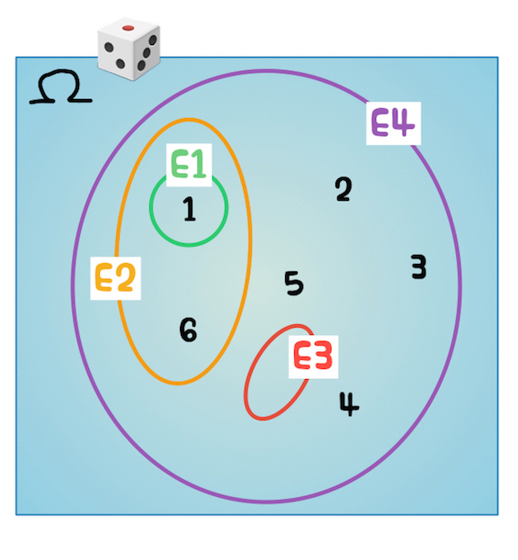
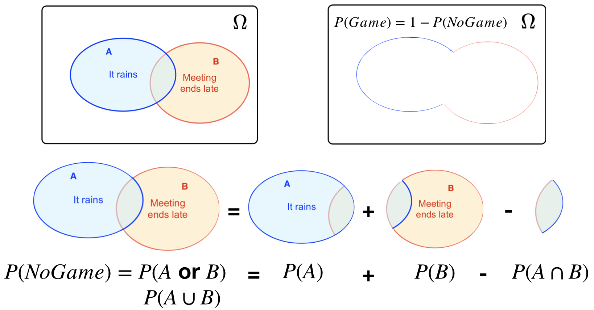
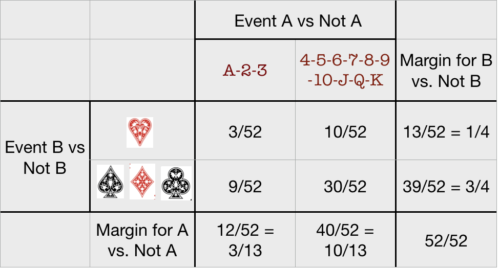
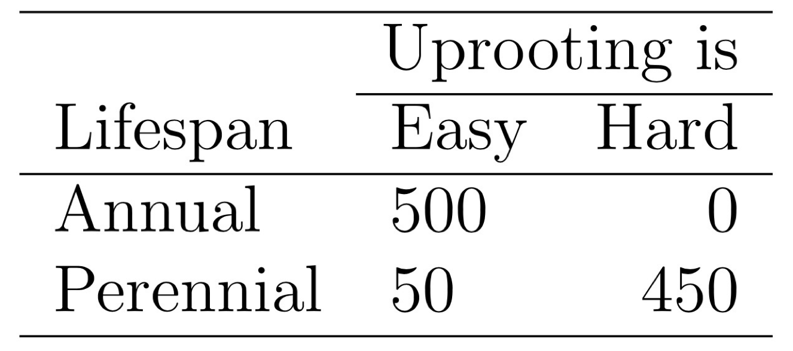
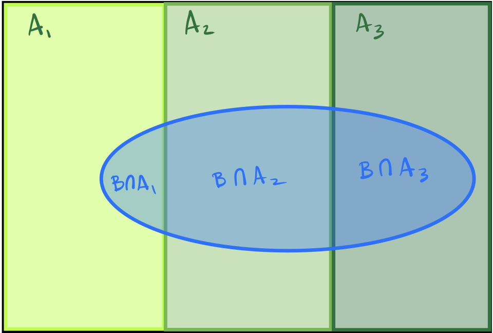
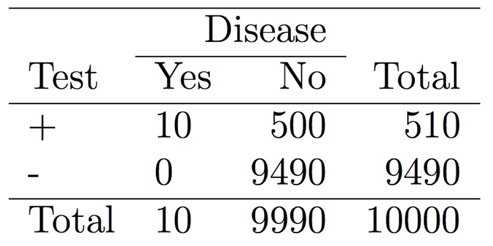

```{r proSetup, echo = FALSE, include=FALSE}
library(knitr)
library(prob)
library(kableExtra)

```


# Probability in Applied Statistics {#chProb}

This chapter introduces the concept of and a semi-formal theory for probability. The rules of probability are applied to random variables defined in the next chapter. We explain the fact that there are at least two ways of thinking about the intepretation of probability in the empirical world, Bayesian and Frequentist, but that in the "mathematical world" probability is just one thing and it follows a single set of rules (at least for the purpose of this course).
This chapter introduces the concept of and a semi-formal theory for probability. The rules of probability are applied to random variables defined in the next chapter. We explain the fact that there are at least two ways of thinking about the interpretation of probability in the empirical world, Bayesian and Frequentist, but that in the "mathematical world" probability is just one thing and it follows a single set of rules (at least for the purpose of this course).

The main point of this chapter is to show students how probabilities work and how the can be used to solve practical problems that involve uncertainty. Thus, we start by linking simple real world experiments whose results are uncertain with probabilities that can be handled mathematically. Then we show some of the main properties and rules that facilitate the calculations with probability.

A second main concept that is treated in this chapter is "randomness"  and the meaning of random. Briefly, in a deep sense no phenomenon in the macro world (larger than atoms) is random in the sense that exaclty the same conditions could lead to different results. Random means that part of what we observe will be modeled using random variables whose values change from experiment to experiment, and part will be modeled as constants that remain the same across experiments.
A second main concept that is treated in this chapter is "randomness"  and the meaning of random. Briefly, in a deep sense no phenomenon in the macro world (larger than atoms) is random in the sense that exactly the same conditions could lead to different results. Random means that part of what we observe will be modeled using random variables whose values change from experiment to experiment, and part will be modeled as constants that remain the same across experiments.

For most of this chapter we will do calculations that assume that we know all the values that are supposed to remain constant and focus on calculating probability of events. In later chapters, we kind of reverse the view to address real world questions and try to guess the unknown constant values based on the observed results of experiments.


## Learning Objectives for Chapter

1. Define probability and list the main probability "laws."
1. Determine if a process is random or deterministic and give examples of both.
1. Given a random experiment like rolling a die, write down the sample space.
1. Determine the probability mass function of a given random variable
1. Classify a list of quantities as values of random variables or parameters.
1. Define "independence" in the context of probability events and determine if two events are independent.
1. Explain what conditional probability is with a diagram and with formulas.
1. Calculate the probability of 1 of 2 mutually exclusive events, two independent events, one event occurring, given that another event has already occurred.
1. Write down Bayes rule and define each of its components.
1. Apply Bayes rule in a classification problem.
1. Give examples of processes that generate random variables with the most important distributions.
1. State the central limit theorem and show its effects with a simulation.


## Variables and parameters
### Variables and parameters

The terms "variable" and "parameter"" should be defined and used carefully. People frequently and incorrectly use the term "parameter" to refer to variables. This makes things more confusing.

Do not confuse "moments" with parameters. The $\chi^2$, t and F distributions can be used as good example of the difference between moments and parameters. The parameters are degrees of freedom, whereas some of their moments are determined by, but different from, the degrees of freedom.

**Parameters** are constants in the statistical distribution of random variables and thus, characterize populations. Usually, *parameters* cannot be measured directly and they cannot be known with certainty unless the whole population is known. The value of a parameter is not necessarily represented in the population values of the variable. For example, the mean, as a parameter, may not be similar to any of the values in the population. A clear case is the Bernoulli distribution, where the population is composed of 1's and 0's and the mean is a number between 0 and 1.

**Variables** may take a different value for each member of the population and can be measured directly and with certainty, within the precision of the measuring instrument.

Consider the following example. We define a random variable $X$ as the sum of the number of dots and the number of heads when we simultaneously roll a die and flip two coins. Assume that for each object (die, coin A, coin B) all outcomes are equally probable. This random experiment generates a probability distribution for $X$. This distribution has a mean, which we still do not know, ...


### What does "random" mean?
#### What does "random" mean?

Processes or experiments that have outcomes can be random or deterministic. When the outcome of a process is not known beforehand, we will say that the process and the resulting outcomes are random. For example, the number that will be selected in a roulette is random. The day of the week tomorrow is deterministic. "A random experiment is an experiment whose outcome is uncertain. Examples include rolling a pair of dice, tossing a coin, counting the number of defectives in a sample from a lot of manufactured items, and observing the time to failure of a tube in a heat exchanger, or a seal in a pump, or a bus section in an electrostatic precipitator." [@PSAES2007].

Although we will use this definition of "random," the word "random" is used with several related but different meanings. For example, sequences of values that cannot be compressed and expressed using less memory without loss of information are also called "random," but that is not the meaning we will use in this book.

We use the term "random" frequently in colloquial terms. However, in statistics the term has a more specific meaning: **Random** means that the result of a process or experiment is not certain. Some people use the term "random" to refer to a selection process in which each element  of a set has an equal probability of being chosen, but this is not the meaning we will use. We will use the word **random** for any experiment that has uncertain results. The following are examples of **random experiments**:.

- Flip a coin and determine which side landed facing up.
- Read the weight of a rat on a scale.
- Plant ten pots with rose variety A and ten with variety B; grow them for a year; count the number of roses produced in each pot and average it for each variety; subtract the average for 

We will see that in dealing with probabilities, we use real and imaginary random experiments, such as flipping a fair coin, rolling a die, or measuring the height of a plant. The results of all of these experiments are not certain until we do them and check the results. We think of the results of random experiments as member of the population of all possible results. The results obtained are called **realizations** of the random process. For example, suppose that you rolled a die 3 times and then flipped a coin twice, obtaining 423HH. The sequence 423HH is a realization of the random process consisting of rolling a die three times and a coin twice. Likewise, if you put a handful of sand in a bottle and shake it, the resting position of each of the grains of sand is a realization of the random process. We can imagine that because the grains have a variety of shapes, sizes and densities, they do not have equal probability for being in all positions. In more advanced applications of statistics, this idea is extended to systems with many parts, like the grains of sand. For example, we think of the DNA sequence in a chromosome as a realization of many theoretically possible sequences. The specific topograhy of a region is one realization of many possible topographies. Of course, we do not think of all of them as being equally likely.
We will see that in dealing with probabilities, we use real and imaginary random experiments, such as flipping a fair coin, rolling a die, or measuring the height of a plant. The results of all of these experiments are not certain until we do them and check the results. We think of the results of random experiments as member of the population of all possible results. The results obtained are called **realizations** of the random process. For example, suppose that you rolled a die 3 times and then flipped a coin twice, obtaining 423HH. The sequence 423HH is a realization of the random process consisting of rolling a die three times and a coin twice. Likewise, if you put a handful of sand in a bottle and shake it, the resting position of each of the grains of sand is a realization of the random process. We can imagine that because the grains have a variety of shapes, sizes and densities, they do not have equal probability for being in all positions. In more advanced applications of statistics, this idea is extended to systems with many parts, like the grains of sand. For example, we think of the DNA sequence in a chromosome as a realization of many theoretically possible sequences. The specific topography of a region is one realization of many possible topographies. Of course, we do not think of all of them as being equally likely.

<br>
```{block, type='mydef'}
```{block, type='mydef', message=FALSE}
**Random** is said of experiments whose outcomes are not known with certainty. By "experiment" we mean any set of actions or processes that will result in an outcome, not just scientific experiments.^[A more restrictive definition of "experiment" is used in [Chapter 10](#chEdesign), where it refers to scientific experiments where treatments are assigned to experimental units using randomization.]
```

### "Just due to Chance"
#### "Just due to Chance"

We frequently encounter explanations of events where a part of the event is said to be caused by certain factors and the rest is *"just due to random chance."* This phrase can lead to misunderstanding and should be considered thoroughly. Randomness does not mean that the process could have resulted in a different outcome if **all conditions were exactly the same**. Randomness or "just chance" is used to refer to the effects of all of the variables that affected the outcome but that we did not measure or consider.

Statements like the following are common in the literature. These were selected haphazardly because they were readily available.

>"Seascale is a village 3 km to the south of Sellafield and had y = 4 cases of lymphoid malignancy among 0–14 year olds during 1968–1982, compared with E = 0.25 expected cases (based on the number of children in the region and registration rates for the overall northern region of England). A question here is whether such a large number of cases could have reasonably occurred by chance. There is substantial information available on the incidence of childhood leukemia across the United Kingdom as a whole." [@Wakefield2013]

>"Exploratory studies are often informal in nature, and many different models may be fitted in order to gain insights into the structure of the data. In general, however, great care must be taken with data dredging since spurious associations may be discovered due to chance alone." [@Wakefield2013]

>"However, Le et al. (1999) argue for including those effects nonetheless. For one thing, they may point to potential hot-spots. These can be due to unknown environmental hazards or known ones that have simply not been detected. Just such spots were seen around the Rocky Mountain Arsenal described in Example 1.2. Of course apparent hot-spots can be artifacts of chance variation so confirmation is vital, a topic beyond the scope of this book." [@LeZidek2006]

>"The mean winning time for the first 13 races is 2 hours, 44 minutes, and 22 seconds (written 2:44:22). The mean winning time for the second 13 races is 2:13:18. This is quite a difference (over half an hour). Does this prove that the fastest men are running faster? Or is the difference just due to chance, no more than what often emerges from chance differences in performance from year to year? We can't answer this question with descriptive statistics alone." [@Lane2018]

>"The P-value reports the likelihood that the observed difference was due to chance alone. For example, if a statistical test comparing two sample means yields a P-value of 0.24 this indicates that there is a 24% chance of obtaining the observed result even if there is no true difference between the two sample means." [@ElzingaEtAl1998]

It is important to correctly interpret phrases like "due to chance" and we recommend not to use them, because they can be misleading. "Due to chance" may be interpreted as "due to a very specific combination of conditions and causes that we are not interested in at this time." Be careful not to just accept the statement as meaning that many different results could have been possible under the same conditions. The randomness of all results is just due to the fact that we cannot, or choose not to, measure all the relevant variables and processes that lead to a result. In the case of the comment about data dredging above, the phrase "due to chance alone" can be interpreted as meaning that the association detected is not a property of the population about which the scientist wants to make statements.

Specificallly, to say that "The P-value reports the likelihood that the observed difference was due to chance alone." is very misleading. For the record, 
Specifically, to say that "The P-value reports the likelihood that the observed difference was due to chance alone." is very misleading. For the record, 

>"Informally, a p-value is the probability under a specified statisti- cal model that a statistical summary of the data (e.g., the sample mean difference between two compared groups) would be equal to or more extreme than its observed value." [@WassersteinLazar2016]

Further, consider the number of tweets so that each student has sent in the last day. For an investigator interested in the population of students, perhaps the variation from student to student can be considered to be random and have some sort of statistical distribution for random errors. However, for each individual student the number of tweets they made is a known quantity and it is not considered to be an error in any way, not even in a statistical way. Presumably, students know exactly why they sent each tweet and the number of tweets for a particular day.


## Probability
### Probability

Gambling with dice motivated the early development of the concept and theory of probability, with the practical purpose of determining bets. One such problem, addressed by Blaise Pascal and Pierre de Fermat in France in the seventeenth century, was to determine the probability of obtaining at least one six in four rolls of one die, or of obtaining at least one pair of sixes in 24 rolls or two dice. The problem was posed by a gambler, Chevalier de Méré. More generally, the question was how to assign probabilities to the different possible outcomes of experiments whose results were not certain.

We need to use the concept of probability in order to be able to express and quantify uncertainty. Significance and confidence levels used in statistical statements are measures of probability, and they must be assigned or calculated in a manner that is consistent with the theory of probability. The theory of probability is a branch of mathematics that provides all the tools we need to operate with probabilities. By linking a real-world phenomenon with a probability model, we can use probability theory to derive new practical results that help us in the real world. For example, we can calculate the probability of incorrectly rejecting a null hypothesis, or the probability that an investment will yield a return greater than inflation, or the probability that a person will live more than 10 years after retirement.

```{block defProb, type = 'mydef'}
```{block defProb, type = 'mydef', message=FALSE}
Probabilities P are real numbers associated with random experiments that have the following properties:

* $0 \le P \le 1$ \
* If a random experiment is performed, P of some event is 1. \
* The probability of either one of two mutually exclusive events occuring is the sum of the individual probabilities.
* The probability of either one of two mutually exclusive events occurring is the sum of the individual probabilities.
```

Although there are several interpretations of probability in terms of what it means for the "real world," [@Allen1934Probability] all interpretations follow the same rules for the calculus of probability. The application of probability theory to the real world is analogous to the use of perfect geometric shapes to represent real-world objects. Formal mathematical constructs can be used as models of reality that are useful, but they are not perfect.

In thinking of probability, it is important to differentiate between using the theory of probability to make calculations that are correct, and the application of the theory to assign probabilities to specific real-world outcomes. For example, the probability of obtaining a particular number by rolling a die can be assigned by rolling the die a very large number of times and calculating the proportion of times the selected number came up. In using the proportion observed in the past to characterize the die in the future, one is implicitly assuming that all conditions will remain the same. This is not always a completely safe assumption, because over time the die may wear out unevenly, and change the probabilities. The example is clearer if you think of the probability of a different event, for example, the probability that your first job after graduation will pay more than \$50,000. It is simpler to imagine the same die being rolled repeatedly, as if the universe remained constant from one roll to the next, than to imagine your life repeating many times. However, the probability model can be applied in both cases. As an exercise, write down at least two difference ways to get an estimate of the probability that you will make more than \$50,000 in your first job. This is an Easter egg. Describe the problem and your proposed solution in class before anybody else and get a reward. Make sure to claim your Easter egg reward, Hint: think of yourself as one of many.

Another way to assign probabilities to experimental outcomes is by using the idea of symmetry. In the case of the die we may reason that all sides are the same and there are six sides, therefore each side gets a probability of $1/6$. In the case of flipping a coin, we assign equal probabilities to each side. We intuitively understand that the sum of the probabilities of all outcomes must be one, because one outcome must take place for each experiment. Do not confuse symmetry with lack of knowledge. The probability of all outcomes is not always the same, even if there are just two outcomes. Some people suffer from a tendency to think that if there are only two outcomes possible then "chances are 50:50." If you are asked about the probabiliy of getting a random card that is black form a deck, you should not bet on 50:50, in spite of the fact that there are only two outcomes, the card is black or it is not.
Another way to assign probabilities to experimental outcomes is by using the idea of symmetry. In the case of the die we may reason that all sides are the same and there are six sides, therefore each side gets a probability of $1/6$. In the case of flipping a coin, we assign equal probabilities to each side. We intuitively understand that the sum of the probabilities of all outcomes must be one, because one outcome must take place for each experiment. Do not confuse symmetry with lack of knowledge. The probability of all outcomes is not always the same, even if there are just two outcomes. Some people suffer from a tendency to think that if there are only two outcomes possible then "chances are 50:50." If you are asked about the probability of getting a random card that is black form a deck, you should not bet on 50:50, in spite of the fact that there are only two outcomes, the card is black or it is not.


### Frequentist and Bayesian probability
#### Frequentist and Bayesian probability

You may be surprised to learn that there are two different schools of thought about the application of probabilities to real-world problems: Bayesian and Frequentist or classic. Both are useful and give almost identical results in many situations, but they have deep philosophical differences, and yield different interpretation of results in important cases. This course deals almost exclusively with the Frequentist approach, which is the most commonly used. Bayesian probability and thinking is introduced to make sure that students keep an open mind and are not blindsided when they encounter applications of Bayesian statistics in the future.

**Probability as long-run relative frequency**: If we can imagine that an experiment or random process can be repeated under identical conditions a very large number of times, the relative frequency observed for a specific event tends to the probability of the event as the number of repetitions increases. Frequentist probability of an event is the relative frequency of the event approached as the number of experiments or trials conducted in identical conditions increases without bound. The probability of obtaining a head in a coin toss is the number of heads observed divided by the total number of tosses when the number of tosses is very, very large.

**Probability as a degree of belief ** In Bayesian statistics, probability is the metric used to quantify certainty. Probability of different events and randomness refer to the information we have, not to the world. A probability of 1 means that we are certain about an event, and a probability of 0 means we are certain it will not happen. The focus of Bayesian statistics is in updating the measure of certainty by using data. As more data are collected, our uncertainty is updated accordingly. Because the focus is on certainty by people, the Bayesian probability is called "subjective" and in Bayesian statistics it is meaning ful to talk about probability distributions for parameters. Because parameters are not known, people are uncertain about them, and that uncertainty is quantified by probability functions. In Bayesian statistics, parameters are treated as random variables.
**Probability as a degree of belief ** In Bayesian statistics, probability is the metric used to quantify certainty. Probability of different events and randomness refer to the information we have, not to the world. A probability of 1 means that we are certain about an event, and a probability of 0 means we are certain it will not happen. The focus of Bayesian statistics is in updating the measure of certainty by using data. As more data are collected, our uncertainty is updated accordingly. Because the focus is on certainty by people, the Bayesian probability is called "subjective" and in Bayesian statistics it is meaningful to talk about probability distributions for parameters. Because parameters are not known, people are uncertain about them, and that uncertainty is quantified by probability functions. In Bayesian statistics, parameters are treated as random variables.


### Outcomes, sample space and events
#### Outcomes, sample space and events

In order to have a minimal basis for working with probabilities and to be able to make statistical statements with properly quantified probabilities we need to define the elements of a **Probability Model**. Consider the roll of a die as before. The result can be 1 or 2 or 3 or 4 or 5 or 6. The set of numbers 1 to 6, all possible outcomes of the experiment, is called **sample space** and it is represented with the Greek letter capital omega $\Omega$.

<br>
\begin{equation}
\text{Sample space for rolling a 6-sided die:} \\[15pt]
\Omega=\{1,2,3,4,5,6\}
\end{equation}
<br>

However, when people use a die for gambling, they are not restricted to betting on a single number at a time. For example, one may want to bet that the number is even, or that it is either a 1 or a 3, or that it is not a 6. With the original sample space we can think of many possible events, each of which has a chance of happening. Imagine all possible events, from no number resulting from the roll (we assume for now that this is impossible if the die is rolled), to obtaining a number between 1 and 6 (a certainty). These are ALL possible events E and they are all possible subsets of $\Omega$. Because there are six numbers in the sample space and each number either is or is not in a subset the total number of event possible is $2^6 = 64$.

Finally, in order to make reasonable bets, one needs to be able to calculate the probability of each event E. We know that the probability of the empty set $\phi$ of the six numbers is zero, and that the probability of one number from the whole set is 1; but how do we determine the other probabilities? For this we need to complete the probability model by requiring that the probability assigned to each event follow these rules:

<br>
\begin{align}
A. \quad &0 \le P(E) \le 1 \\[20pt]
B. \quad &\text{if } \ E_1 \cap E_2 = \phi \\[10pt]
&\implies P( E_1 \cup E_2) = P(E_1) + P(E_2) \\[20pt]
C. \quad & P(\Omega) = 1
\end{align}
<br>

where $E_1 \cap E_2$ is the *intersection* or set of common elements for events $E_1$ and $E_2$, and $E_1 \cup E_2$ is the *union* or set of all elements in $E_1$ and/or $E_2$.

**A**. States that probabilities are numbers between 0 and 1 (including 0 and 1).

**B**. The probability of the experiment resulting in either of two disjoint events is the sum of the individual probabilities. For example, the probability that a die roll will results in 3 or 6 is the sum of the probability of 3 plus the probability of 6.

**C**. The probability that one of the outcomes in th esample space wil take place is 1.
**C**. The probability that one of the outcomes in the sample space will take place is 1.

Amazingly, all properties of probabilities can be derived from those axioms.

<br>
A **probability model** has three components:

1. Sample space
1. Enumeration of all possible events
1. Assigned probabilities
<br>

Such that probabilities are between 0 and 1, inclusive, and the where the probability of two mutually exclusive events is the sum of the probabilities of the individual events.

The sample space of rolling a die was given above. We will define an event as any subset of the sample space. For example "getting a 1" is the event that includes only the number 1, whereas "getting either a 1 or a 6" includes the two numbers:

\begin{equation}
  E_1 = \{1\} \quad \quad E_2= \{1,6\}
\end{equation}

Other events that we will use in the examples are:

\begin{equation}
  \text{   } E_3= \{ \} = \phi \quad \quad E_4= \{1,2,3,4,5,6\}
\end{equation}


```{r dieEvents, message=FALSE, warning=FALSE, paged.print=FALSE, out.width = '60%', fig.align='center', echo=FALSE, fig.cap ="Sample space of rolling a 6-sided die and events marked as subsets of the sample space."}



```

Consider a second random experiment: draw a random card from a standard deck of playing cards. The deck has 52 cards, 13 of each suit, 26 of each color. We are interested in the probabilities associated with various events. What will be extremely difficult for most of us in dealing with probabilities of "card events" is routine for professional card players.

First, let us think about the problem of creating a probability model for the deck of cards. The most basic question is: what probability do we assign to each card?! From the frequentist point of view, we would have to sample the cards many many times and assign to each card the relative frequency observed. As with the multiple rolls of a die mentioned before, we would question the preconception that probabilities will remain constant over time. They would not, because cards would wear our differently. We could get a lot of decks and take just on card from each deck, but this would not give us the probability for any specific deck. We choose to use the "symmetry" point of view, where we assume that there is nothing different about picking any of the 52 cards. Therefore they all have to have equal probability. The sample space is each of the 52 cards, and each outcome is given a probability of 1/52. Given this, we now have all the elements we need to know the exact probability of any event. The probability is exact because we (assume that we) know the "true" distribution of the elementary outcomes. As we will see later, this is not the case in most of the real experimental work. In most real-world applications we do not know the true probability of outcomes, so we use models and estimates.

Based in the model of symmetry that assigns equal probability to all cards we can define events and consider their probabilities. The following are all events, or subsets of the sample space:

1. Ace
1. Even
1. Red or Even
1. Red and Even, or prime

In each case, the probability equals the total number of favorable cases divided by the total number of possible cases, which is 52. P(Ace) = 4/52, P(Even) = 20/52, P(Red or Even) = P(Red) + P(Even) - P(Red and Even) = (26 + 20 - 10)/52. In the last case we subtracted Red and Even to avoid double-counting them as Red and as Even. Two difficulties may arise in trying to calculate the probabilities of these events: calculation of the total number of outcomes, calculation of the total number of favorable events. For these concepts and calculations it is useful to learn about Combinatorics and Set Theory.

### Combinatorics
#### Combinatorics

This is just the most basic introduction to those aspects of combinatorics that will be used in the course. Combinatorics is the branch of mathematics that deals with counting, ordering and arranging sets of objects of elements. For example, how many different sets of 4 cards can you obtain from a deck if you draw them with and without replacement? The probability of getting any specific ordered set would be the reciprocal of such number. It turns out that the number is $52^4$ with replacement and $52! / (52 - 4)!$ without replacement. The "!" means "**factorial**" and consists of the product of all natural numbers that are equal or smaller than the number to the left of the symbol.

<br>
\begin{align}
&\text{Factorial} \\[20pt]
k! &= k \ \cdot \ (k - 1)! \\[15pt]
0! &= 1
\end{align}
<br>

Thus, $52! / (52 - 4)! = 52\cdot 51 \dots 2 \cdot 1 / (48 \cdot 47 \dots 2 \cdot 1 =  52\cdot 51 \cdot 50 \cdot 49$. This is the number of different *permutations* of 52 cards taken in sets of 4, without replacement. But what is we drew more cards or if the order of the cards did not matter? Combinatorics has all of this organized for you, and it provides us with the formulas to calculate the necessary numbers for any situation. But first, we need to define the kinds of counting situations we have.

Consider that you have 5 objects or options, say A, B, C, D and E. These could be 5 cards, or 5 activities to choose from or anything else. For now, just think of them as 5 letters. We can make sequences of letters containing just those 5 letters. The order of the letters may or may not matter and the sequences can be made with or without replacement. If order matters we are dealing with **permutations** and if order does not matter, we are dealing with **combinations**.

```{block defPermComb, type='mydef'}
```{block defPermComb, type='mydef', message=FALSE}
If the sequence AB is **not** the same as BA use Permutations (order matters).

If the sequence AB is the same as BA use Combinations (order does not matter).
```

Therefore, there are four cases for getting sequences of r objects taken from a set of n. The cass and symbols used to represent their sizes are:
Therefore, there are four cases for getting sequences of r objects taken from a set of n. The case and symbols used to represent their sizes are:

- permutations without replacement $P(n,r) = P^n_r$,
- permutations with replacement $PR(n,r) = PR^n_r$,
- combinations without replacement $C(n,r) = C^n_r = (^n_r)$,
- combinations with replacement $CR(n,r) = CR^n_r$.

For example, the symbols $P(n,r)$ are read "permutations of n objects in sets of r." Note that when replacement is not mentioned, it is assumed that there is **no** replacement. The most common situation we will encounter in this course is that of combinations without replacement. We will use it primarily in the calculations for **binomial distributions**.

**Permutations without replacement**

In this case, order matters and each letter can be in the selected set only once. Could you label up to 500 different files with sequences of these letters, without repeating letters? If you use only one letter at a time you can label 5 files. Suppose you take 2 letters. There are 5 options for the first one and 4 options left for the second one, so you get 5 x 4 = 20 different permutations. If you use 3 letters there are 5 x 4 x 3 = 60 different ones. The maximum number of different labels you can get is 5! = 120 when you use all letters. You would need more letters for 500 files. The formula to determine the number of permutations is:

<br>
\begin{equation}
P(n,r) = \frac{n!}{(n-r)!}
\end{equation}
<br>


**Permutations with replacement**

In this case order matters, but each letter can be used as many times as desired. For the first letter of the sequence there are 5 choices, and the number of choices remains constant at 5 for all slots in the sets created. Therefore, there are 5 different one-letter labels, 5 x 5 two-letter labels, ..., and in general, $n^r$ labels made with r letters taken with replacement from n different ones. Note that when there is replacement, r can be larger than n, which is not the case without replacement.

<br>
\begin{equation}
PR(n,r) = n^r
\end{equation}
<br>

If you have to choose only from the 5 letters available (ABCDE) what is the minimum number of letters you need to label 500 files?

<br>
\begin{equation}
5^1 = 5 \\[10pt]
5^2 = 25 \\[10pt]
5^3 = 125 \\[10pt]
5^4 = 625 \\[10pt]
5^5 = 3125 \\[10pt]
\end{equation}
<br>

Four slots will suffice to label 500 files. If you needed to label more files, would you get more labels by adding a letter to the set of choices, making it ABCDEF, or would you add one more letter slot to each label?

Adding a letter to the set of choices: $6^4 = 1296$
Adding a letter to the label: $5^5 = 3125$


**Combinations without replacement**

In this situation, order does not matter. Suppose that you need to organize a soccer tournament with the participation of 10 teams, and you want all teams to play each other. How many games will you organize? In this case order does not matter because team A playing team B is the same as B playing A. For the first team selected for a match you have 10 options, and for the second you have 9, but half of the combinations will be the same as the other half with reversed order. The total is 10 x 9 / 2. In general, the formula is:

<br>
\begin{equation}
C(n,r) = \frac{n!}{(n-r)! r!}
(\#eq:combinations)
\end{equation}
<br>

For the soccer match, the formula results in 
$$\frac{10!}{(10 - 2)! \ 2!} = \frac{10!}{8! \ 2!} = \frac{10 \cdot 9} {2} = 45$$

This equation is important for the calculation of [binomial probabilities](#BinDist). We also use it to determine the total number of possible comparisons between two means taken from a set of k tested in [ANOVA](#chAnova)


**Combinations with replacement**

In this case, the elements in the set to choose from can be reused and order does not matter. Suppose that there are 10 ice cream flavors and that you get three scoops. How many different choices do you have for your cone? The equation for this is:

<br>
\begin{equation}
CR(n,r) = \frac{(n + r - 1)!}{(n-1)! \ r!}
\end{equation}
<br>

Therefore you can choose your ice cream cone from:

<br>
$$\begin{equation}
CR(10,3) = \frac{(10 + 3 - 1)!}{(10-1)! \ 3!} = \frac{12!}{9! \ 3!} = 220 \text{ options}
\end{equation}$$
<br>


**Three Aces**

With the ability to calculate the total number of different types of events, and using the symmetry principle, we can calculate probabilities associated with events using the deck of cards. 

Probability of 3 aces in 3 cards drawn.

Order does not matter, no replacement => Combinations without replacement

Total number of possible outcomes = $(^{52}_{\ 3}) = \frac{52!}{(52-3)! \ 3!} = 22100$

Number of favorable outcomes = $(^4_3) = \frac{4!}{(4-3)! \ 3!} = 4$

P(3 aces in 3 cards) = $4/22100 = 1/5525 \approx 0.000181$

These calculations can be performed in R with the `arrangements` package:

<br>
```{r 3aces3cards}
```{r 3aces3cards, message=FALSE}
library(arrangements)

(tot.outcomes <- ncombinations(k = 3, n = 52)) # total number of outcomes
(fav.outcomes <- ncombinations(k = 3, n = 4)) # outcomes with 3 aces
fav.outcomes / tot.outcomes # probability of 3 aces
```
<br>

Probability of 3 aces in 5 cards drawn.

Order does not matter, no replacement => Combinations without replacement

Total number of possible outcomes $= (^{52}_{\ 5}) = 2598960$

Number of favorable outcomes = no. ways to get 3 out of 4 aces x no. ways to get 2 out of 48 non-aces.

= $(^4_3) \cdot (^{52}_{\ 2}) = 4 \cdot 1128 = 4512$

P(3 aces in 5 cards) = $4 \cdot 1128 / 2598960 \approx 0.001736$

<br>
```{r 3aces5cards}
```{r 3aces5cards, message=FALSE}

(tot.outcomes <- ncombinations(k = 5, n = 52)) # total number of outcomes
# outcomes with 3 aces
(fav.outcomes <- ncombinations(k = 3, n = 4) * ncombinations(k = 2, n = 48))
fav.outcomes / tot.outcomes # probability of 3 aces
```
<br>


Combinatorics and probabilities are the core of bioinformatics. Genomes are constructed with an alphabet of 4 letters: Adenin, Guanine, Cytosine and Thymine for DNA (A, G, C and T for short). RNA uses Uracyl instead of Thymine. Sequences of bases encode amino acids. How many different amino acids can be encoded with two bases? Order matters, and the choices are with replacement, because bases can be repeated in any sequence. Therefore, $n^r = 4^2 = 16$ different amino acids could be encoded with 2-base sequences. However, life uses 20 encoded amino acids. Each one is encoded by a sequence of three bases. Three taken out of 4 with replacement can encode $4^3 = 64$ different things, which is more than necessary for amino acids. This is convenient because it allows for sequences to code other necessary signals for protein synthesis, such as "start" and "stop."
Combinatorics and probabilities are the core of bioinformatics. Genomes are constructed with an alphabet of 4 letters: Adenine, Guanine, Cytosine and Thymine for DNA (A, G, C and T for short). RNA uses Uracil instead of Thymine. Sequences of bases encode amino acids. How many different amino acids can be encoded with two bases? Order matters, and the choices are with replacement, because bases can be repeated in any sequence. Therefore, $n^r = 4^2 = 16$ different amino acids could be encoded with 2-base sequences. However, life uses 20 encoded amino acids. Each one is encoded by a sequence of three bases. Three taken out of 4 with replacement can encode $4^3 = 64$ different things, which is more than necessary for amino acids. This is convenient because it allows for sequences to code other necessary signals for protein synthesis, such as "start" and "stop."

How many different sequences of amino acids can be created with 20 different ones? Obviously, this depends on the size of the protein. One of the polypeptides that compose hemoglobin has 141 amino acid residues. With 20 options, how many different polypeptides of length 141 might be made? A lot!!

A core activity in bioinformatics is detecting patterns in sequences of bases and comparing those patterns. Sequences can be interpreted as resulting from random processes Markov processes.


### Probability of two events {#Pof2Events}
#### Probability of two events {#Pof2Events}

"If my meeting finishes late OR it is raining I will not go to the game." If it rains, even if my meeting ends early, I will not go. If my meeting finishes late, even if it does not rain, I will not go. If it rains and my meeting finishes late, I will not go. This is the meaning of the inclusive logical OR statement, and it will be assumed anytime we use "or." The "exclusive" OR is rarely used. In terms of events, OR means the union of the events. Let rain be event A and meeting finishing late be event B.

<br>
$$\begin{align}
P(A \text{ or } B) &= P(A \cup B) = P(A) + P(B) - P(A \cap B) \\[15pt]
P(A) &= \frac{\text{number of outcomes in A}}{\text{total number of outcomes}} \\[15pt]
P(B) &= \frac{\text{number of outcomes in B}}{\text{total number of outcomes}} \\[15pt]
P(A \cap B)&= \frac{\text{number of outcomes in A and B}}{\text{total number of outcomes}} \\[15pt]
\end{align}$$
<br>

The number of elements common to A and B has to be subtracted because they are included and counted in both in A and B.

Two events that have some outcomes in common create the general situation described in Figure \@ref(fig:gameEvents). It can rain and the meeting can finish late, which is the intersection of the events and is represented by $A \cap B$ where the symbol between the letters is read "intersection."" It can rain and the meeting can finish early, meaning NOT late. This is the intersection of A and not B and is represented as $A \cap \bar{B}$ and is the area in the blue bubble that is not inside the red bubble^[Note that we use the "bar" to signify "not" or complement. Later we will use the bar to signify "average" but there should be no confusion given the contexts in which the symbol appears.]. The white area around the two bubbles represents the case in which it does not rain and the meeting does not end late ($\bar{A} \cap \bar{B}$) which is the white area representing the event that I go to the game.

<br>
```{r gameEvents, message=FALSE, warning=FALSE, paged.print=FALSE, out.width = '75%', fig.align='center', echo=FALSE, fig.cap ="Probability of two events that are not mutually exclusive represented as overlapping subsets of the sample space. The sample space is the white rectangle."}



```
<br>

Disjoint or mutually exclusive events are events that have no elements in common. For example, drawing an ace and drawing an even card. The probability of the union of disjoint events is the sum of the probabilities of each event. To calculate the number of favorable outcomes, simply sum the number of favorable outcomes in each event. There are 4 aces and 20 even cards, and 52 possible outcomes in the sample space. The probability of ace or even is 24/52. In general when we state A or B, it means that either A, B or both are true.

### Conditional probability and independence
#### Conditional probability and independence

What is the probability that it will rain in Davis in a unspecified day? Given the way the question is stated, one could interpret it as the probability in a randomly chosen day. Although the probability of rain in Davis is not the same for all days of the year, the probability that it rains in a randomly selected day could be thought of as a single number. Suppose that it rained in 1350 our of the past 10,950 days. If you pick one of those days at random, the chances of picking a rainy one is 1350/10,950 = 0.123. Using a model that assumes that the proportion of rainy days remains constant in the future, we could assign a P(rainy = 0.123 to a randomly selected futire day. Obvioulsy, this is not what the weather person reports every day.
What is the probability that it will rain in Davis in a unspecified day? Given the way the question is stated, one could interpret it as the probability in a randomly chosen day. Although the probability of rain in Davis is not the same for all days of the year, the probability that it rains in a randomly selected day could be thought of as a single number. Suppose that it rained in 1350 our of the past 10,950 days. If you pick one of those days at random, the chances of picking a rainy one is 1350/10,950 = 0.123. Using a model that assumes that the proportion of rainy days remains constant in the future, we could assign a P(rainy = 0.123 to a randomly selected future day. Obviously, this is not what the weather person reports every day.

The probability of rain obviously depends on the day of the year and more importantly, on the recent weather conditions and the current pattern of circulation in the nearby atmosphere. Suppose that it is February, that it is raining today and that a mass of air with low pressure and moisture is moving through Central California. The probability of rain the following day is much greater than 0.123. It may be 0.93. Given the current conditions, the probability is no longer 0.123. We can say more generally, that probability of rain tomorrow, given that it is February, that it is raining now and that a mass mist air is passing through, is 0.93. This is a conditional probability.


**Conditional Probability**: The conditional probability of one event given that another event is known to have happened is defined as the probability of the intersection of the two events divided by the probability of the event known to have happened.

<br>
\begin{equation}
P(E_1|E_2) = \frac{P(E_1 \cap E_2)} {P(E_2)}
(\#eq:conditionalP)
\end{equation}
<br>

Using the events defined above for rolling a die we can calculate the probability of getting a 6 given that we know that either a 1 or a 6 was rolled. By arguments of symmetry we have assigned a probability of $\frac{1}{6}$ to each event consisting of a single number. Thus, the probability of event $E_1$ is $\frac{1}{6}$, and the probability of event $E_2$ is $\frac{2}{6}$. The intersection of the two events is the number 1 that they have in common, $E_1 \cap E_2 = \{1\}$, so the probability of the intersection is also $\frac{1}{6}$ and the resulting conditional probability is $\frac{1}{2}$, which should make intuitive sense: given that either a 1 or a 6 was observed, what is the probability that it was a 1? It's a 50:50 chance.

<br>
$$E_1 \cap E_2 = \{1\} \implies P(E_1 \cap E_2) = P(\{1\}) = \frac{1}{6}$$
<br>

$$P(E_2) = P(\{1,6\}) = \frac{2}{6}$$
<br>

Therefore, 

<br>
$$P(E_1|E_2) = \frac{\frac{1}{6}}{\frac{2}{6}} = \frac{1}{2}$$
<br>

**Independent events**

We say that two events are independent if the probability of observing both events simultaneously is the product of the probabilities of each event separately. More intuitively, if two events are independent, by knowing one of them you gain no information about the other one. In other words, one event does not affect the probability of the other one. ^[Do not confuse independent event with the concepts or terms dependent and independent variables that we will use later to mean response and predictor variables.] When events are not independent the probability of one depends on the other, and thus information about wether one event has happened or "realized" gives information about the likelihood of the other event. An extreme example of lack of independence is when two events are disjoint. In tis case the dependence is perfect because if we know that one event happened, we also know that the other did not happen.
We say that two events are independent if the probability of observing both events simultaneously is the product of the probabilities of each event separately. More intuitively, if two events are independent, by knowing one of them you gain no information about the other one. In other words, one event does not affect the probability of the other one. ^[Do not confuse independent event with the concepts or terms dependent and independent variables that we will use later to mean response and predictor variables.] When events are not independent the probability of one depends on the other, and thus information about whether one event has happened or "realized" gives information about the likelihood of the other event. An extreme example of lack of independence is when two events are disjoint. In this case the dependence is perfect because if we know that one event happened, we also know that the other did not happen.

```{block indepDef, type = 'mydef'}
```{block indepDef, type = 'mydef', message=FALSE}
- If the probability of observing two events equals the product of the probabilities of each event separately, the events are independent.
```

Consider a random experiment consisting of drawing a card from a deck as before. Define event A as the card being less than 4, and event B as the card being hearts. The total number of outcomes is 52. The outcomes favorable to A are 12 (4 aces, 4 two's and 4 three's), so $P(A) = 12/52 = 3/13$. The outcomes favorable to B are 13, thus, $P(B) = 13/52 = 1/4$. Outcomes favorable to the intersection $A \cap B$ are 3 (ace of hearts, 2 of hearts and 3 of hearts), so the probability of observing a heart lower than 3 is $P(A \cap B) = 3/52$. The events are independent, because $P(A) \cdot P(B) = (3/13) (1/4) = 3/52 = P(A \cap B)$

This can be seen with a table where all combinations of events are represented simultaneously. The columns of the table represent the occurrence of event A and the rows represent B. These tables are constructed such that rows and columns represent two *complete partitions* of the sample space:

<br>
```{r IndepEventsTbl, message=FALSE, warning=FALSE, paged.print=FALSE, out.width = '60%', fig.align='center', echo=FALSE, fig.cap ="Table to compute the probability of two events and determine if they are independent. The random experiment is drawing a card from a deck. The events are independent because the product of the probability of hearts and the probability of less than 4 equals the probability of hearts and less than 4."}



```
<br>

The concept of partition will be useful when we consider the laws of conditional and total probability. A partition of a sample space is a set of disjoint events whose union equals the sample space. For example, the sample space of draing a card can be partitioned into red and black suits, or it can be partitioned into 4 different suits. In each case, if the subsets or events are joined the complete sample space is obtained. In Figure \@ref(fig:gameEvents) we see that the events considered are not a partition, because rain and late meeting can happen simultaneously.
The concept of partition will be useful when we consider the laws of conditional and total probability. A partition of a sample space is a set of disjoint events whose union equals the sample space. For example, the sample space of drawing a card can be partitioned into red and black suits, or it can be partitioned into 4 different suits. In each case, if the subsets or events are joined the complete sample space is obtained. In Figure \@ref(fig:gameEvents) we see that the events considered are not a partition, because rain and late meeting can happen simultaneously.


**Marginal probability**

The table in Figure \@ref(fig:IndepEventsTbl) consists of two types of cells and probabilities: marginal and joint probabilities. The marginal probabilities of event A are in the bottom or marginal row. Ignoring event B, or regardless of B, $P(A) = 3/13$ and $P(\widetilde{A}) = 10/13$. The marginal porbabilities of event B, regardless of A, are in the righmost or marginal column: $P(B) = 1/4$ and $P(\widetilde{B}) = 3/4$. Marginal probabilities must add up to 1.
The table in Figure \@ref(fig:IndepEventsTbl) consists of two types of cells and probabilities: marginal and joint probabilities. The marginal probabilities of event A are in the bottom or marginal row. Ignoring event B, or regardless of B, $P(A) = 3/13$ and $P(\widetilde{A}) = 10/13$. The marginal probabilities of event B, regardless of A, are in the rightmost or marginal column: $P(B) = 1/4$ and $P(\widetilde{B}) = 3/4$. Marginal probabilities must add up to 1.

**Joint probability**

The joint probability of two events is the probability of their intersection, the probability that both event occur simultaneously. Joint probabilities are in the body of Figure \@ref(fig:IndepEventsTbl). For example, the joint probability of A and B (hearts lower than 4) is 3/52. When the joint probability is the product of the marginal probabilities, events are indipendent.
The joint probability of two events is the probability of their intersection, the probability that both event occur simultaneously. Joint probabilities are in the body of Figure \@ref(fig:IndepEventsTbl). For example, the joint probability of A and B (hearts lower than 4) is 3/52. When the joint probability is the product of the marginal probabilities, events are independent.


**Dependent events**

A practical example further represents lack of independence. Annual grasses have roots that are smaller than perennial grasses unless the perennial grasses are in their first year of life. Therefore, it is typically easier to uproot annual than perennial grasses. The problem is that young perennial plants also have small roots. Suppose that 10\% of the perennial grasses in a field are young, and 50\% of all the grass plants in the field are perennial. All annual grasses can be uprooted easily. The experiment we conduct is to uproot a randomly selected plant and determine if it was easy. What is the probability that the plant is annual? We are looking for the conditional probability of the plant being annual given that it was easy to uproot. In order to determine the probability, imagine that there are 1000 plants and that we uproot them all one at a time and the we identify the species to know if they are annual or perennial. We will find that in 550 cases the uprooting was easy: the 500 annual plants and the 50 young perennial plants were easy to uproot. No annual plants were hard to uproot and 450 perennial plants were hard ot uproot. The situation is represented in the following table.
A practical example further represents lack of independence. Annual grasses have roots that are smaller than perennial grasses unless the perennial grasses are in their first year of life. Therefore, it is typically easier to uproot annual than perennial grasses. The problem is that young perennial plants also have small roots. Suppose that 10\% of the perennial grasses in a field are young, and 50\% of all the grass plants in the field are perennial. All annual grasses can be uprooted easily. The experiment we conduct is to uproot a randomly selected plant and determine if it was easy. What is the probability that the plant is annual? We are looking for the conditional probability of the plant being annual given that it was easy to uproot. In order to determine the probability, imagine that there are 1000 plants and that we uproot them all one at a time and the we identify the species to know if they are annual or perennial. We will find that in 550 cases the uprooting was easy: the 500 annual plants and the 50 young perennial plants were easy to uproot. No annual plants were hard to uproot and 450 perennial plants were hard to uproot. The situation is represented in the following table.

<br>
```{r uprootingTbl, message=FALSE, warning=FALSE, paged.print=FALSE, out.width = '40%', fig.align='center', echo=FALSE, fig.cap ="Counts of perennial and annual grasses that are easy or hard to uproot. The observed counts differ from what would be expected if lifespan and uprooting dificulty were independent."}



```
<br>


By conditioning on the uprooting difficulty observed, we eliminate one column of the table. If the uprooting is easy, the probability that the plant is perennial is 50/550, whereas when the uprooting is hard the probability of perennial is 450/450. Therefore, these events are not independent. By determining if the plant is hard to uproot we can greatly increase our certainty about its lifespan. Let's write the probabilities using equations:

<br>
$$\begin{align}
  &P(annual) = 500/1000 \quad \quad \quad P(perennial = 500/1000) \\[15pt]
  &P(Easy) = 550/1000 \quad \quad \quad P(Hard) = 450/1000 \\[15pt]
  &P(Easy \cap perennial) = 50/1000 \quad \quad P(Hard \cap annual) = 0/1000 \\[15pt]
  &P(Easy) P(perennial) = (550/1000) (500/1000) = 275/1000 \neq P(Easy \cap perennial) \\[15pt]
\end{align}$$
<br>

The product of the marginal probabilities of each event is not equal to the joint probability of both events occurring simultaneously, therefore, the events are NOT independent. Note that in this example of perennial and annual plants there is an obvious biophysical mechanism linking the events to each other: annual plants have smaller roots than most perennial plants, and therefore they are easier to uproot than most perennial plants. Annual roots are smaller because they are needed for and can grow during just one season. A lot of science and statistics deals with detecting lack of independence and finding out the mechanisms that are behind the lack of independence. However, lack of independence does not mean that there is a cause-and-effect relationship among events. The frequency of crime increases as the number of churches increases across cities. This is not due to an effect of crime on church-building or of churches on crime tendencies. It is mostly due to a common cause: the number of people causes more churches to be built and more crimes to be committed. The only way to establish cause and effect relationships is through manipulative experimentation where potential causes (treatments) are assigned randomly to experimental material with replications and following a strict [experimental design](#chEdesign).


**Total Probability**

Consider a set of events $A_i$ that are a partition of a sample space. The union of all events $A_i$ is the sample space. Any other event such as event $B$ in Figure \@ref(fig:TotProb) can be represented as the union of the intersections between B and each $A_i$.


<br>
```{r TotProb, message=FALSE, warning=FALSE, paged.print=FALSE, out.width = '60%', fig.align='center', echo=FALSE, fig.cap ="Venn diagram showing the total probability of event B as the weighted sum of the conditional probabilities."}



```

<br>

$$B = U(B \cap A_1, \ B \cap A_2, \ B \cap A_3)$$
<br>

Event B is the union of its intersections with a partition of the sample space $\Omega$. Because the intersections are disjoint, the probability of B is the sum of the probabilities of the intersections. The probability of each intersection can be related to the conditional probability by using the definition of conditional probability in Equation \@ref(eq:conditionalP). Substituting into the equation for $P(B)$ we obtain the law of total probability.

<br>
\begin{align}
P(B) &= P(B \cap A_1) + P(B \cap A_2) + P(B \cap A_3) \\[15pt]
P(B|A_i) &= \frac{P(B \cap A_i)}{P(A_i)} \ \implies \ P(B \cap A_i) = P(B|A_i) \cdot P(A_i) \\[15pt]
\text{therefore} \quad P(B) &= P(B|A_1) \cdot P(A_1) + P(B|A_2) \cdot P(A_2) + P(B|A_3) \cdot P(A_3) \\[15pt]
\text{In general: } P(B) &= \sum_i P(B|A_i) \cdot P(A_i)
(\#eq:totalP)
\end{align}
<br>

A study shows that in certain conditions when heifers are less than 70\% normal body weight they have a 0.20 chance of becoming pregnant; when they are between 70 and 80\% the pregnancy rate is 0.60; when they are between 80\% and 90% the pregnancy rate is 0.75; above 90\% normal body weight the pregnancy rate is 0.92. A herd of 1000 heifers has the following frequencies of body weights:

<br>

|  group  | \% Normal BW | no. heifers | P(preg)  |
|:-------:|:------------:|:-----------:|:--------:| 
|   $A_1$ |   < 70       |    100      |  0.20    |
|   $A_2$ |  70 - 80     |    200      |  0.60    |
|   $A_3$ |  80 - 90     |    250      |  0.75    |
|   $A_4$ |   > 90       |    450      |  0.92    |

<br>

What is the probability of pregnancy for any randomly selected heifer from the herd? In other words, what is the total number of heifers that are expected to get pregnant? The answer is found by the law of total probability. We were given the conditional probabilities of pregnancy for a set of categories that are a partition of the heifers:

<br>
$$P(preg|A_1) = 0.20 \quad \quad P(A_1) = 0.10 \\[15pt]
  P(preg|A_2) = 0.60 \quad \quad P(A_2) = 0.20 \\[15pt]
  P(preg|A_3) = 0.75 \quad \quad P(A_3) = 0.25 \\[15pt]
  P(preg|A_4) = 0.92 \quad \quad P(A_4) = 0.45 \\[15pt]
  P(preg) = 0.20 \times 0.10 \ + \ 0.60 \times 0.20 \ + \ 0.75 \times 0.25 \ + \ 0.92 \times 0.45 = 0.7415$$
<br>


## Bayes Rule {#BayesRule}

Imagine that you are randomly screened for a trait using a test that detects the trait when present with 99% accuracy. The test comes back positive. This may lead you to think that you have the trait. If it is a desirable trait you might become ecstatic. If it is deleterious you might become extremely worried. In reality, you do not have enough information to get too excited. Consider the following excerpt from [@Westbury2010]:

"A particular disorder has a base rate occurrence of 1/1000 people. A test to detect this disease has a false positive rate of 5\%, that is, 5\% of the time that it says a person has the disease, it is mistaken. Assume that the false negative rate is 0\% the test correctly diagnoses every person who does have the disease. What is the chance that a randomly selected person with a positive result actually has the disease?
When this question was posed to Harvard University medical students, about half said that the answer was 95\%, presumably because the test has a 5\% false positive rate. The average response was 56\%. Only 16\% gave the correct answer, which can be computed with Bayes Rule in the following manner:"

The key in solving the problem is in identifying each element properly. The base rate means that the probability that a randomly selected person has the disorder is 0.001. This is called the *prior* probability of the disorder, because it is prior to running the test. The false positive rate of 0.05 is the *conditional* probability of getting a positive test given that the person does not have the disorder. The false negative rate of 0.0 is the conditional probability that the test gives a negative result when the disorder is present. The question asks for the value of the reverse conditional probability of having the disorder $P(D)$ given that the test is positive. Key to the solution is that the person is selected at random from the population with a 0.001 rate of incidence of the disorder.

<br>
$$P(\text{D}) = 0.001 \quad \text{prior probability of a random person having disorder} \\[15pt]
  P(+|\tilde{D}) = 0.05 \quad \text{probability of false positive, i.e., positive given no disorder}\\[15pt]
  P(-|D) = 0.0\quad \implies \quad P(+|D) = 1.0 \quad \text{there are no false negatives} \\[15pt]
  \text{What is } \ P(D|+) \ ?$$
<br>

Before we can solve this we need to introduce Bayes Rule, which is derived directly from the definition of conditional probability. If we have two events, $D$ and $+$, the conditional probability of $D$ given $+$ is the probability of the intersection of the events divided by the probability of $+$. The conditional probability of $+$ given $D$ is the probability of the same intersection divided by the probability of $D$. If we factor out the probability of the intersection in both definitions, the results are equal. We can rearrange them to obtain the basic version of Bayes Rule with the notation for the disorder and test question:

<br>
\begin{align}
P(+|D) &= \frac{P(+ \cap D)} {P(D)} \implies P(+ \cap D) = P(+|D) \cdot P(D) \\[15pt]
P(D|+) &= \frac{P(+ \cap D)} {P(+)} \implies P(+ \cap D) = P(D|+) \cdot P(+) \\[15pt]
&\implies P(+|D) \cdot P(D) = P(D|+) \cdot P(+) \\[15pt]
 &\implies P(D|+) = \frac{P(+|D) \cdot P(D)}{P(+)} = \frac{P(+|D) \cdot P(D)}{P(+|D) \cdot P(D) + P(+|\tilde{D}) \cdot P(\tilde{D})}
(\#eq:diseaseBayes)
\end{align}
<br>


The probability of disorder given a positive test result is directly proportional to the prior probability of disorder times the conditional probability of positive given the disorder (usually called the likelihood), and it is inversely proportional to the total probability of getting a positive test. We apply Bayes rule directly to answer the question, using the total probability of positive test result in the denominator.

The total (marginal) probability of having a positive test is the sum of all independent ways to get a positive test, which includes getting a positive when the disorder is present (true positive) and getting a positive when the disorder is not present (false positive).

$$ \text{Total or marginal probability of positive test result:} \\[15pt]
P(+) = P(True+) + P(False+) \\[15pt]
= P(+|D) \cdot P(D) + P(+|\tilde{D}) \cdot P(\tilde{D}) \\[15pt]
1.0 \times 0.001 + \frac{500}{9990} \times 0.999 = `r 1 * 0.001 +(500/9990) * 0.999`$$
<br>

Thus, the probability of having the disorder given that one was selected at random and had a positive test results is:

<br>
$$P(D|+) = \frac{1.0 \cdot 0.001}{1.0 \cdot 0.001 + 0.05005 \cdot 0.999} = 0.01960786$$
<br>


The small probability is very counterintuitive, but it can be understood without the detailed math as [@Westbury2010] explains:
The small probability is very counter-intuitive, but it can be understood without the detailed math as [@Westbury2010] explains:

"Although the test is highly accurate, it in fact gives a correct positive result just 2\% of the time. How can this be? The answer (and the importance of Bayes Rule in diagnostic situations) lies in the highly skewed base rates of the disease. Since so few people actually have the disease, the probability of a true positive test result is very small. It is swamped by the probability of a false positive result, which is fifty times larger than the probability of a true positive result.

You can concretely understand how the false positive rate swamps the true positive rate by considering a population of 10,000 people who are given the test. Just 1/1000th or 10 of those people will actually have the disease and therefore a true positive test result. However, 5\% of the remaining 9990 people, or 500 people (499.5), will have a false positive test result. So the probability that a person has the disease given that they have a positive test result is 10/510, or 2\%."

<br>
```{r TestDiseaseTbl, message=FALSE, warning=FALSE, paged.print=FALSE, out.width = '50%', fig.align='center', echo=FALSE, fig.cap ="Counts of events showing the relationship between a test for a disease and presence of disease. A total of 10000 randomly selected individuals were tested and also diagnosed with certainty using a different set of tests. The interest is in assessing the probabiliyt of having the disease given that the test is positive, assuming that the individual is selected at random from the same population represente in the table."}



```
<br>

The key phrase in the statement of the problem is "randomly selected person." It is important to understand that a person was randomly selected and then administered the test. Alternatively, as Westbury explains at the end, one can think of the whole population being tested. If the person is not randomly selected from the whole population, then the calculation is not correct. The base rate (prior probability of the diorder) used has to be based on the population from which the person is selected. It is reasonable to think that if the person was selected as a result of a consultation with a doctor, her base rate is probably greater than the base rate for the whole population. The reason for having a test done matters in assessing the probability of having a disease. A Bayesian approach to inference is particularly useful here and it is explained in the next subsection.
The key phrase in the statement of the problem is "randomly selected person." It is important to understand that a person was randomly selected and then administered the test. Alternatively, as Westbury explains at the end, one can think of the whole population being tested. If the person is not randomly selected from the whole population, then the calculation is not correct. The base rate (prior probability of the disorder) used has to be based on the population from which the person is selected. It is reasonable to think that if the person was selected as a result of a consultation with a doctor, her base rate is probably greater than the base rate for the whole population. The reason for having a test done matters in assessing the probability of having a disease. A Bayesian approach to inference is particularly useful here and it is explained in the next subsection.

### Bayesian data analysis
#### Bayesian data analysis

In abstract general form and for discrete events, Bayes Rule states:

<br>
$$P(A_i|B) = \frac{P(A_i) \cdot P(B|A_i)}{\sum_i P(B|A_i) \cdot P(A_i)} \\[25pt]
  P(A_i|B) \quad \text{is the posterior probability of } A_i \\[15pt]
  P(A_i) \quad \text{is the prior probability of } A_i \\[15pt]
  P(B|A_i) \quad \text{is the likelihood of } B \text{ when } A_i \text{ is true} \\[15pt]
  \sum_i P(B|A_i) \cdot P(A_i) \quad \text{ is the normalizing factor} $$
<br>

Recall that the vertical bar is read as "given," "given that," or "conditional on."
In Bayesian statistics, the rule is applied with special meaning for each component of the equation. $A_i$ is the event whose probability or degree of certainty we want to determine by using information about $B$, which is the event observed or data. In the case of the example above, $A_1$ is "disorder is present" and $B$ is "test is positive." The marginal probability of having the disease $P(A_1)$ is the knowledge **prior** to taking the test, the probability that any randomly selected person has the disease. Note that this is prior knowledge and it may or may not be available. In the example, the information is available based on previous studies: $P(A_1) = 0.001$. Because it is the knowledge available before obtaining new data, the probability is known as **prior probability** or simply **prior**. $P(B)$ is the total probability of getting a positive test result. The total probability can be calculated using the law of total probability as shown in Equation \@ref(eq:totalP).

The Bayesian calculation is an updating of the information about the probability that an individual has the disorder based on data about the test. This is the basis of Bayesian statistics: information about events that are not directly observable without error are updated using information about related events that are observable. In specific, Bayesian statistics does provide estimates of the probability that a null hypothesis is true:

<br>
\begin{equation}
P(H_{0i}|data) = \frac{P(H_{0i}) \cdot P(data|H_{0i})}{\sum_i P(data|H_{0i}) \cdot P(H_{0i})}
(\#eq:BayesDataEq)
\end{equation}
<br>

In doing so, the Bayesian method weighs the merit for a particular hypothesis against all possible hypothesis, because it can provide posterior probabilities for all of them. Usually, hypotheses will be about values of unknown parameters, thus, in Bayesian statistics the results of a test are probabilities of values for unknown parameters, whereas in Frequentist statistics the result of a test is usually the rejection of failure to reject a single value for the unknown parameter. It is considered that the parameters is a fixed quantity that is unknown, thus, the probability of $H_0$ being true is either 1 or 0, but it is completely unknown and it is never calculated. 

<br>
```{block BayesFreq, type='think'}
```{block BayesFreq, type='think', message=FALSE}
- Bayesians can calculate the probability of a hypothesis being true.
- Frequentists NEVER calculate the probability of a hypothesis being true.
```
<br>

Suppose that the same test for the disease is now used in a different population that is knonw to have a total incidence of 1 in 100. A randomly selected individual tests positive. What is the probability that the individual has the disease? Once again, we are trying to calculate $P(D|+)$, but now the prior probability of disease is much greater; $P(D) = 0.01$. WE apply Bayes' rule with the new incidence value

<br>
$$\begin{equation}
P(D|+) = \frac{P(D) \ P(+|D)}{P(+|D) \ P(D) + P(+|\tilde{D}) \ P(\tilde{D})}
\end{equation} \\[35pt]
= \frac{0.01 \times 1.00}{0.01 \times 1.00 + \frac{500}{9990} \times 0.99} = `r 0.01*1/(0.01*1+500*0.99/9990)`$$
<br>


### Frequentist data analysis

The frequentist approach does not consider the relative merit of all possible hypothesis but it estimates the probability of observing the data when the chosen hypothesis is true, which in Equation \@ref(eq:BayesDataEq) is $P(data|H_{0})$. If the probability is very low, it rejects the hypothesis. It is very important to remember that the frequentist approach DOES NOT estimate the probability of the hypothesis being true or false. It only estimates the conditional probability for the data given the null hypothesis.


## de Méré's dice problem
### de Mere's dice problem

With the rules of probability we can solve Chevalier de Méré's problem. The French nobleman and gambler Chevalier de Méré needed to know probabilities to make reasonable bets. He suspected that the probabilities of getting at least one 6 in four rolls of one die were greater than obtaining at least one double-six in 24 rolls of two dice. He also wanted to know if betting on those was "even money," meaning that the chances of winning were as good as the chances of losing.
With the rules of probability we can solve Chevalier de Mere's problem. The French nobleman and gambler Chevalier de Mere needed to know probabilities to make reasonable bets. He suspected that the probabilities of getting at least one 6 in four rolls of one die were greater than obtaining at least one double-six in 24 rolls of two dice. He also wanted to know if betting on those was "even money," meaning that the chances of winning were as good as the chances of losing.

**Four rolls of one die**

Sample space for each roll is {1, 2, 3, 4, 5, 6}, with symmetry. Thus^[We use a notation that is simple and easy to understrand, but not completely formal where "$P(6)$" means "probability of getting six dots on the upper face of the die when rolling it once."], $P(6) = 1/6$, and $P(\tilde{6}) = 5/6$. There is only one way to not get a 6 in four rolls: no 6 in the first, no 6 in the second, no 6 in the third and no six in the fourth roll. Because the rolls are independendent the probability of no 6 at all is the product of the probability of no six in each roll. Using the axiom that all $P(6) + P(\tilde{6}) = 1$ we get the result.
Sample space for each roll is {1, 2, 3, 4, 5, 6}, with symmetry. Thus^[We use a notation that is simple and easy to understand, but not completely formal where "$P(6)$" means "probability of getting six dots on the upper face of the die when rolling it once."], $P(6) = 1/6$, and $P(\tilde{6}) = 5/6$. There is only one way to not get a 6 in four rolls: no 6 in the first, no 6 in the second, no 6 in the third and no six in the fourth roll. Because the rolls are independent the probability of no 6 at all is the product of the probability of no six in each roll. Using the axiom that all $P(6) + P(\tilde{6}) = 1$ we get the result.

<br>
$$P(6) = 1/6 \ \implies P(\tilde{6}) = 5/6 \quad \text{ in one roll} \\[15pt]
P(\tilde{6} \ \cap \tilde{6} \ \cap \tilde{6} \ \cap \tilde{6}) = P(\tilde{6}) \cdot P(\tilde{6}) \cdot P(\tilde{6}) \cdot P(\tilde{6}) = (5/6)^4 \\[15pt]
P(\text{at least one 6}) = 1 - P(\tilde{6}) = 1 - (5/6)^4 \approx 0.517747$$
<br>

**Twenty four rolls of two dice**

In this case the sample space for each roll has all permutations of the numbers 1-6 taken in sets of 2, which is $6^2 = 36$. Once again, we choose the shorter way to solve the problem by noting that the only way to not get at least one double-6 is not to get it in each of the 24 rolls.

<br>
$$P(66) = 1/36 \ \implies P(\tilde{6}\tilde{6}) = 1 - 1/36 = 35/36 \\[15pt]
P(\tilde{6}\tilde{6}_1 \ \cap \tilde{6} \tilde{6}_2 \dots \cap \tilde{6} \tilde{6}_{24}) = (35/36)^{24} \\[15pt]
P(\text{at least one 66}) = 1 - (35/36)^{24} \approx 0.491404$$
<br>

The Chevalier de Méré was right in suspecting that the first probability was greater than the second, and in seeking a test of his intuition he promoted the development of the theory of probability and statistics. Blame him for having to take stats!
The Chevalier de Mere was right in suspecting that the first probability was greater than the second, and in seeking a test of his intuition he promoted the development of the theory of probability and statistics. Blame him for having to take stats!

## Next steps
### Next steps

In this chapter we presented the concept of probability and formalized it. The rules to operate with probabilities were examined and used in simple examples of random experiments. Probabilities were assigned to outcomes and events, and the probabilities of different combinations of events were calculated. The link we established was between subsets of the sample space (events) and probabilities. Note that we used simple sample spaces and events, all of which were finite and countable. But in the real world we have to use statitics for decisions that involve infinite sets, both countable and uncountable. For example, what is the number of stars in a sector of the universe? The number is countable but can range from 0 to practically infinity. What are all the possible heights of people? Height is a real number, and it is characterized by being "dense:" the number of real numbers between any two numbers is infinite and uncountable. How do we apply probabilities to the results of measuring star density, people's height or any other quantity of interest that can take lots of values?
In this chapter we presented the concept of probability and formalized it. The rules to operate with probabilities were examined and used in simple examples of random experiments. Probabilities were assigned to outcomes and events, and the probabilities of different combinations of events were calculated. The link we established was between subsets of the sample space (events) and probabilities. Note that we used simple sample spaces and events, all of which were finite and countable. But in the real world we have to use statistics for decisions that involve infinite sets, both countable and uncountable. For example, what is the number of stars in a sector of the universe? The number is countable but can range from 0 to practically infinity. What are all the possible heights of people? Height is a real number, and it is characterized by being "dense:" the number of real numbers between any two numbers is infinite and uncountable. How do we apply probabilities to the results of measuring star density, people's height or any other quantity of interest that can take lots of values?

To complete the transition from probability to statistics, we need to learn about **random variables**, their distributions and the distributions of values obtained from samples of a population. Two things will be different:

1. The random experiments considered will be more complicated and relevant for things other than gambling and games of chance, where sample space and probability are intuitive and easily defined.

2. Unlike the random experiments considered so far, where the probability of each outcome was assumed to be known (e.g. P(Ace) = 1/52), probabilites will not be known.

In a way in this chapter we learned to answer the following types of questions:

What is the probability of obtaining at least 3 heads in three coin tosses?
What is the probability of getting three of a kind in a 5 card hand?

In the next chapter we set the basis for aswering the following questions:
In the next chapter we set the basis for answering the following questions:

What is the probability of getting 7 or 11 when rolling two dice known to be loaded?
Is the hypothesis that no exogenous nitrates are contaminating the water in Metrópolis consistent with the concentrations of nitrates observed in a set of water samples?


## Exercises and Solutions

### Exercise

In the section [Combinatorics] we calculated the probability of getting 3 aces when drawing 3 and 5 cards without replacement, using the fact that order did not matter. It turns out that if you consider that order matters, both for the total and the favorable number of outcomes, we obtain the same results. Do the calculations using the equations in which order matters to show this. Hint: you have to consider that any three aces can be in a number of orders and in a number of positions in the 5 draws.

Solution

Three aces in three cards. Total number of outcomes is the total number of ways that one can get three cards from 52:

<br>
$(P^{52}_3) = 52! / (52 - 3)! = 52 \cdot 51 \cdot 50 = 132600$. 
<br>

The total number of favorable outcomes is the number of different ways to get three out of the 4 aces, permutations of 4 taken in sets of 3

<br>
$(P^{4}_3) = 4! / (4 - 3)! = 4 \cdot 3 \cdot 2 = 24$. 
<br>

Thus, the probability of 3 aces in 3 cards is 24/132600 = 1/5525


### Exercise

In the section [Combinatorics] we calculated the probability of getting 3 aces when drawing 3 cards using the idea of symmetry and calculating the total and favorable number of events possible. Show that the same result can be obtained using the rules independent events applied to the sequence of draws. Hint: you have to remember that in order to get 3 aces you have to get one in the first draw AND one in the second draw AND one in the third draw.


Solution

You get three aces in three cards only if you get ace in the first, AND you get ace in the second after getting an ace first (or GIVEN THAT you got an ace first) AND you get an ace in the third place GIVEN that you got aces in the first two places. This is the same as getting an ace from a full deck AND getting an ace from another deck with a missing ace AND getting an ace from another deck missing two aces. The three events are independent, so the probabilites are multiplied: $(4/52) \cdot (3/51) \cdot (2/50) = 1/5525$
You get three aces in three cards only if you get ace in the first, AND you get ace in the second after getting an ace first (or GIVEN THAT you got an ace first) AND you get an ace in the third place GIVEN that you got aces in the first two places. This is the same as getting an ace from a full deck AND getting an ace from another deck with a missing ace AND getting an ace from another deck missing two aces. The three events are independent, so the probabilities are multiplied: $(4/52) \cdot (3/51) \cdot (2/50) = 1/5525$


### Exercise

Records show that 3 out of 10 animals die from a certain disease.  Of 5 animals with the disease, what is the probability that 

a. exactly 3 will die?
b. the first 3 will die and the next 2 will recover?
c. the first 3 will die?
d. more than 3 will die?


### Exercise

If the probability that it will rain on any given day is 1/5, what is the probability that during a 7-day period it will rain

a. on at least 4 days?

b. on the first 4 days and not on the other 3 days?

### Exercise

A plant breeder created a population of 10,000 alfalfa seedlings where 10\% of the plants have a desirable gene that gives them resistance to a fungal disease. Plants that have the gene have a 5\% chance of getting the disease when exposed to the pathogen, whereas plants that do not have the gene have a 90% probability of getting the disease.

Solution

To solve this problem, think that in this case the presence of the gene is analogous to the presence of the health disorder in the example presented in section about [Bayes Rule]. The result to being exposed to the disease is equivalent to the test for the disorder.

- Make a table with the expected proportion of plants in each category of presence of gene and resistance to pathogen. This table makes it really easy to read the conditional probabilities directly from the table.

We know that the marginal probabilities for gene presence are $P(G) = 0.10$ and $P(\tilde{G}) = 0.90$.

We know the conditional probabilities for resistance: $P(R|G) = 0.95$ and $P(\tilde{R}|\tilde{G}) = 0.90$.

Out of the 10\% that have the gene, 95\% is resistant. Thus, a 0.95 * 0.10 of the plants have the gene and are resistant.

- What is the probability that a randomly selected plant will be resistant?

- Plants are randomly selected and exposed to the disease until a collection of 100 resistant plants is obtained. What proportion of these plants is expected to have the resistant gene?


## Homework

<!-- Complete assigned questions from module Probability Homework in TopHat site. -->
<!-- Select questions from Introductory Statistics I and II and Probability-->

### Soccer teams [5]

1. How many different socccer teams with 11 players can be made from a team of 15, assuming that all players can play any position?

2. How many teams can be made if there are only 3 players that can be goalies?

### Four aces [5]

What is the probability of getting 4 aces in a hand of poker with 5 cards?

### Coin flips [25]

The R package `prob` has a function `tosscoin` that allows us to simulate coin tosses. By specifying the argument `makespace = TRUE` we get all the set of possible outcomes (sample space) and their probabilities using the principle of symmetry. All outcomes have equal probability if the coin has equal probability 0.50 of heads or tails.

We present an example where we toss 4 coins and then you are asked to repeat the calculations for 5 coins. The argument `times` in the `tosscoin` function refers to how many coins are tossed each time. Each set of 4 tosses is an ordered set with 4 elements selected with replacement from a set of two elements, H and T.

What Combinatorics case is this? How many different outcomes are there for tossing 4 coins?

Because H and T can be "reused" the selection is with replacement, and order matters. The nature and number of the outcomes can be listed with the `tosscoin` function.

<br>
```{r HwCoinToss1}

(SampleSpace <- tosscoin(times = 4, makespace = TRUE))

# Number of rows is number of outcomes.
nrow(SampleSpace)

# Number of H's in each outcome
SampleSpace$nH <- as.numeric(SampleSpace$toss1 == "H") + 
   as.numeric(SampleSpace$toss2 == "H") + 
   as.numeric(SampleSpace$toss3 == "H") + 
   as.numeric(SampleSpace$toss4 == "H")

# Define event NoHeads, OneHead, TwoHeads, etc.
NoHeads <- subset(SampleSpace, nH == 0)
OneHead <- subset(SampleSpace, nH == 1)
TwoHeads <- subset(SampleSpace, nH == 2)
ThreeHeads <- subset(SampleSpace, nH == 3)

# Calculate probabilities
Prob(NoHeads) # simply the number of rows without Head over the total 1/16
Prob(OneHead)
Prob(TwoHeads)

# Make frequency table for all events

nHfreq <- as.data.frame(table(SampleSpace$nH))

# Rename columns
names(nHfreq) <- c("nHeads", "AbsFreq")

nHfreq$RelFreq <- nHfreq$AbsFreq / sum(nHfreq$AbsFreq)

pander::pander(nHfreq)

```
<br>


1. Five coins labeled A-E are flipped together and the results are listed in order A-E. For example A=H, B=H, C=T, D=H, E=H, would be listed as HHTHH.

2. List all possible outcomes of the random experiment.

3. For each outcome, calculate the number of H's in the sequence.

4. Make a frequency table that shows the number of H's and the absolute and relative frequency for each of all possible outcomes.

5. How many different ways can you get exactly 3 H's in 5 tosses? Answer both using the frequency table and the correct Combinatorics formula. Consider that there are 5 "slots" or positions where the 3 heads can occur. Think that you are choosing three slots out of 5, and that once a slot is taken, it's taken.


### Marginal and Joint probabilities [20]

A large number of zebu (*Bos indicus*) and taurine (*Bos taurus*) cattle were tested under high temperature conditions. Their body temperature was classified as Normal, Moderately high and Very high. The following table represents the probabilities of each species and condition for the population.

<br>

| Body Temp. | B. indicus | B. taurus |
|-----------:|:----------:|:---------:|
|     Normal |    0.30    |    0.20   |
|   Moderate |    0.15    |    ____   |
|  Very High |    0.05    |    0.10   |

<br>

1. Calculate the missing probability

2. Calculate the marginal probabilities.

3. What is the probability that a randomly chosen animal has very high temperature?

4. Are body temperature and species independent? Why? Show calculation.


### Conditional Probability and Bayes' rule [15]

Use the table for cattle temperature above.

1. What is the probability that a randomly selected animal from that population is *B. indicus*?

2. What is the probability that a randomly selected animal from that population who has very high temperature is *B. indicus*?

3. Assuming that the propensity to have elevated temperatures under stress remains the same, but that we now have a population with 80% *B.indicus*, what is the probability that a randomly selected animal from that population who has very high temperature is *B. indicus*? Hint: P(B. indicus = 0.80)


### Outcomes and events [Not assigned]

Consider the three-door game described in [Chapter 1](#LearnStats). If the player chooses first the door with the car, the host will open one of the other two doors with equal probability. If the player picks a door with a goat, the host will open the other door with a goat with probability 1. List all possible sequences of outcomes of the whole process. Assume that all outcomes have equal probability at each step and calculate the following probabilites:
Consider the three-door game described in [Chapter 1](#LearnStats). If the player chooses first the door with the car, the host will open one of the other two doors with equal probability. If the player picks a door with a goat, the host will open the other door with a goat with probability 1. List all possible sequences of outcomes of the whole process. Assume that all outcomes have equal probability at each step and calculate the following probabilities:

- Probability of getting the car when switching doors.
- Probability of getting the car when not switching door.

To facilitate the representation of outcomes, use the following sequence of letters: door with car - door selected - door shown with goat - final door chosen. The following code generates all possible sequences of outcomes. Keep in mind that the probability of the door selected by the host depends on the door selected by game player and the door behing which the car is. If the player selected door A and the car is in door B, then the host will select door C with probability equal to 1.0. In that case, the sequence of probabilities would be 1/3, 1/3, 1. This is in contrast with a sequence in which the player selects door A, the car is in door A and the host selects door B. In this case the sequence of probabilities is 1/3, 1/3, 1/2
To facilitate the representation of outcomes, use the following sequence of letters: door with car - door selected - door shown with goat - final door chosen. The following code generates all possible sequences of outcomes. Keep in mind that the probability of the door selected by the host depends on the door selected by game player and the door behind which the car is. If the player selected door A and the car is in door B, then the host will select door C with probability equal to 1.0. In that case, the sequence of probabilities would be 1/3, 1/3, 1. This is in contrast with a sequence in which the player selects door A, the car is in door A and the host selects door B. In this case the sequence of probabilities is 1/3, 1/3, 1/2

```{r}
```{r, message=FALSE}

# Create all posible sequences, regardless of feasibility

carOrGoat <- expand.grid(carDoor = c("A", "B", "C"), 
                         choice1 = c("A", "B", "C"), 
                         goatShown  = c("A", "B", "C"),
                         switch = c("Switch", "Stay"))

# Remove unfeasible sequences

notFeasible <- with(carOrGoat, 
                    which(carDoor == goatShown | 
                          choice1 == goatShown))

carOrGoat <- carOrGoat[-notFeasible, ]

carOrGoat$finalDoor <- 
        apply(
           carOrGoat[, c("choice1", "goatShown", "switch")], 
           1, 
           function(x) if (x[3] == "Stay") x[1] else
              setdiff(c("A", "B", "C"), x[1:2])
        )

carOrGoat$result <- "Goat"

carOrGoat$result[carOrGoat$carDoor == carOrGoat$finalDoor] <- "Car"

xtabs(~ switch + result, carOrGoat)

carOrGoat[with(carOrGoat, order(carDoor, choice1, goatShown, switch, finalDoor)), ]

```


```{r, echo=FALSE, include=FALSE}

# Assignment of probabilities

carOrGoat$PcarDoor <- 1/3
carOrGoat$Pchoice1 <- 1/3
carOrGoat$PgoatShown <-
        apply(
           carOrGoat[, c("carDoor", "choice1")], 
           1, 
           function(x) if (x[1] == x[2]) 1/2 else 1)

carOrGoat$pTot <- with(carOrGoat, PcarDoor * Pchoice1 * PgoatShown)

sum(carOrGoat$pTot[carOrGoat$switch == "Switch" & 
                      carOrGoat$result == "Car"])

sum(carOrGoat$pTot[carOrGoat$switch == "Stay" & 
                      carOrGoat$result == "Car"])

```
<br>


## Laboratory Exercises. Animal and Plant Sciences


```
---
title: "Lab02: Probability and distributions"
author: "YourFirstName YourLastName"
date: 
output: html_document
---
```

```{r loadPackagesLab}

# install.packages("prob")
library(prob)
library(arrangements)
library(knitr)
library(kableExtra)
```


### Labels with letters [5]

You are preparing to perform an experiment that will result in the collection of no more than 10,000 laboratory specimens. Each specimen has to be labeled uniquely. What is the minimum number of characters that you can use in the labels if you use 26 letters? Perform the calculation adding one character at a time until you have a set that will work.

Is the selection of letters with or without replacement?

Does order matter?

What Combinatorics case is this?


### Poker hands [5]

How many possible 5-card poker hands are possible from a 52-card deck?
What Combinatorics case is this? Use the equation given in the notes and then use the `ncombinations` function of the `arrangements` package.

<>br>
```{r PokerHands}

library(arrangements)

?ncombinations


```
<br>


### Tagged fish recapture [10]^[This is the Hypergrometric distribution]

A manager needs to estimate the population of trout in small Sierra Nevada lake. She catches 10 trout, tags them and releasese them back into the lake. After trout return to normal, the manager returns to the lake and catches 7 trout. She does not release the trout until she is done with the catching and counting. What is the probability of getting 2 tagged out of 7 trout if the lake has a total of 50, including the 10 marked ones?

The total number of possible sets of 7 trout from the lake is $C^{50}_7$. This can be better visualized if you think that each trout is a different individual, or a different person and the question is how many different groups of people can you make choosing from 50 people (it is a large number, so do not try to list all possibilities). Once a person (e.g. Peter) is selected, he cannot be selected again (no replacement), and it does not matter if Peter is selected first , second or 7th. It just matters wheter he is in the group (order does not matter).

Repeating the rationale for the 10 tagged trout, there are $C^{10}_2$ ways to get 2 out of the 10 tagged trout. Thus, there are $C^{40}_5$ wasy to get the other 5 untagged trout out of the 40 untagged ones available. Each set of tagged trout can be combined wiht each set of untagged trout, so the total number of possible sets of 2 tagged with 5 untagged trout is the product of the number of tagged and untagged sets: $C^{10}_2 \times C^{40}_5$

What is then, the probability of getting exaclty 2 tagged in the set of 7 caught if there were 50 total in the lake?

What is then, the probability of getting exaclty 2 tagged in the set of 7 caught if there were 40 total in the lake?

What is then, the probability of getting exaclty 2 tagged in the set of 7 caught if there were 34 total in the lake?

Based on these results, what should be the manager's guess of the total number of trout? 


### Probability of one-card events [20]

Use the `prob` package [@Kerns2018] to perform the following calculations. Corroborate your results using basic calculations instead of the high-level R functions.

What is the sample space for the random experiment: draw a random card from a deck?

What is P(Heart & even)?

What is P(Heart or even)?


```{r}

# Make the sample space with all outcomes and equal probabilities

(Scard <- cards(makespace = TRUE))

# Define Heart event.
(Heart <- subset(Scard, suit == "Heart"))

# Define even event
(Even <- subset(Scard, rank %in% c(1:5 * 2)))

Prob(Heart) # probability of a Heart

Prob(Even) # probability of an even cards

Prob(Heart, given = Even) # conditional probability of Heart given Even

Prob(Even, given = Heart) # conditional probability of Even given Heart

# Applying the definition of conditional probability:
Prob(intersect(Heart, Even)) / Prob(Even)

Prob(intersect(Heart, Even)) # 5 cards out of 52

Prob(union(Heart, Even))

# Using the equation for either one of two events:
Prob(Heart) + Prob(Even) - Prob(intersect(Heart, Even))

```


Define an event "Odd" for odd numbered card.

Define an event "BetterThan7" for rank greater than 7. Note that rank is a factor and cannot be treated as a number. You have to specify each element in the subset, for example `c("10", "Q", "A")`.

Calculate P(Odd), P(BetterThan7), P(BetterThan7 & Odd), P(BetterThan7 OR Odd), P(Odd | BetterThan7) and P(BetterThan7 | Odd).

Are the events Odd and BetterThan7 independent? Why?


### Rolling the dice [20 points]

A random experiment consists of rolling a die three times.

What is the sample space? How many outcomes are there?

What is the probability of observing the ordered sequence 2, 3 in the three rolls?

What is the probability of observing a 2 and a 3 regardless of order?


```{r}

# Make and view the sample space; 6^3 = 216
(S <- rolldie(times = 3, makespace = TRUE))

# This function checks if a sequence or subset appears inside another sequence

sum(TwoThreeOrdered <- isin(S, c(2,3), ordered = TRUE))
sum(TwoThreeNoOrder <- isin(S, c(2,3), ordered = FALSE))

# Subsets or events are made according to whether the have the sequence or values
# We reuse the names
TwoThreeOrdered <- subset(S, TwoThreeOrdered)
TwoThreeNoOrder <- subset(S, TwoThreeNoOrder)

Prob(TwoThreeOrdered) # 16/216
Prob(TwoThreeNoOrder) # 30/216

```
<br>


### Conditional probability, independence and Bayes' rule. [30]

A very large sample of deer mice were tested for presence of a genetic marker and Hantavirus. The total proportion of mice with Hantavirus (H) is 0.17, whereas 63% of the mice carry the genetic marker (M). Five percent of the mice carried the marker and were positive for Hantavirus (H M). 

Make a data frame with the joint probabilities for all cases. Hint:


$$P(+H) = 0.17 = P(+H\cap+M) + P(+H\cap-M) = 0.05 + P(+H\cap-M)$$
$$P(+H\cap-M) = 0.17 - 0.05 = 0.12$$

```{r Hantavirus}

# Create a data frame with the probabilities for each event
hvirus <- expand.grid(Hanta = c("h", "H"), marker = c("m", "M"))

P.H <- 0.17
P.h <- 1 - P.H
P.M <- 0.63
P.m <- 1 - P.M
P.HM <- 0.05
P.Hm <- P.H - P.HM
P.hM <- P.M - P.HM
P.hm <- 1 - P.HM - P.Hm - P.hM

hvirus$probs <- c(P.hm, P.Hm, P.hM, P.HM)

```

Calculate the marginal probabilities for presence of marker and Hantavirus.

```{r hmarginals}

marginal(hvirus, vars = "marker")

marginal(hvirus, vars = "Hanta")

```

Determine if marker and hantavirus are independent.

```{r hmIndep}

# Is the product of the marginals equal to the joint probability?
P.H * P.M == P.HM
P.h * P.m == P.hm

```


Calculate the probability that a mouse known to have the marker has Hantavirus.

```{r hmConditional}

# Create events for virus and marker
H <- subset(hvirus, Hanta == "H")
M <- subset(hvirus, marker == "M")


Prob(H, given = M)

# Corroborate that sum of conditionals is 1

h <- subset(hvirus, Hanta == "h")

Prob(h, given = M)

Prob(H, given = M) + Prob(h, given = M)


```


The relationship between marker and Hantavirus remains constant across mice populations. This means that the probability that a mouse known to have the marker has Hantavirus is the same across populations. A random mouse is selected from a new population where Hantavirus incidence is 30% and it is determined that it has the marker. What is the probability that it has Hantavirus? Use Bayes' rule. For the denominator, use the law of total probability. You are asked to calculate the posterior P(H | M) with prior P(H) = 0.30.


```{r HvPosterior}

P.H <- 0.30 # New prior probability

# make sure to use P.H and 1 - P.h
P.H * Prob(M, given = H)/(P.H * Prob(M, given = H) + (1 - P.H) * Prob(M, given = h))

```


### Binomial Distribution. [10]

You want to have 10 tomato seedlings to transplant. You place 50 seeds in germinations trays. It is known that the probability that the seeds will germinate and become seedlings is 0.20. What is the probability that you will have enough seedlings? Keep in mind that if 10 or more than 10 seeds germinate, you will have enough seedlings.

We assume that the probability of germination is constant, and that seeds behave independently.


<br>
```{r BinomLab}

?pbinom # lower.tail = FALSE, q = 9, size = 50, prob = 0.20

# Use pbinom() because it gives the cumulative probability
# Keep in mind that the lower tail includes the q specified

pbinom(q = 9, size = 50, prob = 0.20, lower.tail = FALSE)

```
<br>


Plot the binomial distribution for p = 0.20 and n = 50.

<br>
```{r BinomPlotLab}

plot(dbinom(x = 0:50, size = 50, prob = 0.20) ~ c(0:50), type = "h")

```
<br>

What is the smallest number of seeds you need to start with if you want to have at least 95% probability of having enough seedlings? You can add seeds to the calculation until you get the probability needed.

<br>
```{r numberSeeds}
# For 50 seeds the probability of 10 or more is
pbinom(q = 9, size = 50, prob = 0.20, lower.tail = FALSE)

# Graphical solution
plot(
   pbinom(q = 9, 
          size = 60:80, 
          prob = 0.20, 
          lower.tail = FALSE) ~ 
      c(60:80), 
   type = "S",
   ylab = "P(10 or more seeds germinating)")


# Numerical solution
c(60:80)[which(
   pbinom(q = 9, 
          size = 60:80, 
          prob = 0.20, 
          lower.tail = FALSE) >= 
      0.95)]

```
<br>


### Poisson Distribution. [10]

High tensile wire wire for fences can have weak points where it breaks when fencing tension is applied. Wire is sold in 1000 ft rolls. Assuming that the number of weak points has a Poisson distribution with $\lambda = 0.00015$ weak spots per foot, what is the probability of getting a roll with no weak spots?

<br>
```{r PoissonWire1}

lambda <- 0.00015 # per foot

s = 1000 # feet per roll

rate <- s * lambda # per roll

dpois(x = 0, lambda = rate)

```
<br>

How low should be the rate of weak spots, as controlled by the manufacturing process, to make sure that less than five rolls per 100 have one or more weak spots?

<br>
```{r PoissonWire2}

# Desired P(0) >= 0.95

-log(0.95)/s

dpois(x = 0, lambda = 100:1/200)

max(c(100:1/200)[which(dpois(x = 0, lambda = 100:1/200) >= 0.95)])

# finer numerical search for solution

guesses <- seq(from = 0.05, to = 0.055, by = 0.001)

max(c(guesses)[which(dpois(x = 0, lambda = guesses) >= 0.95)])/s

```
<br>


### Optional if you are interested in mark-recapture.

Tagged fish recapture ^[This is the Hypergrometric distribution]

A manager needs to estimate the population of trout in small Sierra Nevada lake. She catches 10 trout, tags them and releasese them back into the lake. After trout return to normal, the manager returns to the lake and catches 7 trout. She does not release the trout until she is done with the catching and counting. What is the probability of getting 2 tagged out of 7 trout if the lake has a total of 50, including the 10 marked ones?

The total number of possible sets of 7 trout from the lake is $C^{50}_7$. This can be better visualized if you think that each trout is a different individual, or a different person and the question is how many different groups of people can you make choosing from 50 people (it is a large number, so do not try to list all possibilities). Once a person (e.g. Peter) is selected, he cannot be selected again (no replacement), and it does not matter if Peter is selected first , second or 7th. It just matters wheter he is in the group (order does not matter).

Repeating the rationale for the 10 tagged trout, there are $C^{10}_2$ ways to get 2 out of the 10 tagged trout. Thus, there are $C^{40}_5$ wasy to get the other 5 untagged trout out of the 40 untagged ones available. Each set of tagged trout can be combined wiht each set of untagged trout, so the total number of possible sets of 2 tagged with 5 untagged trout is the product of the number of tagged and untagged sets: $C^{10}_2 \times C^{40}_5$

What is then, the probability of getting exaclty 2 tagged in the set of 7 caught if there were 50 total in the lake?

What is then, the probability of getting exaclty 2 tagged in the set of 7 caught if there were 40 total in the lake?

What is then, the probability of getting exaclty 2 tagged in the set of 7 caught if there were 34 total in the lake?

Based on these results, what should be the manager's guess of the total number of trout? 


## Next Year we will move these sections to Lab 03
### Normal distribution. [10]

Plot three normal distributions on the same axes. One with mean 0 and variance 1, one with mean 0 and variance 2 and one with mean 1 and variance 1. Describe the effects of mean and variance on the shape and location of the curve.

<br>
```{r normDist1}

curve(dnorm, from = -5.5, to = 5.5)

curve(dnorm(x, sd = 2), from = -5.5, to = 5.5, add = TRUE, col = "chocolate", lwd = 2)

curve(dnorm(x, mean = 1), from = -5.5, to = 5.5, add = TRUE, col = "skyblue", lwd = 2)

```
<br>


What is the probability that a normal random variable with mean 5 and variance 2 has values that are either below 2 or above 7? Between 1 and 4? Between 1 and 4 or more than 7? Between 1 and 4 or more than 3?

<br>
```{r  normDist2}
# P(Z < 2 or Z > 7)
# Mutually exclusive events. Add the separate probabilities.
left.area <- pnorm(q = 2, mean = 5, sd = sqrt(2))
right.area <- pnorm(q = 7, mean = 5, sd = sqrt(2), lower.tail = FALSE)
left.area + right.area

# As shaded areas:

# P(1 < Z < 4)

# P(1 < Z < 4 or Z > 7)

# P(1 < Z < 4 or Z > 3)


```
<br>


Make and print a table of probabilities for the Standard Normal distribution. Make z values vary between 0 and 3.5 in steps of 0.01. This will be a table of probabilities representing the area in the right tail of the curve. Bring it to the tests.

<br>
```{r  normDist3}

zTable <- matrix(NA, nrow = 34, ncol = 10)

for (i in 1:34) {
   for (j in 1:10) {
      zTable[i, j]  <- 1 - pnorm(q = (i - 1)/10 + (j - 1)/100)
   }
}

row.names(zTable) <- 0:33/10

colnames(zTable) <- 0:9/100

kable(zTable, digits = 6, caption = "Right tail areas under the standard normal distribution. For left-tail areas and other calculations consider that the function is symmetric about 0.") %>%
   kable_styling(full_width = FALSE, )

```
<br>


### Student's t distribution [10]

Make and print a table of quantiles for Students's t distribution. The table should have those values of t that leave areas under the right tail equal to 0.15, 0.10. 0.05. 0.025, 0.01, and 0.005, for 1 to 30 degrees of freedom in steps of 1 and 30 to 42 df in steps of 2.


<br>
```{r tTable}

p.values <- c(0.15, 0.10, 0.05, 0.025, 0.01, 0.005)

df <- c(1:30, 16:21*2)

tTable <- matrix(nrow = length(df), ncol = length(p.values))

for (i in 1:36) {
   for (j in 1:6) {
      tTable[i, j] <- qt(p = p.values[j], df = df[i], lower.tail = FALSE)
   }
}

row.names(tTable) <- df

colnames(tTable) <- p.values

kable(tTable, digits = 5, caption = "Values of Student's t with row degrees of freedom that have the column probability under the right tail. For left-tail areas and other calculations consider that the function is symmetric about 0.") %>%
   kable_styling(full_width = FALSE, )

```


