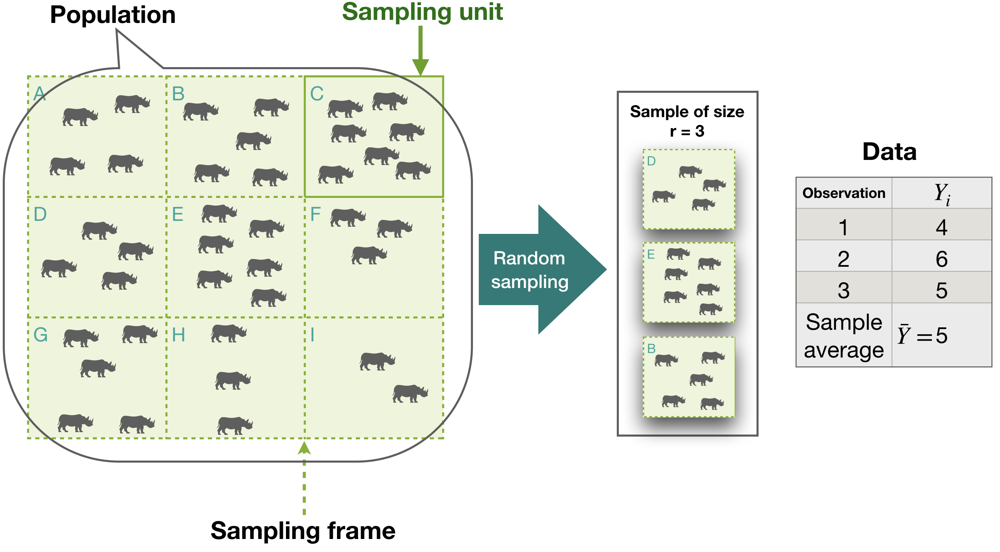

```{r message=FALSE, warning=FALSE, paged.print=FALSE, echo=FALSE, include=FALSE}
# load packages for chapter

options(digits = 10)
library(bookdown)
library(kableExtra)
library(knitr)
library(tables)
library(pander)
library(car)
library(tidyr)
library(ggplot2)
library(latex2exp)
library(arrangements)
library(plotrix)
options(scipen = 999)
```


# Random Variables, Sampling and Distributions {#chSampling}

## Learning Objectives for Chapter


1. Define random variables and their distributions.
1. Define and identify population, sample and observation.
1. Explain why we need to sample populations.
1. Describe and use a method to obtain random samples with equal probabilities.
1. Define "parameter" and "random variable" and discuss their relationship to one another
1. Describe and implement stratified random sampling.
1. Explain the difference between sampling with and without replacement.
1. Write and use equations for estimators of population mean and variance.
1. Distinguish between estimators and definitions of parameters.
1. List the most important distributions in elementary statistics.
1. Define and calculate bias of an estimator of a parameter.
1. When should a Student's t distribution be used over a normal distribution for samples?
1. Define statistical bias and give a few examples of situations that may lead to a biased estimator
1. Sketch an example sampling distribution (r = 10) for observations drawn from a normally distributed population, and sketch the corresponding normal pdf, using your sampling distribution to estimate its parameters.
  - List the differences and similarities between the two sketches.
  - Explain why the normal pdf representing the population from which the samples were drawn might not look like the normal pdf you drew. 

## Random variables

Random variables are those variables whose values are determined by random processes or experiments. Any time we conduct a measurement or observe the result of an experiment we obtain specific values for the random variables. These specific values are termed realizations. For example, consider the result of rolling a pair of dice. Define the random variable as the total number of dots in both dice. The random variable can take integer values between 2 and 12. Say that in one roll you got a 3 and a 5. The realization of the random variable is 8.

In reality, a random variable is a real-valued function defined over the sample space of a random experiment or process. We are free to define the function in any way we want, even with a table that shows the value for each outcome, but because it has to be a function, each result of the random process cannot be associated with more than a single value of each random variable.

```{block rvDef, type = 'mydef'}
- A random variable is a function that associates a single real number with each outcome in the sample space of a random experiment.

```

Do not confuse this function property with the posibility of having random variables grouped into vectors, where each vector contains more than one value, each value being the realization of a different random variable. For example, in the roll of two die we can define the random vector {number of dots in the first die, number of dots in the second die}. The importance of thinking of a random variable as a function is that it gives a lot of flexibility to deal with the results of random experiments. Instead of just counting dots on the face of a die we can use complicated functions that allow us to test hypotheses about more complex processes, such as administering medicines to animals, or comparing the yield of multiple varieties of food plants.

A more formal definition and an intuitive physical model of random variable is given in [@286171]. Make sure to also explore the explanations given by W. Huber in [@54894].


**Examples of Random Variables**

- Number of dots in three dice rolled once.
- Number of plants within 50 cm of a point placed randomly in a wheat field.
- Time that it takes to find a bird of a certain species in a forest plot.
- Your diastolic blood pressure measured every day at noon.
- Weight of a randomly selected mature dairy cow in California.
- Number of atoms that decay in 1 second in 1 mg of Uranium-238.
- Pain level reported by a patient who consults the doctor due to a headache.
- Weight of a ball randomly selected from two.
- Mass of carbon in a soil sample divided by the total sample dry mass.
- Natural log of nonstructural carbohydrates concentration in CA almond tree branches on 1 Mar every year.


### Types of Variables and Notation

The choice of statistical method to answer a specific question depends strongly on the types of random variables involved in the question. The type of variable involved matters primarily because it determines the type of statistical distribution they can have.

There are several ways to classify variables, but the following is perhaps the most useful and general. Statistical variables can be:

**Categorical** For example, plant species or cultivar. These are non-numeric variables whose values are not ordered. The order of values has no meaning.

**Ordinal** For example, plant growth stages or disease condition. Ordinal variables are non-numeric but their values are ordered and the order has meaning. We know that an animal in stable disease condition is worse than healthy and better than gravelly ill, but it is not possible to say if "healthy" is 10 or 1.5 times better than gravelly ill.

**Quantitative** These are random variables that take numerical values and that can be used in arithmetic operations such as addition and multiplication. Quantitative variables can be discrete or continuous.

**Discrete** Discrete quantitative variables can take integer values, for example, the number of branches in a plant, or the number of eggs that a hen produces. The values come from the set of Integer Numbers. Discrete random variables can have finite or infinite sampling spaces. For example, the number of heads in 37 coin tosses is discrete and has a finite sampling space $S = \{0, 1, \dots , 37\}$, whereas the number of tosses until 3 heads are in a row is discrete but has a countable infinite sampling space $S = \{3, 4, \dots \infty \}$.

**Continuous** Continuous quantitative variables can take values between any other two values. For example, the mass of wheat produced per unit area, or the volume of milk produce by a cow per day. These variables take values that are Real Numbers. Note that most of the specific variables we analyze in agricultural and environmental sciences are positive real numbers.

### Using random variables

Once we define a useful random variable, we can apply the rules of probability to calculate the probability of any event in terms of the random variable, but first we have to know the statisticsl distribution of the random variable. Imagine that you are breeding animals and need to get at least three individuals with a specific genotype of class G that is expected to appear in 20% of the offspring. What are the chances (probability) that you will get the 3 G's if you get 5 offspring? We can *model* this situation assuming that the genotypes of all individuals are independent, and that the probability for each individual having G is 0.20. Let's use the letter "O" for "other" to designate individuals that are not G. You will have the 3 you need if you get 3, 4 or all 5 with G. We define the random variable Y as "number of G's in five offsping." If you get 3 you do not get 4 or five. This means that the events are disjoint and that we sum their probabilities to get the probability of at least 3 G's. To calculate the probability of each of the events, we recall that individuals are independent, so the probability of a given set, like GGGOO is the product of the individual probabilities, in this case $0.20^3 \cdot 0.80^2$. Finally, we take into account that the event GGGOO is not the same as GGOOG, but each has probability $0.20^3 \cdot 0.80^2$. The ennumeration of the combinations and probabilities show how a pattern emerges:

<br>
Table: (\#tab:deriveBinomialExmpl) Calculation of the probability of obtaining Y successes in 5 independent trials with constant probability of success.

| Y | sequence                                                             | no. sequences | Probability of each sequence                |
|:-:|----------------------------------------------------------------------|:-------------:|---------------------------------------------|
| 0 | OOOOO                                                                |  1  = $C_0^5$ | $0.20^0 \cdot 0.80^5 = `r 0.80^5`$          |
| 1 | GOOOO, OGOOO, OOGOO, OOOGO, OOOOG                                    |  5  = $C_1^5$ | $0.20^1 \cdot 0.80^4 = `r 0.20^1 * 0.80^4`$ |
| 2 | GGOOO, GOGOO, GOOGO, GOOOG, OGGOO, OGOGO, OGOOG, OOGGO, OOGOG, OOOGG |  10 = $C_2^5$ | $0.20^2 \cdot 0.80^3 = `r 0.20^2 * 0.80^3`$ |
| 3 | GGGOO, GGOGO, GGOOG, GOGGO, GOGOG, GOOGG, OGGGO, OGGOG, OGOGG, OOGGG |  10 = $C_3^5$ | $0.20^3 \cdot 0.80^2 = `r 0.20^3 * 0.80^2`$ |
| 4 | GGGGO, GGGOG, GGOGG, GOGGG, OGGGG                                    |  5  = $C_4^5$ | $0.20^4 \cdot 0.80^1 = `r 0.20^4 * 0.80^1`$ |
| 5 | GGGGG                                                                |  1  = $C_5^5$ | $0.20^5 \cdot 0.80^0 = `r 0.20^5`$          |
<br>

There are many ways to get any number, say r, G's in a sequence. That number equals the number of different sets of r positions or slots that can be chosen from the 5 slots available, without replacement. This is a case where the order in which the slots are chosen does not matter (having G's in positions 1 and 3 is the same as having G's in postions 3 and 1) and there is no replacement (once a slot is occupied it cannot be selected again). Therefore, we can use combinations of 5 slots taken in sets of r = Y to determine the number of ways that a given number of successes can be obtained. Notice that whenever you get r slots with G's you also get 5-r slots for O's. That's why the number of sequences is symmetric from top to bottom of the table.

If we use the letters $p$ for the probability of G or "success," $q = 1-p$ for failure or O and $n$ for the total number of trials we can write a compact equation for the probability that we obtain Y = r successes. We use the letter $Y$ for the random variable "number of successes" to emphasize that it is a response variable, but we also use the letter $r$ to link this to Equation \@ref(eq:combinations) for combinations and to designate a specific realization of Y.

<br>
\begin{align}
P(Y = r ) = C^n_r \ p^r \ q^{n-r}
(\#eq:binomialPMF)
\end{align}
<br>

This equation is the function that associates a probability to each value of the random variable and it is the *probability mass function* for the **Binomial Distribution**. The term "binomial" comes from the fact that the equation represents all the terms in the expansion of the power of a sum of the form $(p + q)^n$. The binomial expansion states that $(p + q)^n = \sum^n_{r = 0} \ p^r \ q^{n-r}$. This equation can be used to answer any questions that involve Binomial distributions. Specifically, the probability of getting at least r G's in the example is $P(Y \ge 3) = \sum^n_{r = 3} \ 0.20^r \ 0.80^{5-r}$

**Functions of random variables**

Suppose that in the example above, animals with G require 2 tons of feed to reach maturity, whereas animals O require 1.5 tons. How much feed do you need to order to have a probability of 90 or better that you will have enough to feed all animals to maturity? We can define a new random variable based on the first one:

<br>
$$X = 2 \ r + 1.5 \ (5-r) = 7.5 + 0.5 \ r$$
<br>


```{r rvFunc1}
an.dat <- data.frame(Y = 0:5) # list of possible values of rv Y

an.dat$Prob <- dbinom(an.dat$Y, size = 5, prob = 0.20) # corresponding porbabilities

an.dat$X = 7.5 - 0.5 * an.dat$Y # lisf of possible values of rv X

an.dat$cdf <- cumsum(an.dat$Prob) # cumulative probabilities

kable(an.dat, caption = "Probability mass function and cumulative distribution function (CDF) for a binomial random variable Y with p = 0.20 and n = 5. Random variable X is a linear function of Y") %>% 
   kable_styling(full_width = FALSE)

```
<br>

Using the relationship between X and Y we obtain the probability mass function for X, which is just the same as the original but translated (by adding 7.5) and shrunk (by multiplying by 0.5). By progressively adding the probability of each value of X, starting from the lowest one we obtain the cumulative density function, which gives us the probability that X is equal to or less than r:  $F(r) = P(X \le r)$. We can see that in order to have a probability greater than or equal to 0.90 of having enough feed we need to order 8.5 tons of feed (Table \@ref(tab:rvFunc1)).

<!-- A global view of the process followed to solve the feed problem above is revealing, because it shows **TO BE COMPLETED** -->


## Probability Distributions

Probability distributions are functions of random variables that have the following properties:

**Discrete Random Variables ** have probability mass functions $P(Y = y)$

<br>
\begin{align}
P(Y = y)& \quad \text{is the probability of the event that results in }Y = y \\[15pt]
P(Y = y)& \ge 0 \\[15pt]
\sum_{y = -\infty}^{y = +\infty} P(Y = y)& = 1\\[15pt]
(\#eq:pmf)
\end{align}
<br>

The corresponding **cumulative distribution function** is 

<br>
\begin{align}
F_Y(y) = P(Y \le y) = \sum_{i = -\infty}^{i = y} P(Y = i)
(\#eq:cdfDiscrete)
\end{align}
<br>

**Continuous Random Variables ** have probability density functions $f(Y = y)$

<br>
\begin{align}
f(y)& \quad \text{is the probability "per unit change of Y"} \\[15pt]
P(Y = y)& = 0 \quad \text{the probability of any specific value y is zero!} \\[15pt]
P(a \le Y \le b)& = \int_a^b f_Y(y) \ dy \\[15pt]
\int_{\mathbb{R}} f_Y(y) \ dy& = 1
(\#eq:pdf)
\end{align}
<br>

The corresponding **cumulative distribution function** is 

<br>
\begin{align}
F_Y(y) = P(Y \le y) = \int_{-\infty}^{y} f_Y(y) \ dy
(\#eq:cdfCont)
\end{align}
<br>

The symbol $\int_\mathbb{R}$ represents the *integral* of the function over all real values of Y, and $\int_{\mathbb{R}} f(y) \ dy$ is the integral between $Y = a$ and $Y = b$. If you are not familiar with the concept of integral, no worries. Imagine that $f(y)$ is an abolutely continuous function of the value $y$. The integral between any two $y$ values a and b is the area under the curve between the two points (Figure \@ref(fig:Sum2Integral)). One way to calculate the area approximately is to divide the interval [a, b] into $(b-a)/dy$ little segments. The area of each segment is the base $dy$ times the height, which can be set at $f(y_{lo} + dy/2)$ where $y_{lo}$ is the left end of each segment.¬

<br>
```{r Sum2Integral, message=FALSE, warning=FALSE, paged.print=FALSE, out.width = '90%', fig.align='center', echo=FALSE, fig.cap ="The integral of a continuous probability density function (pdf) can be though of as the limit of the sum of rectangles with base width $dy$ and height equal to the height of the pdf function at the center of the base, as $dx$ approaches zero. The area of each rectangle is an approximation of the probability that Y takes values within the base of the rectangle."}


```
<br>


- Probability distributions are functions that define the probability of any event occurring in a random experiment where the outcome is the value of a random variable.

- For example, if the random experiment is flipping a fair coin the probability of X = 1 (heads) is the same as probability of X= 0 (tails) and it is 0.50. Then, X is a random variable that has a Bernoulli distribution with parameter p = 0.5.

- Once we know the true distribution of a random variable, we can know everything there is to know about the random variable.

- True distributions for real random variables are rarely known. Even if we assume that we know the distribution family we never know the parameter values.

- In the case of the coin, we know the distribution of a theoretical coin that is fair, perfect and eternal. We use it as a model for real coins, but we know it is not a perfect model. Some people are able to flip any number of heads or tails they want. We can also suspect that each type, or even each individual coin, has a probability of heads that is different and not exactly 0.50. The same can be said of dice. Recall that dice can be loaded and/or imperfect. However, the usual distributions used for them are *very good models* for the corresponding random experiments and variables.


## Parameters and Moments

Distribution functions are usually functions that can be written down with equations that have certain constant values for all values of the random variable. The set of all possible values of the random variable is called the *support*. In the example about breeding animals above, Equation \@ref(eq:binomialPMF) has two parameters: n, the number of trials and p, the probability of success; q does not count as a different parameter because it is simply $1-p$. All distributions will be characterized by their parameters and other properties such as the mean or expected value and variance. The mean, variance, skeweness and kurtosis are called the **moments** of a distribution, because they all arise from variations of the same equation.

This section presents the definitions of the expectation, variance and parameters of distributions using equations that may be a little scary at first. Students are not expected to be able to derive these equations, and in many cases not even to memorize them. The main point in presenting them is for students to realize and remember that moments and parameters are characteristics of the whole distribution, or of populations, whereas averages and sample variances are calculated from samples and use **different equations**. Moreover, for any given random variable, the parameters and moments of its distribution are *constants*, whereas averages and variances estimated with samples from the distribution are themselves random variables that change from sample to sample. This is a very important concept.

### Expectation, Mean or First Moment

The expected value of a random variable is the long-run average of values resulting from repeating the random experiment a very large number of times. According to the **Law of Large Numbers**, the average of a sequence of independent draws from the same random variable will tend towards the mean of the random variable as the number of draws increases. The expectation, represented by $E\{\}$ or mean is more formally defined as follows:


**Expectation of discrete random variables**

<br>

\begin{align}
E\{Y\} = \sum_i y_i \ P(Y = y_i)
(\#eq:DiscreteExpectDef)
\end{align}
<br>

The expectation of the number of animals with genotype class G above is:

\begin{align}
E\{Y\} = \mu_Y &= 0 \times 0.32768 \\
&+ \ 1 \times 0.40960 \\
&+ \ 2 \times 0.20480 \\
&+ \ 3 \times 0.05120 \\
&+ \ 4 \times 0.00640 \\
&+ \ 5 \times  0.00032 = `r an.dat$Y %*% an.dat$Prob`
\end{align}


**Expectation of continuous random variable**

<br>
\begin{equation}
E\{Y\} = \int_\mathbb{R} y \ f_Y(y) \ dy
(\#eq:ContinuousExpectDef)
\end{equation}
<br>

The integral appears again. In this case, think of it as weighted average of values of Y at the center of a large number of small intervals that cover the whole horizontal axis. The weigthing factor is the area under the curve inside each narrow column, which is approximated by the product of the width of the interval and height if the curve at the center. As you make the intervals $dy$ smaller and smaller, the calculation approaches the integral.

As an example for the calculation of the mean of a continuous variable, let's use the continuous uniform distribution between real numbers a and b. The probability density function of this function is rather simple:

<br>
\begin{equation}
f(y) =
  \begin{cases}
    \frac{1}{b-a}       & \quad \text{if } a \leq y \leq b \\
    0                   & \quad \text{otherwise }
  \end{cases}
    (\#eq:unifPdf2)
\end{equation}
<br>

This pdf is zero outside the interval $[a,b]$ and constant in the interval because the area has to be 1.0, then, the height of the rectangle and the value of the function are constant at $1/(b-a)$. Using a bit of calculus or intuition we obtain the expectation:


<br>
\begin{equation}
E\{Y\} = \int_a^b \frac{y}{b-a} \ dy = \frac{1}{b-a} \int _a^b y \ dy = \frac{1}{b-a} \ \left . \frac{y^2} {2} \right |_a^b = \frac{b^2 - a^2}{2 \ (b-a)} = \frac{a + b}{2}
\end{equation}
<br>

Thus, the expectation or mean of a random variable with a continuous uniform distribution between 3 and 7 is 5, the midpoint of the distribution.

### Variance or Second Moment

The variance of a distribution, represented by $V\{Y\} = \sigma^2_Y$ can be defined as the first moment or expectation of the squared deviations from the mean:

<br>
\begin{equation}
V\{Y\} = E\{(Y - E\{Y\})^2\} = E\{(Y - \mu)^2\}
(\#eq:VarDef)
\end{equation}
<br>

This definition is short and easy to remember, and it will also remind us of the equation to estimate the variance based on a sample, where we divide the sum of the squared deviation by the number of observations.

<br>
```{block varDefBlock, type='mydef'}
- The variance is the expectation of squared deviations from the mean.

- The standard deviation is the square root of the variance.

- Both are always positive.
```
<br>

An important property of the expectation is that the expected value of a function $g(Y)$ of a random variable can be obtained simply by using the definition of expectation, where instead of Y, we plug in $g(Y)$. This is called the *Law of the Unconscious Statistician* or LOTUS. The application of Equation \@ref(eq:VarDef) and the LOTUS, with $g(Y) = (Y - \mu)^2$ to discrete distributions yields the definition of variance for discrete distributions:

<br>
\begin{equation}
V\{Y\} = E\{(Y - E\{Y\})^2\} = E\{(Y - \mu)^2\} = \sum_i (y_i - \mu)^2 \ P(Y = y_i)
(\#eq:VarDefDiscrete)
\end{equation}
<br>

In the case of continuous distributions, the variance becomes

<br>
\begin{equation}
V\{Y\} = E\{(Y - \mu)^2\} = \int_\mathbb{R} (y - \mu)^2 \ f_Y(y)
(\#eq:VarDefContinuous)
\end{equation}
<br>


### Covariance and Correlation between two RV's

Recall the definitions of marginal, joint and conditional probability from the section on [Probability of two events](#Pof2Events). Consider two random variables together, and think of the values they take as the events. We can then calculate the joint and conditional probabilities for any combination of values from the two variables. This is easily illustrated with discrete finite random variables, but the concepts extend to any pair of random variables. 

Imagine that we inspect the tidal zone in a segment of coast (your population) and count the number of starfish (X) and large sea snails (Y) in each 2 x 2 $m^2$ of the tidal zone during low tide. Because we define the area at the time of measurement as our whole population, we know the complete population and we can calculate the moments. The table of (fictitious) results expressed as joint relative frequencies is:

<br>
```{r starfish, echo=FALSE}

set.seed(8) # generate some random but reasonable data.
x1 <- rpois(n = 10000, lambda = 0.2)
x2 <- rpois(n = 10000, lambda = 1)
x0 <- rpois(n = 10000, lambda = 0.8)

starfish <- x1 + x0
snails <- x2 + x0

# Remove rows with too many counts
ss.data <- data.frame(starfish = starfish, snails = snails)
ss.data <- ss.data[(ss.data$starfish < 7) & (ss.data$snails < 8), ]

# cor(ss.data)

total <- sum(table(ss.data$snails,ss.data$starfish))
ss.tbl <- table(snails = ss.data$snails, starfish = ss.data$starfish)
st.sn <- as.data.frame(ss.tbl / total)

knitr::kable(addmargins((ss.tbl / total)),
             digits = 4, 
             caption = "Joint and marginal probabilities of number of starfish (columns) and number of sea snails (rows) in each 2 x 2 m-sq of a tidal zone. (Fictitious data)") %>%
   kable_styling(full_width = FALSE)

st.marg <- aggregate(Freq ~ starfish, data = st.sn, FUN = sum)
names(st.marg)[2] <- "Freq.st"
#st.marg$Freq.st %*% 0:6

sn.marg <- aggregate(Freq ~ snails, data = st.sn, FUN = sum)
names(sn.marg)[2] <- "Freq.sn"
#sn.marg$Freq.sn %*% 0:7

```
<br>

The mean or expectation for number of starfish (X) is the sum of each number of starfish multiplied by its marginal frequency:

\begin{align}E\{X\} = \sum_{x=1}^6 \ x \ P(X=x) &= 0 \times `r round(st.marg[1,2], 4)` \\
 &+ 1 \times `r round(st.marg[2,2], 4)` \\
 &+ 2 \times `r round(st.marg[3,2], 4)` \\
 &+ 3 \times `r round(st.marg[4,2], 4)` \\
 &+ 4 \times `r round(st.marg[5,2], 4)` \\
 &+ 5 \times `r round(st.marg[6,2], 4)` \\
 &+ 6 \times `r round(st.marg[7,2], 4)` = `r round(st.marg$Freq.st %*% 0:6, 4)`
\end{align}

As an exercise, fully expand the calculation for the snails mean, ($E\{Y\} = `r sn.marg$Freq.sn %*% 0:7`$). 

Inspection of Table \@ref(tab:starfish) reveals that the events are not independent. The joint probabilities are not the product of the marginal probabilities. We can get the conditional probabilities for each number of snails given the number of starfish by dividing each column by the marginal column sum at the bottom of Table \@ref(tab:starfish). The results are displayed in a graph so the differences can be seen at once.

<br>
```{r starfishPlot, echo=FALSE, fig.cap="Conditional probability of number of snails, given a number of starfish. The distributions are discrete and have no height for axis values between integers. Lines are added just to facilitate the indentification of the different sets of points."}
st.sn <- merge(st.sn, st.marg)
st.sn$condP.sn <- st.sn$Freq / st.sn$Freq.st

ggplot(data = st.sn, 
       aes(y = condP.sn, 
           x = snails, 
           group = starfish, 
           color = starfish)) +
   geom_line(size = 0.5) +
   geom_point(size = 2) + 
   xlab(" Number of snails") +
   ylab("Conditional probability of no. of snails") +
   theme(axis.title.x = element_text(size = 14, face = "bold"),
axis.title.y = element_text(size = 14, face = "bold"))
```
<br>

As the number of starfish increases, the distribution of the number of snails moves to the right, therefore, the two random variables are not independent. The level of dependence between two random variables is measured by their **covariance**. The covariance between two random variables is defined as the expectation of the cross product of deviations of each variable from its mean.


**Covariance**

```{block covBlock, type='mydef'}
- The covariance between two random variables is the expectation of the products of deviations from each observation to the mean in each variable.
```

<br>
\begin{align}
V\{X,Y\} &= \sigma\{X,Y\} = cov\{X,Y\} = E\{(X - E\{X\}) \cdot (Y - E\{Y\})\} \\[15pt]
         &= E\{(X - \mu_X) \cdot (Y - \mu_Y)\}
(\#eq:covDef)
\end{align}
<br>

In the case of discrete random variables like the number of starfish and snails, we apply the definition of expectation for discrete variables to obtain:

<br>
$$V\{X,Y\} = \sum_i \sum_j (x_i -\mu_x) (y_j-\mu_y) \ P(X = x_i, Y = y_j)$$
<br>

Plugging in some of the values from the example we get

<br>
\begin{align}
V\{X,Y\} &= (0 - 1.006) \times (0 - 1.805) \times 0.1363 \\
         &+ (1 - 1.006) \times (0 - 1.805) \times 0.0266 \\
         &+ (2 - 1.006) \times (0 - 1.805) \times 0.0033 \\
&\dots \\
         &+ (0 - 1.006) \times (1 - 1.805) \times 0.1360 \\
         &+ (1 - 1.006) \times (1 - 1.805) \times 0.1311 \\
         &+ (2 - 1.006) \times (1 - 1.805) \times 0.0250 \\
&\dots \\
&\dots \\
         &+ (4 - 1.006) \times (7 - 1.805) \times 0.0006 \\
         &+ (5 - 1.006) \times (7 - 1.805) \times 0.0003 \\
         &+ (6 - 1.006) \times (7 - 1.805) \times 0.0002 = 0.8088
\end{align}
<br>

As an exercise, complete the calculation using R and corroborate that the result 0.8088 is correct. The covariance is positive, indicating that both variables tend to increase or decrease together. This can be seen in a graph showing the **bivariate** distribution of number of starfish and snails.

```{r DiscreteBivariatePlot, message=FALSE, echo=FALSE, fig.align='center', fig.cap="Two perspectives of the bivariate distribution of two random variables, number of starfish and number of snails in all quadrats of a tidal zone. Although bars are used to represent the joint probabilities, in reality the bars should only have height, with null width and lenght, because both random variables are discrete."}

library(plot3D)

par(mfrow = c(1, 2))

hist3D(x = 0:7, y = 0:6, z = ss.tbl / total,
        bty = "g", phi = 20, theta = 45,
       ltheta = 160 , lphi = 70, 
        xlab = " no. starfish", ylab = "no. snails", zlab = "", main = "P(X,Y)",
        col = "lightblue", border = "black", shade = 0.7,
        ticktype = "detailed", space = 0.7, d = 1.5, zlim = c(0, 0.15))

hist3D(x = 0:7, y = 0:6, z = ss.tbl / total,
        bty = "g", phi = 20, theta = 110,
       ltheta = 160 , lphi = 70, 
        xlab = " no. starfish", ylab = "no. snails", zlab = "", main = "P(X,Y)",
        col = "lightblue", border = "black", shade = 0.7,
        ticktype = "detailed", space = 0.7, d = 1.5, zlim = c(0, 0.15))

par(mfrow = c(1, 1))
```

When variables are continuous, the application of the expectation operator to the definition of covariance yields equations with double integrals. We extend the idea of integral in one dimension, explained in Figure \@ref(fig:Sum2Integral), to two dimensions. The probability density function is now a surface in two dimensions and the volume under it is divided into columns whose widths tend to zero. The probability of any region of X and Y values is the volume under the surface inside the area defined by the region.

<br>
$$V\{X,Y\} = \int_x \int_y (x - \mu_x) \ (y - \mu_y) \ f(x, y) \ dx$$
<br>

<br>
```{r biNormal, message=FALSE, warning=FALSE, paged.print=FALSE, out.width = '90%', fig.align='center', echo=FALSE, fig.cap ="Two perspectives of the joint probability density function for two normal random variables that have a correlation of 0.70. The height of the surface is the probability per unit volume under the surface. The intersection between any vertical plane and the surface is the pdf of a normal distribution. In particular,intersections with planes perpendicular to either one of the axes (variables) are the conditional distributions of the other variable."}


```
<br>


**Correlation**

The covariance has a drawback to representt the degree of association between two random variables because it is a quantity with units and its numerical value depends on the magnitude of the random variables and the units. Therefore, covariances cannot be compared when variables have different units or when they have different means. The **correlation** coefficient is a better measure of association between two variables because it has no units and can be compared across variables and situations.


```{block corBlock, type='mydef'}
- The correlation between two random variables equals their covariance divided by the product of their standard deviations.
```

\begin{align}
cor\{X,Y\} = r_{X,Y} = \frac {V\{X,Y\}} {\sqrt{V\{X\} \ V\{Y\}}}
(\#eq:corDef)
\end{align}

When random variables are standardized (see below), their covariance and correlation are equal.

<br>
```{block indepBlock, type='stattip'}
- When random variables are independent, their covariance and correlation are zero, but the converse is not true. Random variables with zero correlation may have nonlinear dependence.
```
<br>


### Parameters are not necessarily the moments

Distribution functions have constant values that are part of the function called **parameters**. In order to know everything about any given distribution, one must know all the parameters. The Uniform distribution seen before has two parameters, a and b. The Binomial distribution also has two paramters, n and p. As we will see in more detail below, the Poisson distribution has a single parameter. In the case of the Uniform and Binomial distributions, their means and variances are not the same as the parameters. In the case of the Poisson distribution, the mean and the variance both are equal to the single parameter. Other distributions, like the Gamma distribution have more than two parameters. The Normal distribution has two parameters, its mean and its variance; it is a very special case.

The point is that parameters are not necessarily the same as mean and variance. The Normal distribution is a special case in which there are only two parameters and they happen to be the mean and the variance. Therefore, in order to know everything about a Normal distribution one only needs two numbers: mean and variance.


### Properties of Mean and Variance

The following properties can be easily derived directly from the definitions of mean and variance, and they are very useful when working with samples. Consider that $X$, $Y$ and $Z$ are random variables with any distribution that has mean and variance^[Amazingly, some distributions do not have mean or variance, for example because the mean or variance involve sum of series that do not converge.].

<br>
\begin{align}
&E\{a + b \ Y\} = a + b \ E\{Y\} \\[15pt]
&V\{a + b \ Y\} = b^2 \ V\{Y\} \\[25pt]
&\text{Let X be a linear combination of random variables Y and Z: } \\[15pt]
& X = a + b \ Y + c \ Z \quad \text{then,}\\[15pt]
&E\{X\} = a + b \ E\{Y\} +c \ E\{Z\} \\[15pt]
&V\{X\} = b^2 \ V\{Y\} + c^2 \ V\{Z\} + 2 \ b \ c \ V\{Y,Z\} \\[15pt]
&\text{Special cases for independent variables: } \\[15pt]
&V\{Y + Z\} = V\{Y - Z\} = V\{Y\} + V\{Z\}
(\#eq:propertiesOfMean)
\end{align}
<br>

The last equation is extremely important in statistics. In most real applications of statistics we have to use models that involve estimation of more parameters than just mean and variance. For example, in linear regression we will estimate intercept and slope. **Estimated parameters** are based on samples of random variables, so they are themselves random variables. When we use the estimated intercept and slope to make a prediction, we are using a linear combination of estimated parameters. The last line in Equation \@ref(eq:propertiesOfMean) allows us to estimate the variance of the prediction and thus make confidence intervals or test hypothesese that involve linear combinations of estimated parameters.

<br>
```{block LCofEstimatedParameters, type='stattip'}

- A main goal of statistics is to make statements about linear combinations of estimated parameters.

- The variance of a linear combination of estimated parameters depends on the variances and covariances of the estimated parameters.

```
<br>


### Standardized variables

Random variables are frequently standardized to obtain new random variables with more desirable properties. Standardization is a linear transformation or function of the random variable by which the mean is subtracted and the result is divided by the standard deviation.

Frequently we use the lower case version of a letter to refer to the standardized variable. The letter "z" is typically used to refer to the standard Normal distribution. 

The mean and variance of a standardized variable are obtained directly by the properties of the mean and variance treated in the previous section. Standardized random variables have mean zero and variance one.

<br>
\begin{align}
&X \ \text{ is an RV with } \ E\{X\} = \mu_X \ \text{and} \ V\{X\} = \sigma^2_X \\[15pt]
&\implies x = \frac{X - \mu_X}{\sigma_X} = - \left( \frac{\mu_X}{\sigma_X} \right) + \left( \frac{1}{\sigma_X} \right) \ X\\[15pt]
&\text{ is an RV with } \ E\{X\} = 0 \ \text{and} \ V\{X\} = 1
(\#eq:standardize)
\end{align}
<br>

The function of X used to get x is a *linear* function, where $\mu_X$ and $\sigma_X$ are constants that do not depend on X. Linear functions simply translate (move along the axis) and uniformly stretch or shrink the width and height of the distribution function.

## Common distributions

The list of distribution functions is infinite. In theory, random variables can have any distribution, for as long as they comply with the definition, which is rather general. In practice, we manage to make useful models of the world with very few prototypical families of distributions. Loosely, a family of distributions is a set of distributions that differ only in the values of their parameters, but have the same functional form. For example, the Bernoulli distribution, which has value 1 with probability $p$ and 0 with probability $1-p$, is a Binomial distribution where $n = 1$.

Some distributions can be derived on the basis of a few facts or assumptions. For example, the Binomial distribution results from performing a set number of independent trials with constant probability of success. Other distributions may be the result of complicated combinations of basic ones random experiments.

In this section we describe the distributions that we will use in the rest of the book. Wikipedia has entries for about 30 discrete and 100 continuous distributions, where they are nicely organized and described.


### Discrete Uniform Distribution {#DUnifDist}

The random experiment consisting of rolling one die can be modeled with a discrete uniform distribution where the random variable is the number of dots facing up. There are n values possible between integers a and b inclusive, and each value has a probability equal to $1/n$.

<br>
**Parameters:** 

$$a, \quad b, \quad n = b - a + 1$$

**Support:** 

Every integer between a and b, including a and b.

**PMF:** 

$$P(Y = y) = 1/n$$

**CDF:** 

$$F_Y(k) = \frac{{\lfloor k \rfloor} - a + 1}{b - a + 1}$$

**Mean:**

$$\mu_Y = \frac{a + b}{2}$$

**Variance:** 

$$V\{Y\} = \sigma^2_Y = \frac{n^2 -1}{12}$$
<br>


### Continuous Uniform Distribution {#CUnifDist}

This is the distribution where a continuous variable has equal probability of taking values in any segment of equal width between a and b. Its pdf was given in Equation \@ref(eq:unifPdf2).

<br>
**Parameters:** 

$a, \quad b$

**Support:** 

Every real number between a and b, including a and b.

**PDF:**

$$f_Y(y) = 1/(b - a) \quad \forall \quad a \le y \le b, \quad 0 \quad \text{elsewhere}$$

**CDF:**

\begin{equation} 
F_Y(y) =   \begin{cases}
   0 & \quad \text{if } y \ \lt a\\
    \frac{y - a}{b - a} & \quad \text{if } \ a \leq y \leq b \\
    1                   & \quad \text{if } \ y \gt b
  \end{cases}
\end{equation}

**Mean:**

$$\mu_Y = \frac{a + b}{2}$$

**Variance:** 

$$V\{Y\} = \sigma^2_Y = \frac{(b - a)^2}{12}$$
<br>


### Binomial Distribution {#BinDist}

This is the distribution of a random variable obtained by summing n independent Bernoulli random variables. The binomial random variable is the number of "successes" in a set of n independent trials with constant probability of success p. The folloiwng random variables are usually modeled with a Binomial distribution:

- Number of heads in n coin tosses.

- Number of seeds that germinate out of a set of 10.

- Number of bird nests found in a forest plot that actually has 5 nests.

- Number of salmon that survive and return to a hatchery stream out of 1000 young released.

- Number of apples with worms out of 20 selected randomly from a batch of 10000.

<br>
**Parameters:**

$$n = \text{no. of trials} \quad \quad p = \text{probability of success}$$

**Support:**

Natural numbers between 0 and n (it's a discrete distribution).

**PMF:**

$$f_Y(r) = P(Y = r) = C_r^n \ p^r \ q^{n-r}\quad \forall \quad 0 \le r \le n, \quad 0 \quad \text{elsewhere}$$

**CDF:** 

$$ F_Y(k) = P(Y \leq k) = \sum_{i = 0}^ {\lfloor k \rfloor }\ C_i^n \ p^i \ q^{n-i}$$

**Mean:**

$$\mu_Y = n \ p$$

**Variance:**

$$V\{Y\} = \sigma^2_Y = n \ p \ (1 - p)$$
<br>

In the binomial calculations, the combinations are combinations of positions where "success" happens. We use combinations because having "success" in positions 1 and 5 for example, is exactly the same as having success in position 5 and 1. Just note that the order of successes and failures matters but the order of the positions of the successes and failures does not! Coin tosses HHTT are not the same as HTHT. However, having H in positions 1 and 2 is the same as having H in positions 2 and 1.


There are four basic functions in R to do calculations reletd to the Binomial distribution:

- `dbinom(x, size, prob)` returns the value of the PMF.

- `pbinom(q, size, prob, lower.tail = TRUE)` returns the CDF left tail.

- `qbinom(p, size, prob, lower.tail = TRUE)` returns the quantile.

-`rbinom(n, size, prob)` returns random values with a Binomial distribution.

Analogous functions are available for several distributions in R. The functions are illustrated in the R chunk below.

```{r binomialPlot, message=FALSE}

# Probability of 3 heads in 5 coin tosses
dbinom(x = 3, size = 5, prob = 0.5)

# Probability of k heads in 5 tosses
(df <- data.frame(k = 0:5, P = dbinom(x = 0:5, size = 5, prob = 0.5)))
plot(df, type = "h", col = "skyblue", lwd = 4)

# Probability of 3 heads as a function of number of tosses
(df <- data.frame(size = 0:15, P = dbinom(x = 3, size = 0:15, prob = 0.5)))
plot(df, type = "h", col = "skyblue", lwd = 4)

# Cumulative distribution function for number of 5's in 10 die rolls
(df <- data.frame(k = 0:10, P = pbinom(q = 0:10, size = 10, prob = 1/6)))
plot(df, type = "S", col = "skyblue", lwd = 4)

# P(> 1) infected animals in a sample of 20 from a population where p = 0.02
# One way; note that q is included in the lower tail
pbinom(q = 2, size = 20, prob = 0.02, lower.tail = FALSE)

# or another
1 - dbinom(x = 0, size = 20, prob = 0.02) - 
    dbinom(x = 1, size = 20, prob = 0.02) - 
    dbinom(x = 2, size = 20, prob = 0.02)
```


### Poisson Distribution {#PoisDist}

The Poisson distribution is typically used to describe the number of events or occurrences that take place over periods of time or segments of space when the probability of event is constant over space and or time, and events are independent. The probability that an event happens in a specific segment of space or time does not depend on whether there are events on other segments. The following are examples of random variables that can be modeled with a Poisson distribution:

- Number of cars that pass by a corner every 10 minutes between 8 and 9 am every weekday.

- Number of birds observed in a forest plot during 1 hour.

- Number of plants of a given species of weed that are within each square meter in an alfalfa field.

- Number of water pumps that break down in California every minute.

- Number of times a machine is expected to fail in 5000 hours of operation.

- Number of weak points per 100 ft length of rope.

The parameter $\lambda$, which is the mean and the variance of the Poisson, is the mean number of events per unit space or time.

<br>
**Parameters:** 

$$\lambda = \mu = \sigma^2$$

**Support:** 

Natural numbers between 0 and $\infty$ (it's a discrete distribution).

**PMF:** 

$$f_Y(y) = P(Y = y) = \frac{e^{-\mu} \ \mu^y}{y!} \quad \forall \quad 0 \le y, \quad 0 \quad \text{elsewhere}$$

**CDF:**

$$ F_Y(k) = P(Y \leq k) = e^{-\lambda}\sum_{i = 0}^ {\lfloor k \rfloor } \ \frac{\lambda^i}{i!}$$

**Mean:**

$$\mu_Y = \lambda$$

**Variance:**

$$V\{Y\} = \sigma^2_Y = \lambda$$
<br>

For the practical application of the Poisson distribution, if $\lambda$ is the mean rate of events per unit time or space, then the mean of the distribution is $\lambda \cdot s$, where $s$ is the size (length, duration, volume, etc.) of the interval considered. Suppose that the mean number of plants per unit area is 6 $m^{-2}$, what is the probability of observing more than 3 plants in a quadrat that is 0.5 m on each side?

The area of the quadrat is 0.25 $m^{-2}$, thus, the expected number of plants per quadrat is 6 $m^{-2} \ \times$ 0.25 $m^2 / quadrat$ = 1.5 $quadrat^{-1}$ or 1.5 plants per quadrat.

$$P(Y \gt 3) = 1 - P(Y \le 2) = 1 - P(Y = 0) - P(Y = 1) - P(Y = 2) \\[15pt]
  = 1 - \frac{e^{-1.5} \ 1.5^0}{0!} - \frac{e^{-1.5} \ 1.5^1}{1!} - \frac{e^{-1.5} \ 1.5^2}{2!} \\[15pt]
  = 1 - `r round(dpois(0, 1.5), 4)` - `r round(dpois(1, 1.5), 4)` - `r round(dpois(2, 1.5), 4)` = `r 1 - round(ppois(2, 1.5), 4)`$$
  
Obviously, the probability that there are more than 3 plants in a 1-$m^2$ quadrat is going to be larger than in a smaller quadrat. Both distributions are plotted in Figure \@ref(fig:PoissonPmfPlot)

<br>
```{r PoissonPmfPlot, message=FALSE, fig.cap="Poisson distributions for number of plants per 0.25 and 1 m^2^ quadrat in a population where the average number of plants per square meter is 6. Both distributions have probabilities that are positive for any positive integer, the distributions are truncated at values of Y for which the probability is too small to be seen in the plot. Abscissa values have been slightly offset so both distributions can be seen without overlap.", out.width = '70%'}

plot(0:20 + 0.05, dpois(x = 0:20, lambda = 1.5), type = "h", lwd = 4, col = "orange", ylab = "PROBABILITY", xlab = "NUMBER OF PLANTS IN QUADRAT")
points(0:20 - 0.05, dpois(x = 0:20, lambda = 6), type = "h", lwd = 4, col = "black")

```
<br>

Note that when asked for the probability of values greater than something in a Poisson, you have to use the probability of the complement, otherwise you would have to sum an infinite number of terms.

There are four basic functions in R to do calculations reletd to the Poisson distribution:

- `dpois(x, lambda)` returns the value of the PMF.

- `ppois(q, lambda, lower.tail = TRUE)` returns the CDF left tail.

- `qpois(p, lambda, lower.tail = TRUE)` returns the quantile.

-`rpois(n, lambda)` returns random values with a Poisson distribution.

The functions are illustrated in the R chunk below. The number of crossovers that happen in a region of a chromosome during meiosis can be modeled with a Poisson distribution. Suppose that we consider a region where the mean crossover rate is 0.8, and that each meiosis represents an independent event.

```{r poisonPlot, message=FALSE}

# Probability of 0 crossovers
dpois(x = 0, lambda = 0.8)

# Probability of 2 crossovers
dpois(x = 2, lambda = 0.8)

# Probability of y crossovers
(df <- data.frame(y = 0:7, P = dpois(x = 0:7, lambda = 0.8)))
plot(df, type = "h", lwd = 4)

# Cumulative distribution function for number of crossovers
(df <- data.frame(y = 0:7, P = ppois(q = 0:7, lambda = 0.8)))
plot(df, type = "S", col = "skyblue", lwd = 4)

# Expected proportion of gametes with 3 or more crossovers
# One way; note that q is included in the lower tail
ppois(q = 3, lambda = 0.8, lower.tail = FALSE)

# or another
1 - dpois(x = 0, lambda = 0.8) - 
    dpois(x = 1, lambda = 0.8) - 
    dpois(x = 2, lambda = 0.8) - 
    dpois(x = 3, lambda = 0.8)
```


### Normal Distribution {#NormDist}

The Normal or Gaussian distribution is most important in statistics and science, because it is an accurate model for a multitude of variables measured. As sample size increases, many estimated parameters tend to have a normal distribution, regardless of the original distribution from where the sample is obtained. The normal distribution describes diffussion of gas particles in a volume, noise in an electromagnetic signal, values in chaotic systems, and all sorts of variables measured in the empirical sciences.

For any given variance and mean, the Normal distribution is the continous distribution with maximum entropy. This means that when one knows the mean and variance of a continuous distribution but nothing else about it, assuming that it has a Normal distribution is the choice that imposes or adds the least prior information.

<br>
**Parameters:** 

$$\mu \ \text{and } \sigma^2$$

**Support:** 

Real numbers between $-\infty$ and $\infty$ (it's a continuous distribution).

**PMF:** 

$$f_Y(y) = P(Y = y) = \frac{1}{2 \ \pi \ \sigma^2} \ e^{-\frac{(y - \mu)^2}{2 \ \sigma^2}} = \\[20pt]
= \frac{1}{2 \ \pi \ \sigma^2} \ exp \left[ -0.5 \ \left( \frac{y - \mu}{\sigma} \right)^2 \right]$$

Note that the probability density depends on the square of the deviation from the mean. As a result, the Normal distribution is symmetric about the mean, the height of the curve at $y = \mu + a$ is equal to the height at $y = \mu - a$: $f_Y(\mu + a) = f_Y(\mu - a)$

**CDF:** 

$$\Phi(y) = \int_{-\infty}^y \ \frac{1}{2 \ \pi \ \sigma^2} \ exp \left[ -0.5 \ \left( \frac{y - \mu}{\sigma} \right)^2 \right] \ dy$$

The CDF of the Normal distribution is a well defined function but it cannot be written down with other elementary functions. We use the Greek letter $\Phi$ to refer to it.

**Mean:**

$$\mu_Y$$

**Variance:**

$$V\{Y\} = \sigma^2_Y$$
<br>


Although the Normal pdf has positive values for all real numbers, we frequently use it as a approximation for random variables that are strictly positive such as mass, length, and other biophysical quantities that cannot be negative. For the approximation to be a good one, the mean has to be at least 4 times the standard deviation. This way, less than 1/30,000 of the distribution is expected to be below zero, making errors of little practical consequence. In cases when the mean is closer to zero than 3-4 standard deviations, we should consider other distributions that have the positive real numbers as support, including 0. The log-normal and members of the Gamma family of distributions would be good choices.

**Calculations with the Normal distribution**

Several of the calculations we present here for the Normal distribution can be performed with any distribution, particularly with symmetric continuous distributions. Most of the time we are interested in areas under the Normal pdf $f(y)$ between values of the random variable, which is the same as differences in the height of $\Phi(y)$ at the values of Y.

```{r normDistFig1, message=FALSE, echo=FALSE, fig.cap="Probability density function (blue) and cumulative distribution function (black) for the standard Normal distribution. The shaded area under the pdf is te probability that the random variable Y takes values less than 0, which is the height of the cumulative distribution function at Y = 0.", out.width='80%'}

curve(pnorm(x), 
      from = -3.5, 
      to = 3.5, 
      lwd = 2, 
      xlab = "Y", 
      ylab = "")

# Create data for the area to shade
cord.x <- c(-3.5, seq(-3.5, 0, 0.01), 0)
cord.y <- c(0, dnorm(seq(-3.5, 0, 0.01)), 0) 

# Add the shaded area.
polygon(cord.x, cord.y, col = "lightblue")

# Redraw lines over shading
curve(pnorm(x), 
      from = -3.5, 
      to = 3.5, 
      lwd = 2, 
      xlab = "Y", 
      ylab = "", 
      add = TRUE)

curve(dnorm(x), 
      from = -3.5, 
      to = 3.5, 
      add = TRUE, 
      lwd = 2, 
      col = "blue")

# Add lies to axes and text
lines(x = 0, y = pnorm(0), type = "h", lty = 2)
lines(x = c(-3.75, 0), y = rep(pnorm(0), 2), lty = 2)

text(x = 2, y = 0.12, 
     labels = "f(Y)", 
     col = "blue", 
     cex = 1.5)

text(x = 2, y = 0.90, 
     labels = TeX("$\\Phi(Y)$"), 
     col = "black", 
     cex = 1.5)

text(x = -0.6, 
     y = 0.07, 
     labels = "Area = 0.5", 
     col = "blue", 
     cex = 1)

text(x = 0.85, y = 0.5, 
     labels = "<- Height = 0.5", 
     col = "black", 
     cex = 1)

```
<br>

Any Normal RV can be mapped to the Standard Normal Distribution (SND) by the linear transformation consisting in subtracting the mean and dividing by the standard deviation. The standard normal distribtuion is a normal distribution with mean equal to 0 ($\mu = 0$) and variance equal to 1 ($\sigma^2 = 1$). 

$$P(Y \le y) = P\left ( Z = \frac{Y - \mu}{\sigma} \le \frac{y - \mu}{\sigma} = z \right )$$

If Y has a Normal distribution with mean $\mu$ and variance $\sigma^2$ and Z has a SND, which we write as $Z \sim N(0,1)$, then

$$P(y_1 \le Y \le y_2) = P \left( \frac{y_1 - \mu}{\sigma} \le Z \le \frac{y_2 - \mu}{\sigma} \right)$$

What is the probability that $Y \sim N(5, 4)$ takes values between 6 and 9, or that it takes values lower than 3? Those probabilities are represented as areas under the curve of $Y \sim N(5,4)$ and under the SND $Z \sim N(0,1)$ in Figure \@ref(fig:normDistFig2).

<br>
```{r normDistFig2, echo=FALSE, message=FALSE, fig.cap="Equivalence of areas under curve in a normal distribution with mean 5 and standard deviation 4, and the standard Normal Distribution.", fig.height=10}

par(mfrow = c(2,1))

curve(dnorm(x, mean = 5, sd = 2), 
      from = -2.5, 
      to = 12.5, 
      lwd = 2, 
      xlab = "Y", 
      ylab = "", 
      col = "blue", 
      xaxp  = c(-1, 11, 12))

# Create data for the area to shade between 6 and 9
cord.x <- c(6, seq(6, 9, 0.01), 9)
cord.y <- c(0, dnorm(seq(6, 9, 0.01), mean = 5, sd = 2), 0)

# Add the shaded area.
polygon(cord.x, cord.y, col = "skyblue")

# Create data for the area to shade below 3
cord.x <- c(-2.5, seq(-2.5, 3, 0.01), 3)
cord.y <- c(0, dnorm(seq(-2.5, 3, 0.01), mean = 5, sd = 2), 0)

# Add the shaded area.
polygon(cord.x, cord.y, col = "grey")

curve(dnorm(x, mean = 5, sd = 2), 
      from = -2.5, 
      to = 12.5, 
      lwd = 2, 
      xlab = "Y", 
      ylab = "", 
      col = "blue", 
      xaxp  = c(-1, 11, 12),
      add = TRUE)

text(x = 7.5, y = 0.015, 
     labels = TeX("$P(6 \\leq Y \\leq 9)$"), 
     col = "blue", 
     cex = 1)

text(x = 1.75, y = 0.015, 
     labels = TeX("$P(Y \\leq 3)$"), 
     col = "black", 
     cex = 1)

text(x = -0.20, y = 0.10, 
     labels = "pnorm(q = 3, mean = 5, \n sd = 2, lower.tail = TRUE) \n = 0.1587", 
     col = "black", 
     cex = 1)

arrows(x0 = -0.20, y0 = 0.075, x1 = 1.5, y1 = 0.025, length = 0.1, angle = 25)

text(x = 10, y = 0.10, 
     labels = "pnorm(9, 5, 2) \n - pnorm(6, 5, 2) \n = 0.2858", 
     col = "blue", 
     cex = 1)

arrows(x0 = 10, y0 = 0.075, x1 = 8, y1 = 0.025, length = 0.1, angle = 25)

##### Repeat plot with standardized distribution

curve(dnorm(x, mean = 0, sd = 1), 
      from = (-2.5 - 5) / 2, 
      to = (12.5 - 5) / 2, 
      lwd = 2, 
      xlab = "Z", 
      ylab = "", 
      main = "Standard Normal Distribution", 
      col = "blue", 
      xaxp  = c((-1 - 5) / 2, (11 - 5) / 2, 12))

# Create data for the area to shade between 0.5 and 2
cord.x <- c(0.5, seq(0.5, 2, 0.01), 2)
cord.y <- c(0, dnorm(seq(0.5, 2, 0.01), mean = 0, sd = 1), 0)

# Add the shaded area.
polygon(cord.x, cord.y, col = "skyblue")

# Create data for the area to shade below -1
cord.x <- c(-3.75, seq(-3.75, -1, 0.01), -1)
cord.y <- c(0, dnorm(seq(-3.75, -1, 0.01), mean = 0, sd = 1), 0)

# Add the shaded area.
polygon(cord.x, cord.y, col = "grey")

curve(dnorm(x, mean = 0, sd = 1), 
      from = (-2.5 - 5) / 2, 
      to = (12.5 - 5) / 2, 
      lwd = 2,
      xlab = "Z", 
      ylab = "", 
      col = "blue", 
      xaxp  = c((-1 - 5) / 2, (11 - 5) / 2, 12),
      add = TRUE)

text(x = 1.25, y = 0.04, 
     labels = TeX("$P(0.5 \\leq Z \\leq 2)$"), 
     col = "blue", 
     cex = 1)

text(x = -1.625, y = 0.04, 
     labels = TeX("$P(Z \\leq -1)$"), 
     col = "black", 
     cex = 1)

text(x = -2.6, y = 0.25, 
     labels = "pnorm(q = (3-5)/2) \n = 0.1587", 
     col = "black", 
     cex = 1)

arrows(x0 = -2.6, y0 = 0.21, x1 = -1.75, y1 = 0.06, length = 0.1, angle = 25)

text(x = 2.5, y = 0.25, 
     labels = "pnorm((9-5)/2) \n - pnorm((6-5)/2) \n = 0.2858", 
     col = "blue", 
     cex = 1)

arrows(x0 = 2.5, y0 = 0.19, x1 = 1.5, y1 = 0.06, length = 0.1, angle = 25)

par(mfrow = c(1,1))

```
<br>


The areas under the curve are used to represent proportions of the population with values between the specified extremes. Imagine that the length of Hass avocados received for sorting and packing at a plant has a normal distribution with mean 9 cm and variance 1.21.cm^2. The following are questions that we can answer using the normal distribution (data and situations described are fictitious).

(@) A buyer wants avocados that are longer than 8 cm. What proportion of the avocados received could go to that buyer?

We are given a set value of the random variable Y and are asked to find a proportion, which we interpret as a probability. The set value $y = 8$ is called a **quantile**. We look up the value of the quantile in the graph and then calculate the probability. Because the total ara under the curve is 1.0, the answer can be calculated in two different ways. The different ways were more relevant when we had to use printed tables to find quantiles and probabilities, because tables usually included only one half of the distribution. The other half is the mirror image and can be derived as such.

$$Y \sim N(9, 1.21) \implies \ P(Y \geq 8) = 1 -  P(Y \leq 8)$$

The R function to go from normal quantiles to probabilities is `pnorm` and it corresponds to the cumulative function $\Phi$. 

```{r}

# probability that Y is greater than 8

1 - pnorm(q = 8, mean = 9, sd = sqrt(1.21), lower.tail = TRUE)

pnorm(q = 8, mean = 9, sd = sqrt(1.21), lower.tail = FALSE)

# The lower tail and standard normal distribution are the defaults.

1 - pnorm(q = (8 - 9) / sqrt(1.21))

```

About 82% of the avocados can be packed for the buyer.

(@) The plant wants to pack boxes that sell for a low price that requires that no more than 12.5% of the avocados be rejected. What is the shortest avocado that will be packed?

This is the reverse of the previous question; we are given a percentage or proportion and asked for a value of Y or quantile. What is the quantile of $Y \sim N(9, 1.21)$ that corresponds to a probability of 0.125? The R function to go from probability to quantile is 'qnorm' and it corresponds to the inverse of $\Phi$.

```{r}

# 0.125 quantile or value of Y below which is 0.125 of the area under curve

qnorm(p = 0.125, mean = 9, sd = sqrt(1.21), lower.tail = TRUE)

# Is the same as the value that leaves 1 - 0.125 probability above it.

qnorm(p = 1 - 0.125, mean = 9, sd = sqrt(1.21), lower.tail = FALSE)

# Standard normal distribution is the default.

qnorm(p = 0.125) * sqrt(1.21) + 9

```

In the last way to calculate the quantile sought we used the reverse of the definition of a standardized variable to get the quantile in the units of avocado length:

$$\Phi^{-1} (p=0.125) = Z_{0.125} = \frac{Y_{0.125} - \mu_Y}{\sigma_Y} \\[15pt]
\implies \ Y_{0.125} = Z_{0.125} \times \sigma_Y \ + \ \mu_Y$$


(@) Avocados prices are \$1.00 for those shorter than 8 cm, \$1.50 between 8 and 9.5 cm, \$2.00 between 9.5 and 11 cm and \$1.25 for those longer ones. What is the expected price of a randomly selected avocado? What is the variance of the price per avocado?

The price of an avocado is a function of its length, and the function can be simply represented with a table, as there is no "formula" given. Therefore, the normal distribution is used only in the first step, to calculate the probability mass function of the resulting discrete distribution.

```{r}

# proportion small < 8 cm
pS <- pnorm(8, mean = 9, sd = sqrt(1.21))

# proportion small < 8 cm
pM <- pnorm(9.5, mean = 9, sd = sqrt(1.21)) - pS

# proportion small < 8 cm
pL <- pnorm(11, mean = 9, sd = sqrt(1.21)) - pS - pM

# proportion small < 8 cm
pXL <- 1 - pS - pM - pL

(PMF <- data.frame(
   price = c(1, 1.5, 2, 1.25), 
   Prob = c(pS, pM, pL, pXL)
   )
)

# Check calculation of probabilities

sum(PMF$Prob) # should be exactly 1

# Apply definition of expectation of discrete distribution

(meanPrice = sum(PMF$price * PMF$Prob))

```

<br>
```{block probQuantBlock, type='rtip'}
- When you are asked for a probability, for continous RV's use the R function starting with "p", as in `pnorm`.

- When you are asked for a critical value or a value of the random variable, use the R function that starts with "q" as in `qt`.

```
<br>


### $\chi^2$ Distribution {#chisqDist}

This distribution is the distribution of a random variable resulting from summing the squares of multiple independent SND's. The $\chi^2$ distribution has one parameter, the number of independent SND squared and summed, which is called the *degrees of freedom* of the distribution.

<br>
$$Y = \sum_{i = 1}^n \ Z^2_i \\[20pt]
\text{where } \quad Z_i \sim N(0,1) \quad \forall \ i \\[20pt]
\implies \quad Y \sim \chi^2_{n} = \chi^2(n)$$
<br>

This distribution is used to do hypothesis testing and confidence intervals for estimated variances, as well as for assessing independence in table of events and comparing observed to expected frequencies.

<br>
**Parameters:** 

$$\nu \quad \text{degrees of freedom}$$

**Support:** 

Real numbers between $0$ and $\infty$ (it's a continuous distribution).

**PMF:** 

Both the PMF and CDF involve gamma functions, which are not in the typical toolbox. These are extremely useful functions, but they are used in the background. They are mentioned here just as a general math culture point, but we will not use or study them further.

$$f_Y(y) = P(Y = y) = \frac{y^{\nu/2-1} \ e^{-y/2}} {2^{\nu/2} \ \Gamma(\nu/2)} \quad \quad y > 0$$

$\Gamma()$ is the "Gamma" function, which is an extension of the factorial to real and complex numbers. When $\nu$ is a strictly positive integer, $\Gamma(\nu) = (\nu -1)!$

**CDF:** 

$$F_Y(y) = P(Y \le y) = \frac{\gamma(\nu/2, \, y/2)}{\Gamma(\nu/2)} \quad \quad y > 0$$

where $\gamma(\nu/2, \, y/2)$ is the *lower incomplete gamma function*.

**Mean:**

$$E\{Y\} = \mu_Y = \nu$$

**Variance:**

$$V\{Y\} = 2 \ \nu$$
<br>

R has four basic functions dealing with $\chi^2$, just like for the other common distributions. R help [@R-base] states:

`dchisq(x, df, ncp = 0, log = FALSE)`
`pchisq(q, df, ncp = 0, lower.tail = TRUE, log.p = FALSE)`
`qchisq(p, df, ncp = 0, lower.tail = TRUE, log.p = FALSE)`
`rchisq(n, df, ncp = 0)`

where the arguments are

- x, q: vector of quantiles.

- p: vector of probabilities.

- n: number of observations. If length(n) > 1, the length is taken to be the number required.

- df: degrees of freedom (non-negative, but can be non-integer).

- ncp: non-centrality parameter (non-negative).

- log.p: logical; if TRUE, probabilities p are given as log(p).

- lower.tail: logical; if TRUE , probabilities are P[X ≤ x], otherwise, P[X > x].

The non-centrality parameter extends the distribution to represent the sum of normal RV's whose means are not zero, but where all have variance 1. The ncp is the sum of the squared means.

As the number of degrees of freedom increase, $\chi^2$ tends to a normal distribution.

<br>
```{r chisqDistPlot, message=FALSE, echo=FALSE, fig.cap="Probability density functions for $chi^2$ distributions with increasing degrees of freedom.", out.width='80%'}

par(mfrow = c(1, 2))

curve(dchisq(x = x, df = 1), 
      from = 0, to = 10, 
      xlab = "Y", 
      ylab = "PDF", 
      lwd = 3,
      ylim = c(0, 0.4))

curve(dchisq(x = x, df = 2), 
      from = 0, to = 10, 
      xlab = "", 
      ylab = "", 
      lwd = 3,
      col = "blue",
      add = TRUE)

curve(dchisq(x = x, df = 3), 
      from = 0, to = 10, 
      xlab = "", 
      ylab = "", 
      lwd = 3,
      col = "lightblue",
      add = TRUE)

curve(dchisq(x = x, df = 4), 
      from = 0, to = 10, 
      xlab = "", 
      ylab = "", 
      lwd = 3,
      col = "darkgreen",
      add = TRUE)

text(x = c(1, 1.5, 2.5, 4.3), y = c(0.39, 0.30, 0.21, 0.15), 
     labels = c("df = 1", "df = 2", "df = 3", "df = 4"), cex = 1.1)


curve(dchisq(x = x, df = 5), 
      from = 0, to = 25, 
      xlab = "Y", 
      ylab = "PDF", 
      lwd = 3)

curve(dchisq(x = x, df = 10), 
      from = 0, to = 25, 
      xlab = "", 
      ylab = "", 
      lwd = 3,
      col = "blue",
      add = TRUE)

curve(dchisq(x = x, df = 15), 
      from = 0, to = 25, 
      xlab = "", 
      ylab = "", 
      lwd = 3,
      col = "lightblue",
      add = TRUE)

curve(dchisq(x = x, df = 20), 
      from = 0, to = 25, 
      xlab = "", 
      ylab = "", 
      lwd = 3,
      col = "darkgreen",
      add = TRUE)

text(x = c(5, 10, 15, 22), y = c(0.15, 0.1, 0.08, 0.065), 
     labels = c("df = 5", "df = 10", "df = 15", "df = 20"), cex = 1.1)


```
<br>

### Student's t Distribution {#tDist}

This distribution is perhaps the second most used one after the SND. t-distributed random variables result from dividing a standard Normal by the square root of the ratio of an independent $\chi^2$ to its degrees of freedom.

$$\text{If} \quad Z \sim N(0,1) \quad \text{and } \quad V \sim \chi^2(\nu) \quad \text{are independent} \\[15pt]
\implies T = \frac{Z}{\sqrt{V/\nu}} \sim t(\nu)$$

The t distribution is symmetric and approaches the SND as degrees of freedom increase. For degrees of freedom less than 30, the PDF of the t distribution has more variance, or "heavier" tails than the normal. We can think of the additional variance as coming from the uncertainty due to the independent variable V in the denominator of T.

```{r tdistPlot, message=FALSE, echo=FALSE, fig.cap="Comparison of t distributions with increasing degrees of freedom and the standard Normal distribution. The SND is drawn with the thin dashed line."}

curve(dnorm(x = x), 
      from = -4, to = 4, 
      xlab = "Y", 
      ylab = "PDF", 
      lwd = 1, 
      lty = 2)

curve(dt(x = x, df = 1), 
      from = -4, to = 4, 
      xlab = "Y", 
      ylab = "PDF", 
      lwd = 3,
      add = TRUE)

curve(dt(x = x, df = 2), 
      from = -4, to = 4, 
      xlab = "Y", 
      ylab = "PDF", 
      lwd = 3,
      add = TRUE,
      col = "blue")

curve(dt(x = x, df = 4), 
      from = -4, to = 4, 
      xlab = "Y", 
      ylab = "PDF", 
      lwd = 3,
      add = TRUE,
      col = "lightblue")

curve(dt(x = x, df = 30), 
      from = -4, to = 4, 
      xlab = "Y", 
      ylab = "PDF", 
      lwd = 3,
      add = TRUE,
      col = "maroon")

ys <- dt(-0.2, df = c(1, 2, 4, 30))

text(x = rep(-1, 4), y = ys, pos = 2,
     labels = c("df = 1", "df = 2", "df = 4", "df = 30"), 
     cex = 1.1)

arrows(x0 = rep(-1, 4), y0 = ys, 
       x1 = rep(-0.2, 4), y1 = ys, 
       length = 0.1, angle = 25)

```

What are the "critical" t values that leave 5% of the population in two equal tails?

```{r tTable1,}

knitr::kable(data.frame(
   df = 1:30, 
   t0.025 = qt(p = 0.025, df = c(1:30)), 
   t0.975 = qt(p = 0.975, df = c(1:30))), 
   caption = "Critical t values for 95% confidence with two tails.") %>%
   kable_styling(full_width = FALSE)

```


### F Distribution {#FDist}

This distribution is the workhorse of hypothesis testing when using analysis of variance. The distribution arises when one estimated variance is divide by an independent estimate of the variance. More specifically, if random variables $U_1$ and $U_2$ have $\chi^2$ distributions with degrees of freedom $\nu_1$ and $\nu_2$, then 

$$Y = \frac{U_1/\nu_1}{U_2/\nu_2} \sim \mathcal{F_{\nu_1, \nu_2}} $$

As we will see in a later chapter, if treatments means are not different, the quotient of mean squares in analysis of variance is supposed to have an $\mathcal{F}$ distribuion.

The PDF and CDF for the $\mathcal{F}$ distribuion are complicated and not presented here.

<br>
**Parameters:** 

$$\nu_1 \quad \text{degrees of freedom of the numerator} \\[15pt]
\nu_2 \quad \text{degrees of freedom of the denominator}$$

**Support:** 

Real numbers between $0$ and $\infty$ (it's a continuous distribution).

**Mean:**

$$E\{Y\} = \frac{\nu_2}{\nu_2 -2} \quad \text{defined only for } \nu_2 \gt 2$$
<br>

R has four basic functions dealing with $\mathcal{F}$, just like for the other common distributions.

`df(x, df1, df2, ncp, log = FALSE)`
`pf(q, df1, df2, ncp, lower.tail = TRUE, log.p = FALSE)`
`qf(p, df1, df2, ncp, lower.tail = TRUE, log.p = FALSE)`
`rf(n, df1, df2, ncp)`


<br>
```{block RDistributions, type='rtip'}
- To get information about all the distributions implemented in the `stast` package of R, 
run `help("Distributions")` or type "Distributions" in the search field of the Help tab.
```
<br>


## Sampling and samples

Applied statistics for plant, animal and environmental sciences deals almost exclusively with making probabilistic statements about unknown and unknowlable population parameters and functions of those parameters. We make estimations and give objective measure of the certainty we have about the statements. Instead of simply calculating probabilities for events or values taken by realizations of random variables with known distributions, as emphasized in the chapter about probability and in the introduction of random variables, we take samples and derive data that are realizations of random variables of unknown distributions and guess the characteristics of the populations where the samples come from.


### Universe, population and sample

**Universe** Refers to the collection of objects or units in the population. For example, all people enrolled in PLS120 constitute a universe of interest to the instructor.

**Population** Is the set of all values of a specific characteristics of all units in the universe. For example, the number of electronic devices owned by each student, or the interpupillary distance of all students in PLS120. Other populations could be the number of days between ovulations in dairy cattle in the US, where "dairy cattle in the US" means either all dairy cattle individuals in the US at some point in time (it is chaging constantly) or all animals that came and will come from a theoretical population of "eternal dairy cattle."

**Sample** A set of students from the PLS120 universe is a sample, and the values of their characteristics (number of devices, etc.) are samples of the corresponding populations.

Frequently, we use the terms population and universe as if they were the same, and this does not cause much confusion. But keep in mind that a unverse of objects can have as many populations as variables we can define in that universe. The distincion is relevant because we will have to use different distribution functions for the different populations. The number of electronic devices might be modeled with a Poisson distribution, but not with a normal distribution, because it is discrete and has a mean that is close to zero.


```{block sampleDef, type='mydef'}
- A **sample** is a set of population units or values obtained from a statistical population by a well defined procedure.
```

The link between population characteristics such as its parameter values and the results of any calculations done with sample values is strictly dependent on the sampling procedure. There are many well defined sampling procedures that were designed for specific situations, including simple random sampling, cluster sampling, stratified sampling and double sampling. For a good introduction to sampling theory and methods, see [@Thompson1992]. In this course we will use almost exclusively random sampling with replacement, but some other methods are briefly introduced.

### No Representative samples allowed

You may have noticed that in the exercises and examples about probability and distributions we always stated (or should have!) "... a randomly selected ..." or something like that. We did no state things like "... a representative unit from ..." or "... selected based on how much I liked them ..." The random selection of the observed units is what allowed us to use the distribution being considered to make statements about the probabilities associated with different values of the random variable. In particular, we never stated that some of the possible values of the random variable would be excluded. For example, we never stated things like "We flip a coin 10 times, but if we get 10 heads we ignore it and try again." The experiments were random and no elements in the sample space were excluded from the possible results.

```{block RandomSampling, type='stattip'}
- The assignment of probabilities to events and random variables is strictly dependent on the details of the random experiment. We deal exclusively whith random experiments where all unitary outcomes have equal probability, and where no events are rejected due to not being "representative."
```

The phrase "representative sample" is found frequently in books and articles, but in the vast majority of cases the term is used incorrectly. Statistics deals with random samples, not with "representative" samples. Excluding some very specific methods of sampling, there is no such thing as a "representiative" sample. Most importantly, the validity of a sample should be based on the method used to obtain the sample and the methods and models used to make estimations and inferences based on the sample. In general, the validity of a sample should not be based on the characteristics of the sample assessed after the sample is obtained. Beware of "representative" samples. All the equations we will use in this book apply to random samples, not representative ones.

It is possible that some authors use the term "representative" to characterize samples that were selected following a proper method and whose elements are processed using the correct formulas specifically derived for the sampling method used. In this case, of course we want "representative" samples. Here, the term is simply used to mean "properly obtained and analyzed" samples.

[@Pietra1926] Wrote *A particular case of non-representative sampling* to point out that randomly sampling persons and averaging their family sizes is not a "representative" sampling process. Intuitively, one should suspect that something might be amiss when we sample objects type A (individuals) and use the formulas for A to make statements about objects type B (families). By sampling individuals randomly, the probability of a family being selected is proportional to its size. Simply using the average to estimate the mean does not work, because a direct use of the average to estimate the mean assumes equal-probability sampling. Presumably, the author of the paper used the term non-representative to mean "unequal probability" sampling. These days there are multiple sampling methods and corresponding formulas that do not use simple random sampling and do use unequal probability sampling.

Incidentally, and to remark the importance of formulating questions carefully, the sampling mentioned by [@Pietra1926] was not suitable to estimate average family size by simply taking the sample average for the individuals selected by simple random sampling. However, it was correct to take the simple average to estimate the average size of family *experienced by individuals*. To futher understand this issue, think about the average class size in UCD vs. the average class attended by students. How would you go about calculating each one if you had the complete database of courses and enrollments?

### No Biased samples allowed

"Biased" is another term unfortunately used to describe samples. The best scenario would be to define biased samples as samples obtained using a method that does not assign equal probability to all elements of the population. But there is a better term that does not have the negative connotation: Unequal probability sampling. It is probably best not to use the term "bias" to talk about samples or sampling methods and to reserve it to be used as a property of some estimators.

There are many sampling methods that use unequal probability. If they are used in conjunction with the proper estimators and analysis procedures, there should not be a problem. As a matter of fact, unequal sampling probability may be the only approach in some situations and it is not a problem for as long as the probabilities of any unit being selected is known and greater than 0. Assigning a zero probability to some elements of the population is equivalent to defining a new populations without them. Obviously, the samples will not have information about the original but about the reduced population. Therefore, another interpretation of the phrase "biased sample" would be that the sample does not come from the population about which we want to make statements.

```{block NoZeroP, type='statip'}
- Samples have to be obtained using a random process in which all units of the population have a strictly positive and known probability of being selected, even if the probabilites differ among units.
```

Statistics deals with sampling where the probability of any unit being included in the sample is greater than zero (e.g., no units are categorically excluded) and known. This is the only way one can calculate the statistical properties of estimators, particularly their variance and bias.


### Sampling methods

We get samples to estimate somethig about the whole population. Sampling or survey design methods are particularly important when we are not doing manipulative studies but observational ones. In manipulative experiments we will always assume that treatments are assigned at random to the experimental units, with certain simple modifications or restrictions applied to designs more advanced than those treated in this text. Experimental units should be selected as a proper sample of the population whose response to treatments we want to estimate. Unfortunately, most designed experiments DO NOT use randomly selected experimental units, so their results have to be taken with caution. For example, medical research is based on either patients that seek medical treatment or volunteers. Neither constitutes a random sample of the population. Agricultural experimentation is conducted with animals either maintained or bred for experimentation, or selected haphazardly from what is available (sample of convenience). Therefore, there is a real and potentially large gap between the samples for which theory and formulas were derived, and actual samples used.

**Sampling design** is the procedure used to select the units for the sample from the population, such that each possible sample has a positive and known probability of being selected.

We will consider only designs where all samples have equal probability.

**Random sampling with equal probabilities without replacement** 
The simplest sampling design is random sampling where all units have equal probability of being selected. If we obtain samples of size r out of a finite population with N elements, there are $C^N_r$ different samples possible without replacement, each with equal probability.

**Random sampling with equal probability with replacement**
In this case there are $N^r$ different samples possible, all with equal probability.

When populations are infinite, as in most of the cases we treat in the rest of the book, the difference between sampling with and without replacement disappears because, regardless of the sample size n, the ratio of sample size to population size is infinitesimal.


### Estimators


Populations are characterized by parameters. Parameters are constant values that are typically unknown. Samples are used to estimate parameters or to make statements about differences in parameters. Although for the Normal distribution the parameters are the same as the mean and the variance, for other distributions this is not the case. The question arises then: how do we estimate parameters based on samples??? There are several methods to estimate parameters, some of which are:

- Least-squares

- Maximum likelihood

- Method of moments

Least-squares estimators are formulas to estimate the parameters that minimize the sum of the squared differences between the observations and the values predicted by using the estimated parameter.

Maximum likelihood estimators yield estimated parameter values that maximize the probability of observing the data actually obtained.

The method of moments derives equations to calculate the parameters as a function of the moments (say mean and variance for example). Then it calculates the sample moments and inserts the sample moment values in the derived equations to get estimated parameters.

The sample average is the least squares, maximum likelihood and method-of-moments estimator for the mean of a normal distribution.

Parameters are estimated by doing calculations with the observed sample values. The results of doing calculations based on sample values are called **statistics** Obviously, this is a different meaning of the term **statistics* in the "science of statistics".

<br>
```{block statisticDef, type='mydef'}

- A **statistic** is a function of sample values, and therefore, a random variable.

- An **estimator** is a statistic used to estimate a parameter.
```
<br>

For example, the **sample average** is a statistic that is typically used to estimate a parameter: the **mean** of a normal population. However, the mean is not necessarily a parameter of all distributions, so we need to come up with methods to estimate parameters in general, not just the mean for normal distributions. For example, the mean is a moment but not a parameter in the Binomial distribution. 


<!-- Move to sampling -->

In this example we illustrate the sampling and inference process with a simple fictitious example. Suppose that a model of reality states that the population density of an endangered species S is equal to or lower than a level $D_c$ considered to be critically low. We can hypothesize $H_0: \ \mu_S \ge D_c$ versus $H_0: \ \mu_S \lt D_c$. These alternatives cover the whole universe of possibilities. For simplicity, let's assume that the whole population of the species is represented by the points in Figure \@ref(fig:InferenceExample) and that the whole area where the population exists is divided into quadrats or sampling units (this is called a *sampling frame*). Each 10 - miles^2^ quadrat is labeled with a letter and represents a sampling unit that can selected to count the number of individuals. Resources and time available permit the collection and processing of data from 3 quadrats. Three letters between A and I are selected randomly and the corresponding quadrats are sampled and counted. 

<br>
```{r InferenceExample, echo=FALSE, message=FALSE, fig.cap="A population of an endangered species is organized into a sampling frame to obtain a sample. Sampling units are identified by letters. Using simple random sampling without replacement, each sampling unit has an equal chance of being selected. The total population is 39, with mean 4.333 per sampling unit.", fig.align='center', out.width="90%"}



```
<br>

There are $C^9_3 = `r arrangements::ncombinations(k = 3, n = 9)`$ different samples of size 3 that can be obtained without replacement from this population (Table \@ref(tab:AllRhinoSamples)).

<br>
```{r AllRhinoSamples, echo=FALSE, message=FALSE}

rhino.pop <- data.frame(s.unit = c(LETTERS[1:9]), 
                        Yi = c(4, 5, 7, 4, 6, 3, 5, 3, 2))

rtbl <- as.data.frame(table(Y = rhino.pop$Yi))

rtbl$Y <- as.numeric(as.character((rtbl$Y)))

all.samples <- as.data.frame(
   do.call(rbind, 
           combinations(x = rhino.pop$s.unit, 
                        k = 3, 
                        layout = "list")))

all.samples$s.unit1 <- LETTERS[all.samples$V1]
all.samples$s.unit2 <- LETTERS[all.samples$V2]
all.samples$s.unit3 <- LETTERS[all.samples$V3]

all.samples <- merge(x = all.samples, y = rhino.pop,
                     by.x = "s.unit1",
                     by.y = "s.unit")

all.samples <- merge(x = all.samples, y = rhino.pop,
                     by.x = "s.unit2",
                     by.y = "s.unit")

all.samples <- merge(x = all.samples, y = rhino.pop,
                     by.x = "s.unit3",
                     by.y = "s.unit")

names(all.samples)[7:9] <- c("Y1","Y2","Y3")

all.samples <- all.samples[, c("s.unit1", "s.unit2", "s.unit3", "Y1", "Y2", "Y3")]

all.samples$s.avg <- apply(all.samples[, c("Y1", "Y2", "Y3")], 1, mean)

knitr::kable(list(all.samples[1:42, ], all.samples[43:84, ]), 
             digits = 2, 
             row.names = FALSE, 
             caption = "All possible samples from the Rhino population, as defined by the sampling frame above. Note that although each row of the table has equal probability, the same sample average can be obtained in many different ways. The sample average is a random variable.") %>%
   kable_styling(full_width = FALSE, font_size = 11)

```
<br>

Each average value can be obtained more than one way. For example the value 4.33 appears 13 times in 13 different samples. A frequency table of the average for all samples constitutes the sampling distribution of the sample average (Figure \@ref(fig:RhinoSamplingDistribution)). Note how the sampling distribution resembles a Normal distribution. The mean of the sampling distribution is the same as the mean of the original population:

<br>

$$\mu_S = \frac{4 + 5 + 7 + 4 + 6 + 3 + 5 + 3 + 2}{9} = \frac{39}{9} = 4.\bar{33} \\[25pt]
\mu_{\bar{Y}} = \frac{1}{84} \times 2.67 + \frac{4}{84} \times 3.00 + \frac{7}{84} \times 3.33 + \frac{10}{84} \times 3.67 + \frac{14}{84} \times 4.00 + \frac{13}{84} \times 4.33 \\[25pt]
+ \frac{13}{84} \times 4.67 + \frac{10}{84} \times 5.00 + \frac{7}{84} \times 5.33 + \frac{3}{84} \times 5.67 + \frac{2}{84} \times 6.00 = 4.\bar{33}$$
<br>


<br>
```{r RhinoSamplingDistribution, echo=FALSE, message=FALSE, fig.cap="Sampling distribution of the average number of rhinos per quadrat. All 84 possible samples of size 3 were created and averaged."}

rhino.table <- as.data.frame(
   table(Sample.average = all.samples$s.avg))

rhino.table$Sample.average <- as.numeric(as.character(rhino.table$Sample.average))

rhino.table2 <- rhino.table

rhino.table2$Sample.average <- format(rhino.table2$Sample.average, digits = 3)

par(mfrow = c(1,2))

plot(rhino.table$Sample.average, rhino.table$Freq, 
     type = "h", lwd = 4,
     xlab = "Sample average (rhinos/10 sq. miles)", 
     ylab = "Frequency (no. samples)", 
     col = "olivedrab")

plot.new()

addtable2plot(-0.2, 0.0, rhino.table2,
ypad = 0.6, xpad = 0.2, bty = "o", 
hlines = TRUE,
vlines = TRUE, 
title = "Frequency table",
cex = 1.5)

par(mfrow = c(1,1))

```
<br>

We use R code to calculate the variances of the original population and the sampling distribution of the average. The original population is already in a data frame called `rhino.pop` and all possible samples are in `all.samples`. Each row of `rhino.pop` is a quadrat (Figure \@ref(fig:InferenceExample)), whereas each row of `all.samples` is a sample of size 3.

```{r SamplingDistributionVariance, message=FALSE}

str(rhino.pop)

str(all.samples)

o.pop.size <- length(rhino.pop$Yi)

s.pop.size <- length(all.samples$s.avg)

(o.var <- var(rhino.pop$Yi) * (o.pop.size - 1) / o.pop.size)

(s.var <- var(all.samples$s.avg) * (s.pop.size - 1) / s.pop.size)

o.var/s.var

```

The R function `var` is designed to estimate variances using samples, and it divides the sums of squared deviations by $(N-1)$ to yield an unbiased estimate of the population variance based on each sample. However, we have been working with two populations: the original population of rhinos per quadrat, and a second virtual population created by the process of getting all possible samples of 3 quadrats and taking the average (Figure \@ref(fig:OriginalAndSampleRhinoPops)). In other words, although we talk about samples, we are dealing with ALL of the samples, therefore, we are dealing with a second population of averages. Therefore, in order to calculate the population variances we have to multiply the result of `var` by $(N-1)/N$.

<br>
```{r OriginalAndSampleRhinoPops, echo=FALSE, message=FALSE, fig.cap="Original rhino population of interest, and virtual population of average rhinos per quadrat in samples of size 3. When sampling the 9 original quadrats without replacement, there are 84 different samples possible. The bar graph on the left is the probability mass function of the original population. The bar graph on the right is the probability mass function of the population of sample averages.", fig.align='center', out.width="95%"}


```
<br>


The variance of the averages is much smaller than the variance of the original population. It can be shown that when sampling is performed without replacement as in this example, the relationship between the original population variance and the variance of the population of averages is as follows:

<br>
\begin{align}
V\{^r\bar{Y}\} &= \frac{V\{Y\}}{r} \ \left( 1 - \frac{r - 1}{N - 1} \right) \\[20pt]
\text{where } \quad & ^r\bar{Y} \quad \text{is the average of samples of size r} \\[20pt]
&N \quad \text{is the size of the original population} \\[20pt]
&r \quad \text{is the sample size} \\[20pt]
(\#eq:VarNoReplacement)
\end{align}
<br>

The derivation of Equation \@ref(eq:VarNoReplacement) is beyond the scope of this book, but we can check the results numerically for the rhino example. The original variance $V\{Y\} = 2.2222$ and we used $r = 3$, therefore the equation above indicates that the variance of averages of samples size 3 ($V\{^3\bar{Y}\}$) should be 

<br>
$$V\{^r\bar{Y}\} = \frac{2.2222}{3} \ \left( 1 - \frac{3 - 1}{9 - 1} \right) = \frac{2.2222}{3} \ \left( 1 - \frac{2}{8} \right) \\[25pt]
= \frac{2.2222}{3} \ \left( 1 - \frac{2}{8} \right) = \frac{2.2222}{3} \ \left( \frac{3}{4} \right) = 0.5555$$
<br>

which indeed is the value we obtained by creating the population of averages and then calculating their variance directly.

Unless it is stated otherwise, in this course we will assume that sampling is with replacement or that populations are infinite, which in both cases leads to a simplification of Equation \@ref(eq:VarNoReplacement) because $(r-1)/(N-1) = 0$ when $N = \infty$.

### Variance of the sample average

Memorize this equation and its meaning. This equation is a pretty handy trick.

<br>
\begin{equation}
V\{^r\bar{Y}\} = \frac{V\{Y\}}{r} \\[20pt]
\sigma^2_{\bar{Y}} = \frac{\sigma^2_Y}{r}
(\#eq:VarOfAverage)
\end{equation}
<br>

When we sample to estimate a mean, we want to know how the sample average varies about the true mean, but we have only one sample. We cannot estimate the among-sample variance directly. However, with one sample we can estimate the variance of the original distribution and plug it into Equation \@ref(eq:VarOfAverage) to get an estimate of the variance of sample averages among samples!

<br>
$$\begin{equation}
\hat{V}\{^r\bar{Y}\} = \frac{\hat{V}\{Y\}}{r} \\[20pt]
\hat{\sigma}^2_{\bar{Y}} = \frac{\hat{\sigma}^2_Y}{r} \\[20pt]
\end{equation}$$
<br>

For the sample shown in Figure \@ref(fig:InferenceExample) the estimated variance of sample averages is obtainedd by first estimating the variance of the original population and then dividing by the sample size.:

<br>
$$\begin{equation}
\hat{\sigma}^2_Y = \hat{V}\{Y\} = \sum_{i=1}^3 \ \frac{(Y_i - \bar{Y})^2}{r-1}= \frac{(4 - 5)^2 + (6 - 5)^2 + (5 - 5)^2}{3-1} = 1 \\[20pt]
\hat{\sigma}^2_{\bar{Y}} = \frac{\hat{\sigma}^2_Y}{r} = \frac{1}{3}
\end{equation}$$
<br>

Assume that the original population is not known, which is usually the case, but that you have the one sample $Y = \{4, 6, 5\}$. The estimated population mean is $\bar{Y} = 5$ and the estiamted variance of the estimate is $\hat{\sigma}^2_{\bar{Y}} = 1/3$. With this information, if we knew the shape of the sampling distribution we could make inferences about the original population. The Central Limit Theorem is what we need!


## Central Limit Theorem
<br>
```{block CentralLimitTheorem, type='stattip'}
- As sample size r tends to infinite, the sample average tends to have a normal distribution with the same mean as the original distribution and variance equal to the original population variance divided by r.
```
<br>

A bit more formally, the Central Limit Theorem (CLT) states that the random variable defined as the average of a series of $r$ independent draws from a population with mean $\mu$ and variance $\sigma^2$ converges in distribution to a normal with the same mean and variance $\sigma^2/r$

$$\begin{equation}
\bar{Y} = \sum_{i = 1}^r \ \frac{Y_i}{r} \ \xrightarrow[r \to \infty] \ \ N(\mu, \sigma^2/r)
\end{equation}$$

Therefore, for sample sizes large enough and independent observations we can assume that the sample average comes from a Normal Distribution. Now, armed with an estimated distribution for the sample averages and knowing that the average is a good estimate of the mean, we can make inferences about the original population by observing samples.


<br>
```{r cltHistograms, echo=FALSE, message=FALSE, fig.cap="Effect of sample size r on the distribution of simulated sample averages. Increasing sample size causes the distribution of averages to approach a Normal distribution with decreasing variance and constant mean equal to the original mean."}

par(mfrow = c(2, 3))

opar = par(ps = 18)  # Make text 18 point

set.seed(91)

r <- c(1, 2, 4, 8, 16, 32)
w <- c(rep(0.25, 4), 0.20, 0.15)

for (i in 1:6) {
samples1 <- sample(rhino.pop$Yi, size = r[i] * 9000, replace = TRUE)
samples1 <- t(matrix(samples1, r[i]))
smeans <- apply(samples1, 1, mean)

ss <- paste("r =", r[i])

h <- hist(smeans, 
          freq = FALSE, 
          breaks = seq(from = 1.5, to = 7.5, by = w[i]), 
          main = ss,
          xlab = "Sample averages",
          col = "olivedrab",
          ylim = c(0, 1.4))

text(x = 2.5, 
     y = 1.2, 
     labels = paste("Var = ", round(var(smeans), 2)))
}

opar # Reset text to 12 point

par(mfrow = c(1, 1))

```
<br>


## Estimation vs. inference and prediction

Recall the use of the binomial or Poisson distributions to calculate probabilities of events. In those cases we used models whose parameters were known to calculate exact probabilities for certain events of interest. For example, we calculated the probability that at least 5 seeds germinate in a sample of 10 seeds. If the germination actually follows the distribution used, then the probability calculated is correct and known with certainty. We could say that before we put a set of seeds to germinate, that we "predict that 5 seeds will germinate with a probability equal to xx." We make what is called a PREDICTION for the results of a random experiment (germinating the seeds). If we repeat the experiment a large number of times, we should be able to corroborate that the number of times 5 seeds germinate divided by the number of experiments is xx.

**A PREDICTION is a statement about the value that a random variable will take in a (future) random experiment.**

The situation above is very different from a situation in which we do not know the parameter $p$ or probability of success of the binomial distribution. In this case we need to ESTIMATE the parameter in order to be able to make any predictions. Parameters can be estimated by using data. For example, we could test 1000 seeds and calculate the proportion that germinate. This estimate is called $\hat{p}$. Now this estimate $\hat{p}$ of $p$ is itself a random variable and it has a variance and expected values that can be estimated.

One way to think of the difference between Probability and Statistics is that in Probability we know the populations and their parameters and we calculate the probabilities of getting different kinds of samples. In Statistics we know samples and we try to estimate the parameters of the populations from which they come. Frequentist statistics gives estimates of parameters and the ability to reject certain hypothesized parameter values. Bayesian statistics give us parameter estimates and the probability that they have any hypothesized value.

**An ESTIMATION is a statement about the current unknown value of a parameter or function of parameters.**

In traditional frequentist statistics, ESTIMATION is the process of obtaining estimates for parameter values, whereas INFERENCE refers to making probabilistic statements about parameters or functions of parameters.


**TERMINOLOGY WARNING!** Different authors use the same terms to refer to different things. Authors are free to use language in any way they see fit. Unfortunately, this means that the reader has to be adaptive and understand how each author uses the terms. We emphasize the knowledge of the list of concepts and the concepts themselves, without being adamant about our usage.

Leaving names aside, some of the various types of statements we can make are:

1. Estimate the unknown value of a parameter that is a fixed number.
1. Make a confidence interval for the parameter.
1. Predict the realized value of a random variable and state how certain we are about it.

For statement 1 we need to know the parameters (or their estimates) and the distribution of the random variable. For statement 2 we only need to estimate the parameter using some estimator. For statement 3 we need to have the estimate and the sampling variance of the estimator. An example will make this clearer.


**EXAMPLE OF PREDICTION, ESTIMATION AND INFERENCE**


## Exercises and Solutions

Most exercises with solutions in the book *Probability and Statistics Applications for Environmental Science* by [@PSAES2007] are relevant for this chapter. The book can be downloaded from a UCD IP address (either in UCD or using the library VPN) from <https://www.taylorfrancis.com/books/9781420007824>.

### Exercise

Objective: understand that we use theoretical probabilities as models that approximate reality but that are not reality. Models are based on specific knowledge or assumptions. One model assumes that a parameter is constant, but in reality the parameter might change. More complicated models can accomodate changing parameters.

Assume that the electric motor of a water pump has a constant probability of failing in any time interval, and that on average the failure rate is once every 10,000 hours and independent of previous or future failures after repairs. 

What distribution can be used to model the number of failures in any given 1000 hour interval?

Solution

A good candidate distribution would be the Poisson because the number of failures is a discrete number that can only be 0 or take positive values. The assumption of constant probabiliyt and independence of events meets the characteristics of the Poisson distribution.

What is the probability that the motor will fail exactly once in 1000 hours?

Solution

We use the PMF for the Poisson with $\lambda = 10^{-4} \ h^{-1}$ and $s = 1000 \ h$. The average number of failures in 1000 h equals $\mu = \lambda \ d = 0.1$.

<br>
$$P(Y = 1) = \frac{e^{-0.1} \ 0.1^1}{1!} = 0.0905$$
<br>

In R we can get the probability using `dpois(x = 1, lambda = 0.1)`, note that in R the term "lambda" is used to refer to the mean of the distribution foe the specific time period.


What is the probability that it will fail at least once in 1000 hours?

Solution

$$P(Y \ge 1) = 1 - P(Y = 0) = 1 - \frac{e^{-0.1} \ 0.1^0}{0!} = 1 - 0.9048$$

Do you think the assumptions about the pump are realistic? How would you modify the assumptions to work towards a better model?

Solution

The assumptions may not be realistic because the pump suffers wear and tear and the longer it operates the more likely it will be that it fails within any period of time. Perhaps a better model is one were the probability of failure increases with the length of time since the last repair. We could start modeling this by using $\mu_t = \lambda_0 + \beta \cdot t$, where t is the time since repair.

Given the potential deficiencies of the model based on the original assumptions, what errors do you expect to see as the pump get older and more time passes since the last repair?

Solution

The estimated probabilities of failure will underestimate the actual risk of failure. I will be likely that we observe more failures than what a model with constant probability predicts, particularly as the pump become older. Presumably, the pump will reach a time when its probability of failure in a short time is almost 1. 


### Exercise

Find processes that could be described with the more common distribution functions, sample them and create histograms for the results. Determine if the results look like the hypothesized distribution. For example, measure the width of leaves of a species of plant in your garden.

### Exercise

A field has a population of weeds that are distributed randomly over the area. The presence of a weed in a point does not affect the probability that there is a weed in another point. The average weed density is 5 plants per m^2^.

1. What distribution can be used to describe the number of weeds that fall in a randomly placed 0.5 m^2^ hoop?

2. What is the probability of finding 3 weed plants in a hoop?

3. An AI (artificial intelligence) sprayer detects individual weed plants with a probability of 0.90. If 3 or more plants are detected, it sprays an area equal to the size of the hoop and moves to the next area. What proportion of the area with 3 weed plants/hoop will be sprayed? Assume that detection of any individual plant is independent from dtection of other plants.

Solution: 

The number of weeds has a Poisson distribution.

The mean number of weeds per hoop is 0.5 m^2^ * 5 plants m^-2^. P(Y = 3) is `dpois(x = 3, lambda = 2.5)`.

Each of the three plants has a probability of being detected that is constant. Each hoop area consists of 3 trials, each with P(detection) = 0.90. Only hoops with 3 detections are sprayed. The number of detections given that there are 3 plants has a binomial distribution with n = 3 and p = 0.90. The probability that a hoop area is sprayed is the probability of detecting 3 out of 3: `dbinom(x = 3, size = 3, prob = 0.90)`. 72\% of the area with 3 plants per hoop is sprayed.


## Homework

<!-- Select questions from TopHat. Assign through TopHat -->

## Laboratory Exercises

### Plant Sciences

### Animal Sciences

