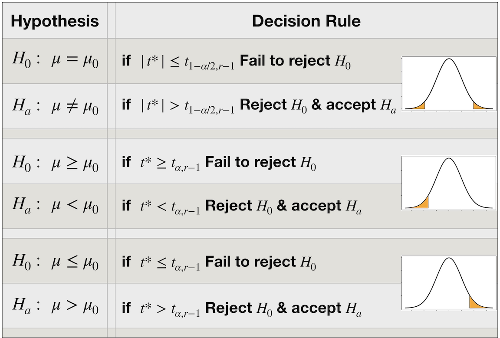
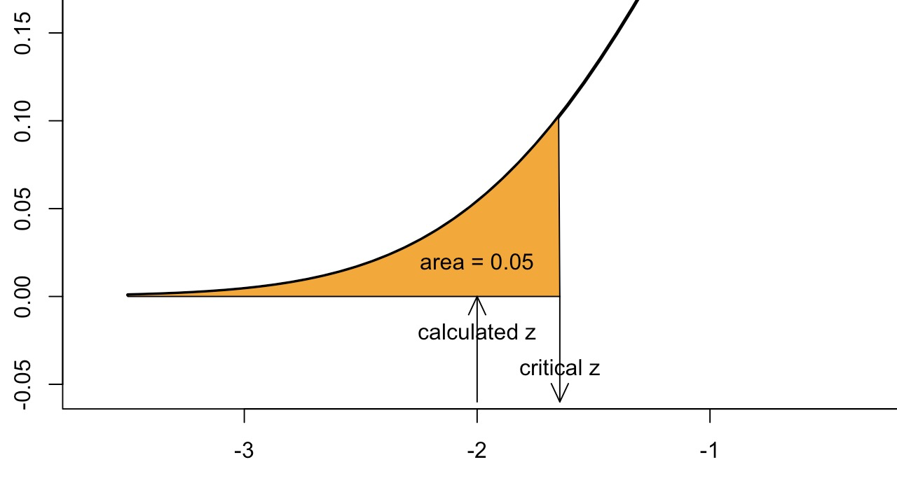
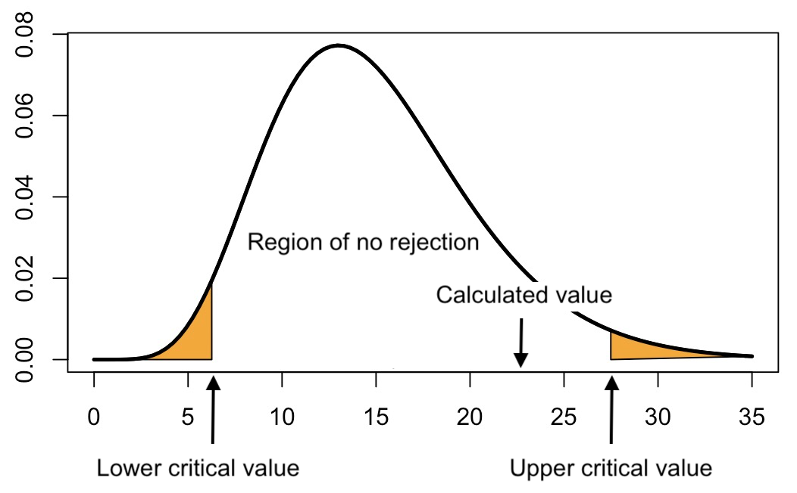
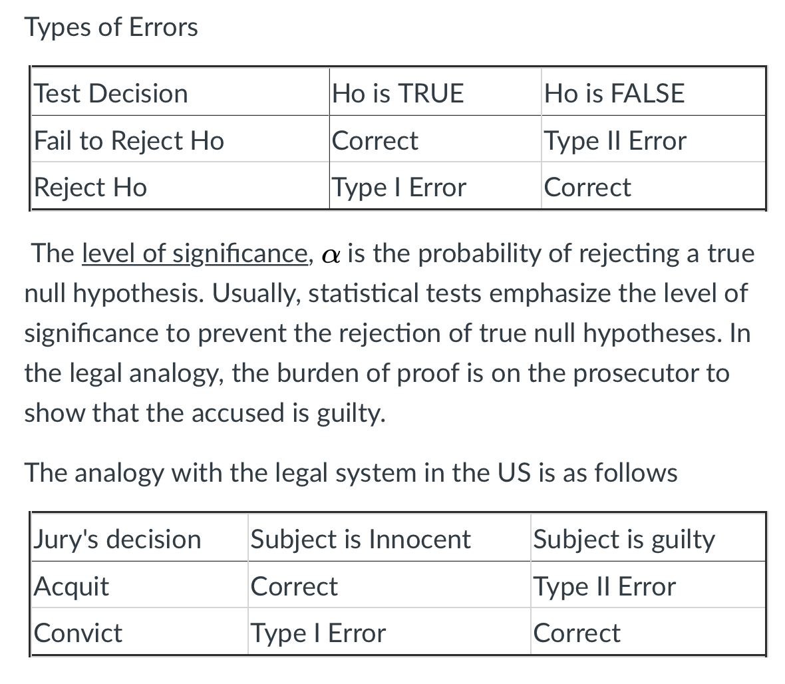
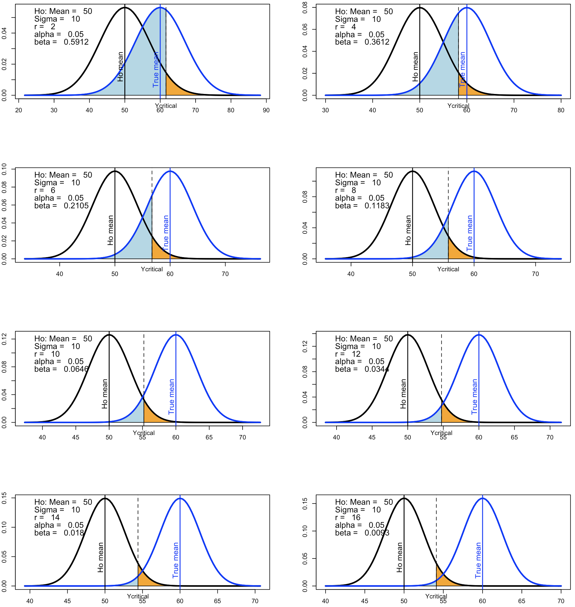

---
output:
  html_document:
    fig_caption: yes
    number_sections: yes
    theme: readable
    toc: yes
    toc_depth: 3
---

```{r setup0, message=FALSE, warning=FALSE, paged.print=FALSE, echo=FALSE, include=FALSE}
# load packages for chapter

options(digits = 10)
library(arrangements)
library(bookdown)
library(kableExtra)
library(knitr)
library(pander)
library(car)
library(tidyr)
library(ggplot2)
library(latex2exp)
library(plotrix)
library(animation)
options(scipen = 999)
```

```{r ShadeLeftTail, message=FALSE, warning=FALSE, paged.print=FALSE, echo=FALSE, include=FALSE}
left.tail <- function(mean = 0, sd = 1, p = 0.025, lblx = "", ...){
   x <- qnorm(p = p, mean = mean, sd = sd)
   from <- mean - 3.5 * sd
   to <- mean + 3.5 * sd
   curve(dnorm(x, mean = mean, sd = sd),
         from = from,
         to = to,
         lwd = 2.5,
         xlab = "",
         ylab = "",
         ylim = c(-0.10 * dnorm(x = mean, mean = mean, sd = sd),
                  dnorm(x = mean, mean = mean, sd = sd)))

   # Add the shaded area.

   cord.x <- c(from, seq(from = from, to = x, length.out = 50), x)
   cord.y <- c(0, dnorm(x = seq(from = from, to = x, length.out = 50),
                        mean = mean, sd = sd), 0)

   polygon(cord.x, cord.y, col = "orange")

   text(x = x, y = -0.05 * dnorm(x = mean, mean = mean, sd = sd), labels = lblx)
}

```


# Confidence intervals and Hypothesis testing {#chHotest}


## Learning Objectives for Chapter

1. Describe the purpose of hypothesis testing, and in what situation it would be necessary.
1. State null and alternative hypotheses in words and equations.
1. Calculate and explain the meaning of level of significance in words and with a graph.
1. Calculate power of a test and explain it with a graph.
1. Calculate and interpret confidence intervals.
1. Describe how sample size and alpha affect CI's.
1. Explain the difference between a one-tailed and two-tailed test and determine when each one is applicable.
1. Recreate and explain a table showing the outcomes of statistical tests and the types of errors.
1. Test if the mean of a population is equal to a hypothetical mean when variance is known and unknown.


## Introduction to inference

With this chapter we enter the topic of **Inference**. Statistical inference consists of making statements about population characteristics based on information obtained from samples. We aim at presenting a general idea that in order to answer interesting practical questions we need to estimate parameters or other unknown and unknowable quantities, and we need to determine how confident we are about the estimated values. Frequently, the topics of estimation and inference are separated in textbooks, because estimation methods can be treated independently of the statistical distributions of the estimators and associated probabilities. Many important properties of estimators, like expected value and variance, can be worked out without assuming any particular distribution for the random components of models. One estimation method we mentioned before is called *least-squares*, another one is *maximum likelihood*.

The main point of this chapter is to present methods to test hypotheses where unknown parameters, typically the mean of normal distributions, are estimated and hypothesized to have specific known values. The mean is unknown so we estimate it with the average of a sample. Using the mathematical "trick" that is the most important equation in this course, we also use a single sample to estimate the sampling variance of the sample average. Armed with a known distribution shape (Normal), an estimate of its mean (the sample average), and an estimate of the variance of sample average, we make inferences about the population. We test hypotheses of specific values of the mean by calculating how likely it would be to observe the data in hand or more extreme data if indeed the hypothesis were true. In later chapters we expand the test to two and then several means.

<br>
```{block StatementCertainty, type='stattip'}
- A main goal of statistics is to estimate unknown parameters or quantities and state the estimates and our degree of certainty about the estimate. Confidence intervals are the primary tool for this and have a simple structure that is the same across apparently diverse statistical tests:

$$CI = \text{estimate} \ \pm \ \text{margin of error}$$

```
<br>

## Testing a hypothesis

A **statistical hypothesis** is an assertion made about some parameter or characteristic of a population. By testing a statistical hypothesis we are making a statistical inference, which consists of making a statement about population characteristics based on information obtained from samples. Keep in mind that statistics, like science in general, is not meant to lead to "the truth." The scientific method and its direct implementation in statistical inference only allow us to make good guesses about which model of reality is better. Other things being equal, the models that agree more with the data are preferred.

Performing a hypothesis test consists of posing a statement about a population parameters or a "model" of some aspect or phenomenon. Then, we gather data and calculate the probability of observing such data under the assumption that the statement or model is true. If the probability is too low, we guess that the statement is not correct,and we reject it. Obviously, the whole testing procedure is a random process because it is based on a random sample, and we never know for sure if our conclusion is correct or not. We just know that the probability of incorrectly rejecting the statement is low. This is the logic of frequentists hypothesis testing. We will come back to this in more detail.

We insist in the understanding of the logic behind hypothesis testing in an overt attempt to correct the widespread misunderstanding and misuse of hypothesis testing in science. One of the most important points of this chapter is to understand the logic behind hypothesis testing and to be able to spot its misuse and misinterpretation. Correctly used and interpreted, hypothesis testing can be a useful tool in science and business. First, let's show the mechanics of hypothesis testing. Then we will point out pitfalls and things to watch out for.


The steps involved for conducting a hypothesis test are:

1) State null and alternative hypotheses
2) Set the level of "significance"
3) Determine/state the decision rule
4) Calculate test-statistic
5) Interpret the decision and state conclusion


### State null and alternative hypotheses

A hypothesis is stated about a population, usually involving a parameter. For example, the mean photosynthetic rate for the non-native eelgrass *Zostera japonica* found on the south side quadrant of Padilla Bay, WA is the same as the mean photosynthetic rate for *Z. japonica* eelgrass found in all quadrants in Padilla Bay.

The null hypothesis states that the mean photosynthetic rate of the eelgrass population in the south quadrant $(\mu_{south})$ is the *same* as the mean photosynthetic rate of the eelgrass population for all quadrants $(\mu_{all})$ (i.e., no difference in photosynthetic rate between the two populations). Thus, the *null hypothesis**, which is denoted by $H_o$, states that there is no difference between means.

The alternative hypothesis for this example would state that the mean photosynthetic rate of the eelgrass population in the south quadrant is *different* from the mean photosynthetic rate of eelgrass found in all quadrants. The alternative hypothesis is denoted $H_a$

Null hypothesis:

<br>

$$H_o: \mu_{south} = \mu_{all}$$


Alternative hypothesis:

$$H_a: \mu_{south} \neq \mu_{all}$$

<br>

Above, the **alternative hypothesis** states that the mean photosynthetic rate of the south quadrant population is *not equal* to the mean photosynthetic rate of the all quadrant population. An important aspect of this statement is that it is not specified how the two population means are different;l it does not say how different they are or which one is expected to be greater. The null hypothesis might be rejected regardless of which one is greater, and the test is said to be **two-tailed**. In general, null hypotheses like this one, where means are hypothesized to be different, are not very useful. Unless we are sampling exactly the same population in the same conditions, it is unlikely that means are truly equal to an infinitesimal degree. It is more useful and informative to hypothesize that means differ by a biologically or practically relevant amount in a given direction.

The more useful and informative test of whether the mean of one population is greater than the other by a biologically or practically significant amount is referred to as a **one-tailed** test. The "tails" refer to left and right areas under the statistical distribution of sample averages, which represent extreme values relative to what would be expected if the null hypothesis were true.

Inference is strongest when the null hypothesis is rejected. Failure to reject a null hypothesis is not as strong, because it may just mean that we simply do not have enough data to "see" the difference. Because of this, the statement of equality should always be part of the null hypothesis, not of the alternative one.


- Two-tailed test:

$$H_o: \mu = \mu_0$$
$$H_a: \mu \neq \mu_0$$

- One-tailed test:

$$H_o: \mu \le \mu_0$$
$$H_a: \mu \gt \mu_0$$

- One-tailed test:

$$H_o: \mu \ge \mu_0$$
$$H_a: \mu \lt \mu_0$$


### Level of significance $\alpha$ and the p-value

Informally, the level of significance is a measure of how unusual the result has to be to reject the null hypothesis. It is a measure of how consistent the data are with the null hypothesis. This measure is the probability of observing the data in the sample or more extreme data if the null hypothesis were actually true. The details of the logic behind this **frequentist** hypothesis testing scheme is explored further down.

Setting the level of significance $(\alpha)$ determines at what calculated probability value the null hypothesis is either rejected or not rejected. The desired level must be set prior to the experiment and should not be changed to avoid the introduction of subjective bias in the tests. Typical values are 0.05 and 0.01 or 5 and 1\%. If we changed the p-value after the data are known, we could control the results of the tests by simply choosing a very low $\alpha$ for hypotheses that we do not want to reject, and a larger one for those that we feel like rejecting.

By definition, $\alpha$ is the probability of obtaining a sample with "extreme" data for a given parameter value (usually the mean of the normal distribution). Those extreme samples may actually come from a population with the hypothesized mean, but the method establishes that in those cases the null hypothesis is rejected. Therefore, $\alpha$ is the probability that a true null hypothesis will be rejected in error. The rejection of a true null hypothesis is called **Error Type I**, and it is expected to happen 5 or 1 times out of 100 tests when $\alpha$ is 0.05. The problem is that we will never know for sure which conclusions were incorrect.

#### What is the meaning of the p-value?

We use the term p-value to refer to the probability of observing a test statistic of equal or greater value than the one actually observed, given or assuming that the null hypothesis is correct. This is a conditional probability.

**Frequentist test of hypothesis**

If $P(\text{calculated } t \ | \ \text{True } H_0) < \alpha$ then, reject $H_0$.

Thus, the test of hypothesis is based on a conditional probability, the probability that the summary statistics or calculated t value is greater than or equal to the one observed, given that the distribution of the observations is normal and independent with mean equal to that hypothesized. For this to make more sense formally we need to distinguish between the random function or variable calculated, call it $s = (\bar{Y} - \mu_0)/S_{\bar{Y}}$ (s for "statistic") and any specific value that it takes for a sample, say $t_{calc}$ (because it is the name we generally use). In symbols:

$$p-value = P(s \ge t_{calc}|Y \sim N(\mu_0, \sigma))$$


The following video has a brief description of the historical origin of the p-value. Unfortunately, a scientific culture developed where the p-value lost its original meaning and resulted in one of the major issues in science today.

<a href = "https://player.pbs.org/viralplayer/3010227907/" target="_blank"> Tea and milk</a>

[@Nuzzo2014] stated:

>P values have always had critics. In their almost nine decades of existence, they have been lik- ened to mosquitoes (annoying and impossible to swat away), the emperor’s new clothes (fraught with obvious problems that everyone ignores) and the tool of a “sterile intellectual rake” who ravishes science but leaves it with no progeny. One researcher suggested rechristening the methodology “statistical hypothesis inference testing”, presumably for the acronym it would yield.

```{block, type = 'think'}
Interesting... It looks like we are studying p-values and that they may mean “statistical hypothesis inference testing.” You may think: "I do not have time for this SHI Testing!" but you do. You are traveling the statistical times at an exciting crossroads!
```

Do not confuse the incorrect use of p-values with incorrect p-values. The formal procedures of obtaining and interpreting p-values are correct. P-values in themselves are not flawed, except that they are used in ways that are not correct. A culture developed in which "statistical significance with p = 0.05"" took a life of its own. Data are analyzed with intention to achieve this false icon, and in doing so, scientists invalidate the p-value. How should p-value be used then??

>Informally, a p-value is the probability under a specified statistical model that a statistical summary of the data (e.g., the sample mean difference between two compared groups) would be equal to or more extreme than its observed value.
>
> [@WassersteinLazar2016]

There are three main problems with the p-value:

1. Misunderstanding. The meaning of the p-value is widely misunderstood. Its correct meaning is stated above. Th p-value **is not** the probability that the null hypothesis is true.

1. Irrelevant significance. The "culture" of science established that small p-values and "significant" results are more interesting than results that have larger p-values. In general, they should not be. But the idea of "statistically significant" became conflated with that of biological or practical significance. In reality they are different. A difference of 10 g in body mass of mature cattle may be statistically significant, but it is not biologically or practically significant.

1. Cherry-picking of results. Researchers became keen on getting "significant" results, because journals and peers want to have significant results. Because of this, the papers that are published are heavily biased to report only those experiments that show significant results. The problem is that any random experiment will always result in significant results and rejection of any null hypothesis if repeated sufficient number of times. In the logic of null hypothesis testing (see below) this is equivalent to hypothesizing that an urn with 80 blue and 20 yellow marbles has 80% blue marbles and then taking samples of 5 marbles with replacement until one gets a sample with more than 4 yellow marbles. A that point one has a "significant" result that is published. This is not good because publications do not usually state how many times the experiment was repeated. By "cherry-picking" only the significant results for publication we contribute to a weakening of science.


### Test-statistic

In order to assess the probability of observing the data in the sample or more extreme data under the assumption that the null hypothesis is true, a test-statistic needs to be calculated. The test statistic selected depends on the specific parameter being estimated, because the statistic has to have a *sampling statistical distribution* that is appropriate. When we test hypotheses about population means we use the standard normal distribution when the variance is known or Student's t distribution when the variance is not known. For tests about values of population variances we use the $\chi^2$ distribution, whereas to compare variances we use the F distribution. Those distributions were derived mathematically by looking at what happens when samples are used to estimate means and variances.

The **sampling distribution** of a statistics is the distribution of the values that the statistic takes over infinitely many samples obtained exactly in the same manner. For example, the sample average is a statistic that has a normal distribution if the original distribution is normal, or if sample size is large, regardless of the original distribution. The sample variance is a statistic that is proportional to a $\chi^2$, whereas the ratio of two independent estimates of the sample variance has an F distribution.

When the data are normally distributed, or approximately normal given a large sample size (e.g., n >30), tests about population means with **known variance** use the z-score as the statistic. The **z-statistic** is calculated as follows:

A hypothesis is stated about a population, usually involving a parameter. For example, the mean photosynthetic rate for the non-native eelgrass *Zostera japonica* found on the south side quadrant of Padilla Bay, WA is the same as the mean photosynthetic rate for *Z. japonica* eelgrass found in all quadrants in Padilla Bay.

$$z_{calc} = \frac{\bar{Y} - \mu_0}{\sigma / \sqrt{r}}$$

<br>

where z is the calculated *z-statistic*, $\bar{Y}$ is the sample mean, $\mu_0$ is the hypothesized population mean, $\sigma$ is the known population standard deviation and r is the sample size. If the calculated z is greater than the value of the standard normal distribution that leaves 5 or 1\% in the tails, the hypothesized mean is rejected.


If the population variance is unknown, it can be estimated with the sample variance. When the data are normally distributed, or approximately normal given a large sample size (e.g., n >30), tests about population means with **unknown variance** use the t-score as the statistic. The t-statistic is calculated as follows:

<br>

$$t_{calc} = \frac{\bar{Y} - \mu_0}{S / \sqrt{r}}$$

The null hypothesis states that the mean photosynthetic rate of the eelgrass population in the south quadrant $(\mu_{south})$ is the *same* as the mean photosynthetic rate of the eelgrass population for all quadrants $(\mu_{all})$ (i.e., no difference in photosynthetic rate between the two populations). Thus, the *null hypothesis**, which is denoted by $H_o$, states that there is no difference between means.


where $t_calc$ is the calculated statistic, which under a true null hypothesis should have a Student's t distribution, and S is the sample standard deviation. The t-distribution is necessary because the unknown variance increases the uncertainty in the test. The t distribution accounts for this by having more variance than the normal, and its variance increases as the number of observations used to estimate the mean declines. This is in addition to the effect through the $\sqrt{r}$.

<br>

## Decision rule

Once the test statistic is calculated it has to be inspected to make a decision about the null hypothesis. The decision can be made in two ways that are equivalent in the result:

1. If the calculated statistic value is greater than the critical value, reject the null hypothesis, otherwise, fail to reject the null hypothesis. The critical value is that which leaves $\alpha$ in the tails. Critical values are quantiles, they are values in the x-axis of the distributions beyond which lies $100 \ \alpha$ \% of the population.

1. If the tail probability associated with the calculated statistic is smaller than $\alpha$, reject the null hypothesis, otherwise, fail to reject it.

The decision rules depend on the nature of the hypothesis, because the error rate $\alpha$ has to be distributed on the tails. If the test is one tails, the area under the curve on the side of rejection is 0.05, but when the test is two-tailed, only 0.025 is in each tail.

<br>
````{block,, type='stattip'}
- Never accept the null hypothesis (unless your power is very large, but that is another story).
````
<br>

```{r NormalTails, message=FALSE, warning=FALSE, paged.print=FALSE, out.width = '90%', fig.align='center', echo=FALSE, fig.cap ="Decision rules for test of hypothesis about an unknown mean using an estimated variance."}



```

<!-- Figure \@ref(fig:prob_dist) is a visual representation of test-statistic values under a normal distribution.  -->


## Test of hypothesis about a mean when variance is known

Suppose that methane production per unit milk production for US cows in the last 5 decades has a mean of 13 g/kg with variance of 9 g^2^/kg^2^. A new feed additive was tested in 16 randomly selected cows and resulted in emissions of 11.5 g/kg. Assuming that the treated population has the same variance as the untreated one, is there evidence that the treatment reduces emissions relative to the mean of the untreated population?

<br>

$$H_0: \mu \ge \mu_0 = 13 \ g/kg \qquad H_a: \mu < \mu_0 = 13 \ g/kg$$

The population variance is known, therefore we use a z-test.

$$\mu_0 = 13 \quad g/kg \qquad \bar{Y} = 11.5 \quad g/kg \qquad \sigma^2 = 9 \qquad r = 16\\[25pt]
z_{calc} = \frac{\bar{Y} - \mu_0}{\sigma / \sqrt{r}} = \frac{11.5 - 13}{\sqrt{\frac{9}{16}}} = `r (11.5 - 13) / sqrt(9/16)`$$

<br>

The calculated z value of `r (11.5 - 13) / sqrt(9/16)` has to be checked for "significance." We can do this in two ways that are equivalent, shown in Figure \@ref(fig:LeftTailTestFig). First, the null hypothesis indicated a two-tailed test where the rejection region is the range of z values that have 5% of the area under the curve in the left of the normal distribution. Since we hypothesize that the new mean is greater than or equal to the untreated population mean, we reject it only if the calculated value is too low to be consistent with the null. The calculated z is compared to the standard normal quantile that corresponds to 0.05 on the left: `qnorm(p = 0.05)` = `r qnorm(p = 0.05)`. Because the calculated z = ` r (11.5 - 13) / sqrt(9/16)` is lower than the critical value of `r qnorm(p = 0.05)` we reject the null hypothesis.

Second, we can calculate the p-value or area under the curve on the left side of the calculated z. In R code that is `pnorm(q = -2)` = `r pnorm(q = -2)`. Because the probability is smaller than $\alpha$, we reject the null hypothesis and accept the alternative one.

<br>
```{r LeftTailTestFig, message=FALSE, warning=FALSE, paged.print=FALSE, out.width = '70%', fig.align='center', echo=FALSE, fig.cap ="Area of rejection for a left-tailed test. Calculated z is less than the critical z, therefore, the null hypothesis is rejected."}



```
<br>

Note that when the population variance is known, the test of the mean does not require that we know the individual values in the sample. We just need to know their averages.

## Test of hypothesis about a mean when variance is unknown

We will use the same example as above, except that we will not assume that the variance is known. Instead, we will use the following values from a sample of 16 cows that received the food additive: 

```{r cowMeth, echo=FALSE, message=FALSE}

set.seed(121023)

cow.meth <- data.frame(cow = 1:16, 
                       methane = round(rnorm(16, mean = 11.5, sd = 4), 1), 
                       ".    " = "")

names(cow.meth)[3] <- ""

methane <- cow.meth$methane

kable(cow.meth, caption = "Grams of methane produced per kg of milk by a sample of US dairy cows that received a new feed supplement (fictitious data).") %>%
   kable_styling(full_width = FALSE, position = "float_left", 
                 bootstrap_options = c("striped", "condensed"),
                 font_size = 12)

```


The sample standard deviation is used to estimate the population standard deviation. Because we are using an estimate of the standard deviation we need to use Student's t distribution.


$$\bar{Y} = `r round(mean(methane), 2)`$$
$$S_Y = `r round(sd(methane), 2)`$$
$$t_{calc} = \frac{\bar{Y} - \mu_0}{S_y / \sqrt{r}} = \frac{`r round(mean(methane), 2)` - 13.0}{`r round(sd(methane), 2)` / \sqrt{16}} = `r (mean(methane) - 13)/(sd(methane)/sqrt(16))`$$

This calculated t has to be compared to the critical value for a 5% left tail in a Student's t distribution with 16 - 1 = 15 degrees of freedom, $t_{critical} = `r qt(0.05, df = 15)`$. Because the calculated t is smaller than the critical t, we reject the null hypothesis.

## Test of hypothesis about an unknown variance

First of all, make sure that you understand that it would not make sense to talk about a test for the variance when the variance is known! For this example we hypothesize that the variance of the population that receives the feed additive is the same as the known variance of the untreated population. We use the same sample of 16 cows above.

$$H_0: \ \sigma^2 = \sigma_0^2 = 9 \\[25pt]
H_a: \ \sigma^2 \ne \sigma_0^2 = 9$$

Under the assumption that sampling was random, that each observation is independent from the others and that the null hypothesis is true, the sum of squared deviations of a sample divided by the variance has a $\chi^2$ distribution with r-1 degrees of freedom. Because the null is an equality, the test is two-tailed and there is an area equal to 0.25 in each side of the curve.

$$\chi^2_{calc} = \sum_{i = 1}^{16} \ \frac{(Y_i - \bar{Y})^2}{\sigma_0^2} = `r round(sum((methane - mean(methane)) ^ 2) / 9, 2)`$$

The lower critical value is the 0.025 quantile of a $\chi^2$ with 15 df: $\chi^2_{Lcritical} = `r qchisq(p = 0.025, 15)`$, whereas the upper critical value is $\chi^2_{Ucritical} = `r qchisq(p = 0.975, 15)`$. Because the calculated value falls between the critical levels, we *cannot reject* the null hypothesis.

<br>s
```{r TwoTailedChisqFig, message=FALSE, warning=FALSE, paged.print=FALSE, out.width = '60%', fig.align='center', echo=FALSE, fig.cap ="Area of rejection for a two-tailed test of an unknown variance. Calculated statistic value is greater than the lower critical level and less than the upper critical level, therefore, the null hypothesis cannot be rejected."}



```
<br>


## Confidence Intervals for the Mean


Another way to make statistical statements without conducting a hypothesis test is to use confidence intervals. A **confidence interval** is a range of values that has a known probability of containing the true value of an unknown parameter. Just like sample averages, confidence intervals vary from sample to sample. The level of confidence selected, or the probability that a randomly selected (because the sample is random) confidence interval (CI) contains the actual value of the parameter is the complement of the p-value: $1 - \alpha$. Thus, we use and refer to 95% and 99% confidence intervals. The confidence refers to the probability that any given sample yields an interval that actually brackets the parameter value. Once an interval is calculated, the parameter either is or is not in it, but we will never know.

One way to visualize the relationship between confidence interval and population mean is to use a simulation with a population of known mean and variance. We simulate samples from the population and for each random sample we calculate a 95% confidence interval for the mean.


<br>

When the variance of the population is known the confidence intervals are calculated as follows:

$$\text{Lower Boundary} = \bar{Y} - z_{1-\alpha/2} \cdot \frac{\sigma}{\sqrt r}$$
$$\text{Upper Boundary} = \bar{Y} + z_{1-\alpha/2} \cdot \frac{\sigma}{\sqrt r}$$

<br>

where *z* is the z-critical value, which for a 95% confidence equals 1.96.

We simulate a population of horseshoe wear, where the amount of horseshoe wear has a mean of 2 mm with standard deviation equal to 0.4 mm. We pretend that we do not know the mean and take random samples of size 9 from the population using the `rnorm` R function. For each sample we calculate the average and create a 95\% confidence interval. Those intervals are plotted about the true mean to determine the proportion that actually contains the true mean. This proportion is called "coverage" and it is expected to be equal to the confidence. The actual proportion may be different due to the random component in sampling, but it should approach the confidence level as the number of samples increases. In real samples, the difference between expected and real coverage is also affected by deviations from normality and independence assumptions.

<br>

```{r zCiCoverage, message=FALSE, fig.cap="Location of 100 confidence intervals about the true mean of a population. Population standard deviation is 0.4 and sample size = 9. Each CI is a vertical line. Red CI's do not include the true mean."}

mean <- 2
sd <- 0.4
ssize <- 9

set.seed(141149)

samples <- matrix(rnorm(n = 900, mean = mean, sd = sd),
                  byrow = TRUE, nrow = 100, ncol = 9)

averages <- apply(samples, 1, mean)

# Calculate CI boundaries using z distribution
# because variance is known.
ci.lo <- averages + qnorm(0.025) * sd / sqrt(ssize)
ci.hi <- averages + qnorm(0.975) * sd / sqrt(ssize)

ymin <- 0.90 * min(ci.lo)
ymax <- 1.10 * max(ci.hi)

ci.colors <- c("red", "blue")
ci.color <- ci.colors[as.numeric(ci.lo < 2 & ci.hi > 2) + 1]

plot(averages, xlab = "Sample", ylab = "95% CI", 
     ylim = c(ymin, ymax), col = ci.color, pch = 16)

abline(h = mean, col = "grey")

segments(x0 = 1:100, y0 = ci.lo, y1 = ci.hi, col = ci.color)

coverage <-  paste("Coverage = ", as.character(sum(ci.lo < 2 & ci.hi > 2)), "%", sep = "")

text(x = 20, y = 1.05 * max(ci.hi), labels = coverage, cex = 1.2)
```


### Test-statistic

In order to assess the probability of observing the data in the sample or more extreme data under the assumption that the null hypothesis is true, a test-statistic needs to be calculated. The test statistic selected depends on the specific parameter being estimated, because the statistic has to have a *sampling statistical distribution* that is appropriate. When we test hypotheses about population means we use the standard normal distribution when the variance is known or Student's t distribution when the variance is not known. For tests about values of population variances we use the $\chi^2$ distribution, whereas to compare variances we use the F distribution. Those distributions were derived mathematically by looking at what happens when samples are used to estimate means and variances.


Given that the population standard deviation of the horseshoe wear is known to be 0.4 mm, and given that it is known that wear follows a normal distribution, then, we know that averages of samples of size r = 9 will have a normal distribution with mean equal to the true wear mean and standard deviation equal to 0.4/3. This means that, in the long run, 95% of the sample averages will fall within $1.96 \times 0.4/3 =$ mm (margin of error) of the true mean. Thus, if we extend "arms" that are 0.63 cm long from each average we calculate, the segment encompassed should contain the mean 95% of the time, in the long, long run. Just like when drawing marbles from a urn with white and blue marbles there is a certain probability that it is blue, when we "draw" confidence intervals, there is a certain probability that they contain the mean. We make the confidence intervals such that the probability is 95% or other desired degree of certainty.

**Margin of Error of estimated mean when variance is known:**

$$MOE = z_{1-\alpha/2} \cdot \frac{\sigma}{\sqrt r}$$

Given the equation above either decreasing the standard deviation or increasing sample size would reduce the margin of error (the length of the "arm" on each side of the average) and give a narrower range within which the true population mean lies. For any given standard deviation and sample size, the margin of error depends on the degree of certainty $1-\alpha$ selected. The greater the certainty desired, the larger the z and the wider the CI. Obviously, the CI looks for a balance between width and certainty. One can be immediately certain that the true mean is something between $-\infty$ and $+\infty$, but that is not be very helpful. By observing the sample we can eliminate values that are extremely unlikely and concentrate our guess of the mean value within a narrow section of the real numbers.

**Margin of Error of estimated mean when variance is NOT known:**

$$MOE = t_{r-1, \ 1-\alpha/2} \cdot \frac{S}{\sqrt r}$$
When the variance is not known, the test statistic has a Student's t distribution that depends on sample size. The t distribution has degrees of freedom that are equal to the divisor used to estimate the variance, r-1. In this cases, an increase in sample size has a positive impact in reducing the margin of error through two effects:

- as before, increasing r reduces the $S / \sqrt{r}$ factor, and 
- as r increases, degrees of freedom increase and the critical t value decreases.

the impact of not knowing the variance on the Ci is illustrated by repeating the calculations for Figure \@ref(fig:zCiCoverage), but using each samples standard deviation and the t distribution instead of the known variance and the z distribution. Because of the additional uncertainty introduced due to not knowing the population variance, confidence intervals in Figure \@ref(fig:tCiCoverage) are wider than in Figure \@ref(fig:zCiCoverage).

```{r tCiCoverage, message=FALSE, fig.cap="Location of 100 confidence intervals about the true mean of a population. Population variance is NOT known and sample size = 9. Each CI is a vertical line. Red CI's do not include the true mean."}

mean <- 2
sd <- 0.4
ssize <- 9

set.seed(141149)

samples <- matrix(rnorm(n = 900, mean = mean, sd = sd),
                  byrow = TRUE, nrow = 100, ncol = 9)

averages <- apply(samples, 1, mean)
ses <- apply(samples, 1, sd) / sqrt(ssize)

# Calculate CI boundaries using z distribution
# because variance is known.
ci.lo <- averages + qt(p = 0.025, df = ssize - 1) * ses
ci.hi <- averages + qt(p = 0.975, df = ssize - 1) * ses

ci.colors <- c("red", "blue")
ci.color <- ci.colors[as.numeric(ci.lo < 2 & ci.hi > 2) + 1]

plot(averages, xlab = "Sample", ylab = "95% CI", 
     ylim = c(ymin, ymax), col = ci.color, pch = 16)

abline(h = mean, col = "grey")

segments(x0 = 1:100, y0 = ci.lo, y1 = ci.hi, col = ci.color)

coverage <-  paste("Coverage = ", as.character(sum(ci.lo < 2 & ci.hi > 2)), "%", sep = "")

text(x = 20, y = 1.05 * max(ci.hi), labels = coverage, cex = 1.2)

```

## Confidence Intervals for the Variance

In the section about [$\chi^2$ distribution](#chisqDist) we noted that the $\chi^2$ distribution is the distribution of a random variable created by summing the squares of multiple standard normal random variables. A little of work on the formula for the estimated variance using the sample variance shows that the estimated variance is a random variable with a distribution related to the $\chi^2$.
>>>>>>> EAL11Oct18

<br>
````{block,, type='stattip'}
- Never accept the null hypothesis (unless your power is very large, but that is another story).
````
<br>

$$\begin{align}
&\hat{\sigma}^2 = S^2 = \sum_{i = 1}^r \ \frac{(Y_i - \bar{Y})^2}{r - 1} \implies S^2 \ (r - 1) = \sum_{i = 1}^r \ (Y_i - \bar{Y})^2 \\[25pt]
&\text{Because } Y_i \sim N(\mu, \sigma^2),\qquad (Y_i - \bar{Y}) \sim N(0, \sigma^2) \ \text{ and} \\[25pt]
&\frac{(Y_i - \bar{Y})}{\sigma} \sim N(0, 1) \ \text{ is a standard normal random variable, and} \\[25pt]
&\frac{S^2 \ (r - 1)}{\sigma^2} = \sum_{i = 1}^r \ \frac{(Y_i - \bar{Y})^2}{\sigma^2} \sim \ \chi^2_{r-1}
\end{align}$$

<br>

Based on this result, we use the $chi^2_{r-1}$ distribution to make confidence intervals for the true variance based on the sample variance. By definition

<!-- Figure \@ref(fig:prob_dist) is a visual representation of test-statistic values under a normal distribution.  -->

$$P \left (\chi^2_{r-1, \ \alpha/2} \ \lt \frac{S^2 \ (r - 1)}{\sigma^2} \lt \chi^2_{r-1, \ 1 - \alpha/2} \right ) = 0.95$$

<br>

therefore, after taking the reciprocal of the expression, changing the direction of the inequalities to preserve their validity, and multiplying all parts by $S^2 \ (r - 1)$, we get


<br>


$$P \left (\frac{S^2 \ (r - 1)}{\chi^2_{r-1, \ 1 - \alpha/2}} \ \lt \sigma^2 \lt \frac{S^2 \ (r - 1)}{\chi^2_{r-1, \ \alpha/2}} \right ) = 0.95 \\[35pt]
\text{Lower Boundary} = \frac{S^2 \ (r - 1)}{\chi^2_{r-1, \ 1 - \alpha/2}} \\[35pt]
\text{Upper Boundary} = \frac{S^2 \ (r - 1)}{\chi^2_{r-1, \ \alpha/2}}$$


<br>

The construction of confidence intervals for the variance is illustrated with R and a plot of coverage is produced below. Note the asymmetry of confidence intervals, which stems from the asymmetry of the $\chi^2$ distribution.


<br>
```{r chiCiCoverage, message=FALSE, fig.cap="Location of 100 confidence intervals about the true variance of a population. Population variance is NOT known and sample size = 9. Each CI is a vertical line. Red CI's do not include the true variance"}

mean <- 2
sd <- 0.4
ssize <- 9
nsamples <- 100

set.seed(141307)

samples <- matrix(rnorm(n = ssize * nsamples, mean = mean, sd = sd),
                  byrow = TRUE, nrow = nsamples, ncol = ssize)

averages <- apply(samples, 1, mean)
vars <- apply(samples, 1, var)

# Calculate CI boundaries using z distribution
# because variance is known.
lo.chisq <- qchisq(p = 0.025, df = ssize - 1)
hi.chisq <- qchisq(p = 0.975, df = ssize - 1)

ci.lo <- vars * (ssize - 1) / hi.chisq
ci.hi <- vars * (ssize - 1) / lo.chisq

ci.colors <- c("red", "blue")
ci.color <- ci.colors[as.numeric(ci.lo < sd^2 & ci.hi > sd^2) + 1]

ymin <- 0.90 * min(ci.lo)
ymax <- 1.10 * max(ci.hi)

plot(vars, xlab = "Sample", ylab = "95% CI", 
     ylim = c(ymin, ymax), col = ci.color, pch = 16)

abline(h = sd^2, col = "grey")

segments(x0 = 1:200, y0 = ci.lo, y1 = ci.hi, col = ci.color)

coverage <-  paste("Coverage = ", 
                   as.character(
                      sum(ci.lo < sd^2 & ci.hi > sd^2) * 100 / nsamples), 
                   "%", sep = "")

text(x = 20, y = 1.05 * max(ci.hi), labels = coverage, cex = 1.2)

```
<br>


We use the first sample obtained above to illustrate the calculation for a CI.

### Correct and incorrect interpretation of the Confidence Interval


$$ Y = \{`r round(samples[1, ], 2)`\} \\[30pt]
S^2 = `r round(var(samples[1, ]), 4)` \\[30pt]
df = r-1 = 9 - 1 = 8 \\[30pt]
\chi^2_{8, \ 0.975} = `r round(qchisq(p = 0.975, df = ssize - 1), 3)` \\[30pt]
\chi^2_{8, \ 0.025} = `r round(qchisq(p = 0.025, df = ssize - 1), 3)` \\[30pt]
\text{Lower Boundary } = `r round(var(samples[1, ]) * (ssize - 1) / qchisq(p = 0.975, df = ssize - 1), 3)` \\[30pt]
\text{Upper Boundary } = `r round(var(samples[1, ]) * (ssize - 1) / qchisq(p = 0.025, df = ssize - 1), 3)` $$

<br>

### Correct and incorrect interpretation of the Confidence Interval

Example of a published incorrect interpretation of a confidence interval:

"Owing to variation, we know the sample point estimate is not the true population value. Consequently, we add to it a statement indicating how far the point estimate is likely to be from the true value. One way is to supplement the point estimate by interval estimate. We can say, for example, that from the sample evidence we are confident that the number of farmers in Boone County who sprayed was between 345 and 736. By "confident" we mean that the probability is 95 chances in 100 that the interval from 345 to 736 contains the true but unknown number of farmers in Boone County who sprayed."

This is incorrect because it takes the CI as constant and the mean as variable. The boundary values of the CI will change from one sample to another, they will not be fixed at 345 and 736. The CI is the random range that changes. We know that based on the theory we expect 95 out of 100 confidence intervals to bracket the fixed true mean, and we know that the CI we actually calculated is one of those 100. Therefore, there is a 95% chance that the one we calculated brackets the mean.

Correct interpretation of the confidence interval found in another page in the same statistics book [@SnedecorCochran1989]:

"When we make a 95% confidence interval statement, the population mean $\mu$ has a fixed but unknown value. The uncertainty attached to a confidence interval for $\mu$ comes from the variability in the sampling process. We do not know whether the confidence interval constructed from the data from any particular sample includes $\mu$ or not. We do know that in the long run 95% of the intervals will include $\mu$, and similarly, 95% of the statements that "$\mu$ lies between the lower and the upper limit"" will be correct"

The main difference that makes the first statement incorrect and the second one correct is that the second statement does not specify the values for the extremes of the confidence interval. Those values will be changing from sample sample. Thus, the probability statement refers to a confidence interval that changes from sample sample, not to a single specific confidence interval. In other words, when we make hundred statement the extremes of the confidence interval change from one statement to the next. In 100 statements we expect to be correct 95 times, but all 100 statements will be different. Notice that the 95% correct rate is expected and may not be realized in any specific set of statements or samples.


## Logic of Null Hypothesis test

The structure of decision making when testing of null hypotheses within a frequentist framework is not intuitive, and it has weaknesses. In this section we explain the logic with a clear example in discuss some of the issues that are common and hard to resolve.

The logic behind test of null hypothesis is analogous to the following situation. Imagine that there are two jars with blue and yellow marbles. These jars represent the two possible cases: jar "Different" on the left is the case where we have different treatment means, whereas jar "Equal" on the right represents the case where all means are the same. One of the jars is the true situation available to be observed, the jar from which the marbles are selected at random, representing the process of collecting data. However, we do not know which one is being observed. We just know what the jars have inside, which represents the two possible states of reality, means equal or means different. The observation/experimentation process does not allow us to see the "real" jar, but we get a sample of what it has inside. Of course, we can only sample or partially observe the "real" situation. You can think that the hypothesis being "The jar sampled (the real situation) has mostly yellow marbles." This is equivalent, in the example, to hypothesizing that the means are equal, because the jar "Equal" has 80% yellow marbles.

On the outside, the jars are identical and you cannot see inside. The "Different" jar has 90% blue marbles, whereas the "Equal" jar has only 20% blue marbles. Suppose that the number of marbles is large enough that the probabilities are not affected by the removal of marbles, or that the marbles are returned to the jar after observing them. Only one jar is available to sample from, depending on whether the true but unknown means are different or not, but you do not know which one. You sample 5 marbles and they are all blue. Did you sample from "Different" or "Equal?" The null hypothesis is that the means are equal, which in the analogy signifies that the hypothesis is that we sampled the jar on the right labeled E for "Equal." We cannot know for sure where the marbles came from, because there are both blue and yellow marbles in both jars.

<br>
<br>
```{r jars1, message=FALSE, warning=FALSE, paged.print=FALSE, out.width = '60%', fig.align='center', echo=FALSE, fig.cap ="Representation of the logic of hypothesis testing in frequentist statistics. Jar D on the left represents the situation when means of treatments are different. Jar E on the right represents the situation when means are all equal. Imagine that there is a large number of marbles in each jar or that sampling is done with replacement. Marbles in each jar represent the distribution of the test statistic under each condition. A sample of r = 5 marbles represents the process of experimentation, sampling and calculation of the observed statistic value. Intuitively, if most of the marbles sampled are blue, we will tend to say that the jar sampled was D. As an exercise, design jars with various proportions of colors and see if it becomes easier or harder to guess the sampled jar."}

knitr::include_graphics("images/UrnsAnova1.png")

```
<br>
<br>

Intuition indicates that if all 5 marbles sampled are blue, we should reject the null hypothesis. Say that you sample 5 marbles and 4 are blue. The logic of Ho testing would go something like this: "I hypothesize that we sampled the E jar with mostly yellow marbles, but I got 4 blue, and the chances of getting 4 blue marbles from the E jar is very small, so I will guess that in reality I sampled from the D jar and reject the hypothesis that I sampled from the E jar. I will guess that the means are different." In the case of the marbles, all parameters of the problem are known, so we can calculate the exact probabilities of making errors. Because sampling is with replacement (or the number of marbles is really large), if the means are all equal, i.e., if we sampled from jar E the probability of getting a blue marble P(blue) in any draw would be constant at 0.20, and the number of blue marbles drawn would have a binomial distribution. Therefore, the probability of getting 4 or more blue marbles from E would be `r round(1 - pbinom(3, 5, 0.20), 5)`. This is the probability that we reject the null hypothesis while in fact it is true. We can call the number of blue marbles the "decision variable" or sample statistic that we use to determine whether to reject the null hypothesis. The probability of drawing 3 or more blue marbles out of 5 from E is `r round(1 - pbinom(2, 5, 0.20), 3)`, which is close to the standard $\alpha = 0.05$. Thus, we can say that we will reject the null that we sampled from E if we get 3 or more blue marbles out of 5. In this case, calculating the sample statistic and its sampling distribution is rather simple: to calculate the sample statistic we count the blue marbles, and the number of blue marbles has a binomial distribution.

<br>

```{block, type = 'think'}
The proportion of marbles in the D jar was not used for anything! What if the D jar had just one more blue marble than the E jar??? This is a problem in frequentist hypothesis testing: it does not take into account the sampling distribution of statistics under plausible alternative hypotheses.
```
<br>

In many experiments the response variable of interest is not binary; the variable observed is not like the number of marbles and it does not have a binomial distribution. A slightly more complicated procedure than applying the binomial distribution is used to calculate a statistic (calculated F-value) whose theoretical distribution is known when the null hypothesis is true (F distribution). This procedure is the analysis of variance, and the statistic calculated is the calculated F-value. When all means are the same, the calculated F has an F-distribution defined by certain parameters called "degrees of freedom" that depend on sample size and number of treatments compared.

```{block, type = "stattip"}

LOGIC OF TESTS OF NULL HYPOTHESIS:
IF the assumptions are true, AND the null hypothesis is true,\
THEN, over many samples, the calculated t has a Student's t distribution with r-1 df.\
THEREFORE, the probability of $t_{calc} \gt t{critical}$ is small.\
If $t_{calc}$ in this test is greater than $t{critical}$ we doubt (reject) the null hypothesis.\
Essentially, we say that events with low probability did not occur.
```

```{block, type = "stattip"}

- If you try a sufficiently large number of times, any hypothesis, regardless of their truthfulness, will be rejected. When somebody tells you they rejected a hypothesis, make sure to ask how many times they tried. Remember that correctly applied statistical methods will lead to rejection of true null hypothesis with an expected rate of 5 out of 100 tests.

```

<!-- ** Add shiny for students to run simulations of draws from randomly selected urns and the be shown the true urn. Use probabilities such that they can explore both types of errors. Assign homework where they explore the rates of errors as a function sample size and probabilities.** -->

<!-- A lot of the course contents can be reduced to comparing two unknown parameters. ANOVA is used when whe have more than one pair of parameters, comparison of two population means is used when we have just two parameters, and a single population test is used when one of the values is a known number. Therefore, the concept of comparing two means generalizes to ANOVA and becomes more specific in one population mean. The equations are all versions of the same general concept: from two random variables (one for each parameter estimate) we build a single random variable (the difference between estimates) and estimate its variance. In all cases the best estimate of the variance of the experimental error is the MSE, the pooled within group variance. The variance of the new single random variable is derived directly from the MSE. For example, in one-population one of the estimated parameters has variance 0 ($\mu$ is known) and there is a single group for the other one, so the MSE is equal to the sample variance, and the variance of the estimated parameter follows direclty from the most important formula for PLS 120, which is simply a rehash of the variance for the sum of independent random variables, where independence is obtained by sampling (assumption). -->


## Types of Errors in Hypothesis testing

```{block, type = 'stattip'}
- Even when everything is done correctly and assumptions are met, we are expected to make errors in hypothesis testing. We will reject true null hypothesis and fail to reject false ones. Statistics gives us methods to estimate and set the approximate rates at which we makes different types of mistakes. If assumptions are not valid, or methods are applied incorrectly we will make mistakes with unknown frequency.
```

Two types of errors can be made when properly testing hypotheses in with frequentist methods (Figure \@ref(fig:TypesOfErrors)). A true null hypothesis may be incorrectly rejected (Error type I) or a false null hypothesis may not be rejected (Error type II). The probability of making an Error type I is $\alpha$, because alpha is the probability of observing calculated statistics in the rejection range of values *when the null hypothesis is TRUE*. Therefore, by setting the value of $\alpha$ we are setting the rate of Error type I.

<br>
```{r TypesOfErrors, message=FALSE, warning=FALSE, paged.print=FALSE, out.width = '90%', fig.align='center', echo=FALSE, fig.cap ="Error types in hypothesis testing. Errors can be though of as analogous to trial decisions where the consequence of convicting an innocent person is highly undesirable."}



```
<br>


The probability of making an Error type II is called $\beta$. Its complement, the probability of NOT making an error type II is called "power." Thus, power = $1 - \beta$. Unlike $\alpha$, modifying $1 - \beta$ is harder. Power in a test of the null hypothesis that a mean is equal to a present number depends on four factors:

1. Variance of the population.

2. Sample size.

3. Difference between the true and the hypothesized mean.

4. Selected value for $\alpha$.

Power decreases with increasing variance and it increases with increasing sample size, difference between true and hypothesized mean, and $\alpha$.


<br>
```{r PowerFigure1, message=FALSE, warning=FALSE, paged.print=FALSE, out.width = '100%', fig.align='center', echo=FALSE, fig.cap ="Effect of sample size on power of a test that the mean of a population equals 50 or less when variance is known and the true mean is 60. The orange area represents the probability of error type I and the blue area is the probability of error type II."}



```
<br>


## Pitfalls to avoid

Avoid the following statements or concepts:

"The probability that the null hypothesis is correct is 0.95."

"The probability that the null hypothesis is correct is 0.05."

"We accept the null hypothesis."

"There is a statistically significant difference, therefore there is something interesting and important to discuss and or report."

## Facts to remember

- Any null hypothesis will be rejected if it is tested enough times, because there are always samples for which the null is rejected. Cure: look at all studies done, not just those published, which are heavily biased towards significance. At least, look at many published studies. Publish negative results. Publish data.

- With enough sample size almost any null hypothesis of equality will be rejected, because no two parts of the world are exactly the same. Of course, if we sample exactly the same population, then we will not reject $H_0$. Cure: Test whether differences are greater than a value that has practical, theoretical or biological significance.

- Originally, statistical significance was designed to be an indicator that there was probably something interesting warranting further investigation. Statistical significance was the start of the work, not the end. Cure: Value and promote replication of experiments in multiple labs.

- Data are fact, except for errors of measurement or transcription. Interpretations and models are ephemeral; they can be disproved and improved.

## Exercises and Solutions

### Exercise

Generate 200 random samples from the same population and test the null hypothesis that the mean is equal to the true value. How many time is the null hypothesis incorrectly rejected? What is the expected number of times that it will be rejected?.

Solution:

We choose to select samples of size 4 from a population with normal distribution, mean equal to 50 and variance equal to 16. We set $alpha$ to 0.05 and make a two-tailed test.

<br>
```{r}

# Calculate the critical z value.
zcrit <- qnorm(p = 0.05/2)

# Generate 200 samples of size 4, or 800 random normal numbers
# and format as a matrix with one column per observation and
# one row per sample.
set.seed(131649) # set seed to get always the same random numbers.
samples <- matrix(
   rnorm(n = 800, mean = 50, sd = sqrt(16)), 
   nrow = 200, byrow = TRUE)

# Apply a function to each row. The function finds the calculated
# z score for each row and compares it to the critical z.
results <- apply(samples, 1, FUN = function(x) {
   abs((mean(x) - 50) / sqrt(16/4)) > abs(zcrit)
})

# Show the vector of tests. TRUE means Ho was rejected.
results

# Print results in normal English.
print(paste("The true null hypothesis was rejected in ", as.character(sum(results) / 2), " % of the tests"))

```
<br>

By definition, the probability of rejecting a true null hypothesis is $alpha$. We expect the number of rejections to be 5% of the tests. 


### Exercise

Generate 200 random samples from the same population and test the null hypothesis that the mean is equal to the true value $\pm \delta$ for each one of them. Count how many times the true null is rejected. Plot the proportion of times that Ho is rejected as delta increases. What should the graph look like? Plot against the theoretical t-distribution.

Solution

The probability of rejecting the false null hypothesis is the power of the test. When the true mean is almost equal to the hypothesized mean, the probability of rejection tends to equal $\alpha$. As the difference $\delta$ increases in absolute value, power increases and approaches 1.0. The shape of the curve should be the same as distribution function for the normal, because power is the area under the right side of a normal as it slides away from a critical value.

<br>
```{r}

# Prepare a data frame to receive results
plot.data <- data.frame(delta = (1:200)/20, prop.rejected = NA)

# Calculate the critical z value.
zcrit <- qnorm(p = 0.05/2)

# Repeat for many values of delta
for (i in 1:200) {
# Generate 200 samples of size 4, or 800 random normal numbers
# and format as a matrix with one column per observation and
# one row per sample.
samples <- matrix(
   rnorm(n = 800, mean = 50 + i / 20, sd = sqrt(16)), 
   nrow = 200, byrow = TRUE)

# Apply a function to each row. The function finds the calculated
# z score for each row and compares it to the critical z.
plot.data$prop.rejected[i] <-
   sum(apply(samples, 1, 
      FUN = function(x) {abs((mean(x) - 50) / sqrt(16/4)) > abs(zcrit)}))/200
}

plot(plot.data$prop.rejected ~ plot.data$delta, type = "l",
     xlab = "Difference between Ho and true mean.",
     ylab = "Power or probability of rejecing the false Ho.")

```
<br>

### Exercise

A population of pears is known to have individual pear mass with a normal distribution with mean of 200 g and standard deviation equal to 18 g. Pears that weigh less than 180 g are used for processing and the larger ones are sold fresh. What proportion of the pears is used for processing?

<br>
```{r PearRejects1, message=FALSE, warning=FALSE, out.width = '60%', fig.align='center', fig.cap ="Proportion of pears that are used for processing because they are too small."}

left.tail(mean = 200, 
          sd = 18, 
          p = pnorm(q = 180, mean = 200, sd = 18), 
          lblx = "180 g")

# Proportion rejected is:

pnorm(q = 180, mean = 200, sd = 18)

```
<br>

### Exercise

A population of pears is known to have individual pear mass with a normal distribution with mean of 200 g and standard deviation equal to 18 g. What should be the lightest pear accepted if the lowest 10% is to be rejected?

<br>
```{r PearRejects2, message=FALSE, warning=FALSE, out.width = '60%', fig.align='center', fig.cap ="Left 10% of pears that are to be rejected."}

left.tail(mean = 200, 
          sd = 18, 
          p = 0.10, 
          lblx = "what is this value?")

# The value that leaves 10% below is:

qnorm(p = 0.1, mean = 200, sd = 18)

```
<br>

### Exercise

Ten pears are selected at random from the same population. What is the probability that 3 or more will be rejected if all pears lighter than `r round(qnorm(p = 0.1, mean = 200, sd = 18), 3)` g are rejected?

Solution

The probability of rejection is constant, and pears are selected independently from each other. Therefore, the number of rejected pears in a set number of 10 trials should follow a binomial distribution. It is simpler to calculate the complement probability of rejecting 0, 1 or 2 and subtract from 1 than to calculate and sum the probabilities of 3, 4, ... 10.

$$P(r \ge 3) = 1 - P(r \le 2) = 1 - \sum_{i = 0}^2 \ C^{10}_i \ 0.10^i \ q^{10-i} \\[25pt]
= 1 - 1 \times 0.10^0 \times 0.90^{10} + 10 \times 0.10^1 \times 0.90^{9} + 45 \times 0.10^2 \times 0.90^{8} \\[25pt]
= `r round(1 - pbinom(q = 2, prob = 0.10, size = 10), 4)`$$


## Homework


### Calculate a normal probability

A population of soybean yields in fields in Southern Brazil is known to have a normal distribution with mean equal to 3500 kg/ha and standard deviation equal to 500 kg/ha. What is the proportion of fields that have yields between 3000 and 4500 kg/ha?

This is the area under a normal pdf with mean 3500 and sd 500 and between 3000 and 4500. In R, I calculate this as the area under the curve for values lower than 4500 minus the area under the curve for values lower than 3000: `pnorm(q = 4500, mean = 3500, sd = 500) - pnorm(q = 3500, mean = 3500, sd = 500)`. If I have to use a z table where only right tail areas are given for the SND, I reason as follows: the area below 4500 in a normal with mean 3500 and sd 500 equals the area under the SND below (4500 - 3500)/500 = 2, which is equal to 1 - area above 2. Find the area above 2 in the table and subtract it from 1. The result is 0.9772499. Then I find the area under the curve to the left of 3000. Standardized, 3000 become (3000 - 3500)/500 = -1. Because of the symmetry of the standard normal distribution, the area under the curve to the left of -1 (which is not shown in the table) is the same as the area under the curve above +1, which you can look up in the table, and is equal to 0.1586553.

Therefore, the answer to the question is 0.9772499 - 0.1586553 = 0.8185946.

What is the proportion of fields that have yields between 2500 and 4000 kg/ha? You can use R, a table or any other method to get the answer. Specify how you obtained the answer.

```{r eval=FALSE}
answer1 <-  # <- type your answer there, to the left of the # symbol; use 4 decimals
```


### Calculate a normal quantile

Fields in the lower 10-percentile are eligible for subsidies. What is the highest yield that a field can have to qualify for a subsidy?

This can be solve by direclty asking R for the quantile that corresponds the lowest 10 percentile:
`qnorm(p = 0.10, mean = 3500, sd = 500)` = 2859.224

What is the highest yield that a field can have to qualify for a subsidy?

```{r}
answer2 <- NA # <- delete the NA and type your answer there,
# on the left of the # symbol; use 4 decimals
```


### Calculate a Student's t probability

Nine rats were randomly selected from a population of laboratory rats. Each rat was tested in a spatial memory maze and the time necessary for the rat to exit the maze was recorded. Maze times recorded for the 9 rats in seconds were: 94.5, 104.7, 97.9, 103.4, 99.1, 95.2, 88.3, 105.1, 98.0.

A vector with the values can be made in R using the `c()` function. For example, 
`v1 <- c(1 ,4 , 2)`
makes a vector with the numbers 1, 4, 2 and puts it into an object called "v1."

With the R code `t. avg <- mean(v1)` we obtain the sample average and put it into `t.avg`.


### Calculate a Student's t quantile

### Test a hypothesis about a mean when variance is known

### Test a hypothesis about a mean when variance is unknown

### Make a confidence interval for the mean with known variance

### Make a confidence interval for the mean with known variance

## Laboratory Exercises

### Plant Sciences Lab

"---" Unquote the three dashes
Title: "Normal distribution, T-distribution, Confidence Intervals, and One-sample Hypothesis testing"
author: "YourFirstName YourLastName"
date: "today's date here"
output: html_document
"---" Unquote the three dashes

### Instructions

For this lab you will modify and submit this file with the file name changed so it has your email ID (the part before @) in lower case instead of "email." Do not add spaces to the file name.

This is a markdown document. You will type your code and run it one line at a time as you add it in the lines indicated below. Add code **ONLY** in the areas between "\```{r}" and "\```". These areas are highlighted with a light grey color. Run each line and part to learn and experiment until you get the result you want. Keep the lines that worked and move on. At any time you can see if your document "knits" or not by clicking on the Knit HTML icon at the top. Once you have completed all work, knit your document and save the html file produced with the same filename but with an html extension (Lab02email.html).

**Submit BOTH files for your lab report using the appropriate Canvas tool**

For each part and question below, type your code in the grey area below, between the sets of back-ticks (```) to perform the desired computation and get output. Type your answers below the corresponding grey area.

```{r setup1, include=FALSE}

knitr::opts_chunk$set(echo = TRUE)

```


### Part 1. Normal Distribution R functions [10 points]

Normal Distribution

A statistical distribution is a function that associates a probability to results of random experiments. For example, the random experiment can be the flip of a coin. Let's "measure" the result by assigning 1 to a tail and 0 to a head. The result is a discrete random variable Y that can take values 0 or 1. The statistical distribution, in this case a Probability Mass Function (pmf), is a function that associates a probability to each value of Y. For the example of the coin, we usually pick a function defined as follows: P(Y = 1) = P(Y = 0) = 0.5. This read as "the probability of Y taking a value of 1 is equal to the probability of Y taking a value of 0 and is equal to 0.5." Keep in mind that the actual pmf can and probably does differ for different individual coins. For an extreme example, remember that for a coin with two heads P(Y = 1) = 0 and P(Y = 0) = 1.0. The probability for the real coin experiment also depends on who flips the coin. It is possible to learn to get any side of the coin one wants.

For continuous random variables we have statistical distributions that are called "Probability Density Functions" for which the probability of any specific number is 0, but the probability of getting a number in any interval, no matter how small, can be positive. The Normal distribution is one of those pdf's that is most used in statistics for many reasons. In this section we will explore and operate with the Normal distribution.

In the R code section below, we will read the help for "Normal" and list the functions that are explained there. Set the seed of random numbers to 39 so everyone gets the same random numbers. Create a vector called “Y5” containing 5 random numbers from the standard normal distribution using the “rnorm()” function. In the “rnorm()” function, give values to arguments called q, p, n, mean and sd by using their names as shown in the **Usage** part of the help.  For example, rnorm(n = 5, mean = 0, sd = 1). Calculate the sample variance of Y5. Now, set the seed to 57 and create a new vector called “Y50” containing 50 random numbers from the standard normal distribution. Calculate the sample variance of Y50. Compare the variances. Is the relationship of the sample variances what you should have expected? What is the true variance of the populations from which you obtained the samples? Why do the calculated variances differ?

```{r}
help("Normal")
# Note, dnorm gives the probability density, pnorm gives the probability distribution function, qnorm gives the quantile function, and rnorm generates random values from the distribution.

set.seed(39)

# obtain 5 random numbers from the standard normal distribution and put into Y5
Y5 <- rnorm(n = 5,
            mean = 0,
            sd = 1)

# obtain 50 random numbers
Y50 <- rnorm(n = 50,
             mean = 0,
             sd = 1) # obtain 50 random numbers

# obtain the variances
(var5 <- var(Y5))
(var50 <- var(Y50))
```

Is the relationship of the sample variances what you should have expected? What is the true variance of the populations from which you obtained the samples? Why do the calculated variances differ?
Answers here:


### Part 2. Normal PDF [10  points]

Plot the pdf for a standard normal distribution. Modify the code and produce a graph of the pdf for a normal distribution with mean = 2 and sd = 0.7.

```{r}
# This plots the standard normal distribution.

plot(function(x) dnorm(x, mean = 0, sd = 1),
     xlim = c(-5,5),
     ylim = c(0, 0.5))

#Modify for mean = 2, sd = 0.7:

plot(function(x) dnorm(x, mean = 2, sd = 0.7),
     xlim = c(-5,5),
     ylim = c(0, 0.6))

```


### Part 3. Students's t Distribution [20 points]

When your sample size is small, and the true population standard deviation is unknown for a continuous probability distribution that you assume is normal, we use the t distribution instead.

```{r}

#plot t distribution with 100 degrees of freedom

plot(function(x) dt(x, df = 100),
     xlim = c(-5,5),
     ylim = c(0, 0.6))

#note the arguments “xlim” and “ylim” set the axis boundaries for the plot

```

Confidence interval from the t distribution, in relation to alpha level: Use R to determine the sample size (n), mean, standard deviation, standard error, and 95% (alpha = 0.05) confidence interval (CI) for sepal length for the iris data. Then calculate the confidence intervals at the
alpha levels of 0.10 (90% CI) and .01 (99% CI).

```{r iris.info, echo = TRUE, include = TRUE}

myiris <- iris  #import the iris data into a data frame called myiris

str(myiris) # see components and types of iris

myiris.sl <- myiris$Sepal.Length  # Create sepal length vector

myiris.n <- length(myiris.sl)  # get sample size

myiris.mean <- mean(myiris.sl) # get mean

myiris.sd <- sd(myiris.sl) # complete the code to get standard deviation

myiris.se <- myiris.sd/sqrt(myiris.n) # get standard error

#add code below to get information on the qt() function, which is for the t distribution:

#*DELETE THIS AND ADD CODE HERE*
 help(qt)

#Confidence interval
(df <- myiris.n - 1) # get degrees of freedom

alpha95 <- 0.05 # set the alpha level to 0.05 (95% CI)

(t.crit95 <- qt(1 - alpha95/2 , df))  # critical t value at 95% quantile under this degree of freedom

(LB95 <- myiris.mean - myiris.se * t.crit95) # lower bound of the 95% confidence interval

(UB95 <- myiris.mean + myiris.se * t.crit95) # upper bound of the 95% confidence interval


library(plotrix) ## needed for plotCI() function

# The text() function adds text to the plot you just printed.
# You have to run all relevant lines at once or else you will
# get an error. Highlight and run plotCI() and text() together to avoid this error.

plotCI(x = myiris.mean,
       uiw = myiris.se * t.crit95,
       pch = 19,
       xlim = c(0.9, 1.1),
       ylim = c(5.5, 6.2),
       ylab = "Sepal Length",
       xlab = "",
       xaxt = 'n',
       main = "95% CI") ## plots the mean and 95% CI interval

text(x = 1.05,
     y = UB95,
     labels = "Upper 95% CL")
### add labels to "mean" and "Lower 95% CL"###

text(x = 1.05,
     y = LB95,
     labels = "Lower 95% CL")
text(x = 1.05,
     y = myiris.mean,
     labels = "Mean")


### Calculate the CI for alpha level 0.10 (90% CI) and plot

# First the 90% CI

alpha90 <- 0.10  # set the alpha level to 0.10 (90% CI)

(t.crit90 <- qt(1 - alpha90/2 , df)) # Fill in missing code to get critical t value at 90% quantile under this degree of freedom

(LB90 <- myiris.mean - myiris.se * t.crit90 ) # fill in missing code to get lower bound of the 90% confidence interval

(UB90 <- myiris.mean + myiris.se * t.crit90)

## plot both CIs in one plot - just run, all code is complete
x <- c(myiris.mean, myiris.mean)

uiws1 <- c(myiris.se * t.crit90, myiris.se * t.crit95)   #confidence interval widths

#if you run plotCI(...) and text(...) separately you will get an error.  Highlight plotCI(...) and text(...) together to avoid error.

plotCI(x = x,
       uiw = uiws1,
       pch = 19,
       xlim = c(0, 3),
       ylim = c(5.5, 6.2),
       ylab = "Sepal Length",
       xlab = "",
       xaxt = "n",
       main = "90%,
95% CIs")

text(1, 5.6, "90% CI")

text(2, 5.6, "95% CI")

```

**Explain why the CI widths are different - what do the error bars represent?


### Part 4. Effect of sample size on CI width [20 points]


Confidence interval in relation to sample size: Use R to determine the mean, standard deviation, standard error, and 95% confidence interval (CI) for sepal length for varying sample sizes (n = 50, 150) in the iris data.

```{r}

alpha <- 0.05   # set alpha at a 95% CI

myiris150 <- myiris$Sepal.Length

# Calculate the 95% confidence interval for n = 150:

myiris150.n <- length(myiris150)  # get sample size

myiris150.mean <- mean(myiris150) # get mean

myiris150.sd <- sd(myiris150) # get standard deviation

myiris150.se <- myiris150.sd/sqrt(myiris150.n) # get standard error

df150 <- myiris150.n - 1 # degrees of freedom

t.crit150 <- qt(1 - alpha/2, df150) # t critical value at 95% quantile under this degree of freedom

LB150 <- myiris150.mean - myiris150.se * t.crit150 # lower bound of the confidence interval

#Complete code for the upper bound of the confidence interval:

#*DELETE THIS AND ADD CODE HERE*
UB150 <- myiris150.mean + myiris150.se * t.crit150


#Sample randomly from entire myiris data set of n = 150 to get a subset of 50 for sepal length:

myiris50 <- myiris$Sepal.Length[sample(1:150,50)]

# Calculate the 95% confidence interval for 50 observations:

myiris50.n <- length(myiris50) #get sample size

myiris50.mean <- mean(myiris50) # get mean

myiris50.sd <- sd(myiris50) # get standard deviation

myiris50.se <- myiris50.sd/sqrt(myiris50.n) # get standard error

df50 <- myiris50.n - 1 # degrees of freedom

t.crit50 <- qt(1 - alpha/2 , df50)   #critical value at 95% quantile under this degree of freedom

LB50 <- myiris50.mean - myiris50.se * t.crit50 #lower bound of the confidence interval

UB50 <- myiris50.mean + myiris50.se * t.crit50 #upper bound of the confidence interval

## plot the means and 95% CIs for n = 50, 150

x <- c(myiris50.mean,
       myiris150.mean)

uiws2 <- c(myiris50.se * t.crit50,
           myiris150.se * t.crit150)

plotCI(x = x,
       uiw = uiws2,
       pch = 19,
       xlim = c(0.5 , 2.5),
       ylim = c(5.4, 6.1),
       ylab = "Sepal Length",
       xlab = "",
       xaxt = "n")

text(1, 5.45, "n = 50")

text(2, 5.45, "n = 150")

```


* Why are the intervals different widths now?  Explain in terms of how changing the sample size changes se and critical t.


### Part 5. Interpretation of the CI [10 points]

Express in words the meaning of the confidence intervals for sepal length at an alpha = 0.05.


### Part 6. Test of null hypothesis [20 points]

Using the statistics calculated in the above section, perform tests of hypotheses to determine if the population from which the samples were taken could have the following means:

a) Average of Sepal.Length in setosa species = 5.84 (alpha 0.05, 0.10)
b) Average of Sepal.Length for all species equal to 5.84 (N=50, 150, alpha= 0.05)
In 4a-4b, use both the t statistic and confidence interval to perform your tests of hypothesis. Discuss your results and state (i) the null and alternate hypotheses, (ii) the decision rule (α) and test statistic, (iii) the final statistical decision, and conclusion.

```{r}
# a)  One-sample t test on setosa species

myiris.set <- myiris$Sepal.Length[myiris$Species == "setosa"] # get a vector of just the sepal lengths for the setosa species

myiris.set.n <- length(myiris.set)  # get sample size

myiris.set.mean <- mean(myiris.set) # get mean

myiris.set.sd <- sd(myiris.set) # get standard deviation

myiris.set.se <- myiris.set.sd/sqrt(myiris.set.n)

df.set <- myiris.set.n - 1

(tstar <- abs((myiris.set.mean - 5.84) / myiris.set.se     )) # complete code to get your sample t value. Note the abs() function

alpha95 <- 0.05

(t.crit95 <- qt(1 - alpha95/2 , df.set))  # critical value at 95% quantile under this degree of freedom #critical value at 95% quantile under this degree of freedom

tstar > t.crit95 # logical query; if your sample test statistic is greater than the critical t value at your chosen alpha level, then you reject the null hypothesis that the population mean of sepal length is equal to 5.84

# If result is TRUE, then we reject the null hypothesis; i.e. the means are different at the alpha level of 0.05. There is still a <5% probability we would sample a mean of 5.006 (the mean of the setosa species) when the true population  mean is 5.84.
# If result is FALSE, then we cannot reject the null hypothesis; i.e. the means of the setosa species and the total data set are the same.


#plot the t distribution and the test and critical t values

plot(function(x) dt(x, df = df.set), xlim = c(-5,16), ylim = c(0, 0.5))

points(x = tstar, y = 0, pch = 24, bg = "blue")

points(x = t.crit95, y = 0, pch = 24, bg = "red")

## Using pt() function

2 * (1 - pt(tstar, df.set))

t.test(myiris.set, mu = 5.84) # Ho: mean = 5.84

# Type your code to do t tests with an alpha level of 0.10. Use the test statistic, the critical t, and the p value to explain the results.


alpha90 <- 0.1

(t.crit90 <- qt(1 - alpha90/2 , df.set))


```

Discuss your results and state (i) the null and alternate hypotheses, (ii) the decision rule (α) and test statistic, (iii) the final statistical decision, and conclusion (answer here):
Alpha = 95%:
(i)

(ii)

(iii)


Alpha = 90%:
(i)

(ii)

(iii)


```{r}
# b) One sample t test for all species, at the 95% CI, but varying sample sizes

t.test(myiris.sl, mu = 5.84) ## fill in code to do a one sample t test on all 150 observations

#Type your code in to do t tests on a sample size of 50 (In Part 2, we already created a data object for this sample size).

alpha90 <- 0.10

t.test(myiris50, mu = 5.84, conf.level = 0.95)
```

Discuss your results and state (i) the null and alternate hypotheses, (ii) the decision rule (α) and test statistic, (iii) the final statistical decision, and conclusion (answer here):
Sample size of 150:
(i)

(ii)

(iii)


Sample size of 50:
(i)

(ii)

(iii)


Were the results what you expected for (a) and (b)?  Why or why not? (answer here):


### Part 7. Knit report [10 points]

Knit this file into html. [10 points]


<!-- ###---------------END PLANT SCIENCES LAB-----------------### -->

### Animal Sciences Lab

"---" Unquote the three dashes
Title: "Normal distribution, T-distribution, Confidence Intervals, and One-sample Hypothesis testing"
author: "YourFirstName YourLastName"
date: "today's date here"
output: html_document
"---" Unquote the three dashes

### Instructions

For this lab you will modify this file and submit this file with the file name changed so it has your email ID (the part before @) in lower case instead of "email." Do not add spaces to the file name.

This is a markdown document. You will type your code and run it one line at a time as you add it in the lines indicated below. Add code **ONLY** in the areas between "\```{r}" and "\```". These areas are highlighted with a light grey color. Run each line and part to learn and experiment until you get the result you want. Keep the lines that worked and move on. At any time you can see if your document "knits" or not by clicking on the Knit HTML icon at the top. Once you have completed all work, knit your document and save the html file produced with the same filename but with an html extension (Lab02email.html).

**Submit BOTH files for your lab report using the appropriate Canvas tool**

For each part and question below, type your code in the grey area below, between the sets of back-ticks (```) to perform the desired computation and get output. Type your answers below the corresponding grey area.

```{r setup, include=FALSE}

knitr::opts_chunk$set(echo = TRUE)

```
### Normal Distribution Part 1. [10 points]

Normal Distribution

A statistical distribution is a function that associates a probability to results of random experiments. For example, the random experiment can be the flip of a coin. Let's "measure" the result by assigning 1 to a tail and 0 to a head. The result is a discrete random variable Y that can take values 0 or 1. The statistical distribution, in this case a Probability Mass Function (pmf), is a function that associates a probability to each value of Y. For the example of the coin, we usually pick a function defined as follows: P(Y = 1) = P(Y = 0) = 0.5. This read as "the probability of Y taking a value of 1 is equal to the probability of Y taking a value of 0 and is equal to 0.5." Keep in mind that the actual pmf can and probably does differ for different individual coins. For an extreme example, remember that for a coin with two heads P(Y = 1) = 0 and P(Y = 0) = 1.0. The probability for the real coin experiment also depends on who flips the coin. It is possible to learn to get any side of the coin one wants.

For continuous random variables we have statistical distributions that are called "Probability Density Functions" for which the probability of any specific number is 0, but the probability of getting a number in any interval, no matter how small, can be positive. The Normal distribution is one of those pdf's that is most used in statistics for many reasons. In this section we will explore and operate with the Normal distribution.

In the R code section below, we will read the help for "Normal" and list the functions that are explained there. Set the seed of random numbers to 39 so everyone gets the same random numbers. Create a vector called “Y5” containing 5 random numbers from the standard normal distribution using the “rnorm()” function. In the “rnorm()” function, give values to arguments called q, p, n, mean and sd by using their names as shown in the **Usage** part of the help.  For example, rnorm(n = 5, mean = 0, sd = 1). Calculate the sample variance of Y5. Now, set the seed to 57 and create a new vector called “Y50” containing 50 random numbers from the standard normal distribution. Calculate the sample variance of Y50. Compare the variances. Is the relationship of the sample variances what you should have expected? What is the true variance of the populations from which you obtained the samples? Why do the calculated variances differ?

```{r}
help("Normal")
#Note, dnorm gives the probability density, pnorm gives the probability distribution function, qnorm gives the quantile function, and rnorm generates random values from the distribution.

set.seed(39)

# obtain 5 random numbers from the standard normal distribution and put into Y5
Y5 <- rnorm(n = 5,
            mean = 0,
            sd = 1)

# obtain 50 random numbers

Y50 <- rnorm(n = 50,
             mean = 0,
             sd = 1) # obtain 50 random numbers

#obtain the variances
(var5 <- var(Y5))
(var50 <- var(Y50))
```

Is the relationship of the sample variances what you should have expected? What is the true variance of the populations from which you obtained the samples? Why do the calculated variances differ?
Answers here:


#### Normal Distribution Part 2  [10  points]

Plot the pdf for a standard normal distribution. Modify the code and produce a graph of the pdf for a normal distribution with mean = 2 and sd = 0.7.

```{r}
# This plots the standard normal distribution.

plot(function(x) dnorm(x, mean = 0, sd = 1),
     xlim = c(-5,5),
     ylim = c(0, 0.5))

#Modify for mean = 2, sd = 0.7:

plot(function(x) dnorm(x, mean = 2, sd = 0.7),
     xlim = c(-5,5),
     ylim = c(0, 0.6))

```

### Student's t distribution Part 1 [20 points]

When your sample size is small, and the true population standard deviation is unknown for a continuous probability distribution that you assume is normal, we use the t distribution instead.

```{r}

#plot t distribution with 100 degrees of freedom

plot(function(x) dt(x, df = 100),
     xlim = c(-5,5),
     ylim = c(0, 0.6))

#note the arguments “xlim” and “ylim” set the axis boundaries for the plot

```

Confidence interval from the t distribution, in relation to alpha level: Use R to determine the sample size (n), mean, standard deviation, standard error, and 95% (alpha = 0.05) confidence interval (CI) for wean weight for the heifer data. Then calculate the confidence intervals at the
alpha levels of 0.10 (90% CI) and .01 (99% CI).

```{r myheifer.info, echo = TRUE, include = TRUE}

# import the heifer data into a data frame called myheifer
myheifer <- read.table('Datasets/Lab02HeiferData.csv', header = TRUE, sep = ',')

str(myheifer) # see components of heifer data

myheifer.sl <- myheifer$Wean_weight  # Create Wean weight vector

myheifer.n <- length(myheifer.sl)  # get sample size

myheifer.mean <- mean(myheifer.sl) # get mean

myheifer.sd <-  sd(myheifer.sl) # complete the code to get standard deviation

myheifer.se <- myheifer.sd/sqrt(myheifer.n) # get standard error

#add code below to get information on the qt() function, which is for the t distribution:

#*DELETE THIS AND ADD CODE HERE*
 help(qt)

#Confidence interval
(df <- myheifer.n - 1) # get degrees of freedom

alpha95 <- 0.05 # set the alpha level to 0.05 (95% CI)

(t.crit95 <- qt(1 - alpha95/2 , df))  # critical t value at 95% quantile under this degree of freedom

(LB95 <- myheifer.mean - myheifer.se * t.crit95) # lower bound of the 95% confidence interval

(UB95 <- myheifer.mean + myheifer.se * t.crit95) # upper bound of the 95% confidence interval


library(plotrix) ## needed for plotCI() function

# The text() function adds text to the plot you just printed.  In Rmarkdown, you have to run all relevant lines at once or else you will get an error. Highlight and run plotCI() and text() together to avoid this error.

plotCI(x = myheifer.mean,
       uiw = myheifer.se * t.crit95,
       pch = 19,
       xlim = c(0.9, 1.1),
       ylim = c(508, 540),
       ylab = "Wean Weight",
       xlab = "",
       xaxt = 'n',
       main = "95% CI") ## plots the mean and 95% CI interval

text(x = 1.05,
     y = UB95,
     labels = "Upper 95% CL")
### add labels to "mean" and "Lower 95% CL"###
text(x = 1.05,
     y = LB95,
     labels = "Lower 95% CL")
text(x = 1.05,
     y = myheifer.mean,
     labels = "Mean")


### Calculate the CI for alpha level 0.10 (90% CI) and plot

# First the 90% CI

alpha90 <- 0.10  # set the alpha level to 0.10 (90% CI)

(t.crit90 <- qt(1 - alpha90/2  , df)) # Fill in missing code to get critical t value at 90% quantile under this degree of freedom

(LB90 <- myheifer.mean - myheifer.se * t.crit90 ) # fill in missing code to get lower bound of the 90% confidence interval

(UB90 <- myheifer.mean + myheifer.se * t.crit90)

## plot both CIs in one plot - just run, all code is complete
x <- c(myheifer.mean, myheifer.mean)

uiws1 <- c(myheifer.se * t.crit90, myheifer.se * t.crit95)   #confidence interval widths

#if you run plotCI(...) and text(...) separately you will get an error.  Highlight plotCI(...) and text(...) together to avoid error.

plotCI(x = x,
       uiw = uiws1,
       pch = 19,
       xlim = c(0, 3),
       ylim = c(505, 535),
       ylab = "Wean Weight",
       xlab = "",
       xaxt = "n",
       main = "90%,
95% CIs")

text(1, 506, "90% CI")

text(2, 506, "95% CI")

```

**Explain why the CI widths are different - what do the error bars represent?


### Student's t distribution Part 2. [20 points]
Confidence interval in relation to sample size: Use R to determine the mean, standard deviation, standard error, and 95% confidence interval (CI) for wean weight for varying sample sizes (n = 50, 150) in the heifer data.

```{r}

alpha <- 0.05   # set alpha at a 95% CI

myheifer150 <- myheifer$Wean_weight

# Calculate the 95% confidence interval for n = 150:

myheifer150.n <- length(myheifer150)  # get sample size

myheifer150.mean <- mean(myheifer150) # get mean

myheifer150.sd <- sd(myheifer150) # get standard deviation

myheifer150.se <- myheifer150.sd/sqrt(myheifer150.n) # get standard error

df150 <- myheifer150.n - 1 # degrees of freedom

t.crit150 <- qt(1 - alpha/2, df150) # t critical value at 95% quantile under this degree of freedom

LB150 <- myheifer150.mean - myheifer150.se * t.crit150 # lower bound of the confidence interval

#Complete code for the upper bound of the confidence interval:

#*DELETE THIS AND ADD CODE HERE*
UB150 <- myheifer150.mean + myheifer150.se * t.crit150

#Sample randomly from entire myheifer data set of n = 150 to get a subset of 50 for Wean_weight:

myheifer50 <- myheifer$Wean_weight[sample(1:150,50)]

# Calculate the 95% confidence interval for 50 observations:

myheifer50.n <- length(myheifer50) #get sample size

myheifer50.mean <- mean(myheifer50) # get mean

myheifer50.sd <- sd(myheifer50) # get standard deviation

myheifer50.se <- myheifer50.sd/sqrt(myheifer50.n) # get standard error

df50 <- myheifer50.n - 1 # degrees of freedom

t.crit50 <- qt(1 - alpha/2 , df50)   #critical value at 95% quantile under this degree of freedom

LB50 <- myheifer50.mean - myheifer50.se * t.crit50 #lower bound of the confidence interval

UB50 <- myheifer50.mean + myheifer50.se * t.crit50 #upper bound of the confidence interval

## plot the means and 95% CIs for n = 50, 150

x <- c(myheifer50.mean,
       myheifer150.mean)

uiws2 <- c(myheifer50.se * t.crit50,
           myheifer150.se * t.crit150)

plotCI(x = x,
       uiw = uiws2,
       pch = 19,
       xlim = c(0.5 , 2.5),
       ylim = c(475, 550),
       ylab = "Wean Weight",
       xlab = "",
       xaxt = "n")

text(1, 476, "n = 50")

text(2, 476, "n = 150")

```


* Why are the intervals different widths now?  Explain in terms of how changing the sample size changes se and critical t.


### Student's t distribution Part 3 [10 points]
Express in words the meaning of the confidence intervals for wean weight at an alpha = 0.05.


### Student's t distribution Part 4 [20 points]

Using the statistics calculated in the above section, perform tests of hypotheses to determine if the population from which the samples were taken could have the following means:

a) Average Wean_weight of heifers born in 2005 = 521.9 (alpha 0.05, 0.10)
b) Average of Wean_weight for all heifers equal to 521.9 (N=50, 150, alpha= 0.05)
In 4a-4b, use both the t statistic and confidence interval to perform your tests of hypothesis. Discuss your results and state (i) the null and alternate hypotheses, (ii) the decision rule (α) and test statistic, (iii) the final statistical decision, and conclusion.

```{r}
# a)  One-sample t test on heifer wean weight

myheifer.set <- myheifer$Wean_weight[myheifer$Year == "2005"] # get a vector of the wean weight for the heifers born in 2005

myheifer.set.n <- length(myheifer.set)  # get sample size

myheifer.set.mean <- mean(myheifer.set) # get mean

myheifer.set.sd <- sd(myheifer.set) # get standard deviation

myheifer.set.se <- myheifer.set.sd/sqrt(myheifer.set.n)

df.set <- myheifer.set.n - 1

(tstar <- abs((myheifer.set.mean - 521.9) / myheifer.set.se  )) # complete code to get your sample t value. Note the abs() function

alpha95 <- 0.05

(t.crit95 <- qt(1 - alpha95/2 , df.set))  # critical value at 95% quantile under this degree of freedom #critical value at 95% quantile under this degree of freedom

tstar > t.crit95 # logical query; if your sample test statistic is greater than the critical t value at your chosen alpha level, then you reject the null hypothesis that the population mean of heifer wean weight is equal to 521.9

# If result is TRUE, then we reject the null hypothesis; i.e. the means are different at the alpha level of 0.05. There is still a <5% probability we would sample a mean of 542.38 (the mean of heifer wean weight in 2005) when the true population  mean is 521.9.
# If result is FALSE, then we cannot reject the null hypothesis; i.e. the means of the wean weight in 2005 and the total data set are the same.


#plot the t distribution and the test and critical t values

plot(function(x) dt(x, df = df.set), xlim = c(-5,16), ylim = c(0, 0.5))

points(x = tstar, y = 0, pch = 24, bg = "blue")

points(x = t.crit95, y = 0, pch = 24, bg = "red")

## Using pt() function

2 * (1 - pt(tstar, df.set))

t.test(myheifer.set, mu = 521.9) # Ho: mean = 532.4

# Type your code to do t tests with an alpha level of 0.10. Use the test statistic, the critical t, and the p value to explain the results.

alpha90 <- 0.1

(t.crit90 <- qt(1 - alpha90/2 , df.set))


```

Discuss your results and state (i) the null and alternate hypotheses, (ii) the decision rule (α) and test statistic, (iii) the final statistical decision, and conclusion (answer here):
Alpha = 95%:
(i)

(ii)

(iii)


Alpha = 90%:
(i)

(ii)

(iii)


```{r}
# b) One sample t test for all years, at the 95% CI, but varying sample sizes

t.test(myheifer.sl, mu = 521.9, conf.level = 0.95) ## fill in code to do a one sample t test on all 150 observations

#Type your code in to do t tests on a sample size of 50 (In Part 2, we already created a data object for this sample size).

t.test(myheifer50, mu = 521.9, conf.level = 0.95)

```

Discuss your results and state (i) the null and alternate hypotheses, (ii) the decision rule (α) and test statistic, (iii) the final statistical decision, and conclusion (answer here):
Sample size of 150:
(i)

(ii)

(iii)


Sample size of 50:
(i)

(ii)

(iii)


Were the results what you expected for (a) and (b)?  Why or why not? (answer here):


### Student's t distribution Part 5.  [10 points]

Knit this file into html. [10 points]


