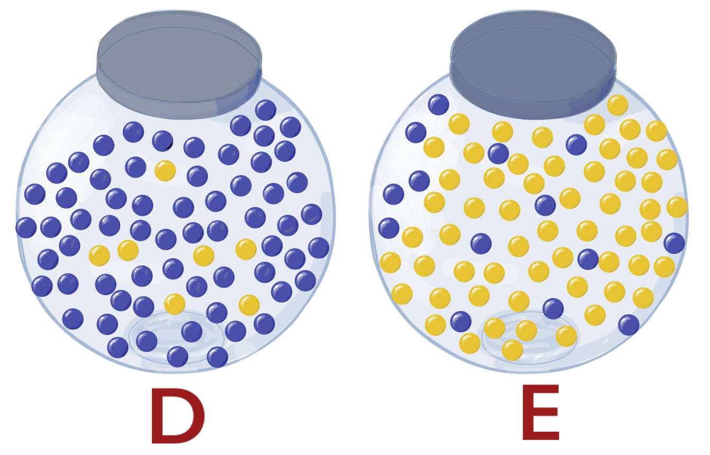

```{r message=FALSE, warning=FALSE, paged.print=FALSE, echo=FALSE, include=FALSE}
# load packages for chapter

options(digits = 10)
library(arrangements)
library(bookdown)
library(kableExtra)
library(knitr)
library(pander)
library(car)
library(tidyr)
library(ggplot2)
library(latex2exp)
library(plotrix)
options(scipen = 999)
```

# Confidence intervals and Hypothesis testing {#chHotest}

## Learning Objectives for Chapter

1. Describe the purpose of hypothesis testing, and in what situation it would be unecessary.  
1. State null and alternative hypotheses in words and equations.
1. Calculate and explain the meaning of level of significance in words and with a graph.
1. Calculate power of a test and explain it with a graph.
1. Calculate and interpret confidence intervals.
1. Describe how sample size and alpha affect CI width. 
1. Perform a simulation to check the correctness of a CI.
1. Explain the difference between a one-tailed and two-tailed test and determine when each one is applicable.
1. Recreate and explain a table showing the outcomes of statistical tests and the types of errors.
1. Test if the mean of a population is equal to a hypothetical mean when variance is known and unknown.

With this chapter we enter the topic of **Inference**. Statistical inference consists of making statements about population characteristics based on information obtained from samples. We aim at presenting a general idea that in order to answer interesting practical questions we need to estimate parameters or other unknown and unknowable quantities, and we need to determine how confident we are about the estimated values. Frequently, the topics of estimation and inference are separated in textbooks, because estimation methods can be treated independently of the statitical distributions of the estimators and associated probabilities. Many important properties of estimators, like expected value and variance, can be worked out without assuming any particular distribution for the random components of models. One estimation method we mentioned before is called *least-squares*, another one is *maximum likelihood*.

The main point of this chapter is to present methods to test hypotheses where unknown parameters, typically the mean of normal distributions are estimated and hypothesized to have specific known values. The mean is unkown so we estimate it with the average of a sample. Using the mathematical "trick" that is the most important equation in this course, we also use a single sample to estimate the sampling variance of the sample average. Armed with a known distribution shape (Normal), an estimate of its mean, and an estimate of the variance of sample average we make inferences about the population. We test hypotheses of specific values of the mean by calculating how likely it would be to observed the data in hand if indeed the hypothesis were true. In later chapters we expand the test to two and then several means.

```{block StatementCertainty, type='stattip'}
- A main goal of statistics is to estimate unknown parameters or quantities and state the estimates anf our degree of certainty about the estimate. Confidence intervals are the primary tool for this and have a simple structure that is the same across apparently diverse statistical tests:

$$CI = \text{estimate} \ \pm \ \text{margin of error}$$

```


## Testing a hypothesis

A **statistical hypothesis** is an assertion made about some parameter or aspect of a population. By testing a statistical hypothesis we are making a statistical inference, which consists of making a statement about population characteristics based on information obtained from samples. Keep in mind that statistics, like science in general, is not meant to lead to "the truth." The scientific method and its direct implementation in statistical inference only allow us to make good guesses about which model of reality is better. Other things being equal, the models that agree more with the data are preferred.

Perfoming a hypothesis test consists of posing a statement about a population parameters or a "model" of some aspect or phenomenon. Then, we gather data and calculate the probability of observing such data under the assumption that the statement or model is true. If the probability is too low, we guess that the statement is not correct, we reject it. Obviously, the whole process is a random process, and we never know for sure if our conclusion is correct or not. We just know that the probability of incorrectly rejecting the statement is low. This is the logic of frequentists hypothesis testing. We will come back to this in more detail.

We insist in the understanding of the logic behind hypothesis testing in an overt attempt to correct the widespread misunderstanding and misuse of hypothesis testing in science. One of the most important points of this chapter is to understand the elogic behind hypothesis testing and to be able to spot its misuse and misinterpretation. Correctly used and interpreted, hypothesis testing can be a useful tool in science and business. First, let's show the mechanics of hypothesis testing. Then we will point out pitfalls and things to watch out for.


The steps involved for conducting a hypothesis test are:

1) State null and alternative hypotheses
2) Set the level of "significance" 
3) Determine/state the decision rule
4) Calculate test-statistic
5) Interpret the decision and state conclusion


### State null and alternative hypotheses

A hypothesis is stated about a population, usually involving a parameter. For example, the mean photosynthetic rate for the non-native eelgrass *Zostera japonica* found on the south side quadrant of Padilla Bay, WA is the same as the mean photosynthetic rate for *Z. japonica* eelgrass found in all quadrants in Padilla Bay. 

In the example above, the null hypothesis states that the mean photosynthetic rate of the eelgrass population in the south quadrant $(\mu_{south})$ is the *same* as the mean photosynthetic rate of the eelgrass population for all quadrants $(\mu_{all})$ (i.e., no difference in photosynthetic rate between the two populations). Thus, the *null hypothesis** states there is no difference between means for the specificed populations. The null hypothesis is denoted as $H_o$. 

The alternative hypothesis for this example would state that the mean photosynthetic rate of the eelgrass population in the south quadrant is *different* than the mean photosynthetic rate of eelgrass found in all quadrants. The alternative hypothesis is denoted $H_a$ 

Null hypothesis: 

$$H_o: \mu_{south} = \mu_{all}$$
Alternative hypothesis:

$$H_a: \mu_{south} \neq \mu_{all}$$
Above, the alternative hypothesis states that the mean photosynthetic rate of the south quadrant population is *not equal* to the mean photosynthetic rate of the all quadrant population. An important aspect of this statement is that it is not specified how the two population means are different. For example, the sample taken $(\mu_{south})$ to test this hypothesis could have a mean that is greater or less than the all quadrant population $(\mu_{all})$. If the goal were to determine if the sample population mean were greater or less than the all quadrant population, this would be referred to as a **one-tailed** test. Since the goal is to just identify if the two population means are different---in some form---than this is referred to as a **two-tailed** test. 

```{block, type = 'stattip'}
- Two-tailed test: 
$$H_o: \mu = \mu_0 \\
H_a: \mu \neq \mu_0$$

- One-tailed test: 
$$H_o: \mu \le \mu_0 \\
H_o: \mu \gt \mu_0$$
$$H_a: \mu < \mu_0$$

- One-tailed test: 
$$H_o: \mu \ge \mu_0 \\
H_o: \mu \lt \mu_0$$
```

### Level of significance

Setting the level of significance $(\alpha)$ determines at what calcualted probability value the null hypothesis is either accpeted or rejected. Setting the level of signficance for the hypothesis before the test is conducted is referred to as *a priori* and a practice intended to prevent implicit bias when drawing conclusions from the hypothesis test. The possible outcomes from a hypothesis test are described in figure (\@ref(fig:Error_table)).  

<br>

```{r Error_table, message=FALSE, warning=FALSE, paged.print=FALSE, out.width = '50%', fig.align='center', echo=FALSE, fig.cap ="Hypothesis test results: type I and type II errors."}

knitr::include_graphics("images/Error_table.pdf")

```

<br>

A *Type I error* is also referred to as a "false positive," and is the probability of rejecting the null hypothesis when it is actually true. Conversley, a *Type II error* is a "false negative," and is the probability of not rejecting the null hypothesis when the alternative hypothesis is true. Based on the level of significance, there will be some degree of probability that which a type I or type II error may occur since there are no absolutes in inferential statistics. 

The probability of making either a type I or type II error can be defined as the power of the statistical test. That is, the **power** of a staistical test is the probability of corrrectly rejecting the null hypothesis when the alternative hypothesis is true.  


```{block, type = 'stattip'}
- In statistics, it is never stated that the null or alternative hypothesis is true. Rather, it is stated that the null hypothesis is rejected or failed to be rejected based on the inferential statistics concluded from the hypothesis test. 

```

<!-- Create figure with changing sample size and variance -->

**Test-statistic**

In order to assess the probability of a statistical test, a test-statistic needs to be calculated. One such test-statistic is the z-statistic (i.e., z-score). When the data are normally distributed, or aprroximately normal given a large sample size (e.g., n >30), the **z-statistic** is, specifically, the number of standard deviations or standard error from the mean value. A z-statistic can be calculated as follws:

$$z = \frac{\bar{x} - \mu}{\sigma / \sqrt{n}}$$
where the calculated *z-statistic* is the the difference between the sample mean $(\bar{x})$ and the known population mean $(\mu)$ over the known population standard deviation divded by the square root of the sample size. If the population variance is unnknown, it can be appoximated from the sample variance and the t-statistic can used to peform the hypothesis test:

$$t = \frac{\bar{x} - \mu}{s / \sqrt{n}}.$$
 
A calculated z-statistic and t-statistic need to be compared against a z-critcal or t-crtical value to determie whether or not the null hypothesis will be rejected or fail to be rejected. Stipulations for calculating a z-statistic are that the populaiton mean and standard deviation need to be known. If these two criteria are not met or the smaple size is small, and the data distribution is approximately normal, a t-statsitic must be calcualted.

The z-critical value is a reference value and dependent on the level of significance (see appendix....), whereas the t-critical value varies with sample size (see appendix... for table). All the z- and t-values are the cumulative probabilites under a normal distribution where the critical values set the threshold of the extreme probabilites of which the result of the hypothesis test can be determined. That is, based on the calculated test-statistics, what is the probability of the calculated values being smaller or greater than the critical values. 

<!-- Figure \@ref(fig:prob_dist) is a visual representation of test-statistic values under a normal distribution.  -->

Another critical component of conducting a hypothesis test is not only comparing sample means and variances, but knowing the confidence in our sample as being representative of the true population parameters. A **confidence interval** is a range values that will encompass the true population parameter within a certain degree of assigned confidence. The confidence level is equalt to 1 - $\alpha$ and can be interpreted as the inverse of the level of significance. On a standard normal distribtuion with \mu = 0 and sigma = 1,  the degree of confidence increases stepwise with sigma. That is, 68%, 95%, and 99% confidence are 1, 2, and 3 standard deviations with a mean of zero (\@ref(fig:CI)).  

<br>

```{r CI, message=FALSE, warning=FALSE, paged.print=FALSE, out.width = '50%', fig.align='center', echo=FALSE, fig.cap ="Confidence intervals 68, 95, and 99 % displayed as one standard deviation apart across a standard normal distribtuion"}

knitr::include_graphics("images/CI.pdf")

```

<br>

For example, if you have known population parameters such as mean and standard deviation (i.e. $\sqrt \sigma^2$) the confidence intervals are calculated:

$$Lower bound = \bar{x} - z* \frac{\sigma}{\sqrt n}$$
$$Upper bound = \bar{x} + z* \frac{\sigma}{\sqrt n}$$
where *z** is the z-critical value, and at 95% confidence, equal to 1.96. 

Say you want to estimate the mean length of the oldest leaf on a seagrass shoot collected from a nearby estuary. You collect 100 samples of seagrass shoots were with a mean length of 30 cm and a standard deviation of 3.2 cm. The confidence interval for these samples can then be calculated: 

$$\pm 1.96*(3.2/10) = 0.63 cm$$

With a lower bound of 29.37 cm and an upper bound of 30.63 cm. The confidence interval when then be stated as *out of 100 samples we are 95% confident that the mean value from 95 of the 100 samples will fall between the lengths of 29.37 and 30.63 cm.

Given the equation above either decreasing the standard deviation or incresing the sample size would lower the confidence bounds and give a narrower range in which the true population mean lies. 

If you have a small sample size  (e.g., <30), you would calculate a confidence interval based on the *t*-critical value which varies based on sample size and level of confidence (see z-table in appendix... ). 

The formula would be the same as above but replacing the *z*-critical value with the *t*-critical value:

$$CI = \bar{x} \pm t* \frac{\sigma}{\sqrt n}$$. 

## Logic of Null Hypothesis test with ANOVA

The logic behind test of null hypothesis is analogous to the following situation. Imagine that there are two jars with blue and yellow marbles. These jars represent the two possible cases: jar "Different" on the left is the case where we have different treatment means, whereas jar "Equal" on the right represents the case where all means are the same. One of the jars is the true situation available to be observed, the jar from which the marbles are selected at random, representing the process of collecting data. However, we do not know which one is being observed. We just know what the jars have inside, which represents the two possible states of reality, means equal or means different. The observation/experimentation process does not allow us to see the "real" jar, but we get a sample of what it has inside. Of course, we can only sample or observe the "real" situation.

On the outside, the jars are identical and you cannot see inside. The "Different" jar has 90% blue marbles, whereas the "Equal" jar has only 20% blue marbles. Suppose that the number of marbles is large enough that the probabilities are not affected by the removal of marbles, or that the marbles are returned to the jar after observing them. Only one jar is available to sample from, depending on whether the true but unknonw means are or are not different, but you do not know which one. You sample 5 marbles and they are all blue. Did you sample from "Different" or "Equal?" The null hypothesis is that the means are equal, which in the analogy signifies that the hypothesis is that we sampled the jar on the right labeled E for "Equal." We cannot know for sure where the marbles came from, because there are both blue and yellow marbles in both jars.

<br>
<br>
```{r jars1, message=FALSE, warning=FALSE, paged.print=FALSE, out.width = '60%', fig.align='center', echo=FALSE, fig.cap ="Representation of the logic of hypothesis testing in frequentist statistics. Jar D on the left represents the situation when means of treatments are different. Jar E on the right represents the situation when means are all equal. Imagine that there is a large number of marbles in each jar or that sampling is done with replacement. Marbles in each jar represent the distribution of the test statistic under each condition. A sample of r = 5 marbles represents the process of experimentation, sampling and calculation of the observed statistic value. Intuitively, if most of the marbles sampled are blue, we will tend to say that the jar sampled was D. As an exercise, design jars with various proportions of colors and see if it becomes easier or harder to guess the sampled jar."}



```
<br>
<br>

Intuition indicates that if most of the marbles are blue, we should reject the null hypothesis, otherwise we fail to reject it. Say that you sample 5 marbles and 4 are blue. The logic of Ho testing would go something like this: "I hypothesize that we sampled the E jar with mostly yellow marbles, but I got 4 blue, and the chances of getting 4 blue marbles from the E jar is very small, so I will guess that in reality I sampled from the D jar. I will guess that the means are different." In the case of the marbles, all parameters of the problem are known, so we can calculate the exact probabilities of making errors. Because sampling is with replacement (or the number of marbles is really large), if the means are all equal, i.e., if we sampled from jar E the probability of getting a blue marble P(blue) in any draw would be constant at 0.20, and the number of blue marbles drawn would have a binomial distribution. Therefore, the probability of getting 4 or more blue marbles from E would be `r round(1 - pbinom(4,5,0.20), 5)`. This is the probability that we reject the null hypothesis while in fact it is true. We can call the number of blue marbles the "decision variable" or sample statistic that we use to determine whether to reject the null hypothesis. The probability of drawing 3 or more blue marbles out of 5 from E is `r round(1 - pbinom(2,5,0.20), 3)`, which is close to the standard $\alpha = 0.05$. Thus, we can say that we will reject the null that we sampled from E if we get 3 or more blue marbles out of 5. In this case, calculating the sample statistic and its sampling distribution is rather simple: to calculate the sample statistic we count the blue marbles, and the number of blue marbles has a binomial distribution.

<br>

```{block, type = 'think'}
The proportion of marbles in the D jar was not used for anything! What if the D jar had just one more blue marble than the E jar??? This is a problem in frequentist hypothesis testing: it does not take into account the sampling distribution of statistics under plausible alternative hypotheses.
```
<br>

In many experiments the response variable of interest is not binary; the variable observed is not like the number of marbles and it does not have a binomial distribution. A slightly more complicated procedure than applying the binomial distribution is used to calculate a statistic (calculated F-value) whose theoretical distribution is known when the null hypothesis is true (F distribution). This procedure is the analysis of variance, and the statistic calculated is the calculated F-value. When all means are the same, the calculated F has an F-distribution defined by certain parameters called "degrees of freedom" that depend on sample size and number of treatments compared.

```{block, type = "stattip"}

LOGIC OF TESTS OF NULL HYPOTHESIS:
IF the assumptions are true, AND the null hypothesis is true,\
THEN the quotient MSTreat/MSE has an F distribution.\
THEREFORE, the probability of a LARGE Fcalc is small.\
SO, if the calculated F is indeed large we doubt (reject) the null hypothesis.\
Essentially, we say that events with low probability did not occur.
```

```{block, type = "stattip"}

- If you try a sufficiently large number of times, any hypothesis, regardless of their truthfulness, will be rejected. When somebody tells you they rejected a hypothesis, make sure to ask how many times they tried. Remember that correctly applied statistical methods will lead to rejection of true null hypothesis with an expected rate of 5 out of 100 tests.

```

<!-- ** Add shiny for students to run simulations of draws from randomly selected urns and the be shown the true urn. Use probabilities such that they can explore both types of errors. Assign homework where they explore the rates of errors as a function sample size and probabilities.** -->


## Theme: compare A and B

See CommonTheme.pdf in Images.

A lot of the course contents can be reduced to comparing two unknown parameters. ANOVA is used when whe have more than one pair of parameters, comparison of two population means is used when we have just two parameters, and a single population test is used when one of the values is a known number. Therefore, the concept of comparing two means generalizes to ANOVA and becomes more specific in one population mean. The equations are all versions of the same general concept: from two random variables (one for each parameter estimate) we build a single random variable (the difference between estimates) and estimate its variance. In all cases the best estimate of the variance of the experimental error is the MSE, the pooled within group variance. The variance of the new single random variable is derived directly from the MSE. For example, in one-population one of the estimated parameters has variance 0 ($\mu$ is known) and there is a single group for the other one, so the MSE is equal to the sample variance, and the variance of the estimated parameter follows direclty from the most important formula for PLS 120, which is simply a rehash of the variance for the sum of independent random variables, where independence is obtained by sampling (assumption).

## Confidence intervals

<!-- Explain why we prefer a 95% CI in the middle instead on both ends of a distribution. -->
<!-- What happens if the distribution is bimodal? Show an example. This counterintuitive example is useful to weed out misconceptions and focus on the real purpose and feasibility of a CI. -->


Example of a published incorrect interpretation of a confidence interval:

"Owing to variation, we know the sample point estimate is not the true population value. Consequently, we add to it a statment indicating how far the point estimate is likely to be from the true value. One way is to supplement the point estimate by interval estimate. We can say, for example, that from the sample evidence we are confident that the number of farmers in Boone County who sprayed was between 345 and 736. By "confident" we mean that the probability is 95 chances in 100 that the interval from 345 to 736 contains the true but unknown number of farmers in Boone County who sprayed."

Correct interptretation of the confidence interval found in another page in the same statistics book:

"When we make a 95% confidence interval statement, the population mean $\mu$ has a fixed but unknown  value. The uncertainty attached to a confidence interval for $\mu$ comes from the variability in the sampling process. We do not know whether the confidence interval constructed from the data from any particular sample includes $\mu$ or not. We do know that in the long run 95% of the intervals will include $\mu$, and similarly, 95% of the statements that "$\mu$ lies between the lower and the upper limit"" will be correct"

Snedecor and Cochran 1989. Statistical Methods. Iowa State University Press, Ames IA.

The main difference that makes the first statement incorrect and the second one correct is that the second statement does not specify the values for the extremes of the confidence interval. Those values will be changing from sample sample. Thus, the probability statement refers to a confidence interval that changes from sample sample, not to a single specific confidence interval. In other words, when we make hundred statement the extremes of the confidence interval change from one statement to the next. In 100 statements we expect to be correct 95 times, but all 100 statements will be different. Notice that the 95% correct rate is expected and may not be realized in any specific set of statements or samples.

<!-- Include simulation or figure with known population parameters. Show 100 Ci's and how they distribute around the known mean. Include a comparison that shows the effect of sample size on the width of the CI's but not on the % correct. This is by design: the width is reduced to maintain the rate of correct statements. -->


## Confidence interval and test of one mean

The test of hypothesis is based on a conditional probability, the probability that the summary statistics or calculated t value is greater than or equal to the one observed, given that the distribution of the observations is normal and independent with mean equal to that hypothesized. For this to make more sense formally we need to distinguish between the random function or variable calculated, call it $s = (\bar{Y} - \mu_0)/S_{\bar{Y}}$ (s for "statistic") and any specific value that it takes for a sample, say $t_{calc}$ (because it is the name we generally use). In symbols:

$$p-value = P(s \ge t_{calc}|X \sim N(\mu_0, \sigma))$$

## What is the meaning of the p-value?

The following video has a brienf description of the historical origin of the p-value. Unfortunately, a scientific culture developed where the p-value lost its original meaning and resulted in one of the major issues in science today.

<a href = "https://player.pbs.org/viralplayer/3010227907/" target="_blank"> Tea and milk</a>

[@Nuzzo2014] stated:

>P values have always had critics. In their almost nine decades of existence, they have been lik- ened to mosquitoes (annoying and impossible to swat away), the emperor’s new clothes (fraught with obvious problems that everyone ignores) and the tool of a “sterile intellectual rake” who ravishes science but leaves it with no progeny. One researcher suggested rechristening the methodology “statistical hypothesis inference testing”, presumably for the acronym it would yield.

```{block, type = 'think'}
Interesting... It looks like we are studying p-values and that they may mean “statistical hypothesis inference testing.” You may think: "I do not have time for this SHI Testing!" but you do. You are traveling the statistical times at an exciting crossroads!
```

Do not confuse the incorrect use of p-values with incorrect p-values. The formal procedures of obtaining and interpreting p-values are correct. P-values in themselves are not flawed, except that they are used in ways that are not correct. A culture developed in which "statistical significance with p = 0.05"" took a life of its own. Data are analyzed with intention to achieve this false icon, and in doing so, scientists invalidate the p-value. How should p-value be used then??


>Informally, a p-value is the probability under a specified statistical model that a statistical summary of the data (e.g., the sample mean difference between two compared groups) would be equal to or more extreme than its observed value.
>
> [@WassersteinLazar2016]

## Types of Errors in Hypothesis testing

```{block, type = 'stattip'}
- Even when everything is done correctly and assumptions are met, we are expected to make errors in hypothesis testing. We will reject true null hypothesis and fail to reject false ones. Statistics gives us methods to estimate and set the approximate rates at which we makes different types of mistakes. If assumptions are not valid, or methods are applied incorrectly we will make mistakes with unknown frequency.
```

## Pitfalls to avoid

Avoid the following statements or concepts:

"The probability that the null hypothesis is correct is 0.95."

"We accept the null hypothesis."

"There is a statistically significant difference, therefore there is something interesting and important to discuss and or report."

## Facts to remember

- Any null hypothesis will be rejected if it is tested enough times, because there are always samples for which the null is rejected. Cure: look at all studies done, not just those published, which are heavily biased towards significance. At least, look at many published studies. Publish negative results. Publish data.

- With enough sample size almost any null hypothesis of equality will be rejected, because no two parts of the world are exactly the same. Of course, if we sample exactly the same population, then we will not reject $H_0$. Cure: Test whether differences are greater than a value that has practical, theoretical or biological significance.

- Originally, statistical significance was designed to be an indicator that there was probably something interesting warranting further investigation. Statistical significance was the start of the work, not the end. Cure: Value and promote replication of experiments in multiple labs.

- Data are fact, except for errors of measurement or transcription. Interpretations and models are ephemeral; they can be disproved and improved.

## Exercises and Solutions

Exercises for lecture

Generate a random sample from the same population for each student and have them test the null hypothesis that the mean is equal to the true value. Count how many people reject the true null.

Generate a random sample from the same population for each student and have them test the null hypothesis that the mean is equal to the true value + $\delta$. Count how many people reject the true null. Then, make a graph on the board showing the proportion of students that rejected Ho as delta increases. What should the graph look like? Plot against the theoretical t-distribution.


## Homework

## Laboratory Exercises

### Plant Sciences Lab

"---" Unquote the three dashes
Title: "Normal distribution, T-distribution, Confidence Intervals, and One-sample Hypothesis testing"
author: "YourFirstName YourLastName"
date: "today's date here"
output: html_document
"---" Unquote the three dashes

### Instructions

For this lab you will modify and submit this file with the file name changed so it has your email ID (the part before @) in lower case instead of "email." Do not add spaces to the file name.

This is a markdown document. You will type your code and run it one line at a time as you add it in the lines indicated below. Add code **ONLY** in the areas between "\```{r}" and "\```". These areas are highlighted with a light grey color. Run each line and part to learn and experiment until you get the result you want. Keep the lines that worked and move on. At any time you can see if your document "knits" or not by clicking on the Knit HTML icon at the top. Once you have completed all work, knit your document and save the html file produced with the same filename but with an html extension (Lab02email.html).

**Submit BOTH files for your lab report using the appropriate Canvas tool**

For each part and question below, type your code in the grey area below, between the sets of back-ticks (```) to perform the desired computation and get output. Type your answers below the corresponding grey area. 

```{r setup1, include=FALSE}

knitr::opts_chunk$set(echo = TRUE)

```


### Part 1. Normal Distribution R functions [10 points]

Normal Distribution

A statistical distribution is a function that associates a probability to results of random experiments. For example, the random experiment can be the flip of a coin. Let's "measure" the result by assigning 1 to a tail and 0 to a head. The result is a discrete random variable Y that can take values 0 or 1. The statistical distribution, in this case a Probability Mass Function (pmf), is a function that associates a probability to each value of Y. For the example of the coin, we usually pick a function defined as follows: P(Y = 1) = P(Y = 0) = 0.5. This read as "the probability of Y taking a value of 1 is equal to the probability of Y taking a value of 0 and is equal to 0.5." Keep in mind that the actual pmf can and probably does differ for different individual coins. For an extreme example, remember that for a coin with two heads P(Y = 1) = 0 and P(Y = 0) = 1.0. The probability for the real coin experiment also depends on who flips the coin. It is possible to learn to get any side of the coin one wants.

For continuous random variables we have statistical distributions that are called "Probability Density Functions" for which the probability of any specific number is 0, but the probability of getting a number in any interval, no matter how small, can be positive. The Normal distribution is one of those pdf's that is most used in statistics for many reasons. In this section we will explore and operate with the Normal distribution.

In the R code section below, we will read the help for "Normal" and list the functions that are explained there. Set the seed of random numbers to 39 so everyone gets the same random numbers. Create a vector called “Y5” containing 5 random numbers from the standard normal distribution using the “rnorm()” function. In the “rnorm()” function, give values to arguments called q, p, n, mean and sd by using their names as shown in the **Usage** part of the help.  For example, rnorm(n = 5, mean = 0, sd = 1). Calculate the sample variance of Y5. Now, set the seed to 57 and create a new vector called “Y50” containing 50 random numbers from the standard normal distribution. Calculate the sample variance of Y50. Compare the variances. Is the relationship of the sample variances what you should have expected? What is the true variance of the populations from which you obtained the samples? Why do the calculated variances differ? 

```{r}
help("Normal")
# Note, dnorm gives the probability density, pnorm gives the probability distribution function, qnorm gives the quantile function, and rnorm generates random values from the distribution.

set.seed(39)

# obtain 5 random numbers from the standard normal distribution and put into Y5
Y5 <- rnorm(n = 5, 
            mean = 0, 
            sd = 1) 

# obtain 50 random numbers
Y50 <- rnorm(n = 50, 
             mean = 0, 
             sd = 1) # obtain 50 random numbers

# obtain the variances
(var5 <- var(Y5))
(var50 <- var(Y50)) 
```

Is the relationship of the sample variances what you should have expected? What is the true variance of the populations from which you obtained the samples? Why do the calculated variances differ?
Answers here: 


### Part 2. Normal PDF [10  points]

Plot the pdf for a standard normal distribution. Modify the code and produce a graph of the pdf for a normal distribution with mean = 2 and sd = 0.7. 

```{r}
# This plots the standard normal distribution.

plot(function(x) dnorm(x, mean = 0, sd = 1), 
     xlim = c(-5,5), 
     ylim = c(0, 0.5)) 

#Modify for mean = 2, sd = 0.7:

plot(function(x) dnorm(x, mean = 2, sd = 0.7), 
     xlim = c(-5,5), 
     ylim = c(0, 0.6)) 

```


### Part 3. Students's t Distribution [20 points]

When your sample size is small, and the true population standard deviation is unknown for a continuous probability distribution that you assume is normal, we use the t distribution instead.  

```{r}

#plot t distribution with 100 degrees of freedom

plot(function(x) dt(x, df = 100), 
     xlim = c(-5,5), 
     ylim = c(0, 0.6)) 

#note the arguments “xlim” and “ylim” set the axis boundaries for the plot

```

Confidence interval from the t distribution, in relation to alpha level: Use R to determine the sample size (n), mean, standard deviation, standard error, and 95% (alpha = 0.05) confidence interval (CI) for sepal length for the iris data. Then calculate the confidence intervals at the
alpha levels of 0.10 (90% CI) and .01 (99% CI).

```{r iris.info, echo = TRUE, include = TRUE}

myiris <- iris  #import the iris data into a data frame called myiris

str(myiris) # see components and types of iris

myiris.sl <- myiris$Sepal.Length  # Create sepal length vector

myiris.n <- length(myiris.sl)  # get sample size

myiris.mean <- mean(myiris.sl) # get mean

myiris.sd <- sd(myiris.sl) # complete the code to get standard deviation
  
myiris.se <- myiris.sd/sqrt(myiris.n) # get standard error

#add code below to get information on the qt() function, which is for the t distribution:

#*DELETE THIS AND ADD CODE HERE*
 help(qt)

#Confidence interval
(df <- myiris.n - 1) # get degrees of freedom

alpha95 <- 0.05 # set the alpha level to 0.05 (95% CI)

(t.crit95 <- qt(1 - alpha95/2 , df))  # critical t value at 95% quantile under this degree of freedom

(LB95 <- myiris.mean - myiris.se * t.crit95) # lower bound of the 95% confidence interval

(UB95 <- myiris.mean + myiris.se * t.crit95) # upper bound of the 95% confidence interval


library(plotrix) ## needed for plotCI() function

# The text() function adds text to the plot you just printed. 
# You have to run all relevant lines at once or else you will 
# get an error. Highlight and run plotCI() and text() together to avoid this error.  

plotCI(x = myiris.mean, 
       uiw = myiris.se * t.crit95, 
       pch = 19, 
       xlim = c(0.9, 1.1), 
       ylim = c(5.5, 6.2), 
       ylab = "Sepal Length", 
       xlab = "", 
       xaxt = 'n', 
       main = "95% CI") ## plots the mean and 95% CI interval

text(x = 1.05, 
     y = UB95, 
     labels = "Upper 95% CL")
### add labels to "mean" and "Lower 95% CL"###

text(x = 1.05, 
     y = LB95, 
     labels = "Lower 95% CL")
text(x = 1.05, 
     y = myiris.mean, 
     labels = "Mean")


### Calculate the CI for alpha level 0.10 (90% CI) and plot

# First the 90% CI

alpha90 <- 0.10  # set the alpha level to 0.10 (90% CI)

(t.crit90 <- qt(1 - alpha90/2 , df)) # Fill in missing code to get critical t value at 90% quantile under this degree of freedom

(LB90 <- myiris.mean - myiris.se * t.crit90 ) # fill in missing code to get lower bound of the 90% confidence interval

(UB90 <- myiris.mean + myiris.se * t.crit90) 

## plot both CIs in one plot - just run, all code is complete
x <- c(myiris.mean, myiris.mean)

uiws1 <- c(myiris.se * t.crit90, myiris.se * t.crit95)   #confidence interval widths

#if you run plotCI(...) and text(...) separately you will get an error.  Highlight plotCI(...) and text(...) together to avoid error.  

plotCI(x = x, 
       uiw = uiws1, 
       pch = 19, 
       xlim = c(0, 3), 
       ylim = c(5.5, 6.2), 
       ylab = "Sepal Length", 
       xlab = "", 
       xaxt = "n", 
       main = "90%, 
95% CIs")

text(1, 5.6, "90% CI")

text(2, 5.6, "95% CI")

```

**Explain why the CI widths are different - what do the error bars represent?  


### Part 4. Effect of sample size on CI width [20 points]
Confidence interval in relation to sample size: Use R to determine the mean, standard deviation, standard error, and 95% confidence interval (CI) for sepal length for varying sample sizes (n = 50, 150) in the iris data.

```{r}

alpha <- 0.05   # set alpha at a 95% CI

myiris150 <- myiris$Sepal.Length

# Calculate the 95% confidence interval for n = 150:

myiris150.n <- length(myiris150)  # get sample size

myiris150.mean <- mean(myiris150) # get mean

myiris150.sd <- sd(myiris150) # get standard deviation

myiris150.se <- myiris150.sd/sqrt(myiris150.n) # get standard error

df150 <- myiris150.n - 1 # degrees of freedom

t.crit150 <- qt(1 - alpha/2, df150) # t critical value at 95% quantile under this degree of freedom

LB150 <- myiris150.mean - myiris150.se * t.crit150 # lower bound of the confidence interval

#Complete code for the upper bound of the confidence interval:

#*DELETE THIS AND ADD CODE HERE*
UB150 <- myiris150.mean + myiris150.se * t.crit150


#Sample randomly from entire myiris data set of n = 150 to get a subset of 50 for sepal length:

myiris50 <- myiris$Sepal.Length[sample(1:150,50)]

# Calculate the 95% confidence interval for 50 observations:

myiris50.n <- length(myiris50) #get sample size

myiris50.mean <- mean(myiris50) # get mean

myiris50.sd <- sd(myiris50) # get standard deviation

myiris50.se <- myiris50.sd/sqrt(myiris50.n) # get standard error

df50 <- myiris50.n - 1 # degrees of freedom

t.crit50 <- qt(1 - alpha/2 , df50)   #critical value at 95% quantile under this degree of freedom

LB50 <- myiris50.mean - myiris50.se * t.crit50 #lower bound of the confidence interval 

UB50 <- myiris50.mean + myiris50.se * t.crit50 #upper bound of the confidence interval

## plot the means and 95% CIs for n = 50, 150

x <- c(myiris50.mean, 
       myiris150.mean)

uiws2 <- c(myiris50.se * t.crit50, 
           myiris150.se * t.crit150)

plotCI(x = x, 
       uiw = uiws2, 
       pch = 19, 
       xlim = c(0.5 , 2.5), 
       ylim = c(5.4, 6.1), 
       ylab = "Sepal Length", 
       xlab = "", 
       xaxt = "n")

text(1, 5.45, "n = 50")

text(2, 5.45, "n = 150")    

```	


* Why are the intervals different widths now?  Explain in terms of how changing the sample size changes se and critical t.


### Part 5. Interpretation of the CI [10 points]
Express in words the meaning of the confidence intervals for sepal length at an alpha = 0.05.


### Part 6. Test of null hypothesis [20 points]	

Using the statistics calculated in the above section, perform tests of hypotheses to determine if the population from which the samples were taken could have the following means:

a) Average of Sepal.Length in setosa species = 5.84 (alpha 0.05, 0.10)
b) Average of Sepal.Length for all species equal to 5.84 (N=50, 150, alpha= 0.05)
In 4a-4b, use both the t statistic and confidence interval to perform your tests of hypothesis. Discuss your results and state (i) the null and alternate hypotheses, (ii) the decision rule (α) and test statistic, (iii) the final statistical decision, and conclusion. 

```{r}
# a)  One-sample t test on setosa species

myiris.set <- myiris$Sepal.Length[myiris$Species == "setosa"] # get a vector of just the sepal lengths for the setosa species

myiris.set.n <- length(myiris.set)  # get sample size

myiris.set.mean <- mean(myiris.set) # get mean

myiris.set.sd <- sd(myiris.set) # get standard deviation

myiris.set.se <- myiris.set.sd/sqrt(myiris.set.n)

df.set <- myiris.set.n - 1

(tstar <- abs((myiris.set.mean - 5.84) / myiris.set.se     )) # complete code to get your sample t value. Note the abs() function

alpha95 <- 0.05

(t.crit95 <- qt(1 - alpha95/2 , df.set))  # critical value at 95% quantile under this degree of freedom #critical value at 95% quantile under this degree of freedom

tstar > t.crit95 # logical query; if your sample test statistic is greater than the critical t value at your chosen alpha level, then you reject the null hypothesis that the population mean of sepal length is equal to 5.84

# If result is TRUE, then we reject the null hypothesis; i.e. the means are different at the alpha level of 0.05. There is still a <5% probability we would sample a mean of 5.006 (the mean of the setosa species) when the true population  mean is 5.84.
# If result is FALSE, then we cannot reject the null hypothesis; i.e. the means of the setosa species and the total data set are the same.  


#plot the t distribution and the test and critical t values

plot(function(x) dt(x, df = df.set), xlim = c(-5,16), ylim = c(0, 0.5))

points(x = tstar, y = 0, pch = 24, bg = "blue")

points(x = t.crit95, y = 0, pch = 24, bg = "red")

## Using pt() function

2 * (1 - pt(tstar, df.set))

t.test(myiris.set, mu = 5.84) # Ho: mean = 5.84

# Type your code to do t tests with an alpha level of 0.10. Use the test statistic, the critical t, and the p value to explain the results.  


alpha90 <- 0.1

(t.crit90 <- qt(1 - alpha90/2 , df.set))


```

Discuss your results and state (i) the null and alternate hypotheses, (ii) the decision rule (α) and test statistic, (iii) the final statistical decision, and conclusion (answer here):
Alpha = 95%:
(i)

(ii)

(iii)


Alpha = 90%:
(i)

(ii)

(iii)


```{r}
# b) One sample t test for all species, at the 95% CI, but varying sample sizes

t.test(myiris.sl, mu = 5.84) ## fill in code to do a one sample t test on all 150 observations

#Type your code in to do t tests on a sample size of 50 (In Part 2, we already created a data object for this sample size).

alpha90 <- 0.10

t.test(myiris50, mu = 5.84, conf.level = 0.95) 
```

Discuss your results and state (i) the null and alternate hypotheses, (ii) the decision rule (α) and test statistic, (iii) the final statistical decision, and conclusion (answer here):
Sample size of 150:
(i)

(ii)

(iii)


Sample size of 50:
(i)

(ii)

(iii)


Were the results what you expected for (a) and (b)?  Why or why not? (answer here):


### Part 7. Knit report [10 points]

Knit this file into html. [10 points]


<!-- ###---------------END PLANT SCIENCES LAB-----------------### -->

### Animal Sciences Lab

"---" Unquote the three dashes
Title: "Normal distribution, T-distribution, Confidence Intervals, and One-sample Hypothesis testing"
author: "YourFirstName YourLastName"
date: "today's date here"
output: html_document
"---" Unquote the three dashes

### Instructions

For this lab you will modify this file and submit this file with the file name changed so it has your email ID (the part before @) in lower case instead of "email." Do not add spaces to the file name.

This is a markdown document. You will type your code and run it one line at a time as you add it in the lines indicated below. Add code **ONLY** in the areas between "\```{r}" and "\```". These areas are highlighted with a light grey color. Run each line and part to learn and experiment until you get the result you want. Keep the lines that worked and move on. At any time you can see if your document "knits" or not by clicking on the Knit HTML icon at the top. Once you have completed all work, knit your document and save the html file produced with the same filename but with an html extension (Lab02email.html).

**Submit BOTH files for your lab report using the appropriate Canvas tool**

For each part and question below, type your code in the grey area below, between the sets of back-ticks (```) to perform the desired computation and get output. Type your answers below the corresponding grey area. 

```{r setup, include=FALSE}

knitr::opts_chunk$set(echo = TRUE)

```
### Normal Distribution Part 1. [10 points]

Normal Distribution

A statistical distribution is a function that associates a probability to results of random experiments. For example, the random experiment can be the flip of a coin. Let's "measure" the result by assigning 1 to a tail and 0 to a head. The result is a discrete random variable Y that can take values 0 or 1. The statistical distribution, in this case a Probability Mass Function (pmf), is a function that associates a probability to each value of Y. For the example of the coin, we usually pick a function defined as follows: P(Y = 1) = P(Y = 0) = 0.5. This read as "the probability of Y taking a value of 1 is equal to the probability of Y taking a value of 0 and is equal to 0.5." Keep in mind that the actual pmf can and probably does differ for different individual coins. For an extreme example, remember that for a coin with two heads P(Y = 1) = 0 and P(Y = 0) = 1.0. The probability for the real coin experiment also depends on who flips the coin. It is possible to learn to get any side of the coin one wants.

For continuous random variables we have statistical distributions that are called "Probability Density Functions" for which the probability of any specific number is 0, but the probability of getting a number in any interval, no matter how small, can be positive. The Normal distribution is one of those pdf's that is most used in statistics for many reasons. In this section we will explore and operate with the Normal distribution.

In the R code section below, we will read the help for "Normal" and list the functions that are explained there. Set the seed of random numbers to 39 so everyone gets the same random numbers. Create a vector called “Y5” containing 5 random numbers from the standard normal distribution using the “rnorm()” function. In the “rnorm()” function, give values to arguments called q, p, n, mean and sd by using their names as shown in the **Usage** part of the help.  For example, rnorm(n = 5, mean = 0, sd = 1). Calculate the sample variance of Y5. Now, set the seed to 57 and create a new vector called “Y50” containing 50 random numbers from the standard normal distribution. Calculate the sample variance of Y50. Compare the variances. Is the relationship of the sample variances what you should have expected? What is the true variance of the populations from which you obtained the samples? Why do the calculated variances differ? 

```{r}
help("Normal")
#Note, dnorm gives the probability density, pnorm gives the probability distribution function, qnorm gives the quantile function, and rnorm generates random values from the distribution.

set.seed(39)

# obtain 5 random numbers from the standard normal distribution and put into Y5
Y5 <- rnorm(n = 5, 
            mean = 0, 
            sd = 1) 

# obtain 50 random numbers
Y50 <- rnorm(n=50, 
             mean = 0, 
             sd = 1) # obtain 50 random numbers

#obtain the variances
(var5 <- var(Y5))
(var50 <- var(Y50)) 
```

Is the relationship of the sample variances what you should have expected? What is the true variance of the populations from which you obtained the samples? Why do the calculated variances differ?
Answers here: 


#### Normal Distribution Part 2  [10  points]

Plot the pdf for a standard normal distribution. Modify the code and produce a graph of the pdf for a normal distribution with mean = 2 and sd = 0.7. 

```{r}
# This plots the standard normal distribution.

plot(function(x) dnorm(x, mean = 0, sd = 1), 
     xlim = c(-5,5), 
     ylim = c(0, 0.5)) 

#Modify for mean = 2, sd = 0.7:

plot(function(x) dnorm(x, mean = 2, sd = 0.7), 
     xlim = c(-5,5), 
     ylim = c(0, 0.6)) 

```

### Student's t distribution Part 1 [20 points]

When your sample size is small, and the true population standard deviation is unknown for a continuous probability distribution that you assume is normal, we use the t distribution instead.  

```{r}

#plot t distribution with 100 degrees of freedom

plot(function(x) dt(x, df = 100), 
     xlim = c(-5,5), 
     ylim = c(0, 0.6)) 

#note the arguments “xlim” and “ylim” set the axis boundaries for the plot

```

Confidence interval from the t distribution, in relation to alpha level: Use R to determine the sample size (n), mean, standard deviation, standard error, and 95% (alpha = 0.05) confidence interval (CI) for wean weight for the heifer data. Then calculate the confidence intervals at the
alpha levels of 0.10 (90% CI) and .01 (99% CI).

```{r myheifer.info, echo = TRUE, include = TRUE}

# import the heifer data into a data frame called myheifer
myheifer <- read.table('Datasets/Lab02HeiferData.csv', header = TRUE, sep = ',')

str(myheifer) # see components of heifer data

myheifer.sl <- myheifer$Wean_weight  # Create Wean weight vector

myheifer.n <- length(myheifer.sl)  # get sample size

myheifer.mean <- mean(myheifer.sl) # get mean

myheifer.sd <-  sd(myheifer.sl) # complete the code to get standard deviation
  
myheifer.se <- myheifer.sd/sqrt(myheifer.n) # get standard error

#add code below to get information on the qt() function, which is for the t distribution:

#*DELETE THIS AND ADD CODE HERE*
 help(qt)  

#Confidence interval
(df <- myheifer.n - 1) # get degrees of freedom

alpha95 <- 0.05 # set the alpha level to 0.05 (95% CI)

(t.crit95 <- qt(1 - alpha95/2 , df))  # critical t value at 95% quantile under this degree of freedom

(LB95 <- myheifer.mean - myheifer.se * t.crit95) # lower bound of the 95% confidence interval

(UB95 <- myheifer.mean + myheifer.se * t.crit95) # upper bound of the 95% confidence interval


library(plotrix) ## needed for plotCI() function

# The text() function adds text to the plot you just printed.  In Rmarkdown, you have to run all relevant lines at once or else you will get an error. Highlight and run plotCI() and text() together to avoid this error.  

plotCI(x = myheifer.mean, 
       uiw = myheifer.se * t.crit95, 
       pch = 19, 
       xlim = c(0.9, 1.1), 
       ylim = c(508, 540), 
       ylab = "Wean Weight", 
       xlab = "", 
       xaxt = 'n', 
       main = "95% CI") ## plots the mean and 95% CI interval

text(x = 1.05, 
     y = UB95, 
     labels = "Upper 95% CL")
### add labels to "mean" and "Lower 95% CL"###
text(x = 1.05, 
     y = LB95, 
     labels = "Lower 95% CL")
text(x = 1.05, 
     y = myheifer.mean, 
     labels = "Mean")


### Calculate the CI for alpha level 0.10 (90% CI) and plot

# First the 90% CI

alpha90 <- 0.10  # set the alpha level to 0.10 (90% CI)

(t.crit90 <- qt(1 - alpha90/2  , df)) # Fill in missing code to get critical t value at 90% quantile under this degree of freedom

(LB90 <- myheifer.mean - myheifer.se * t.crit90 ) # fill in missing code to get lower bound of the 90% confidence interval

(UB90 <- myheifer.mean + myheifer.se * t.crit90) 

## plot both CIs in one plot - just run, all code is complete
x <- c(myheifer.mean, myheifer.mean)

uiws1 <- c(myheifer.se * t.crit90, myheifer.se * t.crit95)   #confidence interval widths

#if you run plotCI(...) and text(...) separately you will get an error.  Highlight plotCI(...) and text(...) together to avoid error.  

plotCI(x = x, 
       uiw = uiws1, 
       pch = 19, 
       xlim = c(0, 3), 
       ylim = c(505, 535), 
       ylab = "Wean Weight", 
       xlab = "", 
       xaxt = "n", 
       main = "90%, 
95% CIs")

text(1, 506, "90% CI")

text(2, 506, "95% CI")

```

**Explain why the CI widths are different - what do the error bars represent?  


### Student's t distribution Part 2. [20 points]
Confidence interval in relation to sample size: Use R to determine the mean, standard deviation, standard error, and 95% confidence interval (CI) for wean weight for varying sample sizes (n = 50, 150) in the heifer data.

```{r}

alpha <- 0.05   # set alpha at a 95% CI

myheifer150 <- myheifer$Wean_weight

# Calculate the 95% confidence interval for n = 150:

myheifer150.n <- length(myheifer150)  # get sample size

myheifer150.mean <- mean(myheifer150) # get mean

myheifer150.sd <- sd(myheifer150) # get standard deviation

myheifer150.se <- myheifer150.sd/sqrt(myheifer150.n) # get standard error

df150 <- myheifer150.n - 1 # degrees of freedom

t.crit150 <- qt(1 - alpha/2, df150) # t critical value at 95% quantile under this degree of freedom

LB150 <- myheifer150.mean - myheifer150.se * t.crit150 # lower bound of the confidence interval

#Complete code for the upper bound of the confidence interval:

#*DELETE THIS AND ADD CODE HERE*
UB150 <- myheifer150.mean + myheifer150.se * t.crit150 

#Sample randomly from entire myheifer data set of n = 150 to get a subset of 50 for Wean_weight:

myheifer50 <- myheifer$Wean_weight[sample(1:150,50)]

# Calculate the 95% confidence interval for 50 observations:

myheifer50.n <- length(myheifer50) #get sample size

myheifer50.mean <- mean(myheifer50) # get mean

myheifer50.sd <- sd(myheifer50) # get standard deviation

myheifer50.se <- myheifer50.sd/sqrt(myheifer50.n) # get standard error

df50 <- myheifer50.n - 1 # degrees of freedom

t.crit50 <- qt(1 - alpha/2 , df50)   #critical value at 95% quantile under this degree of freedom

LB50 <- myheifer50.mean - myheifer50.se * t.crit50 #lower bound of the confidence interval 

UB50 <- myheifer50.mean + myheifer50.se * t.crit50 #upper bound of the confidence interval

## plot the means and 95% CIs for n = 50, 150

x <- c(myheifer50.mean, 
       myheifer150.mean)

uiws2 <- c(myheifer50.se * t.crit50, 
           myheifer150.se * t.crit150)

plotCI(x = x, 
       uiw = uiws2, 
       pch = 19, 
       xlim = c(0.5 , 2.5), 
       ylim = c(475, 550),
       ylab = "Wean Weight", 
       xlab = "", 
       xaxt = "n")

text(1, 476, "n = 50")

text(2, 476, "n = 150")    

```	


* Why are the intervals different widths now?  Explain in terms of how changing the sample size changes se and critical t.


### Student's t distribution Part 3 [10 points]
Express in words the meaning of the confidence intervals for wean weight at an alpha = 0.05.


### Student's t distribution Part 4 [20 points]	

Using the statistics calculated in the above section, perform tests of hypotheses to determine if the population from which the samples were taken could have the following means:

a) Average Wean_weight of heifers born in 2005 = 521.9 (alpha 0.05, 0.10)
b) Average of Wean_weight for all heifers equal to 521.9 (N=50, 150, alpha= 0.05)
In 4a-4b, use both the t statistic and confidence interval to perform your tests of hypothesis. Discuss your results and state (i) the null and alternate hypotheses, (ii) the decision rule (α) and test statistic, (iii) the final statistical decision, and conclusion. 

```{r}
# a)  One-sample t test on heifer wean weight

myheifer.set <- myheifer$Wean_weight[myheifer$Year == "2005"] # get a vector of the wean weight for the heifers born in 2005 

myheifer.set.n <- length(myheifer.set)  # get sample size

myheifer.set.mean <- mean(myheifer.set) # get mean

myheifer.set.sd <- sd(myheifer.set) # get standard deviation

myheifer.set.se <- myheifer.set.sd/sqrt(myheifer.set.n)

df.set <- myheifer.set.n - 1

(tstar <- abs((myheifer.set.mean - 521.9) / myheifer.set.se  )) # complete code to get your sample t value. Note the abs() function

alpha95 <- 0.05

(t.crit95 <- qt(1 - alpha95/2 , df.set))  # critical value at 95% quantile under this degree of freedom #critical value at 95% quantile under this degree of freedom

tstar > t.crit95 # logical query; if your sample test statistic is greater than the critical t value at your chosen alpha level, then you reject the null hypothesis that the population mean of heifer wean weight is equal to 521.9

# If result is TRUE, then we reject the null hypothesis; i.e. the means are different at the alpha level of 0.05. There is still a <5% probability we would sample a mean of 542.38 (the mean of heifer wean weight in 2005) when the true population  mean is 521.9.
# If result is FALSE, then we cannot reject the null hypothesis; i.e. the means of the wean weight in 2005 and the total data set are the same.  


#plot the t distribution and the test and critical t values

plot(function(x) dt(x, df = df.set), xlim = c(-5,16), ylim = c(0, 0.5))

points(x = tstar, y = 0, pch = 24, bg = "blue")

points(x = t.crit95, y = 0, pch = 24, bg = "red")

## Using pt() function

2 * (1 - pt(tstar, df.set))

t.test(myheifer.set, mu = 521.9) # Ho: mean = 532.4

# Type your code to do t tests with an alpha level of 0.10. Use the test statistic, the critical t, and the p value to explain the results.  

alpha90 <- 0.1

(t.crit90 <- qt(1 - alpha90/2 , df.set))


```

Discuss your results and state (i) the null and alternate hypotheses, (ii) the decision rule (α) and test statistic, (iii) the final statistical decision, and conclusion (answer here):
Alpha = 95%:
(i)

(ii)

(iii)


Alpha = 90%:
(i)

(ii)

(iii)


```{r}
# b) One sample t test for all years, at the 95% CI, but varying sample sizes

t.test(myheifer.sl, mu = 521.9, conf.level = 0.95) ## fill in code to do a one sample t test on all 150 observations

#Type your code in to do t tests on a sample size of 50 (In Part 2, we already created a data object for this sample size).

t.test(myheifer50, mu = 521.9, conf.level = 0.95)

```

Discuss your results and state (i) the null and alternate hypotheses, (ii) the decision rule (α) and test statistic, (iii) the final statistical decision, and conclusion (answer here):
Sample size of 150:
(i)

(ii)

(iii)


Sample size of 50:
(i)

(ii)

(iii)


Were the results what you expected for (a) and (b)?  Why or why not? (answer here):


### Student's t distribution Part 5.  [10 points]

Knit this file into html. [10 points]


