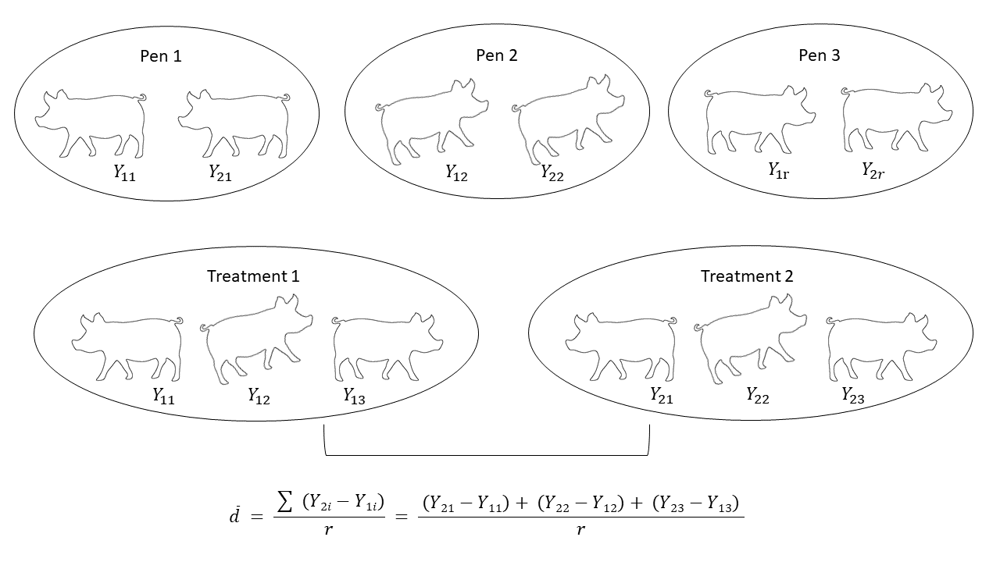

```{r setup0, include=FALSE}
knitr::opts_chunk$set(echo = TRUE)
```

```{r message=FALSE, warning=FALSE, paged.print=FALSE, echo=FALSE, include=FALSE}
# load packages for chapter

options(digits = 10)
library(bookdown)
library(emmeans)
library(ggplot2)
library(dplyr)
library(kableExtra)
library(knitr)
library(tables)
library(plyr)
library(pander)
library(multcomp)
library(agricolae)
library(nlme)
library(car)
library(tidyr)
library(latex2exp)

```

# Two Populations Means {#ch2pops}

## Learning Objectives for Chapter {#LearnObj8}

1. Compare two population means based on two samples
1. Determine if samples are paired or unpaired ("independent") when comparing two means
1. State the null and alternative hypothesis for a two sample t-test 
1. Calculate the sample averages and the difference of the sample averages
1. Perform an F-test of homogeneity of variance by calculating sample variances, and determine if you can "pool" the sample variances
1. Calculate the standard error of the difference
1. Describe the three cases for comparing two populations means and determine when each one is appropriate
1. Calculate the t-statistic and identify the appropriate critical t-value
1. After performing a two sample t test, sketch the t distribution, with the following parts labeled: 
  - the critical t value
  - the test statistic
  - the p value area under the curve.
  - the alpha level area under the curve. 
  - where the CI bounds would lie on the X axis (approximately)
1. Interpret the results of a t-test in terms of the original scientific question

## Two Populations 

We have learned in the previous chapters how to determine if a sample is significantly different from the population it belongs to.  However, researchers may want to know if two populations are significantly different from each other.  In research experiments, populations are considered distinct when there are unique treatments that are applied to them.  For example, one could conduct an experiment comparing a fertilized field to an unfertilized field to determine a significant difference in yield, or an experiment comparing a high-carbohydrate diet to a high-protein diet to determine a significant difference in milk quality among cows.  These experiments are conducted by taking samples from each of the populations and using the difference between the two samples to make inferences about the difference between the two treatments or the two populations.  


```{block, type = 'stattip'}
# Steps to Test Two Population Means
1. State the null and alternative hypotheses for the two populations

2. Collect samples from each population

3. Calculate the sample averages, $\bar{Y}_1$ and $\bar{Y}_2$, the difference of the averages,$\bar{d}$, and the sample variances, $S^2_1$ and $S^2_2$

4. If you do not know if the two population variances are equal, $\sigma_1 = \sigma_2$, perform an F-test to determine if you can pool the sample variances. 

5. Calculate the standard error of the difference, $S_{\bar{d}}$, between the two samples (**it is important to identify the appropriate Case equations to use in this step**)

6. Calculate the t-statistic using the calculated $\bar{d}$ and $S_{\bar{d}}$

7. Compare the calculated t-statistic to the critical t-value, and decide to reject or fail to reject the null hypothesis
```


## Hypothesis Testing

Before all the calculations have begun, it is important to understand the scientific question being asked.  The purpose of testing two population means is to understand if there is a statistically significant difference between these two populations or two treatments.  Thus, our null  hypothesis and alternative hypothesis can be stated, respectively, as 

$$\text{Null hypothesis: the mean of population 1 is equal to the mean of population 2, or that there is no difference between the two population means} \\[15pt]$$
$$H_0 : \mu_1 = \mu_2 \quad \text{or} \quad \mu_{\bar{d}} = 0$$

$$\text{Alternative hypothesis: the mean of population 1 is not equal to the mean of population 2, or that there is a difference between the two population means} \\[15pt]$$
$$H_1 : \mu_1 \neq \mu_2 \quad \text{or}  \quad \mu_{\bar{d}} \neq 0$$


## Sampling Methods

There are two different methods of sampling to compare treatment means: **independent** samples and **paired** or dependent samples.  It is important to understand how the two populations are sampled to decide which equations are appropriate for the experiment.  Using the wrong equation may lead to incorrect calculations and conclusions, so take the time to understand the given parameters of the populations under evaluation. 

### Independent Samples

Samples are considered **independent** when there is no relationship between the observations in one treatment and the observations in the other treatment, and the samples are randomly assigned to a given treatment.  For example, pigs are randomly assigned to two different diets to measure the difference in body weight, and the difference between the two diet averages are measured.  Since there is no information of the relationship between the pigs in the two diet treatments and the pigs are randomly assigned to a diet, the assumption is that these samples (pigs) are independent of each other.  

 (Figure \@ref(fig:IndSamples))

```{r IndSamples, message=FALSE, warning=FALSE, paged.print=FALSE, out.width = '60%', fig.align='center', echo=FALSE, fig.cap ="Independent samples of eight pigs are randomly placed into two treatments.  Half of the eight pigs received treatment 1 and half of the eight pigs received treatment 2, where $r = 4$ is the number of samples per treatment, and $i = 1, 2, 3, 4$ is the sample number for a given treatment"}

knitr::include_graphics("images/CH8IndSamp.png")

```


### Paired Samples

Samples are considered **paired** or dependent when there is a relationship between the observations in one treatment and the observations in the other treatment, and there is a direct comparison of the observations with the shared relationship.  Paired samples are made from the direct comparisons of two measurements made on the same experimental unit.  Individual pigs can be treated as experimental units if two measurements are collected on the same individual.  For example, to understand the effect of two different diets on pigs, an initial body weight measurement is collected on all pigs on standard high-carbohydrate diet.  Then following a set period of time on a high-protein diet, a second body weight measurement will be taken on all pigs.  The difference between the two diets are measured by collectively comparing the two body weight measurements for each pig (each experimental unit) involved in the study.


```{r PairedMeasurements, message=FALSE, warning=FALSE, paged.print=FALSE, out.width = '60%', fig.align='center', echo=FALSE, fig.cap ="Paired samples of eight pigs under two treatments.  Each of the eight pigs has two measurements recorded for each treatment, where $r = 8$ is the number of samples per treatment, and $i = 1, 2, ..., 7, 8$ is the sample number for a given treatment"}

knitr::include_graphics("images/CH8PairSamp2Measurements.png")

```


In some examples, restrictions make it difficult to test two treatments on the same individual organism, however, understanding shared relationships between individuals may allow paired samples of individuals within the same experimental unit.  Pigs that are from the same pen share genetic and environmental effects that are unique to that pen, and we can treat individuals from the same pen as our experimental unit.  For example, two pigs from the same pen are assigned to different diets to measure the difference in body weight among all the paired pigs from the same pen.  The difference between the two diets are measured by collectively comparing the sets of pigs from the same pens.  In this example, the experimental unit is not individual pigs but the pens that the pair of pigs come from. 


```{r PairedSamples, message=FALSE, warning=FALSE, paged.print=FALSE, out.width = '60%', fig.align='center', echo=FALSE, fig.cap ="Paired samples of pigs from the same pen under two treatments.  Only one pig from each of the three pens received treatment 1, while the remaining pig from each of the three pens recieved treatment 2.  Each pig pen has two measurements recorded for each treatment, where $r = 3$ is the number of samples per treatment, and $i = 1,2,3$ is the sample number for a given treatment"}



```


## Calculating Sample Averages and the Average of the Difference

In previous chapters, we perform hypothesis testing within a single population.  We can use hypothesis testing for evaluating the difference between two populations by treating it as a single population consisting of the differences between the two treatments.  

First, calculate the sample averages, $\bar{Y_i}$, for each of the populations or treatments and calculate the difference between these two averages, $\bar{d}$

$$\bar{Y}_i = \frac{\sum Y_{ij}}{r_i} \qquad  \text{where} \ i \ \text{is the population, 1 or 2, and } \ j \ \text{is the sample number}$$

$$\bar{d} = \bar{Y}_1-\bar{Y}_2$$


## Calculating the Sample Variances

Next, calculate the sample variances, $S^2_i$, for each of the populations or treatments 

$$S^2_i =  \frac{\sum (Y_{ij} - \bar{Y}_i)^2}{r_i - 1}$$


## Calculating the F-statistic

Next, we will perform an F-test to determine if the population variances are equal.  If information is already provided, it is not necessary to perform this test.  Since we usually do not know if the population variances are equal, the sample variances are used to calculate the F-statistic.  This will determine if the population variances are assumed to be equal, if we can "pool" our sample variances, and which "Case" and equations to use for further calculations of the standard error of the difference, $S^2_{\bar{d}}$.  


$$\text{Null hypothesis: the variance of population 1 is equal to the variance of population 2} \\[25pt]$$
$$H_0 : \sigma_1 = \sigma_2 $$

$$\text{Alternative hypothesis: the variance of population 1 is not equal to the variance of population 2} \\[25pt]$$
$$H_1 : \sigma_1 \neq \sigma_2 $$


Since we may not always know the population variances, we use the sample variances to infer the equality of the population variances using a two-tailed F-test.  

```{r FCurve, message=FALSE, warning=FALSE, paged.print=FALSE, out.width = '60%', fig.align='center', echo=FALSE, fig.cap ="F-Distribution for determining the equality of variances (image from www.mtstatic.com)"}

knitr::include_graphics("images/CH8FCurve.png")

```

In the calculation, the larger of the two variances is used as the numerator and the smaller of the two variances as the denominator.

$$F = \frac { \text{larger} \ S^2}{\text{smaller} \ S^2} \qquad \text{with}  \qquad df_{\text{numerator}} = r_{\text{larger}} -1 , df_{\text{denominator}} = r_{\text{smaller}} -1$$

This calculated F-value can be tested for significance against the critical F-value on the F-distribution table (Appendix XXX).  The degrees of freedom for the two samples are needed to identify the critical F-value on the F-distribution table to determine if the calculated F-value is significant and if our sample variances are equal. Since this is a two-tailed F-test, the $\alpha$ value to determine the critical F-value, $F_{crit}$, will be divided by two, $\frac{\alpha}{2}$.

The results of the F-test will help identify which case to use for calculating the standard error of the difference for our samples. 


### F-test Decision

If $F_{calc} > F_{crit, \frac{\alpha}{2}}$, then the null hypothesis, $H_0 : \sigma_1 = \sigma_2$), is rejected and the population variances are not equal.

If $F_{calc} < F_{crit, \frac{\alpha}{2}}$, then the null hypothesis, $H_0 : \sigma_1 = \sigma_2$), is not rejected and the population variances are assumed to be equal.

```{r FTestDec, message=FALSE, warning=FALSE, paged.print=FALSE, out.width = '60%', fig.align='center', echo=FALSE, fig.cap ="F-Test Decision Table from www.statistics4u.info"}

knitr::include_graphics("images/CH8FTestDec.png")

```


## Calculating the Pooled Sample Variance, the Standard Error of the Difference, and the t-statistic

The next steps of calculation involve calculating first the pooled sample variance, $S^2$, (if appropriate), followed by the standard error of the difference, $S_{\bar{d}}$, and finally the t-statistic, $t$.  The t-statistic is used for the t-test, which is the final equation to determine if the two populations are significantly different from each other.  *We have previously used t-tests to evaluate if there is a significant difference between an individual observation to a population; now we can also use t-tests to evaluate if populations are significantly different from eachother.*

When the population variances, $\mu^2$, are equal, the two sample variances, $S^2_1$ and $S^2_2$, can be combined to provide a more accurate estimate of sample variance, known as the pooled sample variance.  The pooled sample variance is calculated differently depending on if the two sample sizes are equal or not, and is used to calculate the standard error of the difference.  For paired samples, a different calculation is made for the sample variance of the difference, $S^2_{d}$, which is the variance of the collective paired differences.  

The standard error of the difference, $S_{\bar{d}}$, will be calculated differently depending on (1) if the samples are independent or paired, (2) if the population variances are equal or unequal and (3) if the sample sizes are equal or unequal.  To appropriately identify which equations to use and when, there are three Case scenarios that are outlined below.  

 

### Case 1: Independent samples with equal population variances (#Case1)

When the two population variances are equal, then the two sample variances are estimates of the same population variance.  To calculate a better estimate of this value, we can average the two sample variances to calculate the pooled sample variance $( S^2 )$ and the standard error of the difference as

$$S^2 = \frac{({{S_1}^2})({r_1-1})+({{S_2}^2})({r_2-1})}{(r_1+r_2-2)} \qquad \text{with} \qquad df = r_1+r_2-2$$

$$S_{\bar{d}} = (\frac{S^2}{r_1 + r_2})^{1/2}$$ 

When **the two sample sizes are equal**, the pooled variance and the standard error of the difference can more simply be calculated as

$$S^2 = \frac{{{S_1}^2}+{{S_2}^2}}{2} \qquad \text{with} \qquad df = 2(r-1)$$

$$S_{\bar{d}} = (\frac{{2S}^2}{r})^{1/2}$$ 
The test statistic can be calculated as

$$t = \frac{\bar{d}-\mu_{\bar{d}}}{S_{\bar{d}}}$$


### Case 2: Independent samples with unequal population variances (#Case2)

When the population variances are unequal, we calculate the standard error of the difference using the known information about the sample variances and sample sizes

$$S_{\bar{d}} = (\frac{{S_1}^2}{r_1}+\frac{{S_2}^2}{r_2})^{1/2} \qquad \text{with}  \qquad df = r_1+r_2-2$$
The test statistic is calculated as 

$$t = \frac{\bar{d}-\mu_{\bar{d}}}{S_{\bar{d}}}$$

Since the population variances are unequal, we cannot use the Student t-table to identify the critical t-value ($t_\alpha$).  Therefore, the critical t-value is calculated as

$$t_\alpha = \frac{(t_1 S_{\bar{Y_1}}^2+t_2 S_{\bar{Y_2}}^2)}{(S_{\bar{Y_1}}^2+S_{\bar{Y_2}}^2)}$$

where $t_1$ and $t_2$ are calculated with $r_1 -1$ and $r_2 -1$ degrees of freedom, respectively.


### Case 3: Paired samples (#Case3)

When observations are made on the same experimental unit (adjacent plots in the same field, pigs from the same pen) and are assigned to different treatments, they are considered **paired samples**.  The difference between paired averages, $\bar{d}$, the variance of the difference, $S_d^2$, the standard error of the difference, $S_\bar{d}$, and the test statistic, $t$, are calculated as

$$\bar{d} = \frac{\sum{d_i}}{r}$$

$$S_d^2 = \frac{\sum(d_i-\bar{d})^2}{r-1} \qquad \text{with} \qquad  = r-1$$

$$S_\bar{d} = (\frac{S_d^2}{r})^{1/2}$$

$$t = \frac{(\bar{d}-\mu_{\bar{d}})}{S_{\bar{d}}}$$


```{block}
### Two Populations Equation Summary


Table: (\#tab:CaseEquations) 

| Case | Pop Variances |  Sample Size  | Paired / Independent |                 Pooled Sample Variance                     |        Standard Error of the Difference           |      df     |          t-statistic          |         Confidence Interval     |
|-----:|:-------------:|:-------------:|:------------------:|:---------------------------------------------------------------:|:-------------------------------------------------:|:-----------:| :-------------------------------------------:|:----------------:|
|  1  |     Equal     |Equal/ Not Equal|    Independent      | $\frac{({{S_1}^2})({r_1-1})+({{S_2}^2})({r_2-1})}{(r_1+r_2-2)}$ |        $(\frac{S^2}{r_1 + r_2})^{1/2}$            | $r_1+r_2-2$ | $\frac{\bar{d}-\mu_{\bar{d}}}{S_{\bar{d}}}$  |   ${L\atop U} = \bar{d} \pm t_\alpha S_\bar{d}$   |
|  1  |     Equal     |     Equal     |     Independent      |              $\frac{{{S_1}^2}+{{S_2}^2}}{2}$                    |           $(\frac{{2S}^2}{r})^{1/2}$              |   $2(r-1)$  | $\frac{(\bar{d}-\mu_{\bar{d}})}{S_{\bar{d}}}$|   ${L\atop U} = \bar{d} \pm t_\alpha S_\bar{d}$   |
|  2  |   Not Equal   |Equal/ Not Equal|     Independent      |                                                                 | $(\frac{{S_1}^2}{r_1}+\frac{{S_2}^2}{r_2})^{1/2}$ | $r_1+r_2-2$ |  $\frac{\bar{d}-\mu_{\bar{d}}}{S_{\bar{d}}}$  |   ${L\atop U} = \bar{d} \pm t_\alpha S_\bar{d}$   |
|  3  |     Equal     |     Equal     |       Paired         |          $S_d^2=\frac{\sum(d_i-\bar{d})^2}{r-1}$                |            $(\frac{S_d^2}{r})^{1/2}$              |     $r-1$   | $\frac{(\bar{d}-\mu_{\bar{d}})}{S_{\bar{d}}}$|   ${L\atop U} = \bar{d} \pm t_\alpha S_\bar{d}$   |

```


## Confidence Intervals

After identifying the difference between the two samples averages ($\bar{d}$) and the standard error of the difference ($S_{\bar{d}}$), a confidence interval for the mean difference can be calculated to understand the level of confidence associated with the estimated mean difference. 

$${L\atop U} = \bar{d} \pm t_\alpha S_\bar{d}$$

Note that for Case 2, you will need to calculate the critical t-value, however for Case 1 and 3 you can identify this value from the Student t-table (Appendix XXX) with the appropriate degrees of freedom (see appropriate Case for equation). Depending on which case is used to calculate the standard error of the difference, the degrees of freedom to identify the critical t-value ($t_\alpha$) will vary when calculating your confidence intervals. 


## Decision to Reject or Fail to Reject the Null Hypothesis

After all of the steps and calculations, the calculated t-value and the critical t-value, $t_{\alpha}$, can be used in the final decision to reject or fail to reject the null hypothesis.  **The null hypothesis is never "accepted", rather the decision is to fail to reject.**  Remember, the null hypothesis when testing two population means is that the two populations are equal, $H_0 : \mu_1 = \mu_2 \ \ \text{or} \ \ \bar{d} = 0$


$$\text{If} \ \ t > t_{\alpha} \ \text{and} \ P (t) < \alpha \ \text{then we reject the null hypothesis} $$  
$$\text{If} \ \ t < t_{\alpha} \ \text{and} \ P (t) > \alpha \ \text{then we fail to reject the null hypothesis}$$ 

```{r DecisionMaking, message=FALSE, warning=FALSE, paged.print=FALSE, out.width = '60%', fig.align='center', echo=FALSE, fig.cap ="General Procedure for sampling two populations to make a final decision to reject or fail to reject the null hypothesis"}

knitr::include_graphics("images/CH8Strategy.png")


```
 


## Bean Drought Example

Below is data collected on common bean plots that were randomly assigned to two different irrigation treatments: drought and normal irrigation.  Yield data was collected from these plots and recorded in the table below.  
<br>

Table: (\#tab:BeanDrought) Common bean yield (kg/ha) is measured under drought treatment and irrigation in Quilichao, Columbia (Sponchiado, 1985) 

|   Treatment   |  Yield 1  |  Yield 2  |  Yield 3  |  Yield 4  |   Total   |    Mean   |  
|--------------:|:---------:|:---------:|:---------:|:---------:|:---------:|:---------:|
|    Drought    |    590    |    720    |    720    |    190    |    2220   |    555    |  
|   Irrigated   |   2990    |   2950    |   2660    |   2120    |   10720   |   2680    |

<br>
```{r}

bean.yield <- data.frame(
  "yield" = c("yield 1", "yield 2", "yield 3", "yield 4"), 
  "drought" = c(590, 720, 720, 190 ), 
  "irrigated" = c(2990, 2950, 2660, 2120))

```


### Stating the Hypotheses

This experiment features two distinctly defined treatments: drought and irrigated.  What the researchers aim is to identify if there is a significant difference between the two treatments therefore the null and alternative hypotheses can be stated, respectively, as 

$$\text{Null hypothesis: the mean of the drought treatment is equal to the mean of the irrigated treatment, or that there is no difference between drought and irrigated treatments on common bean yield} \\[15pt]$$
$$\mu_1 = \mu_2   \quad  \text{or} \quad \mu_{\bar{d}} = 0$$

$$\text{Alternative hypothesis: the mean of the drought treatment is not equal to the mean of the irrigated treatment, or that there is a difference between drought and irrigated treatments on common bean yield} \\[15pt]$$
$$\mu_1 \neq \mu_2 \quad  \text{or} \quad \mu_{\bar{d}} \neq 0$$


### Sampling Method

Since the samples are randomly assigned to the treatment and there is no additional information provided on how each sample was assigned to a given treatment, we can assumed that the samples are independent of one another.  


### Calculating Sample Averages and the Mean Difference

As the calculations begin on the two treatments of this experiment, we will designate **Sample 1 as the drought treatment and sample 2 as the irrigated treatment** to simplify labeling of our statistical terms.  Be careful to maintain consistency of this designation throughout the complete set of calculations.  

Since the samples are independent, the averages of each sample is calculated as

$$\bar{Y}_1 = \frac{\sum Y_{1i}}{r_1} = \frac{590 + 720 + 720 + 190}{4} = 555$$ 


$$\bar{Y}_2 = \frac{\sum Y_{2i}}{r_2} = \frac{2990 + 2950 + 2660 + 2120}{4} = 2680$$


and the average of the difference is calculated as the difference between the two averages


$$\bar{d} = \bar{Y}_2 - \bar{Y}_1 =  2680 - 555 = 2125$$
```{r}
#the sum of the samples in each treatment
sum.Y1 <-  sum(bean.yield$drought)
sum.Y2 <-  sum(bean.yield$irrigated)

#the number of samples in each treatment
r1 <- length(bean.yield$drought)
r2 <- length(bean.yield$irrigated)

#calculate the sample averages by dividing the sample sums by the number of samples for each treatment "by hand"
Ybar1 <- sum.Y1 / r1
Ybar2 <- sum.Y2 / r2

#a simpler method to calculate the sample averages
Ybar1 <- mean(bean.yield$drought)
Ybar2 <- mean(bean.yield$irrigated)

#calculate the average of the difference between the two treatments
dbar <- Ybar2 - Ybar1
```


### Calculating Sample Variances

#### Calculate the Individual Sample Variances

Before we determine if we can pool our sample variances, we need to determine if the population variances are equal.  Information on the equality of the population variances may be provided for a given question.  However, in the absence of this information, the equality of the sample variances can be calculated

$$S^2_1 = \frac{\sum (Y_{1i} - \bar{Y}_1)^2}{r_1 - 1} = \frac{(590 - 555)^2 + (720 - 555)^2 + (720-555)^2 + (190-555)^2}{4 - 1} = 62966.67$$


$$S^2_2 = \frac{\sum (Y_{2i} - \bar{Y}_2)^2}{r_2 - 1} = \frac{(2990 - 2680)^2 + (2950 - 2680)^2 + (2660 - 2680)^2 + (2120 - 2680)^2}{4 -1} = 161000$$
```{r}

#calculate the sample variances for each treatment "by hand"
var1 <- sum((bean.yield$drought - Ybar1)^2) / (r1 - 1)
var2 <- sum((bean.yield$irrigated - Ybar2)^2) / (r2 - 1)


#a simpler way to calculate the sample variances
var1 <- var(bean.yield$drought)
var2 <- var(bean.yield$irrigated)

#both methods yield the same answers
```


#### Using an F-test to determine if Population Variances are Equal

The purpose of an F-test is to identify if the population variances are equal, therefore the null hypothesis is that the population variance of the drought treatment is equal to the population variance of the irrigated treatment.  If the population variances are equal, the two sample variances can be pooled to provide a more accurate estimate of the variance.  

The calculated F-value is simply the fraction of the larger sample variance divided by the smaller sample variance


$$F_{calc} = \frac{ \text{larger} \ S^2 }{\text{smaller} \ S^2} = \frac{161000}{62966.67} = 2.56$$
```{r}
#since var.2 is greater than var.1, var.2 will be used as the numerator and var.1 will be used as the denominator 
Fcalc <- var2 / var1

```

Next, compare the calculated F-value, $F_{calc}$, to the critical F-values, $F_{crit}$, which can be found in F-Distribution Table. With $df_{denominator} = 3$ , $df_{numerator} = 3$ and $\alpha_{two-tailed} = \frac{0.05}{2}$, it is determined $F_{crit_\frac{\alpha}{2}} = 15.44$ and $F_{crit_\frac{1-\alpha}{2}} = 0.06$ 

```{r}

#calculation of F-critical value using alpha = 0.05 /2 since the F-test is two-tailed, and the two degrees of freedom for the numerator and denominator
alpha <- 0.05/2
Fcrit.upper <- qf(alpha, r1-1, r2-1, lower.tail = FALSE)
Fcrit.lower <- qf(alpha, r1-1, r2-1, lower.tail = TRUE)

```

Since the F-statistic falls within the two critical F-values, we fail to reject the null hypothesis that the two population variances are equal. 

$$F_{calc} = 2.56 < F_{crit_\alpha} = 9.28$$ and 
$$F_{calc} = 2.56 > F_{crit_{1-\alpha}} = 0.11$$  

Therefore, the population variances can be treated as equal and the sample variances can be pooled.  

```{r}
x <- seq(0.000001,16, 0.25)
pd <- df(x, df1 = 3, df2 = 3, ncp = 0)
plot(x, pd, 
     type = "l",
     xlab = "F-Value", ylab = "Probability Distribution", 
     main = "the F-Distribution Curve",
     lnwt = 1.5)
abline(v = Fcrit.upper, 
       col = "chartreuse3", 
       lty = 3)
abline(v=Fcrit.lower,
       col = "chartreuse3",
       lty =3)
points(0.44, 0.57, pch = 4, col = "cornflowerblue")
text(1.5, 0.57, "F-calc", col = "cornflowerblue") 
text(1.4,0.05, "lower F-crit", col = "chartreuse3")
text(14,0.05, "upper F-crit", col = "chartreuse3")
text(8,0.25, "fail to reject H0")

```


#### Pooling Sample Variances

Since the F-test concluded that the two population variances are equal, the sample variances can be pooled to provide a more accurate estimate of the true variance.  

Since the two sample sizes are the same, $r_1 = 4$ and $r_2 = 4$, the following equation is used to pool the sample variances

$$S^2 = \frac{S_1^2 + S_2^2}{2} = \frac{62966.67 + 161000}{2} = 111983.33$$
```{r}

#the pooled variance can be calculated from taking the average of the to sample variances, since they have the same sample size
pooled.var <- ( var1 + var2 ) / 2

```
since our two sample sizes are equal, the degrees of freedom are 

$$df = 2(r-1)$$

```{r}

#since r1 = r2 = 4, we can just use r = 4 for continued calculations
r <- length(bean.yield$yield)

#the degrees of freedom are calculated as
df <- 2*(r-1)

```

### Calculating the Standard Error of the Difference

The standard error of the difference is calculated using the pooled variance $S^2$ and our sample size $r$, where $r_1 = r_2 = r$

$$S_{\bar{d}} = \sqrt{\frac{2S^2}{r}} = \sqrt{\frac{2 \times  111983.33}{4}} = 236.63$$
```{r}
#the standard error of the difference is calculated by taking the square root after multiplying the pooled variance by 2 and dividing by the number of samples, r

se.dbar <- sqrt( (2*pooled.var) / r)

```

### Calculating the t-statistic

The t-statistic is used to determine if our null hypothesis is true that the population means are equal, $H_0: \mu_1 = \mu_2$ or that there is no difference between our population means, $H_0: \mu_{\bar{d}} = 0$.  

The t-statistic, $t_{calc}$, is calculated by using the difference of the averages, $\bar{d}$ and the standard error of the difference, $S_{\bar{d}}$.  

$\mu_{\bar{d}} = 0$ because our null hypothesis is that there is no difference between the two population means, $H_0: \mu_{\bar{d}} = 0$

$$t_{calc} = \frac{(\bar{d} -  \mu_{\bar{d}})}{S_{\bar{d}}} = \frac{2125 - 0}{236.63} = 8.98$$
```{r}
# calculate the t-statistic by subtracting our hypothesized $\mu_\bar{d}$ which is 0 from average difference and dividing by the standard error of the difference
t.calc <- ( dbar - 0 ) / se.dbar

#a quicker method to calculate the t-statistic 
t.test <- t.test(bean.yield$irrigated, bean.yield$drought, alternative = "greater", paired = FALSE)

#both calculations yield the same value
```


The calculated t-statistic is compared to the critical t-value, $t_{crit}$, which can be found in the Student t-Distribution Table.  With the degrees of freedom of our pooled samples, $df = 2(r-1) = 6$, and $\alpha_{two-tailed} = \frac{0.05}{2}$, it is determined $t_{crit} = 2.447$


Since $t_{calc} = 9.33 > t_{crit} = 2.447$, we reject the null hypothesis that there is no difference between the drought treatment and the irrigated treatment.   

```{r}
y <- seq(-6,10, 0.25)
pfd <- dt(y, df = 6, ncp = 0)
plot(y, pfd, 
     type = "l",
     xlab = "", ylab = "")
criticalt1 <- qt(p = 1 - 0.025, 
                df = 6)
criticalt2 <- qt(p = 0.025, 
                df = 6)
plot(y, pfd, 
     type = "l",
     xlab = "", ylab = "")
abline(v = criticalt1, 
       col = "chartreuse3", 
       lty = 3)
abline(v=criticalt2,
       col = "chartreuse3",
       lty =3)
points(8.98, 0.0001, pch = 4, col = "cornflowerblue")
text(8.98, 0.03, "t-calc", col = "cornflowerblue") 
text(-4,0.35, "lower t-crit", col = "chartreuse3")
text(4,0.35, "upper t-crit", col = "chartreuse3")
text(0,0.05, "fail to reject H0")
text(6,0.05, "reject H0")
```


##  Bean Drought Example - Paired

Below is same data collected on common bean plots from the previous example.  *However, it is revealed that there are 4 unique varieties of common bean that were tested under both drought and normal irrigation*.  Yield data was collected from these plots and recorded in the table below.  
<br>

Table: (\#tab:BeanDrought) Common bean yield (kg/ha) is measured under drought treatment and irrigation in four varieties in Quilichao, Columbia (Sponchiado, 1985).  The difference is calculated by subtracting the drought yield from the irrigated yield (sample 2 - sample 1)

|   Treatment   |   Var 1   |   Var 2   |   Var 3   |   Var 4   |   Total   |    Mean   |  
|--------------:|:---------:|:---------:|:---------:|:---------:|:---------:|:---------:|
|    Drought    |    590    |    720    |    720    |    190    |    2220   |    555    |  
|   Irrigated   |   2990    |   2950    |   2660    |   2120    |   10720   |   2680    |
|  Difference   |   2400    |   2230    |   1940    |   1930    |    8500   |   2125    |

<br>

```{r}
bean.paired <- data.frame(
  "variety" = c("var1", "var2", "var3", "var4"), 
  "drought" = c(590, 720, 720, 190 ), 
  "irrigated" = c(2990, 2950, 2660, 2120))
```


### Stating the Hypotheses

**Our null and alternative hypotheses will be the same as before**

$$\text{Null hypothesis: there is no difference between drought and irrigated treatments on the common bean yield of four varieties} \\[15pt]$$

$$\mu_1 = \mu_2 \quad  \text{or} \quad \mu_{\bar{d}} = 0$$

$$\text{Alternative hypothesis: there is a difference between drought and irrigated treatments on common bean yield of four varieties}\\$$
$$\mu_1 \neq \mu_2 \quad  \text{or} \quad \mu_{\bar{d}} \neq 0$$


### Sampling Method

**The sampling method is now different**.  Since there are four known common bean varieties planted in both drought and irrigated treatments, each variety is considered an experimental unit and the samples can be considered paired.   


### Calculating Sample Averages and the Average of the Difference


For paired samples, it is not necessary to calculate sample averages since we will directly calculate the difference of each experimental unit (each variety) between the two treatments as the average of the difference

$$\bar{d} =  \frac{d_i}{r} =\frac{\sum|(Y_{2i} - Y_{1i})|}{r} = \frac{|(2990-590)| + |(2950 -720)| + |(2660-720)| + |(2120-190)|}{4} = 2125$$
```{r}
#create a new column of the difference between the drought and irrigated treatment columns

bean.paired$d_i <-  bean.paired$irrigated - bean.paired$drought 

#calculate d_i by adding the column containing the differences of the two treatments

sum.d_i <- sum(bean.paired$d_i)

#calculate r as the number of varieties (pairs of treatments)

r.pair <-  length(bean.paired$variety)

#calculate d_bar

dbar.pair <- sum.d_i / r.pair
```

### Calculating the Variance of the Difference

We do not need to calculate individual sample variances since we will directly calculate the variance of the differences between the treatments for each variety

$$S^2_{d} = \frac{\sum( d_i - \bar{d})^2}{r-1} = \frac{(2400-2125)^2 + (2230-2125)^2 + (1940-2125)^2 + (1930-2125)^2}{3} = 52966.67$$
```{r}
#calculate the variance of the differences by adding the paired differences from the average difference divided by r - 1 

#var.d.pair = variance of the differences

var.d.pair <- sum((bean.paired$d_i - dbar.pair) ^ 2) / (r.pair - 1)
```

### Calculating the Standard Error of the Difference

The standard error of the difference is calculated using the variance of the difference $S^2_d$ and our sample size $r$

$$S_{\bar{d}} = \sqrt{\frac{S_d^2}{r}} = \sqrt{\frac{52966.67}{4}} = 115.07$$
```{r}
#calculate the standard error of the difference by taking the square root of the variance of the difference divided by r

se.dbar.pair <- sqrt(var.d.pair / r.pair)
```

### Calculating the t-statistic

The t-statistic is calculated using the same equation as in the independent sampling example

$$t_{calc} = \frac{(\bar{d} -  \mu_{\bar{d}})}{S_{\bar{d}}} = \frac{2125 - 0}{115.07} = 18.47$$
```{r}
#calculate the t-statistic by dividing the difference of the averages by the standard error of the difference

t.calc.pair <- (dbar.pair - 0) / se.dbar.pair

#a simpler way to calculate the t-statistic

(t.test.pair <- t.test(bean.paired$irrigated, bean.paired$drought, alternative = "greater", paired = TRUE))
```
The calculated t-statistic is compared to the critical t-value, $t_{crit}$, which can be found in the Student t-Distribution Table.  With the degrees of freedom of our pooled samples, $df = r-1 = 3$, and $\alpha_{two-tailed} = \frac{0.05}{2}$, it is determined $t_{crit} = 3.182$
```{r}
#we can calculate the critical t-value in r by inputting alpha = 0.05 and the df = r - 1.  Since this is a two-tailed t-test, alpha is divided by 2 for calculations

alpha <- 0.05

t.crit.pair <- qt(alpha / 2, df = r.pair -1  , lower.tail = FALSE)
```

Since $t_{calc} = 18.47 > t_{crit} = 3.182$, we reject the null hypothesis that there is no difference between the drought treatment and the irrigated treatment.   

```{r}
z <- seq(-8,20, 0.25)
fd <- dt(z, df = 3, ncp = 0)
plot(z, fd, 
     type = "l",
     xlab = "", ylab = "")
criticalt3 <- qt(p = 1 - 0.025, 
                df = 3)
criticalt4 <- qt(p = 0.025, 
                df = 3)
plot(z, fd, 
     type = "l",
     xlab = "", ylab = "")
abline(v = criticalt3, 
       col = "chartreuse3", 
       lty = 3)
abline(v=criticalt4,
       col = "chartreuse3",
       lty =3)
points(18.47, 0.0001, pch = 4, col = "cornflowerblue")
text(18.47, 0.03, "t-calc", col = "cornflowerblue") 
text(-6,0.35, "lower t-crit", col = "chartreuse3")
text(6,0.35, "upper t-crit", col = "chartreuse3")
text(0,0.01, "fail to reject H0")
text(10,0.025, "reject H0")

```


## Exercises

1. Another three samples have been submitted from the irrigation study on common bean; two samples for the irrigated treatment, and one sample for the drought treatment  
<br>

Table: (\#tab:BeanDrought) Common bean yield (kg/ha) is measured under drought treatment and irrigation in Quilichao, Columbia (Sponchiado, 1985) 

|   Treatment   |  Yield 1  |  Yield 2  |  Yield 3  |  Yield 4  |  Yield 5  |  Yield 6  |  
|--------------:|:---------:|:---------:|:---------:|:---------:|:---------:|:---------:|
|    Drought    |    590    |    720    |    720    |    190    |   1010    |           |  
|   Irrigated   |   2990    |   2950    |   2660    |   2120    |   1870    |   1560    |

<br>

Assuming these samples are independent of one another and are from the same bean variety, calculate the
  -sample averages
  -difference of the averages
  -sample variances  
  -difference of the sample variances
  -t-statistic

2. Data is collected on the birth weight (lb) of calves at a single farm and grouped according to gender.  The sample size, averages and standard deviation for for each group is provided in the table below
  
<br>

Table: (\#tab:CalfBirthWeight) Average birth weight of calves (lb)

|   Gender   |   Calves  |    Mean   |    SD     | 
|-----------:|:---------:|:---------:|:---------:|
|    Male    |     30    |     60    |    10     |   
|   Female   |     25    |     50    |     7     | 

<br>

Is there a significant difference in the average birth weight of male and female calves, under the following conditions
  -the two populations have equal variances
  -the two populations have unequal variances 
  -the two populations have equal variances and equal sample sizes of 20
  
  
3. Data is collected on the average amount of protein in milk (g/cup) from dairy cows under two different diets

<br>

Table: (\#tab:MilkProtein) Average Protein Content (g/cup) in Milk

|      Diet      |   Cow 1   |    Cow 2  |   Cow 3   |   Cow 4   |   Cow 5   |   Cow 6   |   Cow 7   |
|---------------:|:---------:|:---------:|:---------:|:---------:|:---------:|:---------:|:---------:|
|   High-Carb    |    7.56   |    8.04   |    7.14   |    7.68   |    7.8    |           |           |
|  High-Protein  |    7.86   |    8.04   |    7.68   |    8.1    |    7.98   |    7.62   |   7.44    |

<br>


Is there a significant difference in the average protein content for the two diets?

Is the average protein for the high-protein diet significantly greater than that for high-carbohydrate diet?

What is the 95% confidence interval of the difference between the sample averages?


## Homework : Two Population Means

### Walking Spiders

Wilder and Rypstra (2004) examined the effect of praying mantis excrement on the behavior of wolf spiders to test whether cues from an introduced predator (the praying mantis) would change the movement rate of the native wolf spider. They put 15 wolf spiders in individual containers; inside each container there were two semicircles of filter paper. One semicircle was smeared with praying mantis excrement and one circle was without excrement. The researchers observed each spider for one hour, and calculated spider mean walking speed while it moved across first the excrement circle and then the non-excrement circle. (Each of the 15 spiders was exposed to both treatments). Data were modified for the purpose of homework and are not the original true data.			

```{r}

walking.spiders <- data.frame(
  'Spider Number' = c(1, 2, 3, 4, 5, 6, 7, 8, 9, 10, 11, 12, 13, 14, 15),
  'no excrement (cm/sec)' = c(2.5, 5.5, 1.1, 2.7, 2.8, 1.6, 3.2, 4.5, 5.0, 6.9, 2.2, 3.9, 3.8, 3.5, 5.7),
  'excrement (cm/sec)' = c(0.4, 1.9, 1.2, 2.6, 4.3, 0.3, 1.0, 1.5, 3.3, 2.6, 0.7, 1.4, 2.1, 3.4, 2.3),
  'difference' = c(2.1, 3.6, -0.1, 0.1, -1.5, 1.3, 2.2, 3.0, 1.7, 4.3, 1.5, 2.5, 1.7, 0.1, 3.4)) 

```
<br>

Table: (\#tab:WalkingSpiders) The mean walking speed of 15 wolf spiders inside a container in the presence and absence of praying mantis excrement.


| Spider Number   | no excrement (cm/sec) |  excrement (cm/sec)  |    difference    |
|----------------:|:---------------------:|:--------------------:|:----------------:|
|       1         |          2.5          |         0.4          |        2.1       |
|       2         |          5.5          |         1.9          |        3.6       |
|       3         |          1.1          |         1.2          |       -0.1       |
|       4         |          2.7          |         2.6          |        0.1       |
|       5         |          2.8          |         4.3          |       -1.5       |
|       6         |          1.6          |         0.3          |        1.3       |
|       7         |          3.2          |         1.0          |        2.2       |
|       8         |          4.5          |         1.5          |        3.0       |
|       9         |          5.0          |         3.3          |        1.7       |
|       10        |          6.9          |         2.6          |        4.3       |
|       11        |          2.2          |         0.7          |        1.5       |
|       12        |          3.9          |         1.4          |        2.5       |
|       13        |          3.8          |         2.1          |        1.7       |
|       14        |          3.5          |         3.4          |        0.1       |
|       15        |          5.7          |         2.3          |        3.4       |

<br>

1. Calculate the average speed and sample variance for each treatment.

2. Calculate the difference in speed between treatments for each spider. Report the average difference.

3. Calculate the sample variance for the difference between treatments.

4. Calculate the estimated variance of the averages of difference between treatments.

5. Is this a paired or independent sample case?

6. Calculate the t-value that corresponds to the observed difference.

7. Calculate the critical t value to determine if the difference is significant at the 5% level.

8. Calculate a 95% confidence interval for the difference between treatment means.

9. Can you conclude with 95% confidence that mean spider walking speed differed based on cue (praying mantis excrement)?


### Rat Life

Carlson and Hoelzel looked at the average lifespan of a rats based on gender (1946, Journal of Nutrition). Below is lifespan (days) data from 14 male and 14 female rats, you may assume rat lifespan is distributed normally. Data were modified and are not the original true data. Assume variances are the same for males and females.	
```{r}

rat.life <- data.frame(
  'males' = c(700, 825, 425, 500, 575, 725, 800, 475, 575, 725, 500, 700, 575, 775),
  'females' = c(450, 725, 675, 725, 750, 850, 690, 725, 475, 700, 725, 475, 825, 725))

sample.avg <- sapply(rat.life, mean)

sample.var <- sapply(rat.life, var)

```

<br>

Table: (\#tab:InterSteps)

|   rat   |     males     |      females      |    
|--------:|:-------------:|:-----------------:|
|    1    |      700      |        450        |   
|    2    |      825      |        725        |  
|    3    |      425      |        675        |  
|    4    |      500      |        725        |  
|    5    |      575      |        750        |  
|    6    |      725      |        850        |  
|    7    |      800      |        690        |  
|    8    |      475      |        725        |  
|    9    |      575      |        475        |  
|    10   |      725      |        700        |  
|    11   |      500      |        725        |  
|    12   |      700      |        475        |  
|    13   |      575      |        825        |  
|    14   |      775      |        725        |  
|--------:|:-------------:|:-----------------:|
| average |     633.928   |       679.642     | 
|  s.var  |    17269.917  |      15571.016    | 

<br>

Test the hypothesis that lifespan does not differ between sexes.

10. Write the corresponding null and alternative hypothesis.

11. Assume homogeneous variance and calculate the pooled sample variance for rat lifespan.

12. Calculate the estimated variance of the difference between sample averages.

13. Calculate the t value to test for difference between sexes in lifespan. Subtract males from females.

14. Calculate the degrees of freedom of the t value.

15. Calculate the probability of observing a larger absolute value of t if Ho were true.

16. What do you conclude based on whether the calculated p is greater than alpha = 0.05.


## Laboratory Exercises

### Plant Sciences

**Submit BOTH files for your lab report using the appropriate Canvas tool**

For each part and question below, type your code in the grey area below, between the sets of back-ticks (```) to perform the desired computation and get output. Type your answers below the corresponding grey area.

### Part 1 [25 points]

Mass per mature seed (mg) of an invasive grass (medusahead, *Taeniatherum caput-medusae*) was measured when plants were grown in several randomly selected plots of perennial or annual grasses typical of the California Grasslands. The data are included in the R block below. 'A' stands for annual and 'P' for perennial.

Does the variance of seed mass differ between treatments (perennial vs. annual)? Perform a test of hypothesis at the 5% level ($\alpha = 0.05$) using the F-statistic. Look up the critical F value in Table A.7 and by using the qf(p = 0.05, df1 = , df2 = ) function.

Complete the calculations "by hand", using only basic R functions like var(). Then, use the var.test () R function to test for difference of variances.


```{r}
seedMassA <-c(5.02, 4.34, 4.17, 7.07, 5.92, 5.33, 5.48, 4.59, 5.47, 5.88, 4.1, 5.14, 4.98, 4.47, 4.26, 5.02, 5.38, 5.3, 4.92, 4.96, 5.86, 6.65, 5.23, 4.51, 5.41, 6.23, 5.96, 5.12, 5.43, 4.98, 5.15, 5.81, 6.14, 5.87, 6.16, 5.97, 6.39, 6.25, 5.3, 5.43, 4.81, 4.76, 6.11, 4.18, 5.59, 5.26, 5.23, 5.9, 6.27, 5.31, 5.17, 4.93, 5.24, 4.96)

seedMassP <- c(4.9, 4.17, 4.47, 6.3, 4.52, 4.81, 4.4, 2.98, 4.75, 5.17, 4.64, 4.7, 5.13, 5.11, 5.33, 4.3, 4.24, 4.49, 4.46, 5.06, 4.62, 5.58, 4.39, 4.77, 5.18, 4.38, 4.76, 4.38, 4.95, 5.71, 3.03, 4.2, 4.78, 5.04, 4.76, 4.72, 4.87, 4.58, 4.69, 4.27, 5.17, 4.93, 3.51, 5.11, 5.38, 5.1, 3.2, 4.8, 4.17, 5.01, 3.95, 5.62, 5.44, 3.7, 4.08, 4.36, 4.68, 4.24)

(varA <- var(seedMassA))

(varP <- var(seedMassP))

var.test(seedMassA, seedMassP) # R function that does the complete test

(Fcalc <- varA / varP)

(r1 <- length(seedMassA))

(r2 <- length(seedMassP))

(df1 <- r1 - 1)

(df2 <- r2 - 1)

alpha <- 0.05

(Ftable <- qf(alpha, df1, df2, lower.tail = FALSE))

(p.of.Fcalc <- 2 * pf(Fcalc, df1, df2, lower.tail = FALSE))

# The probability is multiplied by 2 because the test is two-tailed.
```

ANSWER. Write the interpretation and conclusion from the test here:


### Part 2 [30 points]

Calculate the 95% confidence interval for the difference between the mean mass per seed of plants grown in annual and perennial grass plots. *Ignore the possibility of using the z-approximation due to the large sample size and use the t distribution.*

a. Based on the results of the test of equality of variances, determine what case (SG pg. 88) applies and estimate the variance of the difference between averages. Then compute the confidence interval.

b. Perform a t-test of the null hypothesis that the mass per seed does not differ between plants grown in annual or perennial grass plots. Perform all calculations "by hand" and compare to the results from using the t.test() function.


```{r}

(varAP <- (df1 * varA + df2 * varP) / (df1 + df2))

varDbar <- varAP / r1 + varAP/ r2

(tcalc <- (mean(seedMassA) - mean(seedMassP)) / sqrt(varDbar))

(ttable <- qt(alpha / 2, df = df1 + df2, lower.tail = FALSE)) # test is two-tailed

(CI.lo <- (mean(seedMassA) - mean(seedMassP)) - ttable * sqrt(varDbar))
(CI.hi <- (mean(seedMassA) - mean(seedMassP)) + ttable * sqrt(varDbar))

(t.test.1 <- t.test(seedMassA, seedMassP, alternative = "two.sided", paired = FALSE, var.equal = TRUE)) # complete code

```

ANSWER. State the extremes of the confidence interval and interpret the result of the test of hypothesis here:


### Part 3 [30 points]

Twelve plants were used in an experiment to study the effectiveness of using praying mantises to control aphid populations. Aphid density was measured before and after the addition of a mantis to the plant. Perform a test to determine if the mantis reduces aphid density. (Note that these are fictitious data and that the experimental design is simplified for teaching purposes. A real experiment should include a series of control plants to make sure that the potential change in aphid density is not due to other uncontrolled causes besides the addition of the mantis).


```{r}

aphids <- read.csv("Datasets/Aphids.txt", header = TRUE)

before <- aphids$before

after <- aphids$after

(t.test.2 <- t.test(before, after, alternative = "greater", paired = TRUE)) # complete code

# repeat the test using "hand" calculations as in part 2 above. Add lines of code below.

d <- after - before

var.d <- var(d)

se.d.bar <- sqrt(var.d / length(before))

# since the denominator (r) represents the number of pairs, and the number of individuals in the "before"" population is the sampe as the number of individuals in the "after" population, you could also use the code se.d.bar <- sqrt(var.d / length(after))

dfs <- length(before) - 1

t.calc.d <- (mean(d) - 0) / se.d.bar

ttable <- qt(alpha / 2, df = dfs  , lower.tail = FALSE)


```

ANSWER. Interpret the result of the test of hypothesis here:


### Part 4: Paired or independent? [15 points]

For the following situations please determine if you should be conducting an independent or a paired t-test. Make sure to justify your answers!  In some of these situations multiple pieces of information are being collected so please indicate what groups/variables are being compared.

#### A. A researcher is interested in whether the presence of natural enemies significantly reduces herbivory from the invasive pest soybean aphid (Aphis glycines). She randomly chooses 36 individual soybean plants in 4 fields to measure. As a proxy for herbivory, she counts the number of soybean aphids on each plant. She then encloses half of the plants with a mesh exclusion cage, through which aphids can pass but large predatory insects cannot. After two weeks, she counts aphids on all 36 plants again, and determines the net change in aphid abundance under each treatment.

Answer here:


#### B. A master gardener wants to know whether his decision to use organic compost instead of synthetic fertilizer is going to change the yield of his broccoli. To test this, he applies a consistent amount of fertilizer or compost to the soil in each of six plots in a random design (3 receive compost, 3 receive fertilizer). He then plants the same variety of broccoli in all plots and measures the average yield (grams of broccoli head per plant) at harvest for each treatment.

Answer here:


#### C. You have developed a new cultivar of habanero chili (Capsicum chinense) that you have named "Screaming Siren". You are curious if the chilies produced at your breeding facility differ in spice from a colleague's farm in New Mexico. Both you and your colleague gather a sample of 10 random chilies and send the chilies to a lab to have their capsaicin, the compound in chilies that cause their piquancy, concentration measured. 

Answer here:


#### D. A medical research program is evaluating the efficacy of two natural ingredients, fish oil and niacin (vitamin B3), on blood triglyceride level. You wish to know if the ingredients differ in effect on blood triglycerides. Forty patients had their blood triglyceride levels measured before the experiment began. The forty patients were divided into two treatment groups of twenty patients. One treatment group received 4 grams of fish oil per day, the other received 1 gram of niacin per day.  After 30 days the patients had their blood triglyceride level measured.


Answer here:


#### E. A researcher is interested in determining the difference in plant species composition after seeding with native perennial seeds. Before seeding they sample quadrats within the field at random to determine the initial plant species composition. At the end of the second growing season they sample quadrats within the field at random to determine the new plant species composition.

Answer here:


### Animal Sciences

**Submit BOTH files for your lab report using the appropriate Canvas tool**

For each part and question below, type your code in the grey area below, between the sets of back-ticks (```) to perform the desired computation and get output. Type your answers below the corresponding grey area.


### Part 1 [25 points]

Milk production (lb), milk composition and body weights of UCD lactating dairy cows was collected in August of 2000.  The cows are classified in two groups, Herd1 and Herd2, based on their genotype.

Does the variance of milk production differ between the two herds (Herd1 vs. Herd2)? Perform a test of hypothesis at the 5% level ($\alpha = 0.05$) using the F-statistic. Look up the critical F value in Table A.7 and by using the qf(p = 0.05, df1 = , df2 = ) function.

Complete the calculations "by hand", using only basic R functions like var(). Then, use the var.test () R function to test for difference of variances.

```{r}

library(readxl)
MilkData <- read.csv("Datasets/MilkEx5_data.csv")

herd1 <- subset(MilkData, HERD == 1)
milkherd1 <- herd1$TOTmilk
herd2 <- subset(MilkData, HERD == 2)
milkherd2 <- herd2$TOTmilk

## Test for the difference of variances "by hand"

#calculate the variance for each treatment (Herd1 and Herd2)
(var1 <- var(milkherd1))
(var2 <- var(milkherd2))

#calculate the F-value for our treatments (the larger variance will always be the numerator)
(Fcalc <- var1 / var2)

#number of samples in each treatment
(r1 <- length(milkherd1))
(r2 <- length(milkherd2))

#degrees of freedom: number of samples - 1
(df1 <- r1 - 1)
(df2 <- r2 - 1)

alpha <- 0.05

#calculate the critical F-value (for our given alpha and degrees of freedom)
(Ftable <- qf(alpha, df1, df2, lower.tail = FALSE))

#Calculate the p-value of our treatment variances being equal (the probability is multiplied by 2 because the test is two-tailed)
# complete the code to get the observed significance
(p.of.Fcalc <- 2 * pf(Fcalc, df1, df2, lower.tail = FALSE)) 


##R function that does the complete test
var.test(milkherd1, milkherd2) 
```

ANSWER 1.
Write the interpretation and conclusion from the test here:


### Part 2 [30 points]

Calculate the 95% confidence interval for the difference between the milk production of dairy cows between the two herds. *Ignore the possibility of using the z-approximation due to the large sample size and use the t distribution.*

a. Based on the results of the test of equality of variances, determine what case (SG pg. 88) applies and estimate the variance of the difference between averages. Then compute the confidence interval.

b. Perform a t-test of the null hypothesis that milk production does not differ between diary cows from Herd1 and Herd2. Perform all calculations "by hand" and compare to the results from using the t.test() function.


```{r}
#Calculate the pooled variance of Herd1 and Herd2
(var12 <- (df1 * var1 + df2 * var2) / (df1 + df2))

#Calculate the difference in variances between Herd1 and Herd2
varDbar <- var12 / r1 + var12/ r2

#calculate the t-value for our treatments (Herd1 and Herd2)
(tcalc <- (mean(milkherd2) - mean(milkherd1)) / sqrt(varDbar))

#calculate the critical t-value (for our given alpha and degrees of freedom)
(ttable <- qt(alpha / 2, df = df1 + df2, lower.tail = FALSE)) # test is two-tailed

#calculate the bounds of the critical intervals for the difference between our two treatments
(CI.lo <- (mean(milkherd1) - mean(milkherd2)) - ttable * sqrt(varDbar))
(CI.hi <- (mean(milkherd1) - mean(milkherd2)) + ttable * sqrt(varDbar))


(t.test.herd <- t.test(milkherd1, milkherd2, alternative = "two.sided", paired = FALSE, var.equal = TRUE)) # complete code

```

ANSWER. State the extremes of the confidence interval and interpret the result of the test of hypothesis here:


### Part 3 [30 points]

Milk production was measured in the morning (AM) and again in the evening (PM).  Perform a test to determine if there is a difference in milk production between the AM and PM. (Note that this is a paired t-test since the same sample of cows is being milk at two separate times).


```{r}
milkAM <- MilkData$AMmilk

milkPM <- MilkData$PMmilk

# repeat the test using "hand" calculations as in part 2 above. Add lines of code below.

#difference between the means of milk treatments (AM vs PM)
d <- milkPM - milkAM

#difference between the variances of milk treatments
var.d <- var(d)

#standard error of the difference between milk treatments 
se.d.bar <- sqrt(var.d / length(milkAM))

# since the denominator (r) represents the number of pairs, and the number of individuals in the "milkAM"" population is the sampe as the number of individuals in the "milkPM" population, you could also use the code se.d.bar <- sqrt(var.d / length(milkPM))

dfs <- length(milkAM) - 1

#calculated t-value for the difference between milk treatments
t.calc.d <- (mean(d) - 0) / se.d.bar

#critical t-value (for a given alpha and degrees of freedom)
ttable <- qt(alpha / 2, df = dfs  , lower.tail = FALSE)


#complete missing code for t-test between milking times (AM vs PM)
(t.test.time <- t.test(milkPM, milkAM, alternative = "greater", paired = TRUE)) 
```

ANSWER. Interpret the result of the test of hypothesis here:


### Part 4: Paired or independent? [15 points]

For the following situations please determine if you should be conducting an independent or a paired t-test. Make sure to justify your answers!  In some of these situations multiple pieces of information are being collected so please indicate what groups/variables are being compared.

#### A. A researcher is interested in whether a high protein diet for dairy cows will significantly increase the protein content in milk.  36 dairy cows are randomly chosen in 4 fields to measure and the protein content of their milk is measured.  Half of the cows are chosen to receive a high protein diet and half recieve the standard diet.  After two weeks, protein content of milk production is measured again, and the change in protein content is calculated for each treatment.

Answer here:


#### B. A researcher wants to know whether using organic diary feed will change the milk production of his cows.  To test this, organic feed and non-organic feed is given to six cows of the same breed in a random design (3 receive organic feed, 3 receive non-organic feed) and dairy production is measured for each treatment.  


Answer here:


#### C. You have developed a new breed of dairy cows that you have named "Cowabunga".  You are curious if the milk produced from these cows at your facility in Davis differ in lactose content from a colleagues farm in Fresno.  Both you and your colleague gather a sample of 10 random cows and send the milk to a lab to have their lactose content measured.  

Answer here:


#### D. A medical research program is evaluating the efficacy of two natural ingredients, fish oil and niacin (vitamin B3) on blood triglyceride level in diary cows.  You wish to know if the ingredients differ in effect on blood triglycerides.  Forty cows had their blood triglyceride levels measured before the experiment began.  The forty cows were divided into two treatment groups of twenty cows.  One treatment group received 4 grams of fish oil per day, the other received 1 gram of niacin per day.  After 30 days the cows had their blood triglyceride level measured.  

Answer here:


#### E. A research is interested in determining the difference in bacteria species composition in the rumen of a cow after changing the grazing location from one year to the next.  At the first grazing location they sample gut bacteria within a herd at random to determine the initial rumen bacteria composition.  At the end of the year at the second grazing location they sample rumen bacteria within the herd at random to determine the new bacteria species composition.  

Answer here:


