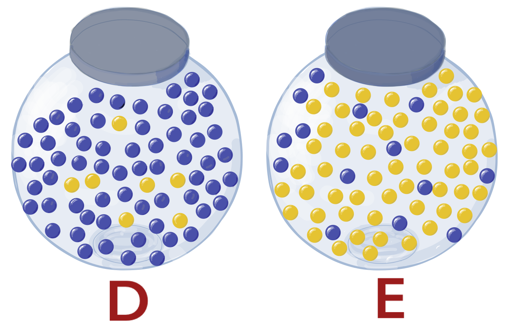

---
output:
  html_document:
    fig_caption: yes
    number_sections: yes
    theme: readable
    toc: yes
  pdf_document:
    toc: yes
---

```{r setup0, include=FALSE}
knitr::opts_chunk$set(echo = TRUE)
```


```{r message=FALSE, warning=FALSE, paged.print=FALSE, echo=FALSE, include=FALSE}
# load packages for chapter
options(scipen = 999)
options(digits = 10)
library(bookdown)
library(emmeans)
library(ggplot2)
library(dplyr)
library(kableExtra)
library(knitr)
library(tables)
library(pander)
library(multcomp)
library(agricolae)
library(nlme)
library(car)
library(tidyr)

```

# Analysis of Variance {#chAnova}

## Learning Objectives for Chapter

1. Translate scientific questions into null and alternative hypotheses.
1. State the null and alternative hypotheses for ANOVA.
1. State the logical structure of testing differences among means using ANOVA.
1. Write down the model for ANOVA and label its components.
1. Define experimental unit and determine number of experimental units in an experiment.
1. State the typical assumptions for ANOVA.
1. Test ANOVA assumptions.
1. Describe how variance is partitioned in a simple one-way ANOVA.
1. Calculate sum of squares and the corresponding degrees of freedom.
1. Compare ANOVA with t-tests for hypothesis testing.
1. Calculate of experimental error with and without subsamples.
1. Run an ANOVA and interpret the results in terms of the original scientific question.

## Introduction to ANOVA

In the previous chapter we used t-tests to test the null hypothesis that two means are equal. The general idea was that if sample means differ a lot more than expected if true means were equal, we conclude that means were not equal. In each test we incurred a risk of making a mistake, either by rejecting a true null hypothesis of by failing to reject a false one. People are particularly keen on making sure that they do not reject true null hypotheses^[There may be some reasons to favor concern about error type I vs. II, but neither error is inherently more troubling. It is more useful to assess the relative importance of errors by thinking about their consequences. What happens if you fail to reject a false hypothesis? What happens if you reject one that is true?]. This means that we want to make sure that we control the probability or making an error type I, called $\alpha$ and that we kwep it at the selected value, usually 0.05.

However, there are stuatioins when researchers want to test more than two treatments at the same time. For example, a researcher may want to test the effects of four different fertilizers on grain yield, or of four different diets on milk quality. If we used independent t-tests to assess the hypothesis that all means are equal, with four treatments (A, B, C, D) we would have to do 6 tests (AB, AC, AD, BC, BD, CD), with a probability of making a mistake in any one of them equal to 0.05. If the tests are independent, the probability of making at least one error in the set of comparisons is $1 - 0.95^6 = `r round(1-0.95^6, 3)`$, which is much greater than the nominal 0.05. In an experiment with 10 treatments, one can make 45 comparisons. If the comparisons are independent, which is the worse case scenario, the probability of making at least one error type I is $1 - 0.95^{45} = 0.90$!
Analysis of variance helps correct this problem by performing a single test of the null hypothesis, regardless of the number of treatments. Preview: the remedy is limited if the null hypothesis is rejected (Be the first to ask why in lecture and get an Easter egg!! Make sure to mention that you want your Easter egg.)

```{block, type='mydef'}
The probability of making an error in one test is $\alpha$ and it is called the test-wise error rate.\
The probability of making at least one error in a set or "family" of tests is called *family-wise* error rate.\
For all tests done in a experiment, the error rate is called *experiment-wise*.
```

Before we present the method in detail, we illustrate it with an intuitive example. The null hypothesis of equality of all means is rejected if the variation among groups or sample averages is much larger than expected on the basis of the variation within samples. All objects in each of the square groups below were randomly selected from a single larger set called  *parent* set. The set of objects in any square is called a *group*. Does it look like all groups have the same parent?

```{r anova.intuition1, echo=FALSE, out.width='60%', fig.cap="Does it look like all groups come from the same parent population?"}

# Code to generate 4 groups from two populations.

library(randomcoloR)

set.seed(1005)

par(mfrow = c(2,2), mai = c(1, 0.1, 0.1, 0.1))

for (i in 1:4) {
  plot(rep(1:3, 3), 
         rep(1:3, each = 3),
         pch = 21,
         cex = 6,
       xlim = c(-1, 5), 
       ylim = c(0.5, 3.5),
       bg = randomColor(count = 9, 
                        hue = c(rep("orange", 3), "yellow")[i], 
                        luminosity = c(rep("light", 3), "bright")[i]), 
       axes = FALSE,
       xlab = paste("GROUP", i, sep = " "), 
       ylab = "")
  }

```

Is the answer the same for the next figure?

```{r anova.intuition2, echo=FALSE, out.width='60%', fig.cap="Does it look like all groups come from the same parent population?"}

# Code to generate 4 groups from a single population.

set.seed(3833)

par(mfrow = c(2,2), mai = c(1, 0.1, 0.1, 0.1))

for (i in 1:4) {
  plot(rep(1:3, 3), 
         rep(1:3, each = 3),
         pch = 21,
         cex = 6,
       xlim = c(-1, 5), 
       ylim = c(0.5, 3.5),
       bg = randomColor(count = 9, 
                        hue = "orange", 
                        luminosity = "light"), 
       axes = FALSE,
       xlab = paste("GROUP", i, sep = " "), 
       ylab = "")
  }


```

Chances are that you thought one group was different from the rest in the first case, whereas no group stood out in the second case. Your eye (actually, mostly your brain) automatically assessed the variability between and within groups and compared them. One group in the first picture differed more from the rest than expected based on the variation of color within groups. This is the basis for ANOVA.

The intuitive recognition of group differences above is probably not the same for all people because of variation in the way people perceive and process color. The subjective method to assess differences is not reliable. Therefore, a formal and objective method has to be used. Most of the rest of this chapter consists of explaining how the intuition is formalized to allow calculations that are not subjective and that lead to the same results, regardless of the person doing the test.


In analysis of variance we use data to calculate the following:

1. Total variation among observations, variation between groups and variation within groups.
2. Ratio of variance between:within groups and its expected statistical distribution.
3. Probability of obtaining a ratio equal to or more extreme than the observed one if means are all equal.

If the ratio (calculated F-value) observed is too extreme, we reject the null hypothesis.


The main idea behind ANOVA is based directly on the most important equation in this course:

<br>

\begin{equation}
\sigma^2_{\bar{Y}} = \frac{\sigma_Y^2}{n} \quad \text{ for populations} \\[20pt]
S^2_{\bar{Y}} = \frac{S_Y^2}{n} \quad \text{ for samples} \\[20pt]
\end{equation}

<br>

```{block, type = 'stattip'}
- The variance of the average is the variance of the original random variable divided by the size of the sample used to calculate the average.
```


When there are several treatments, and IF THE TREATMENTS HAVE NO EFFECTS on the response variable, the observations in each treatment are a sample from the same population, and all samples come from the same population. Therefore, there is one sample from the same population for each treatment in the experiment. Each sample provides an average, so we have as many averages as there are treatments. Because we have many averages, we can estimate the variance among averages $\sigma_{\bar{Y}}$ directly, using the calculation formula for the estimated variance of any random variable applied over k independent observations of the random variable:

$$S^2_{\bar{Y}} = \frac{1}{k-1} \sum_{i=1}^k (\bar{Y}_i - \bar{Y}_{..})^2$$.

We obtain the estimated variance of Y simply by multiplying the estimated variance of the averages times the sample size:

$$S^2_Y = k \ S^2_{\bar{Y}}$$

Note that this calculation results in a valid estimate of the variance ONLY if all means and variances are equal.

We can also estimate the variance using the pooled variance:

$$S^2_Y = \frac{1}{k \ (r - 1)} \sum_{i=1}^k \sum_{j=1}^r (\bar{Y}_{ij} - \bar{Y}_{.k})^2$$

The pooled variance is the average squared deviations from each sample average, and thus, it does not need the means to be equal to be a valid estimate of the common variance for all treatments. This pooled variance is based on the same concept used for comparing two means using independent samples in [Chapter 8](#Case1). Pooling variances is desirable because it leads to better precision and narrower confidence intervals. A pooled estimated variance is based on more observations and is therefore more stable (the variance of the estimated variance is smaller!!), moreover, the variance of Student's t distribution is also reduced as the degrees of freedom increase. Pooling leads to smaller critical t-values, which equals more power (lower probability of error type II) and narrower confidence intervals.

If indeed the first estimate of the variance above, based on the variation among treatment averages, is a valid one, the quotient of the first estimate over the second one, based on the pooled variance, should have an F distribution with values about 1.0. We saw this when testing for differences between independent variance estimates in [section XXX](#addReference). The statistical distribution resulting from the quotient of two variance estimates is called an F-distribution, which was fully described in the *F Distribution* section of the [Probability chapter](#chProb). If the quotient calculated, called "calculated F-value," is too far from 1.0 we conclude that the two variances are not equal, therefore, the estimation of the variance using the averages is not a valid estimate, and the averages are considered too different to come from the same population. The means of the source populations must be different, so the null hypothesis is rejected. This is further illustrated with a numerical example below.


## Logic of Null Hypothesis test with ANOVA

The logic behind a rejection of the null hypothesis using ANOVA is analogous to the following situation. Imagine that there are two jars with blue and yellow marbles. These jars represent the two possible cases: jar "Different" on the left is the case where we have different treatment means, whereas jar "Equal" on the right represents the case where all means are the same. One of the jars is the true situation available to be observed, but we do not know which one. We just know what the jars have inside. The observation/experimentation process does not allow us to see the jar, but we get a sample of what they have inside.

On the outside the jars are identical and you cannot see inside. The "Different" jar has 90% blue marbles, whereas the "Equal" jar has only 20% blue marbles. Suppose that the number of marbles is large enough that the probabilities are not affected by the removal of marbles. Only one jar is available to sample from, depending on whether the true but unknonw means are or are not different, but you do not know which one. You sample 5 marbles and they are all blue. Did you sample from "Different" or "Equal?" The null hypothesis is that the means are equal, which in the analogy signifies that the hypothesis is that we sampled the jar on the right labeled E for "Equal." We cannot know for sure where the marbles came from, because there are both blue and yellow marbles in both jars.

<br>
<br>
```{r jars1, message=FALSE, warning=FALSE, paged.print=FALSE, out.width = '60%', fig.align='center', echo=FALSE, fig.cap ="Representation of the logic of hypothesis testing in frequentist statistics. Jar D on the left represents the situation when means of treatments are different. Jar E on the right represents the situation when means are all equal. Imagine that there is a large number of marbles in each jar or that sampling is done with replacement. Marbles in each jar represent the distribution of the test statistic under each condition. A sample of r = 5 marbles represents the process of experimentation, sampling and calculation of the observed statistic value. Intuitively, if most of the marbles sampled are blue, we will tend to say that the jar sampled was D. As an exercise, design jars with various proportions of colors and see if it becomes easier or harder to guess the sampled jar."}



```
<br>
<br>

Intuition indicates that if most of the marbles are blue, we should reject the null hypothesis, otherwise we fail to reject it. Say that you sample 5 marbles and 4 are blue. The logic of Ho testing would go somethiogn like this: "I hypothesize that we sampled the E jar with mostly yellow marbles, but I got 4 blue, and the chances of getting 4 blue marbles from the E jar is very small, so I will guess that in reality I sampled from the D jar. At least two means are different." In the case of the marbles, all parameters of the problem are known, so we can calculate the exact probabilities of making errors. Because sampling is with replacement (or the number of marbles is really large), if the means are all equal, i.e., if we sampled from jar E the probability of getting a blue marble P(blue) in any draw would be constant at 0.20, and the number of blue marbles would have a binomial distribution. Therefore, the probability of getting 4 or more blue marbles from E would be `r round(1 - pbinom(4,5,0.20), 5)`. This is the probability that we reject the null hypothesis while in fact it is true. We can call the number of blue marbles the "decision variable" or sample statistic that we use to determine whether to reject the null hypothesis. The probability of drawing 3 or more blue marbles out of 5 from E is `r round(1 - pbinom(2,5,0.20), 3)`, which is close to the standard $\alpha = 0.05$. Thus, we can say that we will reject the null that we sampled from E if we get 3 or more blue marbles out of 5. In this case calculating the sample statistic and its sampling distribution is rather simple: we count the blue marbles, and the number of blue marbles has a binomial distribution.

<br>

```{block, type = 'think'}
The proportion of marbles in the D jar was not used for anything! What if the D jar had just one more blue marble than the E jar??? This is a problem in frequentist statistics: it does not take into account the distribution of the statistics if some version of the alternative hypothesis were true.

```
<br>

In many experiments the response variable of interest is not binary; the variable observed is not like the number of marbles and it does not have a binomial distribution. A slightly more complicated procedure than applying the binomial distribution is used to calculate a statistic (calculated F-value) whose theoretical distribution is known when the null hypothesis is true (F distribution). This procedure is the analysis of variance, and the statistic calculated is the calculated F-value. When all means are the same, the calculated F has an F-distribution defined by certain parameters called "degrees of freedom" that depend on sample size and number of treatments compared.

```{block, type = "stattip"}

LOGIC OF TESTS OF NULL HYPOTHESIS:
IF the assumptions are true, AND the null hypothesis is true,\
THEN the quotient MSTreat/MSE has an F distribution.\
THEREFORE, the probability of a LARGE Fcalc is small.\
SO, if the calculated F is indeed large we doubt (reject) the null hypothesis.\
Essentially, we say that events with low probability did not occur.
```

```{block, type = "stattip"}

- If you try a sufficiently large number of times, any hypothesis, regardless of their truthfulness, will be rejected. When somebody tells you they rejected a hypothesis, make sure to ask how many times they tried. Remember that correctly applied statistical methods will lead to rejection of true null hypothesis with an expected rate of 5 out of 100 tests.

```

** Add shiny for students to run simulations of draws from randomly selected urns and the be shown the true urn. Use probabilities such that they can explore both types of errors. Assign homework where they explore the rates of errors as a function sample size and probabilities.**


## Model and Partitioning of Variance

When the different components of an experiment are identified and the effects are additive, then we can use a linear equation to calculate the value of any observation in the experiment. When we assign each of k treatments randomly to r replicates, we have an experimental design called "Completely Randomized Design" or CRD. The model for this design states that each observation is a random draw from a normal distribution that has a potentially different mean for each treatment, but with a common variance for all treatments. Moreover, the treatment mean is expressed as an overall mean plus a treatment effect. The model is written as follows:

<br>
\begin{align}
&Y_{ij} = \mu_{..} + \tau_i + \epsilon_{ij} \quad \quad i = 1, \dots, k, \quad j = 1, \dots, r \\[10pt]
&\epsilon_{ij} \sim iid \ N(0, \sigma^2) \\[15pt]
&\quad \quad \text{where} \\[15pt]
&\mu_{..} \quad \text{is the overall mean} \quad \mu_{..} = \frac{1}{k}\sum_{i = 1}^{k} \mu_{i.}\\[15pt]
&\tau_i \quad \text{is the effect of treatment i } \\[15pt]
&\epsilon_{ij} \quad \text{is the experimental error for treatment i and replicate j} \\[15pt]
& iid \quad \text{means "independent and identically distributed"}
(\#eq:modelCRD)
\end{align}
<br>


When we do not know the parameters of the actual distributions, which is usually the case, parameters are estimated and each observation is partitioned as follows:

<br>
\begin{align}
&Y_{ij} = \hat{\mu}_{..} + \hat{\tau}_i + \hat{\epsilon}_{ij} \\[10pt]
&= \bar{Y}_{..} + \hat{\tau}_i + e_{ij} \\[15pt]
&= \bar{Y}_{i.} + e_{ij} \quad \quad \text{where} \\[15pt]

&\bar{Y}{..} \quad \text{is the overall average calculated as } \frac{1}{k}\sum_{i = 1}^{k} \bar{Y}_{i.}\ \\[15pt]
&\bar{Y}_{i.} \quad \text{is the average for treatment i} \\[15pt]
&e_{ij} \quad \text{is the residual error for treatment i and repetition j} \\[15pt]
(\#eq:estModelCRD)
\end{align}
<br>


Based on the model above, each observation is partitioned into components:
- overall mean, which is estimated with the average of treatment averages,
- treatment effects, which are estimated as the differences between treatment averages and overall average,
- error, which is estimated with the residual or difference bewtween observation and treatment average.

<br>
\begin{align}
Y_{ij} &= \bar{Y}_{..} + \hat{\tau}_i + \hat{\epsilon}_{ij} \\[15pt]
Y_{ij}- \bar{Y}_{..} &= \hat{\tau}_i + \hat{\epsilon}_{ij} \\[15pt]
Y_{ij}- \bar{Y}_{..} &= (\bar{Y}_{i.} - \bar{Y}_{..})+ (\bar{Y}_{ij} - \bar{Y}_{i.}) \\[15pt]
(\#eq:obsPartCRD)
\end{align}
<br>

The total deviation from observation to overall average is partitioned into the deviation from treatment average to overall average plus residual, where the residual is the difference between observation and treatment average. It can be shown that the sum of all total deviations squared equals the sum of squared estimated treatment effects plus the sum of squared residuals: total sum of squares equals treatment sum of squares plus residual sum of squares.


<br>
\begin{align}
\sum_{i=1}^k \sum_{j=1}^r (Y_{ij}- \bar{Y}_{..})^2 &= \sum_{i=1}^k \sum_{j=1}^r (\bar{Y}_{i.} - \bar{Y}_{..})^2 + \sum_{i=1}^k \sum_{j=1}^r (\bar{Y}_{ij} - \bar{Y}_{i.})^2 \\[15pt]
TSS &= SST + SSE\\[15pt]
\text{where} \\[15pt]
TSS &= \sum_{i=1}^k \sum_{j=1}^r (Y_{ij}- \bar{Y}_{..})^2 \\[15pt]
SST &= \sum_{i=1}^k \sum_{j=1}^r (\bar{Y}_{i.} - \bar{Y}_{..})^2 = \ r \ \sum_{i=1}^k (\bar{Y}_{i.} - \bar{Y}_{..})^2\\[15pt]
SSE &= \sum_{i=1}^k \sum_{j=1}^r (\bar{Y}_{ij} - \bar{Y}_{i.})^2\\[15pt]
(\#eq:ssPartCRD)
\end{align}
<br>

## Degrees of freedom (The bulk of this section should be moved to the first time df are mentioned)

Degrees of freedom are quantities associated with sums of squares. Each sum of squares has an associated number that is called its degrees of freedom. We operationally define **degrees of freedom** associated with a sum of squares as the number of different terms in the sum minus the number of independent parameters estimated to be used in the calculation.

In reality, degrees of freedom refers to the number of dimensions in which vectors can vary. The basic mathematics of statistics involves large-dimensional spaces and subspaces. In short, and for those who are curious, a sample of size N is a vector in N dimensions and has N degrees of freedom because it can vary freely over N dimensions. Once a sample is set, the overall average is a vector in N dimensions with each coordinate value equal to the average of the observations. The average vector and the observation vector form a hyperplane in N-1 dimensions where the difference bewteen observation and average reside. The difference $Y_{i} - \bar{Y}_{.}$ is the vector of deviations or residuals (for the simplest model $Y_i = \mu + \epsilon_i$) from observation to average. Given a set sample, this vector of residuals has only N-1 degrees of freedom, because it must stay in the subspace spanned by the observation and the overall average. The restriction comes from the fact that given the overall average and N-1 of the observation coordinates, the last one can be calculated as $Y_N = N \ \bar{Y}_. - \sum_{i=1}^{N-1} Y_i$. 

This concept is illustrated for a sample consisting of three observations, so we can plot them in a 3D figure.

```{r, echo=FALSE, warning=FALSE}

library(rgl)
smpl <- c(3, 4, 8)
avg <- rep(mean(smpl), 3)
rsdl <- smpl - avg
xyz0 <- c(0, 0, 0)
xyz.tips <- rbind(smpl, avg, smpl)
xyz.orig <- rbind(xyz0, xyz0, avg)
colnames(xyz.tips) <- c("obs1", "obs2", "obs3")
colnames(xyz.orig) <- c("obs1", "obs2", "obs3")
ssr <- rsdl %*% rsdl

plot3d(xyz.tips, 
       xlab = "observation 1", 
       ylab = "observation 2", 
       zlab = "observation 3", 
       box = FALSE, 
       xlim = c(0, 10), 
       ylim = c(0, 10), 
       zlim = c(0, 10))


arrow3d(xyz0, xyz.tips[1,], type = "rotation", col = "grey", barblen = 0.05, width = 0.4)
arrow3d(xyz0, xyz.tips[2,], type = "rotation", col = "lightblue", barblen = 0.05, width = 0.4)
arrow3d(xyz.tips[1,], xyz.tips[2,], type = "rotation", col = "maroon", barblen = 0.05, width = 0.4)
planes3d(a = -4,
         b = 5,
         c = -1,
         d = 0, 
         alpha = 0.4)

library(plot3D)

arrows3D(x0 = xyz.orig[, 1], 
         y0 = xyz.orig[, 2], 
         z0 = xyz.orig[, 3], 
         x1 = xyz.tips[, 1], 
         y1 = xyz.tips[, 2], 
         z1 = xyz.tips[, 3], 
         xlim = c(0, 10), 
         ylim = c(0, 10), 
         zlim = c(0, 10), 
         phi = 35, 
         theta = 450, 
         lwd = 2, 
         d = 3, 
         bty = "g", 
         ticktype = "detailed")

```

Note that the three arrows form a square triangle with the observation vector being the hypothenuse, and the other two sides being the average and the residual. Therefore the length of the observation vector equals the length of the average vector plus the lenght of the residual vector. Using the Pythagoras theorem repeatedly, we can see that the length of the observation vector is the sum of squares of individual observations; the length of the average vector is 3 times the squared average and the length of the residual vector is the sum of squares of the residuals or deviations. The length of the average vector is called "correction factor" because it is used to calculate the total variation about the average by subtracting it from the length of the observation vector.

A really good reading to understand the concept of degrees of freedom is Walker [@Walker1940]. The following quote is taken from that paper:

>"A canoe or an automobile moves over a two-dimensional surface which lies upon a three-dimensional space, is a section of a three-dimensional space. At any given moment, the position of the canoe, or auto, can be given by two coordinates. Referred to a four-dimensional space-time universe, three coordinates would be needed to give its location, and its path would be a space of three dimensions, lying upon one of four."

>
> --- Walker (1940)

Thus, the car and canoe move in a 4-dimensional space but they have only 3 degrees of freedom, because they must move on a preset surface. Given the surface, their position on the surface and time is completely determined by 3 numbers. Analogously, the residuals exist in an N-dimensional space, but they must be on the hyperplane defined by the observation and the mean vector, which has N-1 dimensions or degrees of freedom. The geometric interpretation of sums of squares is applicable to all linear models, and in particular to the few that we study in this course. Although graphical representations that are realistic can only be done for the simplest models, graphical analogies are valid for all models. If you think you understand the geometric interpretation or concepts more easily than the equations, let your instructors know and they will be able to help you pursue better understanding using the geometric approach.

**Total degrees of freedom**

Consider an experiment where r plots are assigned randomly to each of k treatments (i is for treatments and j is for replicates or plots). Such experiment is a completely randomized design and has a total of N = r k plots or experimental units. The concept of experimental unit is explained in detail in the [Chapter about Experimental Design](#chEdesign). For now, just think of an experimental unit as a unit of experimental material (e.g.animal, group of animals, pot, land plot, petri dish, etc.) that yields an observation independent of the rest of the observations.

When we use the average to estimate the overall mean, the set of deviations from the overall average has only rk-1 degrees of freedom (df). Thus, the total sum of squares or length of the vector of residuals has rk-1 df. This is called the total degrees of freedom associated with the total sum of squares of a set of samples.

<br>
\begin{align}
\text{Total sum of squares } &= TSS = \sum_{i-1}^k \sum_{j=1}^r (Y_{ij} - \bar{Y}_{..})^2 \\[15pt]
\text{Total df } &= r \ k \quad \text{observations} - 1 \ \text{estimated mean}
\end{align}
<br>

Using the operational definition above we can calculate the total df as follows: the summation has rk independent terms (one for each observation), but we use one parameter estimate, the estimate of the overall mean. Therefore the total df are rk-1.

**Degrees of freedom of treatments**

<br>
\begin{align}
&\text{Sum of squares of Treatments } \\[15pt]
= SST &= \sum_{i-1}^k \sum_{j=1}^r (\bar{Y}_{i.} - \bar{Y}_{..})^2 \\[15pt]
 &= r \sum_{i-1}^k (\bar{Y}_{i.} - \bar{Y}_{..})^2 \\[15pt]
\text{Treatment df } &= k \quad \text{treatments} - 1 \ \text{estimated mean}
\end{align}
<br>

The summation has k independent terms, one for each treatment, and it uses the estimate of the overall mean. As a result, the treatment degrees of freedom equals k-1.


**Degrees of freedom of residuals**

<br>
\begin{align}
\text{Residual sum of squares } &= SSE = \sum_{i-1}^k \sum_{j=1}^r (Y_{ij} - \bar{Y}_{i.})^2 \\[15pt]
\text{Residual df } &= r \ k \quad \text{observations} - k \ \text{estimated treatment means }\\[15pt]
= dfe &= k(r-1)
\end{align}
<br>

The summation has rk independent terms, one for each observation, and it uses the k estimates for the treatment means. Therefore, the residual degrees of freedom are rk - k = k (r-1)

Both sum of squares and degrees of freedom are additive in the sense that the total is equal to the sum of the components:

<br>
\begin{align}
TSS &= SST + SSE \\[15pt]
\text{df Total } &= \text{df Treatment }+ dfe
\end{align}
<br>


## ANOVA Table

The equations above show how each observation and the total variation are partitioned into treatment and residual. Total sum of squares is partitioned into SS of treatments and SS of residual or error ^[We try to use the term "residual" for the calculated values, which are estimates of the unknown true errors. We mention the term "error" because most books use "SSE" to refer to the SS of residuals. The "E" comes from "error."]. Each sum of squares has an associated degrees of freedom. By dividing the SS by the df we obtain **mean squares**. The mean square of residuals (MSE) is the best estimate of the common variance for all samples, and it does not depend on treatment means being equal. The mean square of treatments (MST) has an expectation equal to the common variance PLUS a component that is directly proportional to the difference among means. Only when means are equal is the MST another estimate of the variance of the error. See the optional section of Expected Mean Squares for details.


|Source            |  df      | Sum of Squares (SS) | Mean Squares (MS) | Calculated F |
|:----------------:|:--------:|:-------------------:|:-----------------:|:------------:|
|Total             | k r - 1  |     TSS             |                   |              |
|Among Treatments  | k - 1    |     SST             |        MST        |   MST / MSE  |
|Within Treatments | k (r-1)  |     SSE             |        MSE        |              |

Sums of squares, mean squares and calculated F are all statistics. The values basd on one sample are specific realized values of the random variables, which have their own expected values variances and distributions. If the null hypothesis that all treatment means are the same is true and all assumptions are correct, the calculated F has an F distribution with mean or expectation equal to $dfe/(dfe - 2)$, where dfe is the residual or error degrees of freedom.

```{block, type = 'stattip'}
- When MST is much greater than MSE, calculated F will be much greater than expected if treatment means were equal.
- If calculated F is greater than critical F value, or equivalently, if the probability of an F more extreme than calculated F is smaller than $\alpha$, we REJECT Ho.

```

## Assumptions of ANOVA

In order for the ANOVA results and interpretation to be valid, the following assumptions must be true:

a. the variable of interest must be normally distributed
b. each experimental unit must be independent from any other experimental unit
c. variances of the different treatments must be all equal ("homogeneous")
d. treatment and residual effects must be additive

These assumptions are part of the model above and are important for ANOVA, although some deviation from certain assumptions is not always a grave problem. The main part of the model states clearly that each observation is composed of three additive parts: overall mean, treatment effect and error. Further, the errors,-one for each observation- are assumed to all have identical, independent distributions that are normal with mean 0 and common variance $\sigma^2$ (or standard deviation $\sigma$).

## ANOVA example

We will study the ANOVA procedure with an example. First, the analysis is presented as concisely as possible, from research question to conclusion, using R functions. Then, each step is explained in detail and calculations are presented step by step.

This is a fictitious example with elements based on actual research. Alfalfa geneticists and breeders created two transgenic varieties with genetic modifications of the metabolic pathways that synthesize ligning. Lignin is undigestible fiber that reduces the nutritional quality of forages. A common, unmodified variety and the two GMO varieties need to be compared to determine if the modification leads to better nutrition of cattle. Twelve animals were randomly selected from a large herd of beef cattle for the experiment. Varieties were labeled A, B and C, where A is the unmodified one. Twelve identical ping-pong balls were used for the randomization of treatment assignment to experimental units (animals). Four balls were labelled "A," four "B" and four "C." Balls were put into a bucket and mixed, then a blindfolded operator drew them randomly, one at a time and without replacement. The random sequence of letters was writen down. Animals were lined up haphazardly and assigned the treatments from left to right in the order given by the random sequence. Each animal was housed in an individual pen and fed the corresponding variety of alfalfa for 30 days. Weight gain in lbs per day was calculated for the last 10 days of the experiment and used as the response variable.

<br>
```{r TblAnovaExmpl1, echo=FALSE, warning=FALSE}

aaAnovaExmpl1.dat <- read.table(header = TRUE, text = "
variety wgain
A 1.0
B 2.0
C 3.0
A 2.0
B 3.0
C 4.0
A 2.0
B 2.0
C 3.0
A 3.0
B 3.0
C 2.0
"
)

knitr::kable(
aaAnovaExmpl1.dat, 
   digits = 2, 
   align = "cc", 
   caption = 'Fictitious data. Weight gain in lbs/day of steers fed different varieties of alfalfa. The experiment was a completely randomized design with four replicates of each treatment'
) %>% 
   kable_styling(bootstrap_options = c("condensed"), 
                 font_size = 11, 
                 full_width = F, 
                 position = "center") %>% 
   column_spec(c(1,2), width = "1.5in")

```
<br>

**Null hypothesis**: Weight gain is the same for all alfalfa varieties tested.

\begin{align}
H_0: \quad &\mu_A = \mu_B = \mu_C \quad &\text{or equivalently:} \\
&\tau_A = \tau_B = \tau_C = 0 \quad &\text{treatment effects are zero}
\end{align}

**Alternative hypothesis** There is at least one pair of varieties that differs in the resulting weight gains.

\begin{align}
H_A: \quad &\mu_A \ne \mu_B \quad \text{or} \quad \mu_A \ne \mu_C \quad \text{or} \quad \mu_B \ne \mu_C \\
\end{align}

We use the `lm` and `anova` functions of R. The `lm` function finds the optimal values for the estimated parameters by minimizing the residual sum of squares. The `anova` uses the estimated parameters to partition the total variance and gives the resulting calculated F with the corresponding probability of observing a value at least that extreme if indeed all varieties result in the same weight gain.

```{r, echo = TRUE, warning=FALSE}

transg.aa.m1 <- lm(wgain ~ variety, data = aaAnovaExmpl1.dat)

summary(transg.aa.m1)

```

The output shows the formula used for the model, the quartiles for the residuals, a table of coefficients with the estimated overall mean (Intercept), $\tau_B$ (varietyB), $\tau_C$ (varietyC) and the corresponding standard errors and t-tests for the null hypotheses that each coefficient is zero. We are not interested in testing that the coefficients are zero, so the t-tests can be ignored. The bottom part of the report shows the standard deviation of residuals and their degrees of freedom, the $R^2$ and adjusted $R^2$, and finally the calculated F statistic with its degrees of freedom and probability of observing a value equal to that or more extreme if $H_0$ were true. The $R^2$ is the proportion of the total variation represented by the variation among treatments. We will ignore the adjusted $R^2$ for now.

Before we move further, we need to inspect the residuals to make sure that there are no deviations from the assumptions. If residuals clearly do no meet assumptions, we cannot use ANOVA and the results above are not relevant.

```{r AnovaResPlot1,  echo = TRUE, warning=FALSE, out.width = '90%', fig.align='center', fig.cap ="Left: Plot of residuals against estimated treatment means for the transgenic alfalfa experiment. Points were jittered horizontally because several residuals were equal. Right: quantile-quantile plot of residuals. If residuals have a normal distribution they should not deviate significantly from the straight line."}

par(mfrow = c(1,2))

plot(residuals(transg.aa.m1) ~ jitter(fitted(transg.aa.m1)), 
     ylab = "Residuals", 
     xlab = "Treatment averages (lbs/day)")

qqp(residuals(transg.aa.m1))

```
<br>


Although there are other more formal tests to assess whether assumptions are met, a visual inspection of the residuals is usually sufficient. Formal methods to test for deviation from assumptions are beyond the scope of this course. This data set is very small and the residuals do not show major problems, so the analysis is pursued. Note that when doing real data analysis, this step should be more detailed.

```{r, echo = TRUE, warning=FALSE}

kable(anova(transg.aa.m1)) %>% 
   kable_styling(full_width = FALSE)

```

The analysis of variance table has columns for source of variations, degrees of freedom, sum of squares, mean squares, calculated F-value and probability of observing an F that large or larger if the null hypothesis were true. Of course, the F value and the probability are the same as in the previous table.

Because the probability associated with the calculated F-value is larger than 0.05, we cannot reject the null hypothesis and the study is inconclusive. We do not have enough evidence to say that the varieties lead to different weight gains, because the variation among treatment means is not sufficiently larger than that within treatments, due to experimental error (variation among experimental units due to other, unmeasured causes).

Keep in mind that not being able to reject the null hypothesis is not the same as accepting it. The reason for this is that is it very easy not to reject any null hypothesis: all you have to do is not try hard enough. If not being able to reject the null meant that you accept it, then you could accept any null hypothesis, which obviosuly is not very useful. It would simply lead you to be wrong most of the time.

If the above is not clear, consider the following. You took a a multiple choice test and obtained 75% correct in 20 questions. The questions are a sample of your knowledge. Your professor hypothesizes that your real knowledge of the material is at 73%. With the sample size available, he cannot reject his null hypothesis. Will you accept it?

```{block, type = 'stattip'}
- Failure to reject the null hypothesis DOES NOT mean that you accept it. It means the study is inconclusive, unless you did a calculation of power.
```


## Estimation of parameters

### R Code

### Detailed calculations

First, we present the calculations as traditionally taught in introductory courses. Then we briefly explain the method and equations actually used in the theory of least squares and emplemented by statistical software.


## Hypothesis Testing

When using ANOVA to test for a difference among treatments, our null hypothesis and alternative hypothesis can be stated, respectively, as

$H_0 : \mu_1 = \mu_2 = ... =\mu_k$ for $k$ treatments        
$H_1 : at least 1 treatment is different$     


## Exercises and Solutions

## Homework

### Introduction to ANOVA

This set of exercises introduces the need for and shows the use of a method called Analysis of Variance (ANOVA). This method is used to determine if there are differences in the means of several populations. Instead of two populations, now there are many. We start with a type of ANOVA called One-way ANOVA. The term "One-way" means that the populations may differ in only one factor. For example, the factor can be the amount of fertilizer applied to a crop or the type of diet fed to an animal. Conversely, "Two-way" ANOVA involves more than one factor, for example when plots differ not only in the amount of fertilizer but also in the amount of irrigation. For now we focus on one-way ANOVA.

### Need for ANOVA

We already know how to compare two means. When we have many means and want to determine if any of them are different we could simply test all possible pairs. Why is this not a good idea unless we take precautions? This first part of this homework illustrates this.	

### Comparison of Diets

You are looking for diets that reduce blood cholesterol in rats. You created 14 test diets and did an experiment in which 4 randomly selected rats were fed each diet. Blood cholesterol was measured on each rat at the end of 30 days of feeding.  Because you do this before knowing about ANOVA you decide to test for differences using the independent observations procedure for two population means, taking two diets at a time. You use alpha=0.05 for each test. Assume that the test are  all independent.

**Binomial**

1. How many different tests of $H_0: \mu1 =\mu2$ do you make? Consider that each time you make a test you are choosing 2 out of 14 means. The order of the means does not matter, because we are making 2-tailed tests.

2. What is the probability that you make a type I error in each test separately?

3. What is the probability that you make a type I error in just one of all the tests?

4. What is the probability that you make a type I error in none of the tests?

5. What is the probability that you make a type I error in at least one test (family-wise error rate)?

### Use of ANOVA

When you make a lot of tests, your chance of making at least one mistake can be quite large. ANOVA avoids the problem with your "all-tests" approach by doing a single test that simultaneously checks for evidence of at least one difference. Interestingly, although the test is to determine if there are differences among means, it actually is a test of equality of variances estimated in two different ways. So first we practice testing for equality (or difference) of variances. When two random variables have normal distributions with equal variance, the ratio of sample variances from each population has an F distribution (see [F Distribution](#FDist) .

### Test of Equality of Variances

The data below are samples of forage yield (ton/ha) from a variety of fescue grown with and without irrigation. Test the hypothesis that irrigated and rainfed yields have the same variance.

```{r}

test.of.eq.var <- data.frame(
rainfed = c(4.55531, 3.28384,3.69763, 4.97093, 4.86167, 3.51156, 5.37135, 4.17079, 3.51320, 4.02560, 
              2.79041, 3.55350, 3.22606, 5.89298, 1.66526, 4.16665, 3.50212, 3.72783, 2.36477, 3.30673, 
              4.40777, 3.66480, 3.35171, 3.10409, 2.85976, 3.81750, 5.39221, 4.99803,4.11388, 4.11004),
irrigated = c(13.10275, 11.66548, 8.40485, 8.37005, 10.32271, 10.22372, 8.08630, 12.99069, 11.70000, 12.10000, 
                 7.87410, 10.22707, 12.10700, 11.00452, 10.64577, 8.68308, 6.83079, 12.25721, 10.20000, 12.52602, 
                 NA, NA, NA, NA, NA, NA, NA, NA, NA, NA))

```

```{block, type = 'rtip'}
Data frames are rectangular tables with data. All columns must have the same length. Because our two treatments do not contain the same number of samples, 'NA' values are included to make columns of equal length that can be joined into a data frame.**
```
For the following calculations, assume an $\alpha = 0.05$, and $df_{rainfed} = 29$ and $df_{irrigated} = 19$ to calculate these values.

6. Calculate the sample variances and report the "calculated" or sample F value. 

7. What is the probability of observing an F-value larger than the one observed? 

8. What is the critical F "from table?"

9. Interpret the results of the test of equality of variances.

### Estimation of the Variance Between and Within Samples

For this section of the exercise we will use yield (ton/ha) data about 10 fescue varieties, all grown in rainfed conditions. We assume that the variances are the same for all varieties. This is an important point to understand: we assume that the variance is the same for all varieties, regardless of their means. We are referring to the variances within each sample. Because the variances are assumed to be the same, we can follow the idea used in Case 1 of two populations means (textbook page 88) and pool the estimates to get a better overall estimate of the variance.				

These are randomly simulated data. All variances are equal to 1 and the true means are below. These values are given just FYI, to see how samples differ.

```{r}

fescue.samples <- data.frame(
'var1' = c(3.10, 3.88, 2.37, 3.95, 2.42, 1.72, 3.28, 2.51, 2.44), 
'var2' = c(3.84, 2.65, 3.10, 2.83, 1.81, 3.86, 4.25, 4.21, 5.44), 
'var3' = c(5.80, 5.87, 4.25, 2.56, 4.32, 3.05, 4.31, 3.67, 2.36), 
'var4' = c(5.03, 2.18, 3.49, 4.50, 1.99, 2.95, 3.48, 2.74, 3.89), 
'var5' = c(3.90, 4.24, 4.60, 5.00, 4.04, 4.85, 4.65, 4.26, 5.47), 
'var6' = c(7.57, 3.76, 6.66, 5.87, 5.69, 6.41, 5.12, 6.74, 6.04), 
'var7' = c(2.47, 4.23, 2.63, 4.68, 3.22, 3.88, 3.17, 3.62, 3.22), 
'var8' = c(3.23, 4.15, 4.12, 6.05, 3.66, 4.90, 3.88, 3.76, 3.15), 
'var9' = c(4.01, 5.46, 4.31, 5.63, 5.22, 4.38, 4.75, 4.09, 4.60),
'var10' = c(6.96, 5.79, 6.76, 6.25, 6.83, 7.24, 7.26, 5.00, 4.66))

#Actual Population Means
pop.means <- data.frame(
'var1' = 3.0, 
'var2' = 3.5, 
'var3' = 4.0, 
'var4' = 3.0, 
'var5' = 5.0, 
'var6' = 6.0, 
'var7' = 3.2, 
'var8' = 3.9, 
'var9' = 4.5, 
'var10' = 6.0)

df <- data.frame('var1' = 8, 'var2' = 8, 'var3' = 8, 'var4' = 8, 'var5' = 8, 'var6' = 8, 'var7' = 8, 'var8' = 8, 'var9' = 8, 'var10' = 8)

#Sample Averages for Each Variety
sample.avg <- sapply(fescue.samples, mean)

#Sample Variances for Each Variety
sample.var <- sapply(fescue.samples, var)

```

For the following calculations, assume an $\alpha = 0.05$, and $df_{var_i} = 8$ to calculate these values.

$S^2_{\bar{Y}} = \frac{S^2_{Y}}{r}$

$S^2 = \frac{(r_1 - 1)S^2_{1} + (r_2 - 1)S^2_{2} +(r_3 - 1)S^2_{3} + (r_4 - 1)S^2_{4} + (r_5 - 1)S^2_{5} + (r_6 - 1)S^2_{6} + (r_7 - 1)S^2_{7} + (r_8 - 1)S^2_{8} + (r_9 - 1)S^2_{9} + (r_10 - 1)S^2_{10}}{(r_1 -1) + (r_2 -1) + (r_3 -1) + (r_4 -1) + (r_5 -1) + (r_6 -1) + (r_7 -1) + (r_8 -1) + (r_9 -1) + (r_{10} -1)}$

10. Estimate the pooled variance for the 10 varieties of fescue.


Now we recall that the variance of averages for samples from a population is the variance of individual observations divided by sample size. If it is true that all means are the same for all varieties, then we can obtain another estimate of the individual variance by calculating the variance among averages and multiplying by sample size.	


11. Estimate the variance of yield using the variance among averages and sample size. Refer to the equation you were asked to memorize for this course.						
12. What is the overall average?

13. What is the pooled within variance?

14.  What is the variance of averages?

15.  What is the second variance estimate?

16.  What is $F_{calc}$?

17.  What is $F_{critical}$?

18.  What is P($F$ > $F_{calc}$)?

19.  What is $df_{numerator}$?

20.  What is $df_{denominator}$?


## Laboratory Exercises

### Plant Sciences {#LabCh09PLS}

Prepare an .Rmd document starting with the following text, where you substitute the corresponsing information for author name and date.

```
---
title: "Lab05 CRD Anova"
author: "YourFirstName YourLastName"
date: "enter date here"
output: html_document
---
```

```{r setupPS, include=FALSE}
knitr::opts_chunk$set(echo = TRUE)

library(pander)
library(ggplot2)

```

#### Instructions

For this lab you will modify this file and submit this file with the file name changed so it has your email ID (the part before @) in lower case instead of "email." Do not add spaces to the file name.

This is a markdown document. You will type your code and run it one line at a time as you add it in the lines indicated below. Add code **ONLY** in the areas between "\```{r}" and "\```". These areas are highlighted with a light grey color. Run each line and parts to learn and experiment until you get the result you want. Keep the lines that worked and move on. At any time you can see if your document "knits" or not by clicking on the Knit HTML icon at the top. Once you have completed all work, knit your document and save the html file produced with the same file name but with an html extension (Lab01email.html).

**Submit BOTH files for your lab report using the appropriate Canvas tool**

For each part and question below, type your code in the grey area below, between the sets of back-ticks (```) to perform the desired computation and get output. Type your answers **below** the corresponding grey area.

In this exercise we analyze the data resulting from an experiment at the UC Davis Plant Sciences research fields. The data and description of the experimental setup have been simplified to facilitate understanding. For the purpose of this lab we will consider that the experiment was designed as a Completely Randomized Design in which 12 treatments were applied randomly to 13 plots each. We will also assume that the variances of the errors or residuals are the same in all treatments. One medusahead plant was grown in each plot and its total seed production was recorded at maturity (seedMass.g).

Treatments resulted from combining two levels of nitrogen fertilization (n: no fertilizer added and N: nitrogen added), two levels of watering (w: no water other than rain, W: with water added) and three environments (s: areas without addition of seed representing the typical California Annual Grassland, S: areas where native perennial grasses were seeded, E: edge between seeded and unseeded areas). Based on previous experience and plant biology, we expect medusahead seed production to be lowest without water or fertilizer and when exposed to competition by native perennial grasses.

This exercise has four parts. First, we read in and explore the data with some descriptive statistics. We will use a transformation to normalize the distribution of the response variable. Second, each observation is partitioned into the components indicated by the model and then the corresponding sums of squares (SS) and degreees of freedom (df) are computed. The ANOVA table and tests are done with the resulting values of SS and dfe. Third, we repeat the analysis using pre-existing R functions to do the ANOVA tables and tests direclty. Finally, we calculate confidence intervals for treatment means an back-transform them to be able to interpret results in the original units of grams of seed produced per plant.

#### Part 1. Inspection and summary of data [25 points]

Get a histogram of the data. Make a graph showing boxplots of the data for each treatment. Notice that the data have a highly skewed distribution, so a logarithmic transformation is necessary. Create a new column called logSmass that contains the log of seed mass after adding 0.3 to the mass. We add 0.3 to avoid problems with the zeroes, because log(0) is not defined. Plot histograms and boxplots of the new variable. Inspect the boxplots and determine if there appear to be any effects of treatments on the seed production of the invasive exotic weed. Create a table of averages and standard errors by treatment.

In the first R chunk we read in the data.
```{r}

# seed <- read.csv(file = "Lab05SeedMassData.txt", header = TRUE)

seed <- read.table(header = TRUE, text = "
id block Treatment seedMass.g
1 1 WNE 0.8452
2 1 WNE 1.628599896
3 1 WNE 1.71330012
5 1 WNE 0.605599925
63 2 WNE 1.478700073
64 2 WNE 1.655799925
65 2 WNE 3.579000285
66 2 WNE 2.52810012
67 2 WNE 0.676500068
119 3 WNE 0.84060003
120 3 WNE 0.455200004
121 3 WNE 0.642700076
122 3 WNE 0
6 1 wNE 2.39799978
7 1 wNE 3.630199812
8 1 wNE 3.19679986
9 1 wNE 1.579800105
10 1 wNE 2.524800075
73 2 wNE 1.628599875
74 2 wNE 5.239899819
75 2 wNE 2.374499816
76 2 wNE 2.957700192
128 3 wNE 0.39629997
129 3 wNE 1.11970005
130 3 wNE 2.129599824
131 3 wNE 1.958600049
13 1 wnE 0.049800007
14 1 wnE 0.46560003
15 1 wnE 0.358300019
68 2 wnE 0.616600044
69 2 wnE 1.018299904
70 2 wnE 0.402999948
71 2 wnE 0.600599976
72 2 wnE 0.420299968
132 3 wnE 1.267800064
133 3 wnE 0.722599913
134 3 wnE 0.6414
135 3 wnE 1.559600013
136 3 wnE 0.301799972
16 1 WnE 0.49499996
17 1 WnE 0.42920001
18 1 WnE 0.52509996
19 1 WnE 0.314599977
78 2 WnE 1.070900032
79 2 WnE 0.523999944
80 2 WnE 0.879599924
81 2 WnE 1.015500081
123 3 WnE 0.745699944
124 3 WnE 0.804199928
125 3 WnE 0.633399966
126 3 WnE 0.965900001
127 3 WnE 1.932200036
20 1 wnS 0.3136
21 1 wnS 0.43789998
22 1 wnS 0.326600029
23 1 wnS 2.688000014
24 1 wnS 0.438300029
83 2 wnS 0.184299984
85 2 wnS 0.3579
86 2 wnS 0.2591
152 3 wnS 0.299800035
153 3 wnS 0.713900075
154 3 wnS 0.384100024
155 3 wnS 0.67930006
156 3 wnS 0.631599974
25 1 WNS 2.424700152
26 1 WNS 0.5808
27 1 WNS 0.584400068
28 1 WNS 0.67930005
91 2 WNS 0.7138
92 2 WNS 0.057500004
93 2 WNS 0.18880002
94 2 WNS 2.87149987
95 2 WNS 0.408300021
147 3 WNS 0.62479995
148 3 WNS 0.471400036
150 3 WNS 1.432499985
151 3 WNS 1.666099926
30 1 wNS 0.81229995
31 1 wNS 3.78009968
32 1 wNS 2.014800174
33 1 wNS 1.697400132
34 1 wNS 1.161500076
87 2 wNS 0.997699956
88 2 wNS 2.960099866
89 2 wNS 1.23570003
90 2 wNS 1.034799964
138 3 wNS 1.05819988
139 3 wNS 2.100399994
140 3 wNS 1.347200127
141 3 wNS 2.373300001
35 1 WnS 0.455399956
36 1 WnS 0.258800003
38 1 WnS 0.30340002
39 1 WnS 0.2277
96 2 WnS 0.28540002
97 2 WnS 0.915400058
98 2 WnS 0.3118
99 2 WnS 0.35759997
142 3 WnS 0.209499996
143 3 WnS 0.355199988
144 3 WnS 0.479600032
145 3 WnS 0.195100021
146 3 WnS 0.455800025
40 1 WNs 2.977100165
41 1 WNs 0
42 1 WNs 0
43 1 WNs 0.93639996
105 2 WNs 0.717100059
106 2 WNs 2.6535999
107 2 WNs 4.149200016
108 2 WNs 5.559399812
109 2 WNs 2.09089998
167 3 WNs 6.93320061
168 3 WNs 4.72049974
169 3 WNs 8.660299999
171 3 WNs 2.437699887
44 1 Wns 0.650700024
45 1 Wns 0.93370002
46 1 Wns 2.126800006
47 1 Wns 1.311599922
48 1 Wns 2.114299946
115 2 Wns 2.113199912
116 2 Wns 7.767500208
117 2 Wns 3.437700174
118 2 Wns 2.931799789
172 3 Wns 0.635800038
173 3 Wns 1.607500132
174 3 Wns 0.947599979
175 3 Wns 1.075900105
49 1 wns 1.70000015
51 1 wns 1.504
52 1 wns 0.94400004
53 1 wns 3.488500337
100 2 wns 2.2786001
101 2 wns 1.578499845
102 2 wns 0.764299998
103 2 wns 0.474700014
104 2 wns 1.31689998
157 3 wns 1.770300075
159 3 wns 2.36320013
160 3 wns 4.271699849
161 3 wns 4.158900105
54 1 wNs 5.17460008
55 1 wNs 3.88629957
56 1 wNs 0.592299989
57 1 wNs 2.063099988
58 1 wNs 1.889700111
110 2 wNs 3.202000016
111 2 wNs 5.395399962
112 2 wNs 3.959800395
114 2 wNs 6.27350022
163 3 wNs 2.42960022
164 3 wNs 4.8853
165 3 wNs 1.079000118
166 3 wNs 4.73389994
")

seed$Treatment <- factor(as.character(seed$Treatment), levels = c("wns", "wnE", "wnS", "wNs", "wNE", "wNS", "Wns", "WnE", "WnS", "WNs", "WNE", "WNS")) # Better order for treatments


```

The last line of code changes the order of the treatment levels such that treatmens s, E and S appear in that sequence for each combination of water and nitrogen. This order facilitates the detection of patterns of response.

We then look at the structure of the data frame to make sure the data were read correctly, and we make a boxplot and a histogram of the seed mass in grams produced by each plant.

```{r}
# Look at the data

str(seed) # Note the column that has our dependent variable

boxplot(seedMass.g ~ Treatment, seed)

# Obtain a histogram of the data for seed mass

hist(seed$seedMass.g) # Distribution is too far from Normal

```

Note how the distribution of seed mass is highly skewed with a long right tail. The data model we will use for the ANOVA requires that the *residuals* be normally distributed, not the original data. Therefore, a proper check of normality must be applied on the residuals after removing treatment effects.

The model for a Completely Randomized Design (CRD) is

$$Y_{ij} = \mu_{..} + \tau_i + \epsilon_{ij}$$
where $Y_{ij}$ is the observation (mass of seeds in g) for treatment i and replicate j, $\mu_{..}$ is the overall mean, $\tau_i$ is the effect of treatment i and $\epsilon_{ij}$ is a random error with identical independent normal distributions for all replicates and treatments, which is written as

$$\epsilon_{ij} \sim iid \quad N(0,\sigma) \quad \forall \quad i, j$$

A histogram of the residuals of the model with treatments can be obtained in one line of code as follows. Note how functions can be nested, and they are calculated from the inside out. 

```{r}

hist(
   residuals(
      lm(seedMass.g ~ Treatment,
         data = seed)
   )
)

```

Residuals are slightly skewed. A logarithmic transformation seems to do the trick, yielding residuals that are more normal. Note that we add 1.0 to each observation because some observations are 0, and log(0) is not defined. Moreover, the addition of a fixed quantity to all observations improves the effect of the transformation. In symbols, the transformation is

$$Z_{ij} = \log(Y_{ij} + 1.0)$$

where $Z_{ij}$ is called logSmass in the R environment.

Transformations of original variables can be very useful to meet the assumptions necessary for inference with many models. This is a topic that requires specific treatment, but for now we note that a log transformation seems to work.

```{r}

seed$logSmass <- log(seed$seedMass.g + 1)

hist(
   residuals(
      lm(logSmass ~ Treatment,
         data = seed)
   )
)

```

A boxplot of the transformed seed mass by treatment allows us to look for trends in the results.

```{r}

boxplot(logSmass ~ Treatment, 
        data = seed, 
        ylab = 'log Seed mass (g)')

```

\
\
**ANSWER THE FOLLOWING QUESTIONS:**

Inspect the boxplot. What treatments appear to differ? What would you expect to see based on the hypotheses and previous knowledge? Do the data appear to support your expectations?

\
\
The descriptive statistics for these data are augmented by with a table of averages, medians and standard errors for each treatment. Keep in mind that we are working with the transformed variable, so we include back-transformed values that are in units of grams of seed per plant. The back transformation equation is

$$\bar{Y}_i. = \exp(\bar{Z}_i.) - 1.0$$

where $\bar{Z}_i.$ is the treatment average for the transformed variable. Transformations of reponse and predictor variables can be extremely useful to statistical modeling in general and in particular to meet the assumptions necessary to do inference in ANOVA. Recall that inference ([see Chapter about inference](#)) means to make statistical statements about populations and their parameters based on samples.

To obtain descriptive statistics we will use the `aggregate` function. This is a versatile function that aggregates the data into groups defined by a formula and applies a predefined or a custom-built formula to obtain one result for each group. The custom function can be specified directly inside `aggregate`. Below, `smeans` is a dataframe that has two columns: one for treatment names and the other with the mean `logSmass` for each treatment. The `formula = ` argument tells R what variable is to be aggregated (logSmass) and what variable to use as grouping factor (Treatment). These variables are to be found in the dataframe specified by `data = `. Each group will be processed with the function `mean` as specified in `FUN = `. Note that the parentheses are not necessary to refer to the function that calculates the averages.

```{r}
# Read help about aggregate() function.

smeans <- aggregate(formula = logSmass ~ Treatment, 
                    data = seed, 
                    FUN = mean)

smedians <- aggregate(logSmass ~ Treatment, 
                      data = seed, 
                      FUN = median)

# Use the aggregate() function to get the standard error of the average for each treatment. Note that the function applied gets the standard deviation and divides by the square root of the sample size to get the standard error.

sserrors <- aggregate(logSmass ~ Treatment, 
                      data = seed, 
                      FUN = function(x) sd(x)/sqrt(length(x)))

```

For the calculation of the standard errors (the square root of the variance of each group average) we had to use a custom function defined inside `agregate` and using the `function` function where x is the set of values in each group.

Part 1 is completed by creating a table with the values calculated above and the back-transformed treatment averages. In the first line of code, the separate dataframes created for averages, standard errors and medians are joined as columns with `cbind`, and only columns 1, 2, 4 and 6 are kept. This removes the redundant column for treatments, which is present in each original dataframe. If you want to see the redundant column, see what happens if you remove the `[, c(1, 2, 4, 6)]` part of the code.

```{r}

table.seed.mass <- cbind(smeans, sserrors, smedians)[, c(1, 2, 4, 6)]

names(table.seed.mass) <- c("Treatment", 
                            "Mean.log", 
                            "SE.log", 
                            "Median.log")

table.seed.mass$Mean.g <- exp(table.seed.mass$Mean.log) - 1

pander(table.seed.mass)

```

The same information can be displayed graphically with a bar plot, where the hight of the bars represents seed production for each treatment, with error bars at the top.

```{r}

ggplot(table.seed.mass, 
       aes(Treatment, Mean.log)) + 
   geom_col() +  
   geom_errorbar(
      aes(
         ymin = Mean.log - SE.log, 
         ymax = Mean.log + SE.log), 
      width = 0.2) + 
   labs(y = "Log of Seed mass in g  ± s.e.", 
        x = "Treatment") + 
   theme_classic()

```

\
\
**ANSWER THE FOLLOWING QUESTIONS**

What does`cbind` do?
What does `aggregate` do?


#### Part 2. Partition of Sum of Squares and Degrees of Freedom [30 points]

Now, we use basic functions to partition the total sum of squares of logSmass into treatments and residual or error. The purpose of doing this is for you to undersand the calculations in some detail, without having to actually use a calculator.  Start by creating a column with treatment averages for each observation. This column will have a repeating number for all observations in a treatment. We calculate the total sum of squares as the sum of squares of deviations from each observation to the overall average:

$$total \ deviation = Y_{ij} - \bar{Y}_{..}$$
$$total \ sum \ of \ squares = TSS = \displaystyle\sum_{i=1}^{k} \displaystyle\sum_{j=1}^{r} \ \left(Y_{ij} - \bar{Y}_{..} \right)^2 $$

Treatment sum of squares is the sum of squared deviations from the treatment average to the overall average, for all observations. This deviation is the estimated *treatment effect* $\hat\tau_i$.

$$sum \ of \ squares \ of \ treatments= SST =  \displaystyle\sum_{i=1}^{k} \displaystyle\sum_{j=1}^{r}  \hat\tau_i^2  = \displaystyle\sum_{i=1}^{k} \displaystyle\sum_{j=1}^{r} \left( \bar{Y}_{i.} - \bar{Y}_{..} \right)^2$$

Calculate the corresponding degrees of freedom and prepare a complete analysis of variance table with columns for Source, SS, df, and MS. Make it into a data frame and then print it nicely with `pander`. Calculate the F test and the critical F to test the Ho: mean seed production is the same in all treatments. Interpret the results.


```{r}

names(smeans)[2] <- "AvgLogMass"

seed <- merge(seed, 
              smeans, 
              by = "Treatment", 
              all = TRUE)

head(seed)

# Total sum of squares:
# total deviation of observations from the overall average
ssTot <- sum((seed$logSmass - mean(seed$logSmass)) ^ 2)

# Treatment sum of squares:
# deviation of treatment average from the overall average
ssTrt <- sum((seed$AvgLogMass - mean(seed$logSmass)) ^ 2)

# Residual sum of squares:
# deviation of observations from treatment average
ssRes <- sum((seed$logSmass - seed$AvgLogMass) ^ 2)

# calculate the degrees of freedom by completing the code below

```


```{r}

df.Trt <- length(levels(seed$Treatment)) - 1

dfe <- length(seed$AvgLogMass) - df.Trt - 1

df.Tot <- df.Trt + dfe

# Now calculate the means squares

MSTrt <- ssTrt / df.Trt

MSE <- ssRes / dfe

# Calculate the F ratio and F critical value

(Fcalc <- MSTrt / MSE)

(Fcrit <- qf(0.05, 
             df1 = df.Trt, 
             df2 = dfe, 
             lower.tail = FALSE))


```


ANSWER THE FOLLOWING QUESTIONS:

Are there differences among treatments? Report the F statistic and result. State your conclusions.


#### Part 3. ANOVA using R functions.[20 points]


Use the R functions `aov` and `anova` to obtain the same tests of the null hypothesis that all means are equal. Report the results of using each function and compare to the previous results. The purpose of this part is for you to become familiar with different R functions that accomplish the same task. Read the help about the function `oneway.test` and use it, making sure that all arguments have proper values. Pay particular attention to the assumption of equal variances. Note that this function allows you to do the test even when variances are not equal, but we assume that the variances are equal.


```{r}

# read help about function aov(), anova(), oneway.test()

summary(aov(formula = logSmass ~ Treatment, 
            data = seed))

linear.model1 <- lm(formula = logSmass ~ Treatment, 
                    data = seed)

anova(linear.model1)

oneway.test(logSmass ~ Treatment, 
            data = seed, 
            var.equal = TRUE)

```


ANSWER THE FOLLOWING QUESTION:

Do the results differ among functions? Compare to the results from Part 2 and Part 3.


#### Part 4. Confidence intervals for treatment means [25 points]

Create 95% confidence intervals for all the treatment means, back-transform to see mass in g by exponentiating and subtracting 0.3, then add them to the table created in Part 1. Explain how the line to add the CI's to the ci.data works.


```{r}

ci.data <- data.frame(Treatment = levels(seed$Treatment))

ci.data <- cbind(ci.data, predict(linear.model1, 
                                  newdata = ci.data, 
                                  interval = "confidence")) 

str(ci.data)

# Complete the code below to do the back transformation of the CI's and make a table with them

ci.data.bt <- ci.data[,2:4]

# Note that we will be doing a back-transformation on 3 columns from the ci.data table: the estimated mean values for each of 12 treatments, the lower 95% CIs, and the upper 95% CIs

# Back-transformation code goes here ...


library(plotrix)
plotCI(ci.data.bt$fit, 
       uiw = ci.data.bt$upr - ci.data.bt$fit, 
       liw = ci.data.bt$fit - ci.data.bt$lwr, 
       ylab = "Seed Mass (g)")


```


ANSWER THE FOLLOWING QUESTIONS.

(1) Can you conclude that any of the treatments are effective at controlling medusahead seed production, if your threshold for control is 2 g? In other words, do any treatments result in an expected seed mass production that is significantly less than 2 g?


(2) Explain how the line to add the CI's to the ci.data works (i.e., explain the `cbind` function).


### Animal Sciences {#LabCh09ANS}


Prepare an .Rmd document starting with the following text, where you substitute the corresponsing information for author name and date.

```
---
title: "Lab05 CRD Anova"
author: "YourFirstName YourLastName"
date: "enter date here"
output: html_document
---
```

```{r setupAS, include=FALSE}
knitr::opts_chunk$set(echo = TRUE)

library(pander)
library(ggplot2)

```

#### Instructions

For this lab you will modify this file and submit this file with the file name changed so it has your email ID (the part before @) in lower case instead of "email." Do not add spaces to the file name.

This is a markdown document. You will type your code and run it one line at a time as you add it in the lines indicated below. Add code **ONLY** in the areas between "\```{r}" and "\```". These areas are highlighted with a light grey color. Run each line and parts to learn and experiment until you get the result you want. Keep the lines that worked and move on. At any time you can see if your document "knits" or not by clicking on the Knit HTML icon at the top. Once you have completed all work, knit your document and save the html file produced with the same file name but with an html extension (Lab05email.html).

**Submit BOTH files for your lab report using the appropriate Canvas tool**

For each part and question below, type your code in the grey areas, between the sets of back-ticks (```) to perform the desired computation and get output. Type your answers **below** the corresponding grey area.

In this exercise we analyze the data resulting from an experiment that measured the concentration of protein in cow's milk as a function of diet and period of lactation. Period of lactation are sets of 5 weeks starting on the date of the calf's birth, and are labeled A-D. The data are modified from the `Milk` dataset that comes with Base R. For the purpose of this exercise we assume that each row of data comes from a different cow.

This exercise has four parts. First, we read in and explore the data with some descriptive statistics. We check if we need to use a transformation to normalize the distribution of residuals. Second, each observation is partitioned into the components indicated by the ANOVA model and then the corresponding sums of squares (SS) and degreees of freedom (df) are computed. The ANOVA table and tests are done with the resulting values of SS and dfe. Third, we repeat the analysis using pre-existing R functions to do the ANOVA tables and tests direclty. Finally, we calculate confidence intervals for treatment means an back-transform them to be able to interpret results in the original units of milk protein.

#### Part 1. Inspection and summary of data [25 points]

Get a histogram of the data. Make a graph showing boxplots of the data for each treatment. Notice that the data have a highly skewed distribution, so a logarithmic transformation is necessary. We will create a new column called logProt that contains the log of milk protein content after subtracting 2.64%. Then we will plot histograms and boxplots of the new variable, inspect the boxplots and determine if there appear to be any effects of treatments (lactation period and diet) the concentration of protein in the milk. We create a table of averages and standard errors by treatment.

In the first R chunk we read in the data.

```{r}

# milk.prot <- read.csv(file = "milk.prot.txt", header = TRUE)

milk.prot <- read.table(header = TRUE, text = "
Treatment Period Diet protein
bar+lupA A bar+lup 3.16247700898787
bar+lupA A bar+lup 3.08724498141275
bar+lupA A bar+lup 3.46609229309978
bar+lupA A bar+lup 3.6114421162452
bar+lupA A bar+lup 3.46406702334731
bar+lupA A bar+lup 3.36414430399419
bar+lupA A bar+lup 3.45400121050413
bar+lupA A bar+lup 3.19441594578852
bar+lupA A bar+lup 3.35326928628574
bar+lupA A bar+lup 3.22934381716112
bar+lupA A bar+lup 3.33543175929905
bar+lupA A bar+lup 3.5461325365186
bar+lupA A bar+lup 3.33014969744167
bar+lupA A bar+lup 3.27738459138318
bar+lupA A bar+lup 3.61608739128879
bar+lupA A bar+lup 3.57269856794826
bar+lupA A bar+lup 3.57269856794826
bar+lupA A bar+lup 3.56377228768805
bar+lupA A bar+lup 3.62309023649696
bar+lupA A bar+lup 3.38815934301783
bar+lupA A bar+lup 3.39003264549302
bar+lupA A bar+lup 3.69796748620264
bar+lupA A bar+lup 3.5593358550955
bar+lupA A bar+lup 3.37515060805783
bar+lupA A bar+lup 3.93172455189781
bar+lupA A bar+lup 3.81254081175683
bar+lupA A bar+lup 3.7723438892983
bar+lupB B bar+lup 3.24936791495157
bar+lupB B bar+lup 3.21695450412385
bar+lupB B bar+lup 3.24071829671401
bar+lupB B bar+lup 3.26162361847266
bar+lupB B bar+lup 3.11788028618845
bar+lupB B bar+lup 3.26338848183654
bar+lupB B bar+lup 3.1938468686581
bar+lupB B bar+lup 3.21028616958602
bar+lupB B bar+lup 3.54647855732033
bar+lupB B bar+lup 3.25635015740983
bar+lupB B bar+lup 3.55349802155413
bar+lupB B bar+lup 3.23045228530264
bar+lupB B bar+lup 3.60873626268452
bar+lupB B bar+lup 3.14492519743976
bar+lupB B bar+lup 3.32176884990615
bar+lupB B bar+lup 3.39612749347632
bar+lupB B bar+lup 3.32743600301904
bar+lupB B bar+lup 3.51427222456755
bar+lupB B bar+lup 3.57242380725101
bar+lupB B bar+lup 3.55584721786233
bar+lupB B bar+lup 3.62356902754425
bar+lupB B bar+lup 3.37401840989471
bar+lupB B bar+lup 3.50748741046134
bar+lupB B bar+lup 3.53256534972504
bar+lupB B bar+lup 3.71373258501917
bar+lupB B bar+lup 3.26515687845922
bar+lupB B bar+lup 3.95140962311483
bar+lupC C bar+lup 3.21581657493573
bar+lupC C bar+lup 3.44800859079776
bar+lupC C bar+lup 3.05291167767717
bar+lupC C bar+lup 3.01560466016744
bar+lupC C bar+lup 3.26808563987888
bar+lupC C bar+lup 3.15847493306766
bar+lupC C bar+lup 3.44582631217777
bar+lupC C bar+lup 3.3480301686479
bar+lupC C bar+lup 3.18789847677067
bar+lupC C bar+lup 3.6660333640695
bar+lupC C bar+lup 3.11627883449707
bar+lupC C bar+lup 3.39059231774347
bar+lupC C bar+lup 3.6171777865758
bar+lupC C bar+lup 3.45019523834246
bar+lupC C bar+lup 3.24868037494299
bar+lupC C bar+lup 3.45019523834246
bar+lupC C bar+lup 3.57745198893342
bar+lupC C bar+lup 3.19668177573324
bar+lupC C bar+lup 3.16979172595156
bar+lupC C bar+lup 3.44582631217777
bar+lupC C bar+lup 3.29211669426641
bar+lupC C bar+lup 3.78656131482943
bar+lupC C bar+lup 3.50630722143868
bar+lupC C bar+lup 3.92757897670371
bar+lupC C bar+lup 3.35250536604907
bar+lupC C bar+lup 3.73321160451148
bar+lupC C bar+lup 3.18831464115259
bar+lupD D bar+lup 3.12623709074007
bar+lupD D bar+lup 3.17169459716754
bar+lupD D bar+lup 3.39124380992673
bar+lupD D bar+lup 3.53688468513483
bar+lupD D bar+lup 3.37943092312895
bar+lupD D bar+lup 3.4375038999136
bar+lupD D bar+lup 3.37008635578213
bar+lupD D bar+lup 3.51248690170277
bar+lupD D bar+lup 3.24861665707967
bar+lupD D bar+lup 4.19483265796442
bar+lupD D bar+lup 3.75315138527902
bar+lupD D bar+lup 3.19021008845822
bar+lupD D bar+lup 3.00565324979326
bar+lupD D bar+lup 3.39601046509553
bar+lupD D bar+lup 3.75315138527902
bar+lupD D bar+lup 3.74987334137213
bar+lupD D bar+lup 4.01863236126144
barleyA A barley 3.21958971793313
barleyA A barley 3.40301871623453
barleyA A barley 3.50152934825351
barleyA A barley 3.2777551240594
barleyA A barley 3.35527902404323
barleyA A barley 3.29381369336062
barleyA A barley 3.45720753257547
barleyA A barley 3.43583176700737
barleyA A barley 3.6589813362789
barleyA A barley 3.46626662788544
barleyA A barley 3.4093965937507
barleyA A barley 3.40641429773502
barleyA A barley 3.78479439947903
barleyA A barley 3.61572576157793
barleyA A barley 3.54012447891671
barleyA A barley 3.74371163446542
barleyA A barley 3.74371163446542
barleyA A barley 3.58646003246399
barleyA A barley 3.77256589988619
barleyA A barley 3.67901802958386
barleyA A barley 3.93595317757239
barleyA A barley 3.93871620603499
barleyA A barley 3.78233890699106
barleyA A barley 3.75325288164326
barleyA A barley 3.62423901528139
barleyB B barley 3.12248643668717
barleyB B barley 3.1833831655686
barleyB B barley 3.19651323869693
barleyB B barley 3.23890704839903
barleyB B barley 3.35588423809517
barleyB B barley 3.2083844872523
barleyB B barley 3.46802834620995
barleyB B barley 3.5475869572146
barleyB B barley 3.55194409350653
barleyB B barley 3.45800307265941
barleyB B barley 3.39242637826698
barleyB B barley 3.32422300702216
barleyB B barley 3.51335024348643
barleyB B barley 3.65234582572941
barleyB B barley 3.58743578295748
barleyB B barley 3.74903315029059
barleyB B barley 3.63342772094056
barleyB B barley 3.32942104357986
barleyB B barley 3.66011818640367
barleyB B barley 3.3139200324209
barleyB B barley 3.56071082643042
barleyB B barley 3.89886362429008
barleyB B barley 3.56291349001264
barleyB B barley 3.70284894926828
barleyB B barley 3.83694690162881
barleyC C barley 3.24984772541843
barleyC C barley 3.02806867166766
barleyC C barley 2.97722909449215
barleyC C barley 3.3042385914231
barleyC C barley 3.26432739051296
barleyC C barley 3.36964715879539
barleyC C barley 3.38443727877473
barleyC C barley 3.14986995607598
barleyC C barley 3.15828711751181
barleyC C barley 3.55489711476464
barleyC C barley 3.61838457145728
barleyC C barley 3.61605541224996
barleyC C barley 3.33061250616517
barleyC C barley 3.40898170288263
barleyC C barley 3.80163517433127
barleyC C barley 3.80433586446984
barleyC C barley 3.23523496727666
barleyC C barley 3.65870138900657
barleyC C barley 3.34611225223677
barleyC C barley 3.75393510087424
barleyC C barley 3.55269480358039
barleyC C barley 3.61431159731975
barleyC C barley 4.05801921547774
barleyC C barley 4.16070303427735
barleyC C barley 4.07739981710658
barleyD D barley 3.34998211701732
barleyD D barley 3.27810352281012
barleyD D barley 3.13268376425181
barleyD D barley 3.62959693702492
barleyD D barley 3.23145524255033
barleyD D barley 3.72418401852007
barleyD D barley 3.41265614968261
barleyD D barley 3.86239745579332
barleyD D barley 3.34736464607758
barleyD D barley 3.54516881896749
barleyD D barley 3.36520307449937
barleyD D barley 4.05014583644687
barleyD D barley 3.82716258843302
barleyD D barley 3.90530736258486
barleyD D barley 3.53297348054545
barleyD D barley 3.71839474054614
barleyD D barley 4.53054760216554
lupinsA A lupins 2.95603029280222
lupinsA A lupins 3.17289912491032
lupinsA A lupins 3.2108375205081
lupinsA A lupins 3.14859988098279
lupinsA A lupins 3.22389375887796
lupinsA A lupins 3.0897690493546
lupinsA A lupins 3.26433959404596
lupinsA A lupins 3.1713575354305
lupinsA A lupins 3.41003766428486
lupinsA A lupins 3.34372591926749
lupinsA A lupins 3.43453941314132
lupinsA A lupins 3.17909640732043
lupinsA A lupins 3.60897167260467
lupinsA A lupins 3.45541156047723
lupinsA A lupins 3.38611695701222
lupinsA A lupins 3.44492330687577
lupinsA A lupins 3.45752182649412
lupinsA A lupins 3.77937948894192
lupinsA A lupins 3.99600309156165
lupinsA A lupins 3.65073736963817
lupinsA A lupins 3.50724127766915
lupinsA A lupins 3.39800554938786
lupinsA A lupins 3.28707199749165
lupinsA A lupins 3.67088861428483
lupinsA A lupins 3.31587400920237
lupinsA A lupins 4.13921452740736
lupinsA A lupins 4.1993184650446
lupinsB B lupins 3.05903881648069
lupinsB B lupins 3.06059630293279
lupinsB B lupins 2.99635917438271
lupinsB B lupins 3.11378054556574
lupinsB B lupins 3.0466904311162
lupinsB B lupins 2.98641495493623
lupinsB B lupins 2.90540540400742
lupinsB B lupins 3.02257855521687
lupinsB B lupins 3.30836577833734
lupinsB B lupins 3.1154476250325
lupinsB B lupins 3.07316897172911
lupinsB B lupins 3.23128235620088
lupinsB B lupins 3.26611304512492
lupinsB B lupins 3.15647431931853
lupinsB B lupins 3.36971049805063
lupinsB B lupins 3.50360828445366
lupinsB B lupins 3.4164069900062
lupinsB B lupins 3.35029034810974
lupinsB B lupins 3.43702801495283
lupinsB B lupins 3.2199479989707
lupinsB B lupins 3.609408606032
lupinsB B lupins 4.57193094248879
lupinsB B lupins 3.51589495753408
lupinsB B lupins 3.64303555480527
lupinsB B lupins 3.21433162140314
lupinsB B lupins 3.73014980454211
lupinsB B lupins 3.92145079924361
lupinsC C lupins 3.06590780468262
lupinsC C lupins 3.02059230996939
lupinsC C lupins 2.86743593436082
lupinsC C lupins 2.89494446060554
lupinsC C lupins 3.04780205976617
lupinsC C lupins 3.17953007221293
lupinsC C lupins 3.19286293885429
lupinsC C lupins 3.22603060060185
lupinsC C lupins 3.0805972658309
lupinsC C lupins 3.25624750596647
lupinsC C lupins 3.33257618780012
lupinsC C lupins 3.6250333091386
lupinsC C lupins 3.06799059326193
lupinsC C lupins 3.21419538670027
lupinsC C lupins 3.39122240348853
lupinsC C lupins 3.43364747957442
lupinsC C lupins 3.22404818913958
lupinsC C lupins 3.15112175078154
lupinsC C lupins 2.93863888085488
lupinsC C lupins 3.40519473867389
lupinsC C lupins 3.570483577836
lupinsC C lupins 3.37513185317005
lupinsC C lupins 3.85341302609114
lupinsC C lupins 3.26291484346087
lupinsC C lupins 3.71106031119639
lupinsC C lupins 3.37970618982359
lupinsC C lupins 3.26034535288705
lupinsD D lupins 2.84223981242853
lupinsD D lupins 2.88396586957888
lupinsD D lupins 3.06592157327319
lupinsD D lupins 3.15478932401863
lupinsD D lupins 3.4110674466176
lupinsD D lupins 3.27648807200425
lupinsD D lupins 3.32507280585903
lupinsD D lupins 3.42603743847819
lupinsD D lupins 3.19290053993781
lupinsD D lupins 3.5296744345488
lupinsD D lupins 3.09821010221529
lupinsD D lupins 2.97601302622587
lupinsD D lupins 3.62808203709135
lupinsD D lupins 3.16417469088188
lupinsD D lupins 3.2452918380361
lupinsD D lupins 3.82744489060173
")

```

We then look at the structure of the data frame to make sure the data were read correctly, and we make a boxplot and a histogram of milk.prot.

```{r}

# Look at the data

str(milk.prot) # Note the column that has our dependent variable

boxplot(protein ~ Treatment, milk.prot)

# Obtain a histogram of the data for milk protein concentration.

hist(milk.prot$protein) # Distribution is slightly skewed

```

Note how the distribution of milk protein is skewed with a slightly long right tail. The data model we will use for the ANOVA requires that the *residuals* be normally distributed, not the original data. Therefore, a proper check of normality must be applied on the residuals after removing treatment effects. R has a functions called `residuals` that extracts the residuals from the linear model object.

The model for a Completely Randomized Design (CRD) is

$$Y_{ij} = \mu_{..} + \tau_i + \epsilon_{ij}$$
where $Y_{ij}$ is the observation (percent milk protein for a cow in a period) for treatment i and replicate j, $\mu_{..}$ is the overall mean, $\tau_i$ is the effect of treatment i and $\epsilon_{ij}$ is a random error with identical independent normal distributions for all replicates and treatments, which is written as

$$\epsilon_{ij} \sim iid \quad N(0,\sigma) \quad \forall \quad i, j$$

A histogram of the residuals of the model with treatments can be obtained in one line of code as follows. Note how functions can be nested, and they are calculated from the inside out. 

```{r}

hist(
   residuals(
      lm(protein ~ Treatment,
         data = milk.prot)
   )
)

```

Residuals are slightly skewed. A logarithmic transformation seems to do the trick, yielding residuals that are more normal. Note that we subtract 2.64 from each observation to improve the effect of the transformation. In symbols, the transformation is

$$Z_{ij} = \log(Y_{ij} - 2.64)$$

where $Z_{ij}$ is called logProt in the R environment.

Transformations of original variables can be very useful to meet the assumptions necessary for inference with many models. This is a topic that requires specific treatment, but for now we note that a log transformation seems to work.

```{r}

milk.prot$logProt <- log(milk.prot$protein - 2.64)

hist(
   residuals(
      lm(logProt ~ Treatment,
         data = milk.prot)
   )
)

```

A boxplot of the transformed protein content by treatment allows us to look for trends in the results.

```{r}

boxplot(logProt ~ Treatment, 
        data = milk.prot, 
        ylab = 'log protein %')

```


\
**ANSWER THE FOLLOWING QUESTIONS:**

Inspect the boxplot. What treatments appear to differ? What would you expect to see based on the hypotheses and previous knowledge? Do the data appear to support your expectations?

\
\
The descriptive statistics for these data are augmented with a table of averages, medians and standard errors for each treatment. Keep in mind that we are working with the transformed variable, so we include back-transformed values that are in units of percent milk protein. The back transformation equation is

$$\bar{Y}_i. = \exp(\bar{Z}_i.) + 2.64$$

where $\bar{Z}_i.$ is the treatment average for the transformed variable. Transformations of reponse and predictor variables can be extremely useful to statistical modeling in general and in particular to meet the assumptions necessary to do inference in ANOVA. Recall that [inference](#InferenceEstimation) means to make statistical statements about populations and their parameters based on samples.

To obtain descriptive statistics we will use the `aggregate` function. This is a versatile function that aggregates the data into groups defined by a formula and applies a predefined or a custom-built formula to obtain one result for each group. The custom function can be specified directly inside `aggregate`. Below, `smeans` is a dataframe that has two columns: one for treatment names and the other with the mean `logProt` for each treatment. The `formula = ` argument tells R what variable is to be aggregated (logProt) and what variable to use as grouping factor (Treatment). These variables are to be found in the dataframe specified by `data = `. Each group will be processed with the functions `mean`, `median` and a function created inside the `aggregate` call to calculate the standard error, as specified in `FUN = ` ardument. Recall that the standard error is the square root of the variance of an average, and that the variance of an average is the variance of the original random variable (logProt) divided by the sample size.

$$V[\bar{X}] = \frac{V[X]}{n}$$


```{r}
# Read help about aggregate() function to understand syntax.

smeans <- aggregate(formula = logProt ~ Treatment, 
                    data = milk.prot, 
                    FUN = mean)

smedians <- aggregate(logProt ~ Treatment, 
                      data = milk.prot, 
                      FUN = median)

# Use the aggregate() function to get the standard error of the average for each treatment. Note that the function applied gets the standard deviation and divides it by the square root of the sample size to get the standard error.

sserrors <- aggregate(logProt ~ Treatment, 
                      data = milk.prot, 
                      FUN = function(x) sd(x)/sqrt(length(x)))

```

For the calculation of the standard errors (the square root of the variance of each group average) we had to use a custom function defined inside `agregate` and using the `function` function where x is the set of values for protein in each treatment group.

Part 1 is completed by creating a table with the values calculated above and the back-transformed treatment averages. In the first line of code, the separate dataframes created for averages, standard errors and medians are joined as columns with `cbind`, and only columns 1, 2, 4 and 6 are kept. This removes the redundant column for treatments, which is present in each original dataframe. If you want to see the redundant column, see what happens if you remove the `[, c(1, 2, 4, 6)]` part of the code.

```{r}

table.milk.prot <- cbind(smeans, sserrors, smedians)[, c(1, 2, 4, 6)]

names(table.milk.prot) <- c("Treatment", 
                            "Mean.log", 
                            "SE.log", 
                            "Median.log")

table.milk.prot$Mean.Prot <- exp(table.milk.prot$Mean.log) + 2.64

pander(table.milk.prot)

```

The same information can be displayed graphically with a bar plot, where the hight of the bars represents milk proteni content for each treatment, with error bars at the top.

```{r}

ggplot(table.milk.prot, 
       aes(Treatment, Mean.log)) + 
   geom_col() +  
   geom_errorbar(
      aes(
         ymin = Mean.log - SE.log, 
         ymax = Mean.log + SE.log), 
      width = 0.2) + 
   labs(y = "Log of protein ± s.e.", 
        x = "Treatment") + 
   theme_classic()

```

\
\
**ANSWER THE FOLLOWING QUESTIONS**

What does`cbind` do?
What does `aggregate` do?


#### Part 2. Partition of Sum of Squares and Degrees of Freedom [30 points]

Now, we use basic functions to partition the total sum of squares of logProt into treatments and residual or error. The purpose of doing this is for you to undersand the calculations in some detail, without having to actually use a calculator.  Start by creating a column with treatment averages for each observation. This column will have a repeating number for all observations in a treatment. We calculate the total sum of squares as the sum of squares of deviations from each observation to the overall average:

$$total \ deviation = Y_{ij} - \bar{Y}_{..}$$
$$total \ sum \ of \ squares = TSS = \displaystyle\sum_{i=1}^{k} \displaystyle\sum_{j=1}^{r} \ \left(Y_{ij} - \bar{Y}_{..} \right)^2 $$

Treatment sum of squares is the sum of squared deviations from the treatment average to the overall average, for all observations. This deviation is the estimated *treatment effect* $\hat\tau_i$.

$$sum \ of \ squares \ of \ treatments= SST =  \displaystyle\sum_{i=1}^{k} \displaystyle\sum_{j=1}^{r}  \hat\tau_i^2  = \displaystyle\sum_{i=1}^{k} \displaystyle\sum_{j=1}^{r} \left( \bar{Y}_{i.} - \bar{Y}_{..} \right)^2$$

We calculate the corresponding degrees of freedom and prepare a complete analysis of variance table with columns for Source, SS, df, and MS. Results are put into a data frame and printed neatly with `pander`. By calculating the F test and the critical F we are able to test the Ho: mean protein content is the same in all treatments.


```{r}

names(smeans)[2] <- "AvgLogProt"

milk.prot <- merge(milk.prot, 
              smeans, 
              by = "Treatment", 
              all = TRUE)

head(milk.prot)

# Total sum of squares:
# total deviation of observations from the overall average
ssTot <- sum((milk.prot$logProt - mean(milk.prot$logProt)) ^ 2)

# Treatment sum of squares:
# deviation of treatment average from the overall average
ssTrt <- sum((milk.prot$AvgLogProt - mean(milk.prot$logProt)) ^ 2)

# Residual sum of squares:
# deviation of observations from treatment average
ssRes <- sum((milk.prot$logProt - milk.prot$AvgLogProt) ^ 2)

```

Degrees of freedom are calculates as the total number of independent (different) terms in each sum, minus the number of parameters estimated for each sum. In the case of total sum of square, there are as many different terms are there are observations, because each observation is potentially different. Only the overall mean is estimated with the overall average. For the sum of squares of treatments we have as maby different terms as there are treatments, and we use the overall average as estiamate of the overall mean. Because the total degrees of freedom equal the sum of the components, the residual df can be calculated as the total df (n-1) minus treatment df.

```{r}

df.Trt <- length(levels(milk.prot$Treatment)) - 1

dfe <- length(milk.prot$AvgLogProt) - df.Trt - 1

df.Tot <- df.Trt + dfe

# Now calculate the means squares

(MSTrt <- ssTrt / df.Trt)

(MSE <- ssRes / dfe)

# Calculate the F ratio and F critical value

(Fcalc <- MSTrt / MSE)

(Fcrit <- qf(0.05, 
             df1 = df.Trt, 
             df2 = dfe, 
             lower.tail = FALSE))


```


ANSWER THE FOLLOWING QUESTIONS:

Are there differences among treatments? State your conclusions.


#### Part 3. ANOVA using R functions.[20 points]


Use the R functions `aov` and `anova` to obtain the same tests of the null hypothesis that all means are equal. Report the results of using each function and compare to the previous results. The purpose of this part is for you to become familiar with different R functions that accomplish the same task. Read the help about the function `oneway.test` and use it, making sure that all arguments have proper values. Pay particular attention to the assumption of equal variances. Note that this function allows you to do the test even when variances are not equal, but we assume that the variances are equal.


```{r}

# read help about function aov(), anova(), oneway.test()

summary(aov(formula = logProt ~ Treatment, 
            data = milk.prot))

linear.model1 <- lm(formula = logProt ~ Treatment, 
                    data = milk.prot)

anova(linear.model1)

oneway.test(logProt ~ Treatment, 
            data = milk.prot, 
            var.equal = TRUE)

```


ANSWER THE FOLLOWING QUESTION:

Do the results differ among functions? Compare to the results from Part 2 and Part 3.


#### Part 4. Confidence intervals for treatment means [25 points]

Create 95% confidence intervals for all the treatment means, back-transform to see milk protein content by exponentiating and adding 2.64, then add them to the table created in Part 1. Explain how the line to add the CI's to the ci.data works.


```{r}

ci.data <- data.frame(Treatment = levels(milk.prot$Treatment))

ci.data <- cbind(ci.data, predict(linear.model1, 
                                  newdata = ci.data, 
                                  interval = "confidence")) 

str(ci.data)

# Complete the code below to do the back transformation of the CI's and make a table with them

ci.data.bt <- exp(ci.data[,2:4]) + 2.64 # All columns are back transformed one at a time

ci.data.bt$Treatment <- ci.data$Treatment # add treatment names back


library(plotrix)
plotCI(ci.data.bt$fit,
       uiw = ci.data.bt$upr - ci.data.bt$fit, 
       liw = ci.data.bt$fit - ci.data.bt$lwr, 
       ylab = "milk.prot", 
       xlab = "", 
       axes = FALSE)
axis(side = 2)
axis(side = 1, at = seq_along(ci.data.bt$Treatment), labels = ci.data.bt$Treatment)


```

The confidence interval graph is built first without axes, then the axes are custom-added so we can have treatment names instead of values in the x-axis.


ANSWER THE FOLLOWING QUESTIONS.

Can you conclude that any of the treatments are effective to produce a protein content of 3.4% at least in one period? In other words, do any treatments result in an expected protein content that is significantly greater than 3.4%


Explain the `cbind` function works.


