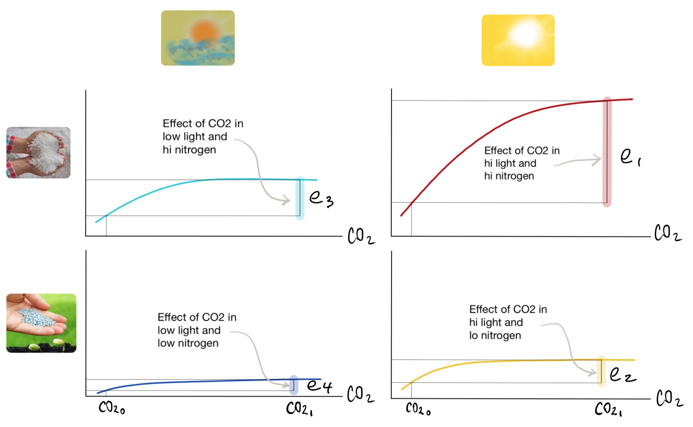

```{r setup0, include=FALSE}
knitr::opts_chunk$set(echo = TRUE)
```


```{r message=FALSE, warning=FALSE, paged.print=FALSE, echo=FALSE, include=FALSE}
# load packages for chapter

options(digits = 10)
library(bookdown)
library(emmeans)
library(ggplot2)
library(dplyr)
library(kableExtra)
library(knitr)
library(tables)
library(pander)
library(multcomp)
library(agricolae)
library(nlme)
library(car)
library(tidyr)

```


# Treatment Structures and Comparisons {#chTrtstr}

## Learning Objectives for Chapter {#LearnObj12}
1. Identify treatments and factor levels in a factorial experiment.
1. State the null and alternative hypotheses of a factorial experiment.
1. Define and compare simple and main effects in a factorial.
1. Given a graph of factorial experiment results, determine if there are main effects and/or interaction effects. 
1. Calculate PLSD confidence intervals for a pairwise comparison of means and determine if two means are significantly different based on the CIs. 
1. Design factorial treatment combinations to answer a research question.
1. Transform a real-world question into a null hypothesis about means.
1. Create linear combinations of means that address practical real-world questions.
1. Define statistical interaction and explain it graphically.
1. Test hypotheses involving more than one and more than 2 means.
1. Interpret result of ANOVA with factorial treatments.
1. Interpret a graph of a factorial experiment, including description of L, Q and C trends.
1. Given a set of treatments, formulate and test useful contrasts.
1. Determine if a linear combination of means is a contrast.
1. Create contrasts to estimate the value and variance of interactions.
1. Estimate the variance of a linear combination of means.
1. Make confidence intervals for linear combination of estimated means.
1. Calculate and use the Least Significant Difference (LSD) to test for differences among treatments.
1. Apply the Protected LSD and explain how it ameliorates the inflation of alpha?
1. Create linear combinations of estimated treatment means.
1. Create contrasts to answer research questions such as effects of treatments, linear and quadratic effects of continuous treatment variables.


## Pairwise Comparisons {#PairComp}

ANOVA performs one test for the whole experiment, and one for each effect or line item in the model, including treatments. The single F test for treatments is used to test the null hypothesis that there are no treatment effects. If the F-value is greater than the critical value "from table" we reject Ho and accept the alternative, but we still do not know which treatments or factor levels are significantly different from each other. Estimated means need to be compared to determine which ones are different.

### Least Significant Difference

Means are compared by subtracting one from the other and testing if the difference is significantly different form zero.

$$H_0: \mu_1 = \mu_2 \\
H_0: \mu_1 - \mu_2 = 0$$

Because the means are not known we use the estimates. Estimates of means are statistics, and because they are calculated as linear functions of normally distributed random variables, they are themselves normally distributed random variables.

```{block, type = 'stattip'}
- Recall: Linear combinations of normal random variables are normal random variables.
- The mean of a linear combination is the linear combination of the means.
- The variance of the difference between two RV's is the sum of the individual variances plus twice their covariance.
- Estimated means of balanced experiments are independent random variables (i.e. their covariance is zero).
```

The variance of an estimated mean depends on the number of observations used to estimate the mean (number of observations averaged) and on the variance of individual observations, which comes fro the random errors. The relationship between the variance of an average and the variance of individual observations is given by the **PRIME DIRECTIVE** of this course. 


### Experiment-wise and Family-wise Error Rates

When multiple means are compared sequentially, a new problem arises. To understand the solution, first we need to fully understand the problem. In testing hypotheses we are particularly interested in avoiding problemd of "false positives" where two averages appear to be significantly different while they really are not. This is called "Type I" error. The nominal probability of making a Type I error in a test is $\alpha$. This is referred to as the "test-wise" or "comparison-wise" error rate, because it is the error rate in each single comparison or test.

The probability of making at least one error Type I in a set of tests comparing treatments or testing other contrasts is called "family-wise" or "experiment-wise" error rate. Family-wise error rate tends to increase as the number of tests in the family increases, because an error in any of the tests is an error for the family. If tests are independent and test-wise error rate is kept constant at $\alpha$, the number of errors in a family has a Binomial distribution. The probability of not making **any** errors in n comparisons, assuming independence, is $(1-\alpha)^n$. Thus, the probability of making *at least* one error is $1-(1-\alpha)^n$.

As an example, consider an experiment where there are 6 treatments. The total number of pairwise comparisons is 

$$\left(
    \begin{array}{c}
      6 \\
      2
    \end{array}
  \right) = \frac{6!}{2!(6-2)!} = 15$$

With 15 comparisons, the probability of making at least one error in the set is `r 1-(1-0.05)^15`. Obviosuly, this error is much greater than the nominal rate for each comparison. Several methods are available to make sure that the family-wise error rate remains close to the nominal of 5%.


## Factorials {#Factorials}

Factorials are experiments where treatments have a special structure resulting from combining levels of different factors. The treatment structure allows us to assess the effects of several treatment factors as well as the interaction between factors. The concept of **interaction** is fundamental in statistics and in life in general and it is treated in detail below. Let's concentrate on the factorial structure for now.

For a factorial set of treatments we need at least two factors or variables, each of which will take at least two values. Suppose you are trying to invite someone to have a meal with you and you want to maximize the chances of being accepted. Two main factors come into play: the type of cuisine you propose and the meal. In your town you have Mexican, Thai, Chinese, American and Japanese restaurants. You can have lunch or dinner. Therefore, you have 5 x 2 options for the invitation. For another example, imagine that you want to determine the best combination of speed and tire pressure to maximize your fuel efficiency whie commuting. The car manufacturer gives a recommendation for tire pressure, but that is not specifically adjusted for the roads in your commute, or for your typical range of speeds. You can choose several tire pressures around the manufacturers recommendation, and several speeds that are resonable around your average. Most likely, the effect of tire pressure will depend on speed because the relative importance of tire resistance and boncing depend on speed. Say you choose 32, 34 and 36 psi for tire pressure and 65, 70 and 75 mph for speed. You will have to test 3 x 3 combinations. These are called complete factorials because each level of each factor appears with each level of the other factors. Sometimes we say that the factors are *crossed* as in a table where rows are levels of one factor and columns are levels of the other factor (Table \@ref(tab:CrossedFactors))

<br><br>

Table: (\#tab:CrossedFactors) Treatments resulting from the factorial combination of three levels of tire pressure (columns) and three levels of speed (rows). The treatment structure is a 3x3 factorial.

|         |  32 psi  |  34 psi  |  36 psi  |
|--------:|:--------:|:--------:|:--------:|
| 65 mph  |  65-32   |  65-34   |  65-36   |
| 70 mph  |  70-32   |  70-34   |  70-36   |
| 75 mph  |  75-32   |  75-34   |  75-36   |

<br><br>

### Interactions

Statistically, a two way interaction (or simply an interaction) is present when the effect of one factor depends on the level of another. The combined effects of changes in two factors is larger (synergistic or positive interaction) or smaller (antagonistic or negative interaction) than the sum of individual effects obtained when each factors is changed at a time. Interactions are common and we are familiar with them in daily life, but we typically do not take the time to think of them as interactions. Take for example the effect of putting on a nice warm coat on your level of comfort. It is a desirable effect if it is cold and not so good if it is really hot. There is an interaction between clothing and weather on comfort.

Three variables are involved in a two-way interaction, two predictor variables or treatment factors and one response variable. We say that predictor variable 1 (clothing) interacts with predictor variable 2 (ambient temperature) to determine the value of the reponse variable (level of comfort). Typical examples of interactions are:

- environment by genotype interaction on phenotype;
- drug interaction of alcohol with opiods on alertness;
- nitrogen and water supply interaction on crop yield.

Interactions are scale dependent, which is a specific effect of the fact that interactions depend on the response variable. An interaction that is significant in one scale may become non-significant after a logarithmic transformation of the response variable.

Hamilton and Saito [@HamiltonSaito2014] describe an interaction between level of education and political affiliation on belief in anthropogenic climate change (\@ref(fig:HamiltonSaito2014)). The effect of increasing education on the proportion of people that believe that climate change is mostly anthropogenic depends on their political affiliation: while for Democrats belief increases with increasing education, for Republicans there is no effect and for Tea Party members it.

<br>

```{r HamiltonSaito2014, message=FALSE, warning=FALSE, paged.print=FALSE, out.width = '50%', fig.align='center', echo=FALSE, fig.cap ="Example of an interaction graph where political party and level of education interact in determining the probability that a person believes that climate change is mostly anthropogenic. See citation in text."}

knitr::include_graphics("images/HamiltonSaito2014.png")

```

<br>

Olson et al. [@OlsonEtAl1991] reported a typical genotype by environment on calf birth weight showing that different cattle breed have specific adaptation to environmental conditions. Brahman is a breed of *Bos indicus* that evolved in Asia and has been selected for tropical conditions, whereas Angus and Hereford are breeds that were selected for colder climates with higher quality forages. The effect of location on calf birth weight (kg) depends on the breed, therefore, there is an interaction.

<br>

```{r OlsonEtAl1991, message=FALSE, warning=FALSE, paged.print=FALSE, out.width = '60%', fig.align='center', echo=FALSE, fig.cap ="Example of genotype by environment interaction on calf birth weight. British crosses (Angus-Hereford) perform better in Nebraska, whereas Brahman crosses do better in the semitropical climate of Florida. Vertical bars are standard errors of estimated means"}

calfBW <- read.table(header = TRUE, text = "
Location BreedType weight SE
Florida Angus-Hereford 26.9 0.7
Florida Brahman-Hereford 28.8 0.7
Nebraska Angus-Hereford 37.4 0.6
Nebraska Brahman-Hereford 36.0 0.5
")

ggplot(data = calfBW, aes(x = Location, y = weight, group = BreedType)) + 
   geom_line(size = 1.5, 
             aes(linetype = BreedType, 
                 color = BreedType)) + 
   geom_point(size = 4, 
              aes(color = BreedType), 
              position = position_dodge(0.05)) + 
   geom_errorbar(aes(ymin = weight - SE, 
                     ymax = weight + SE, 
                     color = BreedType), 
                 width = 0.2,
                 position = position_dodge(0.05)) + 
   labs(x = "Location", y = "Calf birth weight (kg)") + 
   theme(legend.position = c(0.7, 0.2))

```

<br>

Factorial treatment combinations can result from combining levels of more than two factors. There is no theoretical limit to the number of factors that can be included, but the number of treatments grows very fast with number of treatments and levels per factor. For example, a factorial of three factors, each with three levels has 27 different treatments.

When there are more than two factors, new levels of interactions appear in the partition of variation and each observation. With three factors, say A, B and C there are three 2-way interactions (AB, AC and BC) and one 3-way interaction (ABC). A 3-way interaction means that the two way interaction between two of the three factors is different in the two levels of the third factor.

Photosynthesis and plant growth are known to require nitrogen (mostly for enzymes, nucleic acids and structural proteins), light and carbon dioxide. Growth rate typically responds nonlinearly to each of these factors and is limited by all of them. Figure \@ref(fig:threeWayA) shows a representation of a typical pattern of response.

<br>

```{r threeWayA, message=FALSE, warning=FALSE, paged.print=FALSE, out.width = '60%', fig.align='center', echo=FALSE, fig.cap ="Representation of effects of light intensity, nitrogen and carbon dioxide concentration on photosynthesis rate by a well watered plant. $N_0$ and $N_1$ represents low and high nitrogen fertilization. $CO_{2_0}$ and $CO_{2_1}$ are low and high concentrations of carbon dioxide. Effects of increasing $CO_2$ concentration with high light intensity are labeled $e_1$ and $e_2$ for low and high N. Effects of increasing $CO_2$ concentration with low light intensity are labeled $e_3$ and $e_4$ for low and high N."}


```

<br>

To work our way up to the 3-way interaction we start with "effects" of increasing $CO_2$ concentration. The effect of increasing $CO_2$ concentration in with high light and N is calculated on the red curve in the top graph. The four curves are separated into different panels to facilitate the visualization of effects (\@ref(fig:threeWayB))

<br>

```{r threeWayB, message=FALSE, warning=FALSE, paged.print=FALSE, out.width = '100%', fig.align='center', echo=FALSE, fig.cap ="Same information as in previous figure, but presented in one separate set of axes for each combination of light intensity and N fertilizer addition. Top row has high N, and right colunm has high light intensity. The effect of increasing $CO_2$ concentration is depiced by a vertical bar and labeled $e_1$ to $e_4$."}



```

<br>

To calculate the effect of increasing $CO_2$ concentration in with high light and N, we move vertically on $CO_{2_0}$ and $CO_{2_1}$ until we reach the red curve. At each of the two points reached on the red curve we move horizontally to the left until we reach the Y axis, were we read the photosynthesis rate (PR) for low and high $CO_2$. The difference between the two PR's is the effect of increasing $CO_2$ for high light intensity and high level of N fertilization, and it is labeled $e_1$. The process is repeated for each one of the graphs to get the effect of increasing $CO_2$ in each of the other three combinations of light and N, which are labeled $e_2$ through $e_4$.

<br>

First, consider only the two graphs with high light intensity (righ column of Figure \@ref(fig:threeWayB). We have a large effect of $CO_2$ with high N ($e_1$, red vertical bar) and a smaller effect of $CO_2$ with low N ($e_2$, yellow vertical bar). Therefore, the effect of $CO_2$ depends on the level of N, which fits the definition of a significant 2-way interaction. The value of this interaction is the difference in length between the red and the yellow bars or $e_1 - e_2$, which is represented in Figure \@ref(fig:threeWayC) with a green vertical  bar.

Now consider only the two graphs with low light intensity (left column of Figure \@ref(fig:threeWayB)). By repeating the same procedure applied in the right column we get two new effects of increasing $CO_2$ ($e_3$ with high and $e_4$ with low N) and their difference, which is the value of the 2-way interaction between $CO_2$ and N with low light (dark red or maroon vertical bar).

Finally, just like the difference in effects of one factor between levels or a second one is the 2-way interaction, the difference between 2-way interactions between levels of a third factor is the 3-way interaction, which is represented by the dark pink vertical bar.

<br>

```{r threeWayC, message=FALSE, warning=FALSE, paged.print=FALSE, out.width = '100%', fig.align='center', echo=FALSE, fig.cap ="Two-way interactions between $CO_2$ and nitrogen are calculated as differences of effects of $CO_2$ between levels of N. There is a large difference in the high light condition and a smaller difference in the low light condifion. The difference between the 2-way $CO_2$ x N interactions in the two light conditions constitute the 3-way light x $CO_2$ x N interaction."}

knitr::include_graphics("images/3WayFactorialC.png")

```

<br>


Four factors produce six 2-way interactions (AB, AC, AD, BC, BD, CD), four 3-way interactions (ABC, ABD, ACD, BCD) and one 4-way interaction (ABCD), and so on. Two-way interactions are common and easy to understand intuitively; 3-way interactions may be common and are a bit harder to understand intuitively; 4-way interactions are almost impossible to understand in general terms for most people. However, I would guess that in the "real world" there are all sorts of complex interactions. Consider for example that you study plant growth rate and you use a factorial of four factors, each with 2 levels: with or without water, with or without carbon dioxide, with or without light and at -20 and 20 C. The plant will only grow in one of the 16 treatments, the one that includes water, carbon dioxide, light and a positive temperature. That is a 4-way interaction.

### Interactions and Main Effects

When a factorial has a significant interaction, the **main effects may have little meaning**, because they average over conditions that have different consequences for the factor in question. Take for example a typical (realistic but fictitious data) experiment in which a strong ecotype by environment is present. Two ecotypes (Montanus and Desertorum) are grown in two environments (desert and mountain) in what is called a reciprocal transplant experiment, where each ecotype is grown in its native environment and in the other's environment, with replication. Mature size of the organisms (could be plants or animals or anything else that is alive and has a mature size) is measured and analyzed.

<br>

```{r interxVsMain, message=FALSE, warning=FALSE, paged.print=FALSE, out.width = '60%', fig.align='center', echo=FALSE, fig.cap ="Interaction plot showing the effects of ecotpye and environment on mature size. Although there are obsious responses to the treatments, main effects show no response for either factor."}

knitr::include_graphics("images/interxVsMain.png")

```

<br>

Each ecotype does better than the other when grown in its original environment (Panel A, Figure \@ref(fig:interxVsMain)). However, on average over ecotypes and over environments, there are no differences in mature size (Panels B and C, Figure \@ref(fig:interxVsMain)). The main effects hide the clear pattern of response exhibited by the individual treatment means. It would not make sense to say that either factor has no effect, however it is true that averaged over the levels of ecotype, environment had not effect, and vice versa. Thus, whenever interactions are present and significant, interpretation of results should start with an inspection of interaction graphs.
<br>

### Model and Calculations in Factorials

Factorial treatments can be used with different experimental designs, because the treatment structure is independent of the experimental design that determines how treatments are assigned to experimental units. Consider an experiment in which two factors (say nitrogen fertilization and amount of irrigation) are used to create a factorial treatment structure by combining all levels of both factors. Each combination is a treatment, and we can (but some times we may not want to) ignore the treatment structure when assigning treatments to experimental units. We start with the simplest experimental design, the completely radomized design (CRD) where treatments are assigned to experimental units completely at random.

To make the equations general, we will call

- nitrogen *factor A* with levels $a_1, \dots, a_{k_a}$ and 

- irrigation will be *factor B* with levels $b_1, \dots, b_{k_b}$.

For example, the third nitrogen fertilization level is called $a_3$, and the first level of irrigation is $b_1$, thus, the treatment with level 3 of nitrogen and level 1 of irrigation is called $a_3b_1$. The symbol $k_a$ represent the number of levels of factor A, and $k_b$ is the number of levels of factor B. The statistical model for this experiment is:

<br><br>

\begin{equation}
Y_{ijh} = \mu_{ij.} + \epsilon_{ijh} \\[20pt]
= \mu_{...} + \tau_{ij} + \epsilon_{ijh} \\[20pt]
= \mu_{...} + \alpha_i + \beta_j + \alpha\beta_{ij} + \epsilon_{ijh} \\[20pt]
\epsilon_{ijh} \sim N(0,\sigma) \\[20pt]
\text{where: } \quad \mu_{...} \quad \text{is the overall mean} \\[20pt]
\mu_{ij.} = \mu_{...} + \alpha_i + \beta_j + \alpha\beta_{ij} \quad \text{is the mean for treatment} \ a_ib_j\\[20pt]
\tau_{ij} =  \alpha_i + \beta_j + \alpha\beta_{ij} \quad \text{is the effect of treatment} \ a_ib_j\\[20pt]
\alpha_i \quad \text{is the effect of level } a_i \text{ of factor } A\\[20pt]
\beta_j \quad \text{is the effect of level } b_j \text{ of factor } B \\[20pt]
\alpha\beta_{ij} \quad \text{is the interaction between } a_i \text{ and } b_j
(\#eq:crdFactorial)
\end{equation}

<br><br>

The model implies that each observation is partitioned into the five components present in the model: overall mean, effect of A, effect of B, interaction AB and random error. As usual, the model has a counterpart that uses estimates instead of the true but unknown parameter values. When the design is complete and balanced such that all treatments have the same number of replications,

<br><br>

\begin{equation}
Y_{ijh} = \hat{\mu}_{ij.} + \hat{\epsilon}_{ijh} \\[20pt]
= \hat{\mu}_{...} + \hat{\tau}_{ij} + \hat{\epsilon}_{ijh} \\[20pt]
= \hat{\mu}_{...} + \hat{\alpha}_i + \hat{\beta}_j + \hat{\alpha\beta}_{ij} + e_{ijh} \\[20pt]
\text{where: } \quad \hat{\mu}_{...} = \bar{Y}_{...} \quad \text{is the overall average} \\[20pt]
\hat{\tau}_{ij} = \bar{Y}_{ij.} - \bar{Y}_{...} = \hat{\alpha}_i + \hat{\beta}_j + \hat{\alpha\beta}_{ij} \quad \text{is the estimated effect of treatment} \ a_ib_j\\[20pt]
\hat{\alpha}_i = \bar{Y}_{i..} - \bar{Y}_{...} \quad \text{is the estimated effect of level } a_i \text{ of factor } A\\[20pt]
\hat{\beta}_j = \bar{Y}_{.j.} - \bar{Y}_{...} \quad \text{is the estimated effect of level } b_j \text{ of factor } B \\[20pt]
\hat{\alpha\beta}_{ij} = \bar{Y}_{ij.} -  \bar{Y}_{i..} - \bar{Y}_{.j.} + \bar{Y}_{...} \quad \text{is the estimated interaction between } a_i \text{ and } b_j
(\#eq:crdFactorialHat)
\end{equation}

<br><br>

If the experiment is laid out in a randomized complete block design, we simply add a term for blocks to the model (Equation \@ref(eq:rcbdFactorial)). Block effects are calculated as the difference of block averages and overall average, as usual

<br><br>

\begin{equation}
Y_{ijh} = \mu_{ij.} + B_h + \epsilon_{ijh} \\[20pt]
= \mu_{...} + \tau_{ij} + B_h + \epsilon_{ijh} \\[20pt]
\text{where: } \quad B_h \quad \text{is the effect of block h} \\[20pt]
B_h = \mu_{..j} - \mu_{...} \\[20pt]
\text{which is estimated as} \\[20pt]
\hat{B}_h = \bar{Y}_{..j} - \bar{Y}_{...} \\[20pt]
(\#eq:rcbdFactorial)
\end{equation}

<br><br>


#### R Code for Factorial in RCBD
The equations and calculations are illustrated with a numerical example. We conducted an experiment to determine the competitive ability of two naturalized grasses of the California Annual Grassland (Laca, unpublished data), *Lolium multiflorum* (Lam.) and *Bromus hordeaceus* (L.) which we will call Lomu and Brho for short. The experiment was laid out in an RCBD with 10 blocks and 6 treatments.  Blocks were used because the field had fertility gradients caused by differences in soil types. Treatment structure was a 2 x 3 factorial of **target** plant (the species of the plant measured, which was Lomu or Brho) and **competitor** (self, both and none), which was the species surrounding the target individual. "Self" competitor was a competitor of the same species as the target (intraspecific competition), "both" was a mix of both species, and "none" meant that the target plant was grown in an area that was kept clear of any other species within a radius of 10 cm of the target plant. All plots were circular and had a radius of 10 cm around the target plant (Figure \@ref(fig:LomuBrhoTrtFig)). Areas around plots were kept clear of vegetation. Target plant mass and height were measured at maturity. Plant mass was transformed to meet the assumption of homogeneity of variance, but the range of values is comparable to the original units in mg per plant. We analyze plant mass as a function of blocks and the factorial set of treatments.


**Goal and hypothesis** The goal of the study (for this section) was to determine if intra and interspecific competition were different for Lomu and Brho. The null hypothesis is that the effect of adding competitors depends on whether the competitor is of the same species or not. For logistic reasons, instead of using treatments with only interspecific competitors, we used a mixture of both species. Therefore, the main reason for the experiment was to determine if there was a significant statistical interaction between target and competitor species. We also had more specific hypotheses about which species was the superior competitor and the relative effects of intra and interspecific competition. Those are addressed in the [Section about Contrasts](#Contrasts). 

<br>

```{r LomuBrhoTrtFig, message=FALSE, warning=FALSE, paged.print=FALSE, out.width = '80%', fig.align='center', echo=FALSE, fig.cap ="Treatments used in the experiment to study competition between ryegrass (Lomu) and softchess (Brho). Rows are for target plants measured and columns are for competitor. Plots were circles of 20 cm diameter established in a field."}

knitr::include_graphics("images/LomuBrhoTrtFig.png")

```

<br>


```{r message=FALSE, warning=FALSE, paged.print=FALSE, echo=FALSE, include=FALSE}

lb.compDat <- read.table(header = TRUE, text = "
block species competitor ht.cm mass.mg
1 Brho 1.Self 23.9 203
1 Brho 2.Both 18 133
1 Brho 3.None 31.5 269
1 Lomu 1.Self 23.8 205
1 Lomu 2.Both 32.3 245
1 Lomu 3.None 27.8 391
2 Brho 1.Self 23.4 268
2 Brho 2.Both 25.6 221
2 Brho 3.None 30.8 340
2 Lomu 1.Self 42.6 369
2 Lomu 2.Both 19.9 226
2 Lomu 3.None 26.5 268
4 Brho 1.Self 36.7 413
4 Brho 2.Both 32.7 317
4 Brho 3.None 25.5 279
4 Lomu 1.Self 39.8 365
4 Lomu 2.Both 48.8 453
4 Lomu 3.None 63.7 649
5 Brho 1.Self 29 346
5 Brho 2.Both 23.4 287
5 Lomu 1.Self 25.9 240
5 Lomu 2.Both 20.5 205
5 Lomu 3.None 43 475
7 Brho 1.Self 15.2 136
7 Brho 2.Both 12.4 132
7 Brho 3.None 27 427
7 Lomu 1.Self 18.8 254
7 Lomu 2.Both 16.4 181
7 Lomu 3.None 26.9 425
8 Brho 1.Self 16.8 212
8 Brho 2.Both 12.3 109
8 Lomu 1.Self 13.8 252
8 Lomu 2.Both 14.8 207
8 Lomu 3.None 16 347
10 Brho 1.Self 15.9 205
10 Brho 2.Both 18.3 243
10 Brho 3.None 17.8 313
10 Lomu 1.Self 11.1 166
10 Lomu 2.Both 10.5 143
10 Lomu 3.None 21.6 410
11 Brho 1.Self 20.4 242
11 Brho 2.Both 12.2 129
11 Brho 3.None 24.5 345
11 Lomu 1.Self 12.3 186
11 Lomu 2.Both 14.2 177
11 Lomu 3.None 49.8 563
13 Brho 1.Self 35.9 401
13 Brho 2.Both 17.6 135
13 Brho 3.None 29.4 394
13 Lomu 1.Self 26 229
13 Lomu 2.Both 25.1 320
13 Lomu 3.None 60.8 508
14 Brho 1.Self 25.7 326
14 Brho 2.Both 17.9 162
14 Lomu 1.Self 15.5 190
14 Lomu 2.Both 26.7 222
14 Lomu 3.None 54.3 540
")

lb.compDat$block <- factor(lb.compDat$block)

# Impute data for Brho in blocks 5-3.None, 8-3.None and 14-3.None

library(nlme)
library(car)

lb.imp.m1 <- lme(fixed = mass.mg ~ species * competitor, 
                 random = ~ 1 | block, 
                 data = lb.compDat)

lb.imp.m2 <- lme(fixed = log(ht.cm) ~ species * competitor, 
                 random = ~ 1 | block, 
                 data = lb.compDat)

newdata <- data.frame(block = factor(c(5, 8, 14)), 
                      species = "Brho", 
                      competitor = "3.None")

set.seed(890)

newdata$mass.mg <- round(predict(lb.imp.m1, newdata = newdata) + 
   rnorm(dim(newdata)[1], mean = 0, sd = lb.imp.m1$sigma), 0)

newdata$ht.cm <- round(exp(predict(lb.imp.m2, newdata = newdata) + 
   rnorm(dim(newdata)[1], mean = 0, sd = lb.imp.m2$sigma)), 1)

lb.compDat <- rbind(lb.compDat, newdata)

lb.compDat <- lb.compDat[
   with(lb.compDat, 
        order(as.numeric(as.character(block)), 
              species, 
              competitor)), 
   ]

```


```{r LomuBrhoCompDat, message=FALSE, warning=FALSE, paged.print=TRUE, }

list(lb.compDat[1:30, c(1:3,5)], lb.compDat[31:60, c(1:3,5)]) %>%
   kable(caption = "Data from experiment on competition between ryegrass and softchess (Laca, unpublished data)", 
         row.names = FALSE, 
         digits = c(0, 0, 0, 1, 1)) %>% 
   kable_styling(font_size = 10, 
                 bootstrap_options = c("condensed"))

```

First we analyze the data using high-level R functions for linear models. Then, we will recreate the calculations "by hand" using basic functions and applying the formulas directly derived from the model. Prior to looking at results we check for homogeneity of residuals and normality using graphics. Residuals should be distributed symmetrically about zero, and should not exhibit any patterns when plotted against the predicted values for each observation. The quantile-quantile scatterplot should be closely grouped around a straight line.

<br>

```{r resdlLomuBrhoComp, message=FALSE, warning=FALSE, fig.cap="Residual plots for factorial of target and competitor in RCBD.", out.width='50%', fig.show='hold', fig.align='center'}

lb.m1 <- lm(mass.mg ~ block + species * competitor, data = lb.compDat)

plot(residuals(lb.m1) ~ fitted(lb.m1),
     xlab = "Fitted values (Y hats)", 
     ylab = "Residuals (e's)", 
     pch = 16, 
     col = "blue")

abline(h = 0, lty = 2, col = "red")

qqp(residuals(lb.m1), pch = 16, col = "blue")

```

<br>

Observations 12 and 15 are a little out of the assumed distribution (Figure \@ref(fig:resdlLomuBrhoComp)) because they have extremely large residuals compared to the rest of the observations. In a real analysis, we would explore the reasons why those observations have large residuals by double checking data entry and field notes, as well as integrity of lab samples. We note but ignore the outliers in the rest of the explanation, as the extreme residuals do not change the way calculations are done.

<br>

```{r aovLomuBrhoComp, message=FALSE, warning=FALSE, echo=FALSE}

kable(anova(lb.m1), 
      caption = "Analysis of variance table for Lomu vs. Brho competition experiment.", 
      digits = c(0, 0, 0, 2, 5)) %>% kable_styling(full_width = FALSE)

```

<br>

All effects in the model were significant. The line items in the ANOVA table (Table \@ref(tab:aovLomuBrhoComp)) correspond to specfic hypotheses, and the fact that the probabilities, listed in the last column, are all smaller than 0.05 means that all null hypotheses are rejected. In general, hypotheses tested are that effects are all zero, but the origin of the hypotheses is a set of questions about intra and interspecific competition. Our main question whether intra and interspecific competition is the same in boh species. This is convenient because it focuses first on the interaction. In general, the interactions should be tested first in factorials. If they are significant, then specific comparisons of cell means should be performed and interpreted, because marginal means may no be interpretable (see [Section about Contrasts](#Contrasts)).

**Interaction between species and competitor:** Is the effect of competition the same in both species? If competitive effects are equal, the **effect of adding competitors** will be the same in all cases. This effect is the difference between the control with no competition and each of the treatments with competitors, wthin species. To say that competitive strengths differs between species is the same as stating that the effects of competition (factor B)  differ between levels of species (factor A), which is the definition of interaction. So our first interesting hypothesis refers directly to the interaction.

<br>

$$\text{ Null hypothesis: competition effects are the same for Lomu and Brho } \\[15pt]
H_0: \alpha\beta_{ij} =  0 \quad \text{for all pairs } \ i,j \\[15pt]
\text{which is equivalent to: } \\[15pt]
\begin{equation}
H_0: \quad
  \begin{cases}
    \mu_{LomuNone} - \mu_{LomuSelf} = \mu_{BrhoNone} - \mu_{BrhoSelf} & \quad \text{and} \\
    \mu_{LomuNone} - \mu_{LomuBoth} = \mu_{BrhoNone} - \mu_{BrhoBoth} & \quad \text{and} \\
    \mu_{LomuBoth} - \mu_{LomuSelf} = \mu_{BrhoBoth} - \mu_{BrhoSelf} 
  \end{cases} \\[45pt]
\text{Alternative hypothesis: at least one of the three pairs of effects is not equal} \\[15pt]
\end{equation}$$

<br>

The hypothesis about interactions is tested in the line of the ANOVA labeled `species:competitor`. The calculated F value is `r round(anova(lb.m1)$'F value'[4], 2)`, which is rather large. The probability of observing a calculated F of such value or larger when $H_0$ is true (called "p-value") is `r round(anova(lb.m1)$'Pr(>F)'[4], 4)`, which is smaller than the $\alpha = 0.05$ required for rejecting the null hypothesis. Thus, we reject $H_0$ and accept $H_a$, which means that competition effects differ between the species. Because the interaction is "significant," we can proceed to more detailed comparisons of cell means to answer the question more specifically: which species is the superior competitor, and how does competition against both competitors differ from competing against self? Those specific hypotheses are addressed below (see [Section about Contrasts](#Contrasts)).

**Marginal competition effect:** is there an effect of competition on mature mass? We pose the null hypothesis that leads to a strong inference by its rejection: on average over species, competition does not affect mature size. If there were no competition, then plant mass at maturity for each species should not be affected by the competitor treatment. Lomu and Brho may differ in mean size, but their size would not be affected by the competitor. Keep in mind that a significant interaction was detected, so the interpretation of marginal results may be misleading and have to be considered  with caution. The line corresponding to `competitor` in the ANOVA table (Table \@ref(tab:aovLomuBrhoComp)) shows a p-value of `r round(anova(lb.m1)$'Pr(>F)'[3], 4)`, which is significant. The null hypothesis that competition has no effect, or that mature size is the same, regardless of competition, is rejected.

<br>

$$\text{ Null hypothesis: there is no competition effect on mature size } \\[15pt]
H_0: \mu_{.None} = \mu_{.Self} =  \mu_{.Both} \\[15pt]
\text{Alternative hypothesis: at least one of the three pairs is not equal} \\[15pt]
\begin{equation}
H_a: \quad
  \begin{cases}
    \mu_{.None} \neq  \mu_{.Self}       & \quad \text{or} \\
    \mu_{.None} \neq  \mu_{.Both}       & \quad \text{or} \\
    \mu_{.Self} \neq  \mu_{.Both}
  \end{cases}
\end{equation}$$

<br>

Note that the hypotheses were posed as means or effects being equal or not equal. It would be equivalent to state that the differences between the terms on each side of the "=" sign are zero. For example:

<br>

$$H_0: \mu_{.None} = \mu_{.Self} =  \mu_{.Both} \\[15pt]$$
is equivalent to

<br>

$$H_0:\mu_{.None} - \mu_{.Self} = 0 \quad \text{AND} \quad \mu_{.None} - \mu_{.Both} = 0  \quad \text{AND} \quad \mu_{.Self} - \mu_{.Both} = 0 $$

<br>

**Marginal species effect:** do species differ in mature size, averaged over competition treatments? Because of the significant interaction detected, the same note about caution applies here. The interaction means that the difference in mature size between species depends on competition. Ignoring the interaction for now, we test the marginal effect of species. Based on the line for `species` in the ANOVA table, we reject the null hupothesis that mature plant mass is the same for both species. 

<br>

$$\text{ Null hypothesis: there is no species effect on mature size } \\[15pt]
H_0: \mu_{Lomu.} = \mu_{Brho.} \\[15pt]
\text{Alternative hypothesis: mature size differs between species} \\[15pt]
\begin{equation}
H_a: \quad
    \mu_{Lomu.} \neq  \mu_{Brho.}
\end{equation}$$

<br>

Results can be presented using a table or a figure. A figure facilitates the interpretation of interactions. A table also includes standard errors and marginal means, which is more complete but harder to interpret quickly. Both are presented below for illustration.

<br>

```{r LomuBrhoCompFig1, message=FALSE, warning=FALSE, paged.print=FALSE, out.width = '60%', fig.align='center', echo=FALSE, fig.cap ="Effects of species and competitor on mature plant size. Vertical bars are 95% confidence intervals. Plant mass is in transformed units, but values are commensurate with mass in mg."}

LomuBrhoMeans <- as.data.frame(emmeans(lb.m1, c("competitor", "species")))

ggplot(data = LomuBrhoMeans, aes(x = competitor, y = emmean, group = species)) + 
   geom_line(size = 1.5, 
             aes(linetype = species, 
                 color = species)) + 
   geom_point(size = 4, 
              aes(color = species), 
              position = position_dodge(0.05)) + 
   geom_errorbar(aes(ymin = lower.CL, 
                     ymax = upper.CL, 
                     color = species), 
                 width = 0.2,
                 position = position_dodge(0.05)) + 
   labs(x = "Competitor", y = "Mature plant mass") + 
   theme(legend.position = c(0.7, 0.2))

```

<br>

```{r message=FALSE, warning=FALSE, paged.print=FALSE}

cmm <- as.data.frame(emmeans(lb.m1, "competitor"))
smm <- as.data.frame(emmeans(lb.m1, "species"))
cspmm <- as.data.frame(emmeans(lb.m1, "species", "competitor"))

```

<br>

Table: (\#tab:SppCompTable) Estimated marginal and cell means of mature plant mass for competition experiment. Mature plant mass is in transformed units ^[$Y = 1000 \ \frac{[4 + \log(PlantMass.g + 0.03)]} {6}$]. Standard errors of cell means, marginal competitor and marginal species means are `r round(cspmm[1, 4], 2)`, `r round(cmm[1, 3], 2)` and `r round(smm[1, 3], 2)`.


|                |    **Competitor**         |                           |                            |                         |
|---------------:|:-------------------------:|:-------------------------:|----------------------------|-------------------------|
|**Species**     |    **Self**               |          **Both**         |        **None**            |      **Spp means**      |
|       Brho     | `r round(cspmm[1, 3], 1)` | `r round(cspmm[3, 3], 1)` |  `r round(cspmm[5, 3], 1)` | `r round(smm[1, 2], 1)` |
|       Lomu     | `r round(cspmm[2, 3], 1)` | `r round(cspmm[4, 3], 1)` | `r round(cspmm[6, 3], 1)`  | `r round(smm[2, 2], 1)` |
|**Comp. means** | `r round(cmm[1, 2], 1)`   | `r round(cmm[2, 2], 1)`   |  `r round(cmm[3, 2], 1)`   |                         |

<br>

**R Code Summary**

The analysis of the factorial experiment, without the code for making the pretty figues and table was very simple. It only required 5 short lines of code:

```{r FactorialCode1, message=FALSE, warning=FALSE}

# Fit model to data. lb.compDat is the data frame with data
lb.m1 <- lm(mass.mg ~ block + species * competitor, data = lb.compDat)

anova(lb.m1) # Perform ANOVA based on model

plot(residuals(lb.m1) ~ fitted(lb.m1)) # Check homogeneity of variance

qqp(residuals(lb.m1)) # Check normality

# Get marginal means, S.E. and CI's for competitor
emmeans(lb.m1, "competitor")

# Get marginal means, S.E. and CI's for species
emmeans(lb.m1, "species")

# Get cell means, S.E. and CI's for treatments
emmeans(lb.m1, "species", "competitor")

```

#### Detailed Calculations for Factorial in RCBD

In this section we show the basic calculations to obtain parameter estimates and complete the ANOVA table for a factorial in a Randomized Complete Block Design. First, we obtain the parameter estimates by using overall and marginal averages. Then we partition each observation using the parameters and calculate the corresponding sums of squares. Finally, degrees of freedom are computed and the ANOVA table is constructed.
Treatment averages:


```{r message=FALSE, warning=FALSE, include=FALSE}

brho <- which(lb.compDat$species == "Brho")
self <- which(lb.compDat$competitor == "1.Self")
brho.self <- intersect(brho, self)

lb.compDat[brho.self, "mass.mg"]

paste(as.character(lb.compDat[brho.self, "mass.mg"]), collapse = " + ")

mean(lb.compDat[brho.self, "mass.mg"])

```

<br>

$$\hat{\mu}_{ij.} = \bar{Y}_{ij.} = \frac{1}{r}\sum^{h=r}_{h=1}Y{ijh} \\[25pt]
\text{For example: } \\[25pt]
\hat{\mu}_{Brho,1.Self} = \frac{203 + 268 + 413 + 346 + 136 + 212 + 205 + 242 + 401 + 326}{10} = $$ `r mean(lb.compDat[brho.self, "mass.mg"])`

<br>

We can calculate treatment or cell averages using the `aggregate` function in R. Averages are merged with the data set so we can calculate treatment effects and later partition them into main effects and interactions.

```{block, type='rtip'}
Writing code in R can be greatly facilitated by carefully planning the names of objects. Note how the names below are organized such that it is easy to modify the code for species to get the code for competitors. The first chunk for cell averages was copied and quickly edited to get the chunks for marginal and block averages.
```


```{r}

(cell.avgs <- aggregate(mass.mg ~ species + competitor, 
                         data = lb.compDat, 
                         FUN = mean))

names(cell.avgs)[3] <- "cell.avg"

lb.compDat <- merge(lb.compDat, 
                    cell.avgs, 
                    all = TRUE)

```

Marginal averages are calculated as the averages of the corresponding cell averages.

$$\hat{\mu}_{i..} = \bar{Y}_{i..} = \frac{1}{k_b}\sum^{j=k_b}_{j=1}\bar{Y}_{ij.} = \frac{1}{k_b}\sum^{j=k_b}_{j=1}\hat{\mu}_{ij.} \\[25pt]
\text{where } k_b = 3 \text{ is the number of levels of factor B (competitor). For example: } \\[25pt]
\hat{\mu}_{Brho} = \frac{275.2 + 186.8 + 342.9}{3} = `r mean(cell.avgs[cell.avgs$species == "Brho", "cell.avg"])`$$

<br>

```{r}
(s.avgs <- aggregate(cell.avg ~ species, # get species averages
                     data = cell.avgs, 
                     FUN = mean))

names(s.avgs)[2] <- "sp.avg" # change column name to facilitate merge

(comp.avgs <- aggregate(cell.avg ~ competitor, # get competitor averages
                     data = cell.avgs, 
                     FUN = mean))

names(comp.avgs)[2] <- "comp.avg" # change column name to facilitate merge

```

<br>

$$\hat{\mu}_{.j.} = \bar{Y}_{.j.} = \frac{1}{k_a}\sum^{i=k_a}_{i=1}\bar{Y}_{ij.} = \frac{1}{k_a}\sum^{i=k_a}_{i=1}\hat{\mu}_{ij.} \\[25pt]
\text{where } k_a = 2 \text{ is the number of levels of factor A (target species). For example: } \\[25pt]
\hat{\mu}_{Self} = \frac{275.2 + 245.6}{2} = `r mean(comp.avgs[comp.avgs$competitor == "1.Self", "comp.avg"])`\\[30pt]$$

We follow an analogous procedure to estimate overall^[In this experiment, the overall average is the same as the estimated overall mean because the data are balanced (all treatments appear once in each block). When the number of observations differs among treatments, the estimated overall mean is not the overall average, but the average of all estimated treatment means.] and block means with block averages. As an exercise, write down the equations to calculate block averages for this data set before read any further. The equations are shown further down (Equation \@ref(eq:FactBlockAvg)).

```{r}
# merge data set with marginal species and competitor averages

lb.compDat <- merge(lb.compDat, 
                    s.avgs, 
                    all = TRUE)

lb.compDat <- merge(lb.compDat, 
                    comp.avgs, 
                    all = TRUE)

# calculate block averages and merge with data

b.avgs <- aggregate(mass.mg ~ block, 
                    data = lb.compDat, 
                    FUN = mean)

names(b.avgs)[2] <- "block.avg" # change column name to facilitate merge

lb.compDat <- merge(lb.compDat, 
                    b.avgs, 
                    all = TRUE)

print(lb.compDat[ , -4], digits = 5) # data with averages

```

<br>

\begin{equation}
\hat{\mu}_{..h} = \bar{Y}_{..h} = \frac{1}{k_a k_b} \sum^{i=k_a}_{i=1}\sum^{j=k_b}_{j=1}Y_{ijh}
(\#eq:FactBlockAvg)
\end{equation}

<br>

\begin{equation}
\hat{\mu}_{...} = \frac{1}{k_a k_b} \sum^{i=k_a}_{i=1}\sum^{j=k_b}_{j=1}\hat{\mu}_{ij.}
(\#eq:FactAllAvg)
\end{equation}

<br>

**Sums of Squares** Now that we have all averages we can calculate sums of squares. Sums of squares (SS) correspond to the effects in the model. Sums of squares are 

- TSS or total sum of squares that is the sum of squares of total differences between observed value ($Y_{ijh}$) and overall average ($\hat{\mu}_{...}$).

- SST or treatment sum of squares is the sum of squared differences between treatment (cell) averages$\hat{\mu}_{ij.}$ and overall average ($\hat{\mu}_{...}$).

- SSB or block sum of squares is the sum of squared differences between block average ($\hat{\mu}_{..h}$) and overall average ($\hat{\mu}_{...}$).

- SSE or residual (error) sum of squares of differences between observed value ($Y_{ijh}$) and predicted value ($\hat{Y}_{ijh}$), where predicted value is the sum of overall average and all effects.

Because the treatments have a factorial structure and each treatment effect $\tau_{ij}$ is partitioned into its components $\alpha_i$, $\beta_j$ and $\alpha\beta_{ij}$.Accordingly, SST is partitioned into SSA, SSB and SSAxB.

*Total sum of squares*

We use R to implement the equations that define each of the effects and corresponding sum of squares. First we calculate the overall average and use it to compute TSS. In the code below `all.avg` = $\mu_{...}$ and the column `lb.compDat$mass.mg` is the set of all $Y_{ijh}$. Thus, `sum((lb.compDat\$mass.mg - all.avg) ^ 2)`= $\sum_{i=1}^{k_a}\sum_{j=1}^{k_b}\sum_{h=1}^{r}(Y_{ijh} - \hat{\mu}_{...})^2$

```{r}

(all.avg <- mean(cell.avgs$cell.avg)) # get overall average

# Total sum of squares
(TSS <- sum((lb.compDat$mass.mg - all.avg) ^ 2))

```

*Sum of squares of Blocks*

Now we compute SSB. In the code below, `lb.compDat\$block.avg` is $\hat{\mu}_{..h}$, thus, `sum((lb.compDat\$block.avg - all.avg) ^ 2)` = $\sum_{i=1}^{k_a}\sum_{j=1}^{k_b}\sum_{h=1}^{r}(\hat{\mu}_{..h} - \hat{\mu}_{...})^2 = k_a k_b \sum_{h=1}^{r}(\hat{\mu}_{..h} - \hat{\mu}_{...})^2$

```{r}
# Sum of squares of blocks
(SSB <- sum((lb.compDat$block.avg - all.avg) ^ 2))

```


*Sum of squares of Treatments*

For the SST we use the column `lb.compDat$cell.avg`, which contains the estimated mean for each combination of target species and competitor assigned to each observation.

```{block, type='stattip'}
Keep in mind that each observation is partitioned into an estimate of the overall mean plus all effects: block, factor A, factor B, interactions AxB and residual. All sums for SS are over all observations, although some estimates are repeated. For example, the estimated effect of Brho is the same for all plots where Brho was the target species.
```

### Advantages of factorials

Consider that you have to study the effects of irrigation and fertilization with N on corn yield. You could take a simple approach and do one experiment for irrigation and another for nitrogen, or you could study both factor at the same time in a factorial experiment. Note that "factorial" refers to the way treatments are organized and it says nothing about the experimental design in terms of how treatments are assigned to experimental units.

Here we demonstrate two main advantages of factorials:

- abiliyt to detect interactions between factors, and
- much greater efficiency than separate experiments.

To show the advantage of a factorial, we first simulate two separate experiments and then a single combined experiment with both factors. By comparing the results we will be able to see that the factorial approach has advantages.

<br>

#### Effects of Irrigation alone

Using the simple approach, the experiment for irrigation includes two treatments: one or two irrigations. For this experiment, a moderate level of nitrogen of 160 lb/ac is selected. Treatments are repeated three times in each of two blocks (Table \@ref(tab:tblIrrigDat)). In this case we include replicates of treatments within blocks to have a total number of observations that will be comparable to case when we test both factors at once. The original data set has 20 observations, so we will simulate 12 observations ^[We use 12 instead of 10 for simplicity, to have the same number of replicates equal in all treatments. This is not absolutely necessary, but different sample sizes per treatment makes things a bit more complicated.] for the irrigation experiment and 10 observations for the nitrogen experiment.

<br>

```{r message=FALSE, warning=FALSE, paged.print=FALSE, echo=FALSE}

# Wheat yield data from page 137 of SG book

# IxN <- read.csv("IrrigationNitroFactorial.csv", header = TRUE)
IxN <- read.table(header = TRUE, text = "
Block Irrigation Nitrogen Yield
1 1 0 31.7
1 2 160 68.5
1 1 160 56.8
1 1 80 50
1 1 240 57.3
1 2 0 38.9
1 2 240 73.5
1 2 80 61.4
1 2 320 70.6
1 1 320 53.1
2 2 240 72.9
2 2 160 66.7
2 1 240 59.4
2 2 0 40
2 1 160 60.6
2 1 80 48.6
2 2 320 72.3
2 1 320 54.1
2 2 80 53.1
2 1 0 39.1
")

IxN$Block <- factor(IxN$Block)
IxN$Irrigation <- factor(IxN$Irrigation)
IxN$Nitrogen <- factor(IxN$Nitrogen)
IxN <- IxN[order(IxN$Block, IxN$Irrigation, IxN$Nitrogen), ]


# Get estimated parameters and use them to generate simulated data for single experiments.

set.seed(123)

ixn.m1 <- lm(Yield ~ Irrigation * Nitrogen + Block, data = IxN)

IrrigDat <- expand.grid(Block = levels(IxN$Block), 
                        Irrigation = factor(c(1,2)), 
                        Nitrogen = factor(160), 
                        rep = c(1:3))

IrrigDat$Yield <- predict(object = ixn.m1, 
                          newdata = IrrigDat) + 
   rnorm(dim(IrrigDat)[1], mean = 0, sd = summary(ixn.m1)$sigma)
```


```{r tblIrrigDat, echo= FALSE}

kable(IrrigDat, 
      caption = "Simulated data for a simple experiment to test the effect of irrigation on wheat yield.") %>% kable_styling(full_width = FALSE)

```
<br>

We analyze these data using the following model (Equation \@ref(eq:irrigMod1)), which is known to have the correct form because the data were simulated based on the same model. Note that the model does not mention the effect of nitrogen because the same dose of nitrogen was applied to all plots.
<br>

\begin{equation}
Y_{ijh} = \mu_{...} + \tau_i + B_j +  \epsilon_{ijh} \\[20pt]
\tau_i = \text{ effect of irrigation treatment with level i} \\
B_j = \text{ effect of block j} \\
\epsilon_{ijh} = \text{ random error in treatment i, block j and replicate h}
(\#eq:irrigMod1)
\end{equation}

<br>

```{r IrrigAnova, message=FALSE, warning=FALSE, paged.print=FALSE, echo=FALSE}

irrig.m1 <- lm(Yield ~ Irrigation + Block, data = IrrigDat)

kable(anova(irrig.m1), 
      caption = "ANOVA table for irrigation effects on yield.",
      digits = c(0, 1, 1, 2, 5)) %>% 
   kable_styling(full_width = FALSE)

```

<br>

```{r IrrigEmmeans, message=FALSE, warning=FALSE, paged.print=FALSE, echo=FALSE}

kable(emmeans(irrig.m1, "Irrigation"), 
      caption = "Effect of irrigation on wheat yield", 
      digits = c(0, 1, 2, 0, 2, 2)) %>% 
   kable_styling(full_width = FALSE)

```
<br>

The ANOVA table shows that there is a significant difference in yield between treatments. Table \@ref(tab:IrrigEmmeans) contains the estimated means for both irrigations and shows that yield is significantly greater with two than with a single irrigation. The precision of the estimates is reflected in both the MSE in the ANOVA table and in the width of the confidence intervals of the table of means, which is about `r round(2 * qt(p = 0.975, df = irrig.m1$df.residual) * sqrt(anova(irrig.m1)[3, 3] / 6), 2)` bushels/ac (1 bushel of wheat is equivalent to 60 lb). The width of the confidence interval is calculated as twice the product of the critical t value, which depends on the degrees of freedom of the residuals (dfe = 9), and the standard error, which is the square root of the MSE divided by the square root of the number of experimental units averaged to get each estimated mean. There were 12 experimental units equally divided between the two treatments in the experiment, so six experimental units were used for the average of each treatment.

```{r message=FALSE, warning=FALSE, paged.print=FALSE, echo=FALSE, include=FALSE}
tcrit <- qt(p = 0.975, df = irrig.m1$df.residual)
MSE <- anova(irrig.m1)[3, 3]
```


\begin{equation}
\text{CI width } = 2 \ t_{dfe, \alpha} \ \sqrt{\frac{MSE}{r}} \\[20pt]
\text{where the number of plots averaged per treatment is } r = 6 \\[20pt]
dfe = `r irrig.m1$df.residual` \\[20pt]
t_{dfe, \alpha} = `r round(tcrit, 4)` \\[20pt]
\text{therefore, CI width } = 2 \times `r round(tcrit, 4)` \times `r round(sqrt(MSE / 6), 3)` = `r round(2 * tcrit * sqrt(MSE / 6), 3)`
\end{equation}


<br>

#### Effects of Nitrogen alone

Following with the simple approach of one factor at a time, we do a second experiment to determine the effect of nitrogen fertilization on wheat yield. Five equally-spaced doses of nitrogen (0, 80, 160, 240 and 320 lb/ac) are selected. For this experiment, one irrigation is used for all plots. The five treatments are replicated in each of two blocks, such that each treatment appears in a single experimental unit per block.

```{r message=FALSE, warning=FALSE, paged.print=FALSE, include=FALSE}

NitroDat <- expand.grid(Block = levels(IxN$Block), 
                        Irrigation = factor(1), 
                        Nitrogen = factor(c(0, 80, 160, 240, 320)))

set.seed(123)

NitroDat$Yield <- predict(object = ixn.m1, 
                          newdata = NitroDat) + 
   rnorm(dim(NitroDat)[1], mean = 0, sd = summary(ixn.m1)$sigma)

```


```{r tblNitroDat, echo= FALSE}

kable(NitroDat, 
      caption = "Simulated data for a simple experiment to test the effect of nitrogen on wheat yield.") %>% kable_styling(full_width = FALSE)

```
<br>

We analyze these data using the following model (Equation \@ref(eq:NitroMod1)), which is known to have the correct form because the data were simulated based on the same model. Note that the model does not mention the effect of irrigation because the same single irrigation was applied to all plots.

<br>

\begin{equation}
\begin{aligned}
Y_{ij} &= \mu_{...} + \tau_i + B_j + \epsilon_{ij} \\[20pt]
\tau_i &= \text{ effect of nitrogen treatment with level i} \\
B_j &= \text{ effect of block j} \\
\epsilon_{ij} &= \text{ random error in treatment i, block j}
\end{aligned}
(\#eq:NitroMod1)
\end{equation}

<br>

```{r NitroAnova, message=FALSE, warning=FALSE, paged.print=FALSE, echo=FALSE}

nitro.m1 <- lm(Yield ~ Nitrogen + Block, data = NitroDat)

kable(anova(nitro.m1), 
      caption = "ANOVA table for nitrogen effects on yield.",
      digits = c(0, 1, 1, 2, 5)) %>% 
   kable_styling(full_width = FALSE)

```

<br>

```{r NitroEmmeans, message=FALSE, warning=FALSE, paged.print=FALSE, echo=FALSE}

kable(emmeans(nitro.m1, "Nitrogen"), 
      caption = "Effect of nitrogen on wheat yield", 
      digits = c(0, 1, 2, 0, 2, 2)) %>% 
   kable_styling(full_width = FALSE)

```
<br>

The ANOVA table for the nitrogen experiment shows that there is a significant difference in yield between treatments. Table \@ref(tab:NitroEmmeans) contains the estimated means for nitrogen doses and shows that yield is highest when a dose of 160 lb N/ac is applied. Note that the reponse to nitrogen in not a straight line, and that the effect of adding 80 lb N/ac depends on how much was added already. An important part of this result is that more is not always better when it comes to nitrogen and plants. Too much nitrogen has a negative effect on plant growth, and in wheat it is known to be detrimental to the metabolism necessary for grain filling. Too much nitrogen results in reduced antioxidant ability, which lead to increased lipied peroxidation [KongEtAl2017]. Moreover, wheat is unable to absorb all the applied nitrogen, which leads to nitrogen percolating into deeper soil layers and water contamination [DongEtAl2011]. A graph of the response to nitrogen levels reveals the non-linearity of the response and the reduction of yield for high N doses (Figure \@ref(fig:nitroFig1)).

<br><br>

```{r nitroFig1, message=FALSE, warning=FALSE, paged.print=FALSE, echo=FALSE, fig.cap ="Effects of nitrogen fertilization level on wheat yield. Vertical error bars are confidence intervals.", fig.align='center', out.width="80%"}

nitroMeans <- as.data.frame(emmeans(nitro.m1, "Nitrogen"))
nitroMeans$Nitrogen <- as.numeric(as.character(nitroMeans$Nitrogen))

ggplot(data = nitroMeans, aes(x = Nitrogen, y = emmean)) + 
   geom_line(size = 1.5) + 
   geom_point(size = 4) + 
   geom_errorbar(aes(ymin = lower.CL, ymax = upper.CL), width = 5,
                 position = position_dodge(0.05)) + 
   labs(x = "Nitrogen (lb/ac)", y = "Grain Yield (bu/ac)")

```

<br><br>

Precision of mean estimates is reflected in both the MSE in the ANOVA table and in the width of the confidence intervals of the table of means, which is about `r round(2 * qt(p = 0.975, df = nitro.m1$df.residual) * sqrt(anova(nitro.m1)[3, 3] / 2), 2)` bushels/ac. Again, confidence interval width is calculated as twice the product of the critical t value, which depends on the degrees of freedom of the residuals (in this case dfe = 4), and the standard error, which is the square root of the MSE divided by the square root of the number of experimental units averaged to get each estimated mean. There were 10 experimental units equally divided between the 5 treatments in the experiment, so 2 experimental units were used for the average of each nitrogen treatment.


```{r message=FALSE, warning=FALSE, paged.print=FALSE, echo=FALSE, include=FALSE}

tcrit <- qt(p = 0.975, df = nitro.m1$df.residual)

MSE <- anova(nitro.m1)[3, 3]

```

<br>

\begin{equation}
\text{CI width } = 2 \ t_{dfe, \alpha} \ \sqrt{\frac{MSE}{r}} \\[20pt]
\text{where the number of plots averaged per treatment is } r = 2 \\[20pt]
dfe = `r nitro.m1$df.residual` \\[20pt]
t_{dfe, \alpha} = `r round(tcrit, 4)` \\[20pt]
\text{therefore, CI width } = 2 \times `r round(tcrit, 4)` \times `r round(sqrt(MSE / 2), 3)` = `r round(2 * tcrit * sqrt(MSE / 2), 3)`
\end{equation}


If we base our irrigation and fertilization decisions in these two experiments we would decide to irrigate twice and apply 160 lb N/ac. As we will see below, it turns out that this is not the best decision possible, and that only a factorial experiment can reveal the optimal combination of irrigation and nitrogen because those two factors interact biologically and statistically.

<br>

#### Combined Effects of Irrigation and Nitrogen

Instead of two experiments, we could do a single one where all levels of irrigation are combined with all levels of nitrogen in a factorial treatment structure. Each treatment is replicated once in each of two blocks. The experiment has 5 levels of nitrogen x 2 levels of irrigation x 2 blocks = 20 plots or experimental units. This is 2 fewer than the two individuial experiments together.

```{r tblIxNDat, echo= FALSE}

tblixn <- cbind(IxN[IxN$Block == 1, 2:4],IxN[IxN$Block == 2, 4])

names(tblixn) <- c("Irrig", "Nitro", "Block 1", "Block 2")

kable(tblixn, 
      row.names = FALSE, 
      caption = "Wheat yield (bu/ac) in an experiment to test the joint effects of nitrogen (lb/ac) and irrigation (times).") %>% kable_styling(full_width = FALSE)

```
<br>

Data from the factorial experiment are analyzed using the model in Equation \@ref(eq:IxnMod1). The equation shows that each treatment effect is partitioned into nitrogen effect, irrigation effect and nitrogen by irrigation interaction. The interaction reflects the part of the response that is not explained by simply adding the individual effects of each factor.

<br>

\begin{equation}
\begin{aligned}
Y_{ijh} &= \mu_{...} + \tau_{ij} + B_j + \epsilon_{ij} \\[20pt]
\tau_{ij} &= \text{ effect of treatment with level i of nitrogen and level j of irrigation} \\
&= N_i + I_j + NI_{ij} \\
N_i &= \text{ effect of level i of nitrogen} \\
I_j &= \text{ effect of level j of irrigation} \\
IN_{ij} &= \text{ interaction effect of levels i and j} \\
B_j &= \text{ effect of block j} \\
\epsilon_{ij} &= \text{ random error in treatment i, block j}
\end{aligned}
(\#eq:IxnMod1)
\end{equation}

<br>

```{r IxNAnova, message=FALSE, warning=FALSE, paged.print=FALSE, echo=FALSE}

kable(anova(ixn.m1), 
      caption = "ANOVA table for nitrogen x irrigation factorial effects on yield.",
      digits = c(0, 1, 1, 2, 5)) %>% 
   kable_styling(full_width = FALSE)

```

<br>

Because we did the experiment using a factorial arrangewment of treatments, we have three types of comparisons we can do:

- compare average yield for levels of irrigation averaged over levels of nitrogen,
- compare average yield for levels of nitrogen averaged over levels of irrigation, and
- compare averages of individual treatments resulting from any two combinations of irrigation and nitrogen.

The estimated means for irrigation levels and the estimated means for nitrogen levels are called **marginal means** because they are at the margins of the table and are the averages over all levels of the other factors. The estimated means for individual treatments or combinations of the factors are frequently called **cell means**.

Compare tables \@ref(tab:NitroEmmeans) vs. \@ref(tab:NmargMeans) and \@ref(tab:IrrigEmmeans) vs. \@ref(tab:ImargMeans) to see the advantages of the factorial. In the case of nitrogen, the factorial experiment has larger dfe than the nitrogen experiment. In both cases the standard error (SE) is smaller in the factorial, mostly because estimated means come from averaging more observations than in the separate experiments, although the separate experiments had more observations in total. By combining the treatments in a factorial we increase the degrees of freedom in the residuals, which results in a smaller critical t value, and we increase the total number of observations averaged to get the estimated marginal means.

<br>

```{r NmargMeans, message=FALSE, warning=FALSE, paged.print=FALSE, echo=FALSE}

nmm <- as.data.frame(emmeans(ixn.m1, "Nitrogen"))

imm <- as.data.frame(emmeans(ixn.m1, "Irrigation"))

inmm <- as.data.frame(emmeans(ixn.m1, ~ Nitrogen * Irrigation))

kable(nmm, 
      caption = "Marginal effects of nitrogen on wheat yield", 
      digits = c(0, 1, 2, 0, 2, 2)) %>% 
   kable_styling(full_width = FALSE)

```

<br>

```{r ImargMeans, message=FALSE, warning=FALSE, paged.print=FALSE, echo=FALSE}

kable(imm, 
      caption = "Marginal effects of irrigation on wheat yield", 
      digits = c(0, 1, 2, 0, 2, 2)) %>% 
   kable_styling(full_width = FALSE)

```

<br>

```{r IxNcellMeans, message=FALSE, warning=FALSE, paged.print=FALSE, echo=FALSE}
kable(inmm, 
      caption = "Joint effects of nitrogen and irrigation on wheat yield", 
      digits = c(0, 0, 1, 2, 1, 1, 1)) %>% 
   kable_styling(full_width = FALSE)

```
<br>
<br>

Table: (\#tab:ixnTable) Estimated marginal and cell means for the irrigation by nitrogen factorial experiment. Nitrogen levels are in lb/ac, estimated mean yields are in bu/ac.

|                 |  Irrigation levels       |                           |                         |
|----------------:|:------------------------:|:-------------------------:|-------------------------|
|  **N levels*    |   **1 Irrigation**       |      **2 Irrigations**    |        **N means**      |
|          0      | `r round(inmm[1, 3], 1)` | `r round(inmm[6, 3], 1)`  | `r round(nmm[1, 2], 1)` |
|         80      | `r round(inmm[2, 3], 1)` | `r round(inmm[7, 3], 1)`  | `r round(nmm[2, 2], 1)` |
|        160      | `r round(inmm[3, 3], 1)` | `r round(inmm[8, 3], 1)`  | `r round(nmm[3, 2], 1)` |
|        240      | `r round(inmm[4, 3], 1)` | `r round(inmm[9, 3], 1)`  | `r round(nmm[4, 2], 1)` |
|        320      | `r round(inmm[5, 3], 1)` | `r round(inmm[10, 3], 1)` | `r round(nmm[5, 2], 1)` |
|**Irrig. means** | `r round(imm[1, 2], 1)`  | `r round(imm[2, 2], 1)`   |                         |

<br>

High precision, reflected in narrow confidence intervals and small LSD's are desirable because it means we have more certaint about the results of the experiment. Both the LSD and the width of confidence intervals have a factor that is the product of the critical t and the square root of the MSE divided by the number of observations averaged. Both the LSD and the CI width become smaller due of the joint effects of increased dfe and increased number of observations averaged for the marginal means.

<br>

$$LSD = t_{dfe, \alpha} \ \sqrt{\frac{2 \ MSE}{n_{obs}}}$$

<br>

$$CI_{width} = 2 \ t_{dfe, \alpha}\sqrt{\frac{MSE}{n_{obs}}}$$

<br>

A second and perhaps more important advantage of the factorial approach is that it reveals the potential interaction between factors. If there is an interaction, the effect of one factor depends on the level of the other factor. In the case of nitrogen and irrigation, there is a typical *positive interaction*, for example, because the effect of adding an extra 80 lb N/ac, from 160 to 240 lb N/ac, is greater with two than with a single irrigation (Figure \@ref(fig:ixnFig)). The value of the difference in effects can be calculated using a linear combination of treatment averages that is also a contrast: 

<br>

$$(\hat{\mu}_{240,2} - \hat{\mu}_{160,2}) - (\hat{\mu}_{240,1} - \hat{\mu}_{160,1}) = $$
<div style="text-align: center"> `r round(inmm[9, 3], 1)`  -  `r round(inmm[8, 3], 1)`  -  (`r round(inmm[4, 3], 1)`  -  `r round(inmm[3, 3], 1)`)  =  `r round(inmm[9, 3], 1) - round(inmm[8, 3], 1) -  (round(inmm[4, 3], 1) - round(inmm[3, 3], 1))`</div>

<br>

```{r ixnFig, message=FALSE, warning=FALSE, paged.print=FALSE, echo=FALSE, fig.cap ="Effects of nitrogen fertilization and irrigation on wheat yield. Vertical error bars are confidence intervals."}

ggplot(data = inmm, aes(x = Nitrogen, y = emmean, group = Irrigation)) + 
   geom_line(size = 1.5, 
             aes(linetype = Irrigation, 
                 color = Irrigation)) + 
   geom_point(size = 4, 
              aes(color = Irrigation), 
              position = position_dodge(0.05)) + 
   geom_errorbar(aes(ymin = lower.CL, ymax = upper.CL, color = Irrigation), 
                 width = 0.2,
                 position = position_dodge(0.05)) + 
   labs(x = "Nitrogen (lb/ac)", y = "Grain Yield (bu/ac)") + 
   theme(legend.position = c(0.7, 0.2))

```


## Contrasts {#Contrasts}

The Lomu Brho experiment (Figure \@ref(fig:LomuBrhoTrtFig)) was done because we wanted to answer specfic questions about how plants compete with each other. Based on previous observations, it looked like Lomu was a stronger competitor than Brho. This should result in an asymmetry of the interaction between species. First, we wanted to check that competition within 10 cm of a plant did have an impact on plant size, so a "control" treatment where plants were grown without competitors was included. We also wanted to test the hypothesis that intraspecific competition was greater in Lomu than in Brho, and that having half of the surrounding plants being of the other species ("2.Both" level of comptetitor) was sufficient for Lomu to experience reduced and Brho to experience increased competition relative to having only conspecifics. If indeed Brho is the weaker competitor, then Brho-1.Self should be larger than Brho-2.Both, and Lomu-1.Self should be smaller than Lomu-2.Both. These questions translate directly in contrasts that are special linear combinations of treatment means.

Recall that a linear combination of means ("ingredients") is like a recipe: each ingredient is multiplied by a known constant (coefficient) and added together. Contrasts are linear combinations of parameters in which the sum of the coefficients is zero.

$$Linear \ combination \ of \ estimated \ means = \sum_{i=1}^k c_i \ \hat{\mu}_{i} \\[20pt]
\text{where } c_i \text{ are known constants}$$

```{block, type='mydef'}
- A contrast is a linear combination of estimated parameters whose coefficients add up to zero.
- Two contrasts, $C_1$ and $C_2$, are orthogonal if the sum of the products of corresponding coefficients equals zero.
```

$$Contrast \ C \ = \sum_{i=1}^k c_i \ \hat{\mu}_{i} \\[20pt]
\text{where } c_i \text{ are known constants and }\sum_{i=1}^k c_i = 0$$

<br>

\begin{equation}
C_1 = \sum_{i=1}^kc_{1i}\hat{\mu}_{i} \ \text{ and } \ C_2 = \sum_{i=1}^k c_{2i}\hat{\mu}_{i} \ \text{ are orthogonal if }\\[20pt]
\sum_{i=1}^kc_{1i}c_{2i} = 0
(\#eq:orthoContr)
\end{equation}

<br>

- Contrasts are useful to test hypotheses because they have an expected value of 0 if the corresponding null hypothesis is true. Therefore, a contrast whose value is significantly diferent from zero leads to rejection of the null nypothesis.

- Each contrast has an associated sum of squares and one degree of freedom.

- Sums of squares of treatments, factors and interactions can be partitioned into as many orthogonal contrasts as their degrees of freedom.

- If the null hypothesis that the contrast of true parameter values is zero is true, the mean square of a contrast has an F distribution with 1 degree of freedom in the numerator and dfe degrees of freedom in the denominator.

- If the null hypothesis that the contrast of true parameter values is zero is true, the quotient of the estimated contrast and its standard error has a t distribution with dfe degrees of freedom.

```{block, type='stattip'}
- All testable hypothesis can be expressed as linear combinations of estimated parameters.
```

Contrasts can be classified as **Class comparisons** or **Trends**.

- **Class comparisons** are comparisons among treatments that have categorical factor levels. For example, the competition experiment involved class comparisons.

- **Trends** are comparisons among treatments that have quantitative levels. For example, in the irrigation by nitrogen experiment we can determine if the shape of the response to N was linear, quadratic, etc. 

<br>

**Class Comparisons**

Treatments can have structures other than factorials. A pair of typical classes of treatment is what is called "control" and "placebo." The control usually is a "treatment" for which experimental units receive no manipulation at all, whereas the placebo receives the same manipulation required to deliver an active principle, treatment of medicine, without actually including the compound or procedure that is being tested. This "controls" for the potential effects of the procedure that are not caused by the compound or procedure of interest. The use of placebos in medical experimentation is well established and it is generally understood. Patients can respond not only to the chemical compound in a medications but also to the idea of being cared for and to the process of ingesting a pill that might help them.

In agricultural sciences, controls are also necessary in some experiments. In order to study the effect of a dietary additive on animal production, we would want to have a control treatment that adds the same amount of energy and nutrients, but without the specific chemical compounds whose effect we want to test. To test the effect of a chemical in a pesticide application, a control treatment should involve the application of water and other additives as in the main treatment, but without the active principle to be tested.

One interesting example of necessary control is in the study of conditioned flavor aversions in animals. To test if sheep can be conditioned to avoid eating grape leaves to use them to graze between rows in vineyards, we dosed sheep with lithium chloride (Laca, unpublished work), which causes digestive discomfort. Sheep were given grape leaves and then dosed with LiCl delivered directly to the rumen with a tube. To determine if the LiCL was the cause of the aversion instead of the intubation procedure used to deliver it, we had a treatment in which sheep were intubated and given an equivalent amount of tapwater without LiCl.

```{block, type = 'stattip'}
The design of proper controls is an art beyond statistics. It involves concepts and interpretations that can be highly creative. Correct experimentation and interpretation of results requires much more than formally correct statistical methods.
```

In addition to controls and placebos, treatments may have natural classes that can be compared as such. For example, we may want to test the effects of several methods to control weeds on crop yield (fictitious example). We are not interested in isolating the effect of the chemicals' active principles, because those are already knonw to exist. The seven treatments are:

- Control: Undisturbed control 
- chemA: Spraying chemical A
- chemB: Spraying chemical B
- Flame: Flaming
- Steam: Covered steaming
- Hoe: Rotary hoe
- Blast: Abrassive blasting

```{r message=FALSE, warning=FALSE, paged.print=FALSE, echo=FALSE, include=FALSE}

set.seed(1217)

wc.trts <- c("Control", "chemA", "chemB", "Flame", "Steam", "Hoe", "Blast")

wc.fxs <- data.frame(wc.fx = c(600, -200, -200, 100, 100, -300, -100), 
                     trt = wc.trts)

weed.ctl.dat <- expand.grid(trt = wc.trts, rep = 1:5)

weed.ctl.dat <- merge(weed.ctl.dat, wc.fxs)

sigma <- 200
mu <- 1400

weed.ctl.dat$weed.mass <- with(weed.ctl.dat, 
                               mu + wc.fx + rnorm(n = length(trt), 
                                                  mean = 0, 
                                                  sd = sigma))

```


The effects of the chemical sprays can be determined with the following contrasts:

- Effect of spraying chemical A: chemA - Control
- Effect of spraying chemical B: chemB - Control
- Difference between effects of spraying A or B = (chemA - Control) - (chemB - Control) = chemA - chemB

Weed control methods tested can also be seen as being in two **classes**: chemical and non-chemical. Furthermore, non-chemical treatments can be classified as thermal or non-thermal. These classes offer a natural (but not unique) way to design contrasts. The difference between chemical and non-chemical treatments is calculated as the following contrast:

- Difference between chemical and non-chemical treatments = 2 (chemA + chemB) - (Flame + Steam + Hoe + Blast)

If we are interested in the difference between thermal and non-termal treatments, we can use the following contrast:

- Difference between thermal and non-thermal methods = (Flame + Steam) - (Hoe + Blast)

Finally, we want to test if Flame method is different from Blast^[Note that for simplicity, we use the language in a lax manner here and in other parts of the book. When writing "if Flame method is different from Blast," we actually mean "if the effect of the Flame method on response variable Y is the same as the effect of the Blast method on Y." Of course, the methods themselves ARE different as one involves burning weeds and in the other, weeds are blasted with an abrasive agent.]

However, these comparisons (contrasts) may not be all orthogonal to each other.

In order to check for orthogonality we need to specify all coefficients for all treatment averages, including the coefficients that are zero. Coefficients for treatment averages are organized in a vector with 7 columns to make a table of coefficients with 6 rows (contrasts) and 7 columns, one for each treatment mean. For the tests of hypotheses, the corresponding contrast is calculated by multiplying the row of the table times the vector of treatment averages:

<br>

\begin{equation}
\text{Vector with 7 columns, one for each estimated treatment mean} \\[10pt]
\hat{\vec{\mu}} = (\hat{\mu}_{Control}, \ \hat{\mu}_{chemA}, \ \hat{\mu}_{chemB}, \ \hat{\mu}_{Flame}, \ \hat{\mu}_{Steam}, \ \hat{\mu}_{Hoe}, \ \hat{\mu}_{Blast}) \\[20pt] \\
\text{Vector of contrast coefficients to estimate} \\
\text{the effect of chemical A relative to the control} \\[10pt]
\vec{c}_{chemA} = (-1, \ 1, \ 0, \ 0, \ 0, \ 0, \ 0) \\[20pt] \\
\text{Contrast chemA is obtained by summing the products of each} \\
\text{coefficient with the corresponding estimated mean: }\\[10pt]
chemA = \vec{c}_{chemA} . \hat{\vec{\mu}} = \\[10pt]
= -1 \ \hat{\mu}_{Control} + 1 \ \hat{\mu}_{chemA} + 0 \ \hat{\mu}_{chemB} + 0 \ \hat{\mu}_{Flame} + 0 \ \hat{\mu}_{Steam} + 0 \ \hat{\mu}_{Hoe} + 0 \ \hat{\mu}_{Blast} \\[10pt]
= \hat{\mu}_{chemA} - \hat{\mu}_{Control}\\[20pt]
\text{Vector of contrast coefficients to estimate} \\
\text{the effect of chemical B relative to the control} \\[10pt]
\vec{c}_{chemB} = (-1, \ 0, \ 1, \ 0, \ 0, \ 0, \ 0) \\[20pt] \\
\vec{c}_{chemA} \text{ and } \vec{c}_{chemB} \text{ are not orthogonal because } \ \vec{c}_{chemA} . \vec{c}_{chemB} = 1 \ne 0
\end{equation}

<br>

In the following R chunk we us R functions to facilitate the calculations and determine which pairs of contrasts are orthogonal and wich ones are not. First we create a vector of coefficients for each contrast and give it a name that helps us remember what it is. Then, the vectors are joined into a matrix using `rbind` and the columns are given names that indicate the average that is multiplied by each coefficient. A few pairs are tested individually and finally the matrix is used to calculate the sum of products for all possible pairs at once.

```{r, message=FALSE, warning=FALSE}

# Name the estimated treatment means
avg.names <- c("Control", "chemA", "chemB", "Flame", "Steam", "Hoe", "Blast")

chemAC <-     c(-1, 1,  0,  0,  0,  0,  0)
chemBC <-     c(-1, 0,  1,  0,  0,  0,  0)
chemAB <-     c( 0, 1, -1,  0,  0,  0,  0)
ch.nch <-     c( 0, 2,  2, -1, -1, -1, -1)
th.nth <-     c( 0, 0,  0,  1, -1,  1, -1)
FlameBlast <- c( 0, 0,  0,  1,  0,  0, -1)

contr.mat <- rbind(chemAC, 
                   chemBC, 
                   chemAB, 
                   ch.nch, 
                   th.nth,
                   FlameBlast)

colnames(contr.mat) <- avg.names

# Are chemA and chemB orthogonal? NO
sum(chemAC * chemBC)

# Are chemA and chemAB orthogonal? NO
sum(chemBC * chemAB)

# Are A and ch.nch orthogonal? NO
sum(chemAC * ch.nch)

# Are A and th.nth orthogonal? YES
sum(chemAC * th.nth)

# A table of all possible pairs is easily constructed by using matrix multiplication:
orth.mat <- contr.mat %*% t(contr.mat)

```


```{r OrthoContr1, message=FALSE, warning=FALSE, paged.print=FALSE, echo=FALSE}
kable(contr.mat, 
      caption = "Top: Coefficients for each treatment average (columns) for each of seven contrasts (rows) comparing weed control methods (chemA is effect of chemical A, chemB is effect of chemical BA, chemAB is their difference, ch.nch is chemical vs. non-chemical, th.nth is thermal vs. non-thermal, and FlameBlast is the difference between flaming and abrasive blasting. The coefficients in this table are created to reflect specific null hyotheses. Bottom: sum of products of corresponding coefficients for all pairs of contrasts (row in the left table). This is a symmetric matrix (the lower left triangle below the diagonal is the same as the upper right) because A is orthogonal to B if, and only if, B is orthogonal to A.") %>% kable_styling(full_width = FALSE)

kable(orth.mat) %>% kable_styling(full_width = FALSE)
```

<br>

Table \@ref(tab:OrthoContr1) shows that 6 out of the 15 pairs of contrasts are not orthogonal. For example, the number 2 in row 1 (chemA) and column 4 (ch.nch) of the table in the right results from the sum of the products of coefficients in rows 1 and 4 of the table on the left:

<br>

\begin{aligned}
2 = (-1)&\times0 \\
+ 1 &\times 2 \\
+ 0 &\times 2 \\
+ 0 &\times (-1) \\
+ 0 &\times (-1) \\
+ 0 &\times (-1) \\
+ 0 &\times (-1) \\
= \vec{c}_{chemA} &. \vec{c}_{ch.nch}
\end{aligned}

<br>

Although not mandatory, orthogonal contrasts are generally considered desirable particularly if they are posed before the data are collected. These so-called **a priori** sets of hypothesis are independent form each other and account for all the variation due to experimental treatments. Because they are *a priori*, it is accepted that no corerctions are needed to account for inflation of experimentwise error rate.

A complete set of orthogonal contrasts for the weed control example can be created as follows by taking a class-comparisons approach. The set has to have 6 contrasts because there are 7 treatments, and there is one orthogonal contrast per degree of freedom. This is not the only set of orthogonal contrasts possible; in fact there are 15 different possible sets of orthogonal contrasts for 7 treatment levels. The number of sets gets large very quickly as the <a href="http://www.southampton.ac.uk/~cpd/anovas/datasets/Contrast%20sets.htm" target="_blank">number of levels</a> increases.

<br>

```{r OrthoContr2, message=FALSE, warning=FALSE}

TvsC <-    c(-6,  1,  1,  1,  1,  1,  1) # Average treatment effect.
CvsNC <-   c( 0, -2, -2,  1,  1,  1,  1) # Chemical vs. non-chemical
AvsB <-    c( 0,  1, -1,  0,  0,  0,  0) # Do chemical treatments differ?
THvsNTH <- c( 0,  0,  0,  1,  1, -1, -1) # Thermal vs. non-thermal
CSvsFF <-  c( 0,  0,  0, -1,  1,  0,  0) # Does Steam differ from Flame?
RHvsAB <-  c( 0,  0,  0,  0,  0, -1,  1) # Does Hoe differ from Blast?

Cmat <- rbind(TvsC, 
              CvsNC, 
              AvsB, 
              THvsNTH, 
              CSvsFF, 
              RHvsAB)

(orth.mat <- Cmat %*% t(Cmat)) # All othtogonal!!

```

<br>

In the first contrast we compare all treatments against the control. In the second one we compare the chemical vs. non chemical treatments. The rationale behind the contrasts is that we compare the average of one class vs. the averge of another class. Although not strictly necessary, the coefficients are mltiplied by the largest denominator to make them all integers. For example, the average of chemical treatments is 
$$\frac{1}{2}\hat{\mu}_{chemA} + \frac{1}{2}\hat{\mu}_{chemB}$$
and the average of non-chemical treatments is 
$$\frac{1}{4}\hat{\mu}_{Flame} + \frac{1}{4}\hat{\mu}_{Steam} + \frac{1}{4}\hat{\mu}_{Hoe} + \frac{1}{4}\hat{\mu}_{Blast}$$
so we multiply all coefficients times 4 to obtain the set of integers that make the contrast coefficients.

Now that we have a meaningful set of orthogonal contrasts we can proceed with data analysis. Because contrasts are a priori, no correction for multiple comparisons will be applied.

**Caution:** - Some authors recommend applying corrections, even if comparisons were posed *a priori*.

```{r OrthoContr3, message=FALSE, warning=FALSE, paged.print=FALSE}

# Give treatments the same order used in the text:
weed.ctl.dat$trt <- factor(weed.ctl.dat$trt, 
                           levels = c("Control", 
                                      "chemA", 
                                      "chemB", 
                                      "Flame", 
                                      "Steam", 
                                      "Hoe", 
                                      "Blast"))

# Create a column for treatments with defined contrasts.
weed.ctl.dat$Ctrt <- weed.ctl.dat$trt

# Assign contrast structure to treatments.
# Cmat has to be transposed because R takes the contrasts as columns.
contrasts(weed.ctl.dat$Ctrt) <- t(Cmat)

# Second, run the model with orthogonal contrasts.
wc.m2 <- lm(weed.mass ~ Ctrt, data = weed.ctl.dat)

# The summary of an lm model gives us the t-tests for the contrasts.
# Where Ho is that the contrast equals zero.
summary(wc.m2)

```

When we run an `lm` it uses the contrasts specified for the treatment column, assuming that the contrast coefficients were given in the order of the levels of the factor column. The contrasts of the contrast matrix had names, and the program is able to read those and prints the tests with the corresponding names. The output of `summary(wc.m2)` shows the model call at the top, followed by summary statistics for the residuals. By definition, the average of residuals is zero. The median is greater than zero, indicating a bit of skewness. Under the heading `coefficients` we find a list of contrasts, their estimated value, standard error and calculated t (`t value`) with the corresponding probabilities for two-tailed tests; `t value = Estimate / Std. Error`. The estimated value of each contrast is simply the sum of the products of each mean and the corresponding contrast coefficient, for example,

$AvsB =  -1 \ \hat{\mu}_{Control} + 1 \ \hat{\mu}_{chemA} + 0 \ \hat{\mu}_{chemB} + 0 \ \hat{\mu}_{Flame} + 0 \ \hat{\mu}_{Steam} + 0 \ \hat{\mu}_{Hoe} + 0 \ \hat{\mu}_{Blast} = \hat{\mu}_{chemA} - \hat{\mu}_{Control}$

The first row of effects is an estimate of the overall mean, called `(Intercept)`, which is calculated based on a linear combination that is not a contrast. This line is usually not relevant for the analyses, as it tests that the overall mean is zero. Below the overall average there are lines for each contrast. On average, treatments reduced weed mass by ` r round(summary(wc.m2)$coefficients[2, 1], 1)` kg/ha, a value that was significantly different from 0. Non-chemical methods were slightly but significantly worse than chemical ones because the had ` r round(summary(wc.m2)$coefficients[3, 1], 1)` kg/ha more of weed mass. Interpretation of the rest of the contrasts is left as an exercise. Keep in mind that the sign of the estimated contrast and its meaning depends on which class was given the negative coefficients, which is arbitrary (i.e., we can choose).


```{r OrthoContr4, message=FALSE, warning=FALSE, paged.print=FALSE}

# The summary of the analysis of variance shows the
# complete partition of total SS into contrasts.

(wc.aov.tbl <- summary(aov(weed.mass ~ Ctrt, data = weed.ctl.dat), 
        split = list(Ctrt = list("TvsC" = 1, 
                                "CvsNC" = 2, 
                                "AvsB" = 3, 
                                "THvsNTH" = 4, 
                                "CSvsFF" = 5, 
                                "RHvsAB" = 6))))

kable(wc.aov.tbl[[1]], 
      caption = "Partition of SS into contrasts for weed control example. Meaning of contrasts are defined in R object Cmat above.") %>% kable_styling(full_width = FALSE)

# Show treatment means and confidence intervals.
emmeans(wc.m2, "Ctrt")

```

Each contrast has **1 df** and an associated **SS contrast**. The SS associated with each contrast in Table \@ref(tab:OrthoContr4) is calculated as follows:

<br>

$$\begin{aligned}
&\text{let } C_h \text{ be a row of coefficients for contrast } h \\[15pt]
&\text{and } \mathbf{C} = \begin{Bmatrix}c_{hi}\end{Bmatrix} \text{be a }(k-1) \times k \text{ matrix of orthogonal contrasts} \\[15pt]
&\text{for a set of k treatments in a balanced experiment with r replicates;} \\[15pt]
&\text{the sum of squares associated with each row of } \mathbf{C} \text{ is: } \\[15pt]
&SSC_h = \frac{r \sum_{i=1}^k \left( c_{hi}\bar{Y}_{i.} \right)^2 }{\sum_{i=1}^kc_{hi}^2}
(\#eq:SScontr)
\end{aligned}$$

<br>

Let's calculate the SSC for the first two contrasts in the weed control experiment "by hand" using basic R functions. Note that $\mathbf{C}$ in Equation \@ref(eq:SScontr) is the matrix called `Cmat` in the previous code. Recall that the first set of contrast coefficients, which is the first row of `Cmat`, is called `TvsC` and compares all weed control methods against the undisturbed control.

```{r message=FALSE, warning=FALSE, paged.print=FALSE}

# Make a vector with the estimated means for each treatment in the weed control experiment.
# We extract them from the estimated marginal means to avoid problems if the
# experiment were unbalanced.
mu.hat <- summary(emmeans(wc.m2, "Ctrt"))$emmean

names(mu.hat) <- summary(emmeans(wc.m2, "Ctrt"))$Ctrt

cbind(names(mu.hat), mu.hat)

# In this balanced case, aggregate also works:
aggregate(weed.mass ~ Ctrt, data = weed.ctl.dat, FUN = mean)

r <- max(weed.ctl.dat$rep)

(SS.TvsC <- r * (sum(TvsC * mu.hat)) ^ 2 / sum(TvsC ^ 2))

# If we use a small number of digits in the 'hand' calculations 
# we obtain a similar result, but not exactly the same due to rounding.
# Let this be a warning for the corroboration of formula results
# by actually typing in rounded numbers. (It does not always work!)

5 * ((-6) * 2108.876 + 
        1 * 1430.616 + 
        1 * 1003.274 + 
        1 * 1636.725 + 
        1 * 1551.933 + 
        1 * 1245.658 + 
        1 * 1313.272 ) ^ 2 / 
   ((-6) ^ 2 + 
       1 ^ 2 + 
       1 ^ 2 + 
       1 ^ 2 + 
       1 ^ 2 + 
       1 ^ 2 + 
       1 ^ 2) 

(SS.CvsNC <- r * (sum(CvsNC * mu.hat)) ^ 2 / sum(CvsNC ^ 2))

5 * (0 * 2108.876 + 
        (-2) * 1430.616 + 
        (-2) * 1003.274 + 
        1 * 1636.725 + 
        1 * 1551.933 + 
        1 * 1245.658 + 
        1 * 1313.272 ) ^ 2 / 
   (0 ^ 2 + 
       (-2) ^ 2 + 
       (-2) ^ 2 + 
       1 ^ 2 + 
       1 ^ 2 + 
       1 ^ 2 + 
       1 ^ 2)

```

Treatment SS (first row in Table \@ref(tab:OrthoContr4)) is the sum of all 6 contrast SS, because we used a complete set of orthogonal contrasts. Residual SS can be calculated by subtracting the treatment average from each observation, squaring and adding all results. MSE is SSE/dfe, where dfe = number of observations minus number of treatments, or we can get it directly from the `anova` in R using `anova(wc.m2)$'Mean Sq'[2]`.

```{r message=FALSE, warning=FALSE, paged.print=FALSE}
(MSE <- anova(wc.m2)$'Mean Sq'[2])

# Calculated F for treatments vs control.
(Fcalc.TvsC <- SS.TvsC / MSE)

df.num <- 1
(df.den <- length(weed.ctl.dat$weed.mass) - length(levels(weed.ctl.dat$Ctrt)))

# Probability of obtaining an F this large or larger is Ho is true.
(Prob.TvsC <- pf(Fcalc.TvsC, 
                 df1 = df.num, 
                 df2 = df.den, 
                 lower.tail = FALSE))

```

```{block, type = 'rtip'}
- Output of analyses in R typically are lists or other structures with components that can be extracted or even modified. Use the `str` function to see what parts are there and to figure out how to "bring them out."

```

## Trends {#Trends}

In the nitrogen by irrigation fertilization experiment (Table \@ref(tab:IxNAnova)) there are 9 df for treatments that are partitioned into 1 df for irrigation, 4 df for nitrogen and 4 df for the irrigation x nitrogen interaction. Thus, the corresponding SS can be partitioned into a total of 9 orthogonal contrasts: 1 for irrigation, 4 for nitrogen and 4 for the interaction. The specific contrasts are not unique, and we can design them to answer specific biological questions. A natural way to partition SS and df in the nitrogen by irrigation factorial is as follows:

1. Does one extra irrigation increase wheat yield, averaging across levels of nitrogen?
1. What is the simplest curve we can use to summarize the effect of nitrogen on wheat yield? Is the reponse linear, quadratic, cubic or quartic?
1. Does the shape of the response to nitrogen depend on the number of irrigations? How does it differ? 

Because the levels of nitrogen are quantitative, we can create contrasts that test for the significance of increasingly complex shapes of the relationship between yield and nitrogen. The fact that N levels are equally spaced greatly facilitates the calculations because we can use the following standard formulas for contrast coefficients (Equation \@ref(eq:orthopoly)):
<br>

\begin{aligned}
Linear: C_1&=\gamma_1 \left[ \frac{X-\bar{X}}{\Delta}\right] \\[15pt]
Quadratic: C_2 &= \gamma_2 \left[ \left(\frac{X-\bar{X}}{\Delta}\right)^2-\left( \frac{k_f^2-1}{12} \right)\right] \\[15pt]
Cubic: C_3 &= \gamma_3 \left[ \left(\frac{X-\bar{X}}{\Delta}\right)^3- \left(\frac{X-\bar{X}}{\Delta}\right)\left( \frac{3k_f^2-7}{20} \right)\right] \\[15pt]
Quartic: C_4& = \gamma_4 \left[ \left( \frac{X - \bar{X}}{\Delta} \right)^4 - \left( \frac{X - \bar{X}}{\Delta} \right)^2 \left( \frac{3k_f^2 - 13}{14} \right)+ \frac{3 \left(k_f^2 - 1\right) \left(k_f^2 - 9 \right)}{560} \right]
(\#eq:orthopoly)
\end{aligned}

<br>

where $X$ are the levels of the quantitative factor, $\bar{X}$ is the average of all factor levels, $\Delta$ is the distance between levels, $k_f$ is the number of levels in the factor and $\gamma_i$ are arbitrary values used to make all contrast coefficients into integers for simplicity. In this section we will use these equations to create a complete set of orthogonal constrasts to test for trends in the irrigation by nitrogen experiment. Then we apply the contrasts and interpret the results.

There are 5 levels of nitrogen in the experiment: `r levels(IxN$Nitrogen)`. The distance between levels is 80, and the average of levels is `r mean(as.numeric(levels(IxN$Nitrogen)))`.

<br>

- Linear coefficients for N:

\begin{aligned}
X &= 0\\[15pt]
\bar{X} &= 160\\[15pt]
\Delta &= 80\\[15pt]
c_{L,0} &= \gamma_1 \left[ \frac{0-160}{80}\right] = -2 \gamma_1 \\[15pt]
c_{L,80} &= \gamma_1 \left[ \frac{80-160}{80}\right] = -1 \gamma_1 \\[15pt]
c_{L,160} &= \gamma_1 \left[ \frac{160-160}{80}\right] = 0 \gamma_1 \\[15pt]
c_{L,240} &= \gamma_1 \left[ \frac{240-160}{80}\right] = 1 \gamma_1 \\[15pt]
c_{L,320} &= \gamma_1 \left[ \frac{320-160}{80}\right] = 2 \gamma_1 \\[15pt]
\text{Choose } \gamma_1 &= 1 \\[15pt]
C_L &= (-2, -1, 0, 1, 2)
(\#eq:orthoNL)
\end{aligned}

<br>

- Quadratic coefficients for N:

\begin{aligned}
k_f &= 5 \\[15pt] 
\left(\frac{k_f^2-1}{12} \right) &= \left( \frac{5^2-1}{12} \right) = 2 \\[15pt]
c_{Q,0} &= \gamma_2 \left[ \left( \frac{0-160}{80} \right) ^2-2 \right] = 2 \gamma_2 \\[15pt]
c_{Q,80} &= \gamma_2 \left[ \left( \frac{80-160}{80} \right) ^2-2 \right] = -1 \gamma_2 \\[15pt]
c_{Q,160} &= \gamma_2 \left[ \left( \frac{160-160}{80} \right) ^2-2 \right] = -2 \gamma_2 \\[15pt]
c_{Q,240} &= \gamma_2 \left[ \left( \frac{240-160}{80} \right) ^2-2 \right] = -1 \gamma_2 \\[15pt]
c_{Q,320} &= \gamma_2 \left[ \left( \frac{320-160}{80} \right) ^2-2 \right] = 2 \gamma_2 \\[15pt]
\text{Choose } \gamma_2 &= 1 \\[15pt]
C_Q &= (2, -1, -2, -1, 2)
(\#eq:orthoNQ)
\end{aligned}

<br>

- Cubic coefficients for N:

\begin{aligned}
k_f &= 5 \\[15pt] 
\left(\frac{3 \times k_f^2-7}{20} \right) &= \left(\frac{3 \times 5^2-7}{20} \right) = 3.4\\[15pt]
c_{C,0} &= \gamma_3 \left[ \left(\frac{0-160}{80}\right)^3- \left(\frac{0-160}{80}\right) \times  3.4\right] = -1.2 \gamma_3 \\[15pt]
c_{C,80} &= \gamma_3 \left[ \left(\frac{80-160}{80}\right)^3- \left(\frac{80-160}{80}\right) \times  3.4\right] = 2.4 \gamma_3 \\[15pt]
c_{C,160} &= \gamma_3 \left[ \left(\frac{160-160}{80}\right)^3- \left(\frac{160-160}{80}\right) \times  3.4\right] = 0 \gamma_3 \\[15pt]
c_{C,240} &= \gamma_3 \left[ \left(\frac{240-160}{80}\right)^3- \left(\frac{240-160}{80}\right) \times  3.4\right] = -2.4 \gamma_3 \\[15pt]
c_{C,320} &= \gamma_3 \left[ \left(\frac{380-160}{80}\right)^3- \left(\frac{380-160}{80}\right) \times  3.4\right] = 1.2 \gamma_3 \\[15pt]
\text{Choose } \gamma_3 &= 5/6 \\[15pt]
C_C &= (-1, 2, 0, -2, 1)
(\#eq:orthoNC)
\end{aligned}

<br>

- Quartic coefficients for N:

\begin{aligned}
k_f &= 5 \\[15pt] 
\left( \frac{3k_f^2 - 13}{14} \right) &= \left( \frac{3 \times 5^2 - 13}{14} \right) = 31/7 \\[15pt]
\frac{3 \left(k_f^2 - 1\right) \left(k_f^2 - 9 \right)}{560} &= \frac{3 \left(5^2 - 1\right) \left(5^2 - 9 \right)}{560} = 72/35\\[15pt]
c_{Qt,0} &= \gamma_4 \left[ \left( \frac{X - 160}{80} \right)^4 - \left( \frac{X - 160}{80} \right)^2 \frac{31}{7} + \frac{72}{35} \right] = \frac{12}{35} \gamma_4 \\[15pt]
c_{Qt,0} &= \gamma_4 \left[ \left( \frac{X - 160}{80} \right)^4 - \left( \frac{X - 160}{80} \right)^2 \frac{31}{7} + \frac{72}{35} \right] = \frac{-48}{35} \gamma_4 \\[15pt]
c_{Qt,0} &= \gamma_4 \left[ \left( \frac{X - 160}{80} \right)^4 - \left( \frac{X - 160}{80} \right)^2 \frac{31}{7} + \frac{72}{35} \right] = \frac{70}{35} \gamma_4 \\[15pt]
c_{Qt,0} &= \gamma_4 \left[ \left( \frac{X - 160}{80} \right)^4 - \left( \frac{X - 160}{80} \right)^2 \frac{31}{7} + \frac{72}{35} \right] = \frac{-48}{35} \gamma_4 \\[15pt]
c_{Qt,0} &= \gamma_4 \left[ \left( \frac{X - 160}{80} \right)^4 - \left( \frac{X - 160}{80} \right)^2 \frac{31}{7} + \frac{72}{35} \right] = \frac{12}{35} \gamma_4 \\[15pt]
\text{Choose } \gamma_4 &= 35/12 \\[15pt]
C_Qt &= (1, -4, 6, -4, 1)
(\#eq:orthoNQt)
\end{aligned}

<br>

## Linear Combinations {#LinCombo}

From a very practical point of view we may also interested in determining if linear combinations of parameters are different from known fixed values. These linear combinations do not have to be contrasts. For example, a producer who needs to choose the level of fertilization of wheat may be interested in the probability that gross income per ac of applying two irrigations and 240 lb N/ac is at least \$100 more than the gross income form applying 1 irrigation and 160 lb N/ac, because the difference in costs is \$100/ac. The difference in question is a linear combination of wheat yield in the two treatments, where the coefficients are determined by the price of wheat.

$$ I_{ij} \ \text{ is gross income from level i of nitrogen and level j of irrigation}\\[20pt]
p \ \text{ is the price of wheat}\\[20pt]
I_{240,2} = p \ \hat{\mu}_{240,2}\\[20pt]
I_{160,1} = p \ \hat{\mu}_{160,1}\\[20pt]
P((I_{240,2} - I_{160,1}) \ge 100) = P((p \ \hat{\mu}_{240,2} - p \ \hat{\mu}_{160,1}) \ge 100)\\[20pt]
= P((p \ (\hat{\mu}_{240,2} - \ \hat{\mu}_{160,1}) - 100) \ge 0)$$

If residuals of ANOVA are normally distributed as is assumed, theory indicates that the linear combination of estimated parameters also has a normal distribution, and the ratio of the linear combination over its standard error has a Student's t distribution. These facts allow us to use the distribution to calculate the probability sought.

**The big picture:** Anova tells you whether there is at least one contrast that is significantly different from zero, but it does not tell what it is. Without the restriction of orthogonality, there is an large number of contrasts that could be tested, so we need to choose crefully. When we do not choose a few contrasts *a priori* and start calculating comparisons (contrasts) looking for something significant, the probability of at least one Error Type I increases very fast and can reach 100% very quickly, so something needs to be done. One approach is to make orthogonal contrasts *before* colleting the data, during the planning of the experiment. The restriction of orthogonality will keep the number of constrasts limited to one fewer than the treatment degrees of freedom, and the *a priori* condition makes it acceptable not to have to correct for multiple comparisons. Another approach is to make a few *post-hoc* (after seeing the data) contrasts and applying some method to contain the inflation of experimentwise error rate, for example the Protected LSD, Bonferroni's correction or Tukey's HSD. In the case of quantitative treatments such as doses, rates, times, age, etc., contrasts can be used to naturally partition the shape of the response into incremental orthogonal components that increase the "wiggliness" of the reponse in an orderly way. Non-significant complexity can be ignored, which simplifies comparisons and explanations.


## Exercises and Solutions {#ExSol12}

Use the data below and basic R functions to calculate `Estimate`, `Std. Error`, `t value`, `Pr(>|t|)`, `Sum Sq`, `Mean Sq`, `F value` and `Pr(>F)` for the last 3 contrasts in the weed control example (Tables \@ref(tab:OrthoContr4) and \@ref(tab:OrthoExer1)).

```{r OrthoExer1, message=FALSE, warning=FALSE, paged.print=FALSE}

weed.ctl.dat

kable(summary(wc.m2)$coefficients, caption = "Summary of t-tests for contrasts in the weed control example with simulated data.") %>% kable_styling(full_width = FALSE)

```

Interpret the results for the last 3 contrasts in the weed control example. Include statements about the efectiveness of treatments in the real world and your certainty about them.


## Homework {#Hwk12}

## Laboratory Exercises

### Plant Sciences {#Lab12PLS}

Prepare an .Rmd document starting with the following text, where you substitute the corresponsing information for author name and date.


```
---
title: "Lab07 Factorial ANOVA and LSD"
author: "YourFirstName YourLastName"
date: "enter date here"
output: html_document
---
```

```{r setup, include=FALSE}

knitr::opts_chunk$set(echo = TRUE)

# install.packages(c("tables", "pander","lsmeans", "multcomp","agricolae"))

library(tables)
library(pander)
library(lsmeans)
library(multcomp)
library(agricolae)

```

#### Instructions

The same instructions for completion and submission of work used in previous labs applies here. Refer to previous labs for the details. 

For this lab you have to be familiar with the following sections of the textbook:

\@ref(chRcbd) RCBD without subsamples
\@ref(chTrtstr) Factorial Experiments
\@ref(label) Fisher's Protected LSD


In this exercise we analyze the data resulting from an experiment at the UC Davis Plant Sciences research fields. These are based on the **same experiment used in Lab 06**, but now we will consider that seeding and fertilizer are two **factors** that create the set of 6 treatments in a **factorial** treatment structure. We ignore the factor water for simplicity and because it did not cause any effects. The 6 treatments were applied in a **Completely Randomized Block Design** in which each of 6 treatments were applied randomly to 2 plots in each of 3 blocks for a total of 36 experimental units or plots.

Simulated block effects of 0.50, 0.25, and -0.75 were added to logMass observations in blocks 1, 2 and 3 to show block effects. Blocks were defined areas that were more or less homogeneous in soil and plant properties and that were contiguous. We will assume that the variances of the errors or residuals are the same in all treatments. Each observation represents the average mass of seeds produced by 4-5 medusahead plants (logMass). Data were log transformed as $logMass = log(SeedMass + 0.2)$ to achieve normality and equality of variances.


#### Part 1. Factorial ANOVA using R functions [45 points]

##### 1a. Random assignment of treatments to plots [15 points]

In a RCBD the treatments are assigned randomly to plots within blocks such that each treatment appears at least once in each block. Because we ignore the water factor, treatments will have 2 replicate plots in each block, one for each original level of the water factor. There are a total of 6 treatments that resulf from the combination each level of the factor "nitrogen" (n and N) with each of the three levels of the factor "seeding" (s, S and E). The treatments are identified by the two letters together. For example. NE is the treatment with addition of nitrogen and at the egde between naturalized annual and seeded native perennial grasses.

First, we pretend that the experiment is about to start and we need to assign treatments to experimental units. The random assignment of treatments to plots within blocks can be done using the '*'sample' R function. To preform the random assignment we start by creating a dataframe with a row for each treatment and a column for each factor. A new column called "Treatment" is created by pasting together the two letters that represent the corresponding level of the factor.

```{r}
# Read and understand the code in this part but do not type or modify anything.
# Create a data frame with all combinations of levels of the 2 factors. First, create treatment names for all 6 treatments. 

treat <- expand.grid(
  nitro = c("n", "N"), 
  seeding = c("s", "S", "E")
  )


# Create a column containing the treatment name in the data frame

treat$Treatment <- paste(
  treat$nitro, 
  treat$seeding, sep = ""
  )

```

In the second step, plots in each block are labeled with the numbers 1 through 12. We make a character vector with two copies of each treatment label, shuffle the order of treatment with 'sample' and column-bind the results with the plot labels. At this point, the objects called 'block1', 'block2' and 'block3' list the plot number and the treatment it should receive.


```{r}
# Number the 12 plots in each block 1 through 12, then shuffle the treatment names and assign to plots of each block.
# The sample() function is used to create a vector that has each treatment randomly assigned to each block twice, because there are two plots for each treatment in each block.

# Plots 1-12 of each block get:

(block1 <- cbind(1:12, sample(c(treat$Treatment, treat$Treatment))))


(block2 <- cbind(1:12, sample(c(treat$Treatment, treat$Treatment))))


(block3 <- cbind(1:12, sample(c(treat$Treatment, treat$Treatment))))

```

##### 1.b Add columns with factor levels to the data [15 points]

Treatments were applied, plantts grown and measured. Data were collected and organized, and we enter them below. Because the data have the labels for the original treatments, we need to split the labels into the columns that correspond to nitrogen and seeding treatment. In order to analyze the experiment as a factorial of nitrogen x seeding, each factor has to be in a separate column.

```{r}
# Read and understand the code in this part but do not type or modify anything.
# Read data (seedF for "factorial")

# seedF <- read.csv(file = "Lab07SeedMassData.txt", header = TRUE)

seedF <- read.table(header = TRUE, text = "
Treatment  block  logMass
wnE  Block1  -0.210836005431437
wNE  Block1  1.55288938986704
WnE  Block1  0.055235139345024
WNE  Block1  0.835167804254832
wns  Block1  1.24627323200302
wnS  Block1  0.540066519204629
wNs  Block1  1.57199447282598
wNS  Block1  1.23870355136554
Wns  Block1  0.986995928669204
WnS  Block1  -0.170749893385349
WNs  Block1  0.664136397253749
WNS  Block1  0.736888706368722
wnE  Block2  0.041449411568171
wNE  Block2  1.428708818124
WnE  Block2  0.319992367391131
WNE  Block2  1.03098409320956
wns  Block2  0.643797294741899
wnS  Block2  -0.511211922892043
wNs  Block2  1.84080033644501
wNS  Block2  0.813650468511317
Wns  Block2  1.69986757761409
WnS  Block2  -0.154140967169852
WNs  Block2  1.423732115253
WNS  Block2  0.2968644855256
wnE  Block3  -0.655926955677754
wNE  Block3  -0.27934035269992
WnE  Block3  -0.5542030003591
WNE  Block3  -1.12888399571028
wns  Block3  0.45627765803375
wnS  Block3  -1.04875645623447
wNs  Block3  0.49759250163951
wNS  Block3  -0.097792008066854
Wns  Block3  -0.513584856362292
WnS  Block3  -1.36796547632004
WNs  Block3  1.02290365359422
WNS  Block3  -0.527897010482484
")

```

The two factor columns are sufficient to perform the analysis using preexisting R functions for factorial treatment combinations, but to do the calculations using only "basic" R functions (we refer to this as "by hand") we need a new column that contain labels for all 12 treatments. We create the colkumn by pasting the letters for nitrogen and seeding levels, make it into a factor, and add it to the data frame. Recall that a factor is a special type of column in data frames that behaves as a categorical variable with a certain set of possible values. The same column of strings could be set to be a character vector, in which case it would not have recognizable levels. You can explore this by running 'levels(seedF\$NStreat)' and then 'levels(as.character(seedF\$NStreat))'

```{r}
# Add columns $nitro and $seeding to the data, to show the levels for each factor.

seedF$nitro <- factor(substr(seedF$Treatment, 2, 2))

seedF$seeding <- factor(substr(seedF$Treatment, 3, 3))

# Add column NStreat for treatments resulting from nitro and seeding combinations.

seedF$NStreat <- factor(paste(seedF$nitro, seedF$seeding, sep = ""))

```


##### 1.c Perform a test of the Ho that all treatment means are equal [15 points]

For this part you need to test the null hypotheses that:
- there are no interactions between nitrogen and seeding,
- there are no "main effects" of nitro or seeding.

"Main effects" refers to the overall effect of a factor averaged over all levels of other factors. "Simple effects" are the effects of one factor for a given individual level of another factor. For example, the main effect of S for level n is:

$$\bar{Y}_{nS}$$

We do these tests with an ANOVA that partitions all variation (sum of squares) in the response variable (logMass) into Block, Treatment and Error, and then partition the Treatment variation into main effect of nitro, main effect of seeding, and the interaction between nitro and seeding (nitro x seeding).


```{r}

# First do the ANOVA ignoring the treatment factorial structure.

# This yields the first partition of SS

rcbd.mod <- lm(formula = logMass ~ NStreat + block, data = seedF)

pander(anova(rcbd.mod))

# Now, analyze the same data, this time partitioning the Treatment SS according to a factorial treatment structure.

rcbdF.mod <- lm(formula = logMass ~ nitro * seeding + block, data = seedF)

# complete the code below to make an ANOVA table for the same data partitioning the Treatment SS according to factorial, as above:

pander(anova(rcbdF.mod))


```


Questions:

a) Report MSE in the RCBD and RCBDF models.

b) State the null hypothesis for the main effects of N in the RCBDF model.

c) State the null hypothesis for the main effects of seeding in in the RCBDF model.

c) Do we reject or fail to reject the following null hypothesis for the RCBDF model?

Ho: There is no interaction between nitrogen and seeding affecting medusahead seed mass?


#### Part 2. Factorial ANOVA detailed calculations [30 points]

Create a new column in the data for each of the following:
- overall average
- nitro treatment average
- nitro effect = nitro average - overall average
- seeding treatment average
- seeding effect = seeding average - overall average
- overall average + nitro effect + seeding effect
- nitro x seeding average
- nitro x seeding interaction = 
  = nitro x seeding average - (overall average + nitro effect + seeding effect)
- block average
-block effect = block average - overall average
- residual


Then calculate the sum of squares and degrees of freedom for nitro effect, seeding effect, interaction and residuals. Make sure that the numbers match the results from the previous section.


```{r}

# First calculate the average medusahead seed mass per factor and add to a data frame

# Type the column name of the response variable after the dollar sign:

seedF$overall.avg <- mean(seedF$logMass) 

nitro.avg <- aggregate(formula = logMass ~ nitro, 
                       data = seedF, 
                       FUN = mean)

names(nitro.avg)[2] <- "nitro.avg"

seedF <- merge(seedF, nitro.avg)

# Type the function for calculating averages:

seed.avg <- aggregate(formula = logMass ~ seeding, 
                      data = seedF, 
                      FUN = mean)

names(seed.avg)[2] <- "seed.avg"

seedF <- merge(seedF, seed.avg)


nitro.seed.avg <- aggregate(formula = logMass ~ nitro + seeding, 
                      data = seedF, 
                      FUN = mean)

names(nitro.seed.avg)[3] <- "nitro.seed.avg"

seedF <- merge(seedF, nitro.seed.avg)


# Create a vector called block.avg to aggregate the response variable by block and calculate the means of each block

block.avg <- aggregate(formula = logMass ~ block, 
                       data = seedF, 
                       FUN = "mean")

names(block.avg)[2] <- "block.avg"

seedF <- merge(seedF, block.avg)


# Second, calculate the effects and residuals

seedF$nitro.fx <- seedF$nitro.avg - seedF$overall.avg

# Type the vector name for the average of the seeded/unseeded treatment:

seedF$seed.fx <- seedF$seed.avg - seedF$overall.avg 

seedF$nitro.seed.fx <- with(seedF, nitro.seed.avg - (overall.avg + nitro.fx + seed.fx))

seedF$block.fx <- seedF$block.avg - seedF$overall.avg

seedF$resdl <- with(seedF, 
                    logMass - 
                       overall.avg - 
                       nitro.fx - 
                       seed.fx - 
                       nitro.seed.fx - 
                       block.fx)


# Finally, type your equations to calculate the sum of squares.

(SSnitro <- sum(seedF$nitro.fx ^ 2))

(SSseed <- sum(seedF$seed.fx ^ 2))

(SSnitro.seed <- sum(seedF$nitro.seed.fx ^ 2))

(SSblock <- sum(seedF$block.fx ^ 2))

(SSresdl <- sum(seedF$resdl ^ 2))

# HINT: check your answers of the SS with the anova table in Part1. It should be the same if your calculations are correct:

pander(anova(rcbdF.mod)) 


```


#### Part 3. Multiple comparison of means using Fisher's PLSD [25 points]

Fishers Protected Least Significant Difference is the LSD that is applied only if the overall F test is significant. In this section you need to calculate the Least Significant differences for nitro, seeding and nitro x seeding levels. For each one, construct a table that shows the means that are NOT significantly different connected by a common letter.

``` {r}
# First, use the LSD.test() function of the agricolae package.


LSD.test(rcbdF.mod, "nitro", group = TRUE, console = TRUE)


LSD.test(rcbdF.mod, "seeding", group = TRUE, console = TRUE)


LSD.test(rcbdF.mod, c("nitro", "seeding"), group = TRUE, console = TRUE)


# Second, calculate the LSD's and CI's "by hand."
# Hint: check your answers of LSD with the lsd test table. It should be the same if your calculations are correct.

(dfe.rcbd.F <- 36 - 1 - 2 - 2 - 2 - 1)
(t.critical <- qt(0.975, dfe.rcbd.F))
(MSE.rcbd.F <- SSresdl / dfe.rcbd.F)


# nitrogen
(se.nitro <- sqrt(MSE.rcbd.F / (length(seedF$logMass) / length(levels(seedF$nitro)))))
(LSD.nitro <- t.critical * sqrt(2) * se.nitro)


# seeding
(se.seed <- sqrt(MSE.rcbd.F / (length(seedF$logMass) / length(levels(seedF$seeding)))))

# Type your equation and calculate the LSD for seeding.
(LSD.seed <- t.critical * sqrt(2) * se.seed)


# nitrogen x seeding
(se.nitro.seed <- sqrt(MSE.rcbd.F / 
                         (length(seedF$logMass) / 
                            (length(levels(seedF$nitro)) * 
                            length(levels(seedF$seeding))))))

# Type your equation and calculate the LSD for nitro * seeding
(LSD.nitro.seed <- t.critical * sqrt(2) * se.nitro.seed)


```


Question Read the last lsd table and answer following questions:.

a) Do treatments n:s and N:s differ? 

b) Do treatments n:s and N:E differ? 

c) Do treatments n:s and n:E differ? 


### Animal Sciences {#Lab12ANS}


